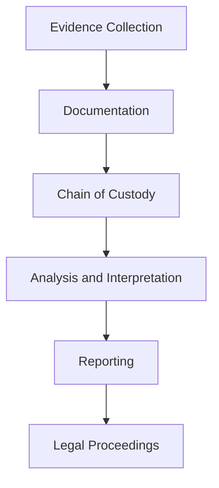

## 12.4 Forensic Documentation Standards

In the realm of forensic accounting and fraud examination, maintaining rigorous documentation standards is paramount. Proper documentation not only ensures the integrity and admissibility of evidence in legal proceedings but also supports the credibility and professionalism of forensic accountants. This section delves into the critical aspects of forensic documentation standards, emphasizing their role in evidence management during fraud investigations.

### Understanding Forensic Documentation Standards

Forensic documentation standards refer to the established protocols and practices that guide the recording, handling, and preservation of evidence in fraud investigations. These standards are designed to ensure that evidence is collected and maintained in a manner that upholds its integrity and reliability, thereby making it admissible in court. Adhering to these standards is crucial for forensic accountants, as it directly impacts the outcome of legal proceedings and the credibility of the investigation.

### Importance of Documentation in Forensic Accounting

Documentation serves as the backbone of forensic accounting investigations. It provides a detailed account of the investigative process, including the collection, analysis, and interpretation of evidence. Proper documentation ensures transparency, accountability, and consistency, which are essential for building a strong case. Moreover, it facilitates communication among stakeholders, including legal teams, regulatory bodies, and law enforcement agencies.

### Key Elements of Forensic Documentation Standards

1. **Accuracy and Completeness**: Documentation must be accurate and complete, capturing all relevant details of the investigation. This includes the date and time of evidence collection, the identity of individuals involved, and a description of the evidence.

2. **Consistency and Uniformity**: Consistent and uniform documentation practices help maintain the integrity of the evidence. Standardized forms, templates, and procedures should be used to ensure uniformity across different cases and investigators.

3. **Timeliness**: Documentation should be completed promptly to ensure that details are accurately recorded while they are still fresh in the investigator's mind. Delays in documentation can lead to errors and omissions that may compromise the investigation.

4. **Security and Confidentiality**: Protecting the security and confidentiality of documentation is crucial. Access to documentation should be restricted to authorized personnel, and measures should be in place to prevent unauthorized access, alteration, or destruction of records.

5. **Legibility and Clarity**: Documentation should be legible and clear, avoiding jargon and technical terms that may not be understood by all stakeholders. Clear documentation facilitates communication and ensures that the evidence can be easily interpreted by others.

### Best Practices for Forensic Documentation

- **Use of Standardized Forms and Templates**: Employing standardized forms and templates ensures consistency and completeness in documentation. These tools provide a structured approach to recording information, reducing the risk of errors and omissions.

- **Detailed Record-Keeping**: Maintain detailed records of all investigative activities, including interviews, evidence collection, and analysis. Each entry should include the date, time, location, and individuals involved.

- **Chain of Custody Documentation**: The chain of custody refers to the chronological documentation of the handling, transfer, and storage of evidence. It is crucial for establishing the integrity and authenticity of the evidence. Each transfer of evidence should be documented, including the names of individuals involved and the purpose of the transfer.

- **Digital Documentation**: In today's digital age, electronic documentation is increasingly common. Ensure that digital records are securely stored and backed up, with access controls in place to prevent unauthorized access or alteration.

- **Regular Audits and Reviews**: Conduct regular audits and reviews of documentation practices to ensure compliance with established standards. This helps identify areas for improvement and ensures that documentation remains accurate and up-to-date.

### Legal Considerations in Forensic Documentation

Forensic documentation must comply with legal requirements to be admissible in court. This includes adhering to rules of evidence, privacy laws, and confidentiality agreements. In Canada, forensic accountants must be familiar with the Canadian Evidence Act and other relevant legislation that governs the admissibility of evidence.

- **Admissibility of Evidence**: For evidence to be admissible, it must be relevant, reliable, and obtained legally. Proper documentation supports the admissibility of evidence by demonstrating its integrity and authenticity.

- **Privacy and Confidentiality**: Forensic accountants must comply with privacy laws and confidentiality agreements when handling sensitive information. This includes obtaining consent for the collection and use of personal data and ensuring that documentation is securely stored and protected from unauthorized access.

- **Expert Witness Testimony**: Forensic accountants may be called upon to provide expert testimony in court. Proper documentation supports their testimony by providing a detailed account of the investigative process and the evidence collected.

### Practical Applications and Case Studies

To illustrate the practical applications of forensic documentation standards, consider the following case studies:

#### Case Study 1: Enron and Arthur Andersen

The Enron scandal highlighted the importance of proper documentation in forensic accounting. The lack of adequate documentation and the destruction of key records by Arthur Andersen contributed to the collapse of the firm and the loss of credibility in the accounting profession. This case underscores the need for rigorous documentation standards to ensure transparency and accountability.

#### Case Study 2: Nortel Networks Corporation Fraud

In the Nortel Networks Corporation fraud case, forensic accountants played a crucial role in uncovering financial misstatements. Detailed documentation of the investigative process and the evidence collected supported the prosecution's case and led to successful convictions. This case demonstrates the importance of thorough and accurate documentation in building a strong legal case.

### Step-by-Step Guidance for Implementing Forensic Documentation Standards

1. **Develop a Documentation Plan**: Begin by developing a comprehensive documentation plan that outlines the procedures and protocols for recording and maintaining evidence. This plan should be tailored to the specific needs of the investigation and comply with legal and regulatory requirements.

2. **Train Investigators**: Provide training to investigators on the importance of documentation and the specific standards and practices to be followed. This ensures that all team members are aware of their responsibilities and can effectively implement the documentation plan.

3. **Use Technology**: Leverage technology to streamline the documentation process. This includes using electronic forms, digital signatures, and secure storage solutions to enhance efficiency and security.

4. **Monitor and Review**: Regularly monitor and review documentation practices to ensure compliance with established standards. This includes conducting audits and providing feedback to investigators to improve their documentation skills.

5. **Continuous Improvement**: Encourage continuous improvement in documentation practices by staying informed of industry developments and incorporating best practices into the documentation plan.

### Diagrams and Visual Aids

To enhance understanding, consider the following diagram illustrating the flow of documentation in a forensic investigation:

This diagram represents the key stages of documentation in a forensic investigation, highlighting the flow of information from evidence collection to legal proceedings.

### Common Pitfalls and Challenges

- **Incomplete Documentation**: Failing to document all relevant details can compromise the integrity of the investigation and the admissibility of evidence. Ensure that all aspects of the investigation are thoroughly documented.

- **Lack of Standardization**: Inconsistent documentation practices can lead to confusion and errors. Use standardized forms and templates to ensure uniformity and completeness.

- **Security Breaches**: Unauthorized access to documentation can compromise the confidentiality and integrity of evidence. Implement robust security measures to protect documentation from unauthorized access or alteration.

### Strategies for Overcoming Challenges

- **Implement Robust Training Programs**: Provide comprehensive training to investigators on documentation standards and best practices. This ensures that all team members are equipped with the knowledge and skills needed to maintain high-quality documentation.

- **Leverage Technology**: Use technology to streamline the documentation process and enhance security. This includes using electronic forms, digital signatures, and secure storage solutions.

- **Conduct Regular Audits**: Regularly audit documentation practices to identify areas for improvement and ensure compliance with established standards. This helps maintain the integrity and reliability of documentation.

### References and Additional Resources

For further exploration of forensic documentation standards, consider the following resources:

- **International Financial Reporting Standards (IFRS)**: Provides guidelines for financial reporting and documentation.
- **CPA Canada**: Offers resources and guidance on forensic accounting and fraud examination.
- **Canadian Evidence Act**: Outlines the legal requirements for the admissibility of evidence in Canada.
- **Association of Certified Fraud Examiners (ACFE)**: Provides resources and training on fraud examination and documentation standards.

### Conclusion

Forensic documentation standards are a critical component of fraud investigations, ensuring the integrity and admissibility of evidence. By adhering to established standards and best practices, forensic accountants can build strong cases and support the pursuit of justice. As you prepare for the Canadian Accounting Exams, remember the importance of rigorous documentation and its impact on the credibility and success of forensic investigations.

## **Ready to Test Your Knowledge?**



### What is the primary purpose of forensic documentation standards?

- [x] To ensure the integrity and admissibility of evidence
- [ ] To simplify the investigation process
- [ ] To reduce the cost of investigations
- [ ] To increase the speed of investigations

> **Explanation:** Forensic documentation standards are designed to ensure that evidence is collected and maintained in a manner that upholds its integrity and reliability, making it admissible in court.

### Which of the following is NOT a key element of forensic documentation standards?

- [ ] Accuracy and Completeness
- [ ] Consistency and Uniformity
- [x] Cost-Effectiveness
- [ ] Security and Confidentiality

> **Explanation:** While cost-effectiveness is important, it is not a key element of forensic documentation standards. The focus is on accuracy, consistency, security, and confidentiality.

### What is the chain of custody?

- [x] The chronological documentation of the handling, transfer, and storage of evidence
- [ ] A list of all evidence collected during an investigation
- [ ] A summary of the investigation findings
- [ ] A report submitted to the court

> **Explanation:** The chain of custody refers to the chronological documentation of the handling, transfer, and storage of evidence, establishing its integrity and authenticity.

### Why is timeliness important in forensic documentation?

- [x] To ensure details are accurately recorded while fresh in the investigator's mind
- [ ] To reduce the workload of investigators
- [ ] To comply with legal deadlines
- [ ] To expedite the legal process

> **Explanation:** Timeliness ensures that details are accurately recorded while they are still fresh in the investigator's mind, reducing the risk of errors and omissions.

### Which of the following is a best practice for forensic documentation?

- [x] Use of standardized forms and templates
- [ ] Relying solely on digital records
- [ ] Documenting only key evidence
- [ ] Allowing unrestricted access to documentation

> **Explanation:** Using standardized forms and templates ensures consistency and completeness in documentation, reducing the risk of errors and omissions.

### What legal consideration must be taken into account for forensic documentation?

- [x] Admissibility of evidence
- [ ] Cost of documentation
- [ ] Speed of documentation
- [ ] Investigator's preference

> **Explanation:** Forensic documentation must comply with legal requirements to be admissible in court, including rules of evidence and privacy laws.

### How can technology be leveraged in forensic documentation?

- [x] By using electronic forms and secure storage solutions
- [ ] By replacing all physical documentation
- [ ] By reducing the need for documentation
- [ ] By allowing public access to records

> **Explanation:** Technology can streamline the documentation process and enhance security through electronic forms and secure storage solutions.

### What is a common pitfall in forensic documentation?

- [x] Incomplete documentation
- [ ] Over-documentation
- [ ] Excessive use of technology
- [ ] Lack of legal compliance

> **Explanation:** Incomplete documentation can compromise the integrity of the investigation and the admissibility of evidence.

### What strategy can help overcome challenges in forensic documentation?

- [x] Implementing robust training programs
- [ ] Reducing the amount of documentation
- [ ] Allowing unrestricted access to documentation
- [ ] Eliminating audits

> **Explanation:** Robust training programs equip investigators with the knowledge and skills needed to maintain high-quality documentation.

### True or False: Forensic documentation standards are only important for legal proceedings.

- [x] False
- [ ] True

> **Explanation:** While forensic documentation standards are crucial for legal proceedings, they also support the credibility and professionalism of forensic accountants and ensure transparency and accountability in investigations.


