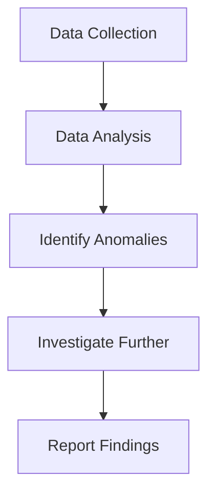

## 13.3 Communication with Stakeholders

In the realm of forensic accounting and fraud examination, effective communication with stakeholders is paramount. This involves not only presenting findings clearly and concisely but also ensuring that the information is understood and actionable by various audiences, including management, boards, regulatory bodies, and legal teams. This section delves into the strategies and best practices for communicating forensic accounting results, emphasizing clarity, precision, and the ability to influence decision-making.

### Understanding Stakeholder Needs

Effective communication begins with understanding the needs and expectations of your stakeholders. Different stakeholders have varying levels of expertise and interest in the details of forensic accounting findings. For instance:

- **Management** may be interested in the financial impact and strategic implications of the findings.
- **Boards of Directors** often focus on governance, risk management, and compliance issues.
- **Regulatory Bodies** require detailed, factual reports that adhere to specific standards.
- **Legal Teams** need evidence that can withstand scrutiny in legal proceedings.

#### Identifying Stakeholders

Identifying the key stakeholders involved in a forensic accounting investigation is crucial. Stakeholders can include internal parties such as executives, managers, and employees, as well as external parties like investors, auditors, and regulators. Understanding their roles and interests helps tailor the communication approach.

### Crafting the Message

Once stakeholders are identified, the next step is crafting a message that resonates with each audience. This involves:

- **Clarity**: Use clear and straightforward language, avoiding jargon unless it is necessary and well-explained.
- **Relevance**: Focus on the aspects of the findings that are most pertinent to the stakeholder's interests.
- **Conciseness**: Be concise, ensuring that the main points are communicated without unnecessary detail.

#### Structuring the Report

A well-structured report enhances comprehension and retention. Consider the following structure:

1. **Executive Summary**: A brief overview of the investigation, findings, and recommendations.
2. **Introduction**: Context and objectives of the investigation.
3. **Methodology**: Description of the techniques and procedures used.
4. **Findings**: Detailed presentation of the evidence and analysis.
5. **Conclusion**: Summary of findings and their implications.
6. **Recommendations**: Suggested actions based on the findings.
7. **Appendices**: Additional data, charts, and supporting documents.

### Visual Aids and Exhibits

Visual aids such as charts, graphs, and tables can significantly enhance the communication of complex data. They provide a visual representation that can make trends and anomalies more apparent. When using visual aids:

- Ensure they are clear and easy to interpret.
- Label them accurately and provide context.
- Use them to complement, not replace, the narrative.

#### Example: Fraud Detection Chart

This flowchart illustrates the process of fraud detection, from data collection to reporting findings, providing a clear visual representation of the steps involved.

### Legal and Ethical Considerations

When communicating forensic accounting findings, it is essential to consider legal and ethical implications. This includes:

- **Confidentiality**: Protecting sensitive information and ensuring it is only shared with authorized parties.
- **Accuracy**: Ensuring all reported information is accurate and verifiable.
- **Compliance**: Adhering to relevant laws, regulations, and professional standards.

#### Regulatory Framework

In Canada, forensic accountants must comply with standards set by CPA Canada and other regulatory bodies. This includes adhering to the International Financial Reporting Standards (IFRS) and Accounting Standards for Private Enterprises (ASPE).

### Engaging Stakeholders

Engagement is key to effective communication. This involves not only presenting information but also facilitating dialogue and feedback. Techniques for engaging stakeholders include:

- **Interactive Presentations**: Encourage questions and discussions during presentations.
- **Workshops and Seminars**: Conduct sessions to educate stakeholders on forensic accounting processes and findings.
- **Regular Updates**: Provide ongoing updates to keep stakeholders informed of progress and developments.

### Case Studies and Real-World Examples

Incorporating case studies and real-world examples can make the communication more relatable and impactful. For example, discussing a well-known fraud case and how similar techniques were used in the current investigation can provide context and enhance understanding.

#### Case Study: Nortel Networks Corporation Fraud

The Nortel Networks Corporation fraud case is a notable example of financial statement manipulation. By examining the techniques used in this case, stakeholders can gain insights into the methods of fraud detection and prevention.

### Best Practices for Effective Communication

To ensure effective communication with stakeholders, consider the following best practices:

- **Know Your Audience**: Tailor your message to the audience's level of understanding and interest.
- **Be Transparent**: Provide honest and transparent information, even if the findings are unfavorable.
- **Use Plain Language**: Avoid technical jargon and complex language.
- **Focus on Key Messages**: Highlight the most critical points and ensure they are clearly understood.
- **Provide Actionable Insights**: Offer practical recommendations that stakeholders can implement.

### Common Pitfalls and Challenges

Communicating forensic accounting findings can be challenging. Common pitfalls include:

- **Overloading with Information**: Providing too much detail can overwhelm stakeholders.
- **Lack of Clarity**: Failing to present information clearly can lead to misunderstandings.
- **Ignoring Stakeholder Concerns**: Not addressing stakeholder concerns can lead to disengagement.

### Strategies to Overcome Challenges

To overcome these challenges, consider the following strategies:

- **Simplify Complex Information**: Break down complex information into manageable parts.
- **Seek Feedback**: Encourage feedback to ensure the message is understood.
- **Adapt Communication Style**: Be flexible and adapt your communication style to suit different stakeholders.

### Conclusion

Effective communication with stakeholders is a critical component of forensic accounting and fraud examination. By understanding stakeholder needs, crafting clear and concise messages, and engaging stakeholders through interactive and transparent communication, forensic accountants can ensure their findings are understood and acted upon.

### References and Further Reading

- CPA Canada. (2024). *Forensic Accounting Guidelines*.
- International Financial Reporting Standards (IFRS).
- Accounting Standards for Private Enterprises (ASPE).

---

## **Ready to Test Your Knowledge?**



### Which of the following is a key component of effective communication with stakeholders in forensic accounting?

- [x] Understanding stakeholder needs
- [ ] Using technical jargon
- [ ] Providing excessive detail
- [ ] Avoiding feedback

> **Explanation:** Understanding stakeholder needs is crucial for tailoring communication effectively.

### What is the purpose of an executive summary in a forensic accounting report?

- [x] To provide a brief overview of the investigation, findings, and recommendations
- [ ] To present detailed evidence and analysis
- [ ] To include additional data and charts
- [ ] To summarize legal considerations

> **Explanation:** The executive summary provides a concise overview of the entire report, highlighting key points.

### Why are visual aids important in communicating forensic accounting findings?

- [x] They enhance the communication of complex data
- [ ] They replace the need for a narrative
- [ ] They are only used for aesthetic purposes
- [ ] They are optional and not recommended

> **Explanation:** Visual aids help make complex data more understandable and highlight trends and anomalies.

### What should be considered when using visual aids in reports?

- [x] Clarity and ease of interpretation
- [ ] Complexity and detail
- [ ] Exclusivity to certain stakeholders
- [ ] Avoidance of context

> **Explanation:** Visual aids should be clear, easy to interpret, and provide context to complement the narrative.

### Which of the following is a legal consideration in forensic accounting communication?

- [x] Confidentiality
- [ ] Stakeholder engagement
- [ ] Visual aid usage
- [ ] Report structure

> **Explanation:** Confidentiality is crucial to protect sensitive information and ensure it is shared only with authorized parties.

### How can forensic accountants engage stakeholders effectively?

- [x] By facilitating dialogue and feedback
- [ ] By presenting information without interaction
- [ ] By focusing solely on written reports
- [ ] By avoiding questions during presentations

> **Explanation:** Engaging stakeholders involves encouraging dialogue and feedback to ensure understanding and buy-in.

### What is a common pitfall in communicating forensic accounting findings?

- [x] Overloading with information
- [ ] Using plain language
- [ ] Providing actionable insights
- [ ] Engaging stakeholders

> **Explanation:** Overloading stakeholders with too much information can lead to confusion and disengagement.

### How can forensic accountants overcome the challenge of complex information?

- [x] By breaking it down into manageable parts
- [ ] By using technical jargon
- [ ] By avoiding feedback
- [ ] By ignoring stakeholder concerns

> **Explanation:** Simplifying complex information into manageable parts helps stakeholders understand and retain the information.

### What is a strategy for adapting communication style to different stakeholders?

- [x] Being flexible and responsive to stakeholder needs
- [ ] Using the same approach for all stakeholders
- [ ] Focusing solely on written communication
- [ ] Avoiding stakeholder feedback

> **Explanation:** Adapting communication style to suit different stakeholders ensures the message is effectively conveyed.

### True or False: Providing excessive detail in reports is a best practice in forensic accounting communication.

- [ ] True
- [x] False

> **Explanation:** Providing excessive detail can overwhelm stakeholders and obscure key messages.


