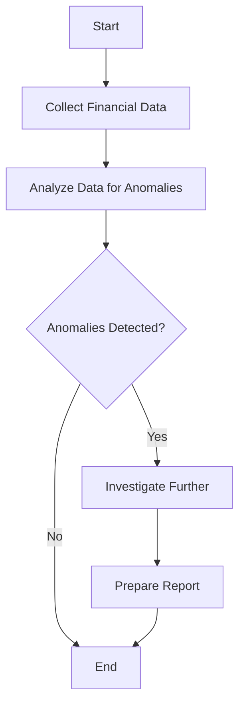

## 13.4 Visual Aids and Exhibits in Reporting

In the realm of forensic accounting and fraud examination, the ability to communicate findings clearly and effectively is paramount. Visual aids and exhibits play a crucial role in enhancing the clarity and impact of reports. This section will delve into the types of visual aids commonly used in forensic accounting reports, their benefits, and best practices for their implementation.

### The Importance of Visual Aids in Forensic Accounting

Visual aids are essential tools in forensic accounting reports for several reasons:

- **Clarity and Comprehension:** Visual aids help distill complex data into understandable formats, making it easier for stakeholders to grasp key points.
- **Engagement:** Well-designed visuals capture the reader's attention and maintain their interest throughout the report.
- **Persuasiveness:** Visuals can effectively highlight trends, anomalies, and patterns, supporting the narrative and conclusions of the report.
- **Efficiency:** They allow for quick assimilation of information, which is particularly valuable in time-sensitive situations.

### Types of Visual Aids and Exhibits

#### 1. Charts and Graphs

Charts and graphs are among the most common visual aids used in forensic accounting reports. They provide a visual representation of data, making it easier to identify trends and patterns.

- **Bar Charts:** Useful for comparing quantities across different categories. For example, a bar chart can illustrate the frequency of fraudulent transactions across various departments.

- **Line Graphs:** Ideal for showing trends over time. A line graph can depict the progression of financial discrepancies over several months.

- **Pie Charts:** Effective for displaying proportions and percentages. A pie chart can show the distribution of different types of fraud within an organization.

- **Histograms:** Useful for showing the distribution of data points. A histogram can illustrate the frequency of transaction amounts within specified ranges.

#### 2. Tables

Tables are used to present detailed data in a structured format. They are particularly useful for displaying numerical data that requires precise analysis.

- **Comparison Tables:** Allow for side-by-side comparison of different data sets, such as budgeted versus actual expenses.

- **Summary Tables:** Provide a concise overview of key findings, such as the total amount of funds misappropriated.

#### 3. Flowcharts

Flowcharts are diagrams that depict the sequence of steps or processes. They are valuable for illustrating complex processes and identifying potential points of failure or fraud.

- **Process Flowcharts:** Show the steps involved in a financial transaction process, highlighting where controls may have failed.

- **Decision Trees:** Illustrate decision-making processes and potential outcomes, useful for risk assessment.

#### 4. Infographics

Infographics combine text and visuals to convey information in an engaging and easily digestible format. They are particularly effective for summarizing findings and recommendations.

- **Timeline Infographics:** Show the sequence of events leading to a fraud incident, providing context and clarity.

- **Statistical Infographics:** Highlight key statistics and findings, making them more memorable.

#### 5. Diagrams

Diagrams are used to illustrate relationships and structures, such as organizational hierarchies or network connections.

- **Organizational Charts:** Show the structure of an organization, which can be useful in identifying potential collusion among employees.

- **Network Diagrams:** Illustrate connections between individuals or entities, useful in tracing the flow of funds.

### Best Practices for Using Visual Aids

#### 1. Relevance and Accuracy

Ensure that all visual aids are directly relevant to the report's objectives and accurately represent the data. Misleading or irrelevant visuals can undermine the report's credibility.

#### 2. Simplicity and Clarity

Visual aids should be simple and easy to understand. Avoid clutter and unnecessary complexity, which can confuse the reader.

#### 3. Consistency

Maintain consistency in style, color schemes, and labeling throughout the report. This helps create a cohesive and professional appearance.

#### 4. Annotation and Explanation

Provide clear annotations and explanations for all visual aids. This includes titles, labels, and legends, which help the reader interpret the visuals correctly.

#### 5. Integration with Narrative

Visual aids should complement the narrative of the report, not replace it. Ensure that each visual is accompanied by a discussion that explains its significance and relevance to the findings.

### Practical Examples and Case Studies

#### Example 1: Revenue Fraud Detection

A forensic accountant investigating revenue fraud might use a combination of line graphs and bar charts to illustrate discrepancies in reported sales figures over time. A line graph could show an unexpected spike in revenue during a particular quarter, while a bar chart could compare actual sales to industry benchmarks.

#### Example 2: Expense Reimbursement Fraud

In a case of expense reimbursement fraud, tables and pie charts could be used to present data on employee expense claims. A table might list individual claims with suspicious patterns, while a pie chart could show the proportion of fraudulent claims relative to total claims.

#### Case Study: Enron Scandal

In the Enron scandal, forensic accountants used organizational charts and network diagrams to unravel the complex web of entities and transactions. These visuals helped illustrate the relationships between Enron's various subsidiaries and the flow of funds, providing a clear picture of the fraudulent activities.

### Real-World Applications and Regulatory Scenarios

#### Compliance with Canadian Standards

When preparing forensic accounting reports in Canada, it is essential to comply with relevant standards and regulations, such as those set by CPA Canada. Visual aids should adhere to these standards to ensure accuracy and reliability.

#### Use of Technology

Advancements in technology have made it easier to create sophisticated visual aids. Software tools like Microsoft Excel, Tableau, and Power BI offer powerful features for data visualization, allowing forensic accountants to create dynamic and interactive exhibits.

#### Privacy and Confidentiality

When using visual aids, it is crucial to protect sensitive information. Ensure that all visuals comply with privacy laws and confidentiality agreements, particularly when dealing with personal or proprietary data.

### Step-by-Step Guidance for Creating Visual Aids

#### Step 1: Define the Objective

Determine the purpose of the visual aid and what you want to communicate. This will guide the selection of the appropriate type of visual.

#### Step 2: Gather and Organize Data

Collect the necessary data and organize it in a format suitable for visualization. Ensure that the data is accurate and complete.

#### Step 3: Choose the Right Tool

Select a software tool that meets your needs and capabilities. Consider factors such as ease of use, customization options, and compatibility with other software.

#### Step 4: Design the Visual

Create the visual aid, keeping in mind best practices for simplicity, clarity, and consistency. Use appropriate colors, fonts, and labels to enhance readability.

#### Step 5: Review and Revise

Review the visual aid for accuracy and effectiveness. Make revisions as necessary to ensure that it accurately represents the data and supports the report's objectives.

#### Step 6: Integrate with the Report

Incorporate the visual aid into the report, providing context and explanation. Ensure that it complements the narrative and enhances the overall presentation.

### Diagrams and Charts

Below is an example of a flowchart illustrating the process of detecting fraud in financial statements:

This flowchart provides a visual representation of the steps involved in detecting fraud, making it easier for readers to understand the process.

### Common Pitfalls and Challenges

- **Overcomplicating Visuals:** Avoid adding unnecessary details that can overwhelm the reader. Keep visuals simple and focused on the key message.

- **Ignoring Audience Needs:** Tailor visuals to the needs and preferences of the audience. Consider their level of expertise and familiarity with the subject matter.

- **Neglecting Accessibility:** Ensure that all visuals are accessible to all readers, including those with visual impairments. Use high-contrast colors and provide alternative text descriptions.

### Conclusion

Visual aids and exhibits are powerful tools in forensic accounting reports, enhancing clarity, engagement, and persuasiveness. By following best practices and leveraging technology, forensic accountants can create effective visuals that support their findings and recommendations. As you prepare for the Canadian Accounting Exams, remember the importance of visual aids in communicating complex information and practice creating them to enhance your reporting skills.

## **Ready to Test Your Knowledge?**



### What is one of the primary benefits of using visual aids in forensic accounting reports?

- [x] They enhance clarity and comprehension.
- [ ] They replace the need for a narrative.
- [ ] They are only used for aesthetic purposes.
- [ ] They reduce the length of the report.

> **Explanation:** Visual aids enhance clarity and comprehension by distilling complex data into understandable formats, making it easier for stakeholders to grasp key points.

### Which type of chart is ideal for showing trends over time?

- [ ] Bar Chart
- [x] Line Graph
- [ ] Pie Chart
- [ ] Histogram

> **Explanation:** Line graphs are ideal for showing trends over time, as they can depict the progression of data points across a timeline.

### What is a common use for pie charts in forensic accounting reports?

- [ ] Showing trends over time
- [ ] Comparing quantities across categories
- [x] Displaying proportions and percentages
- [ ] Illustrating decision-making processes

> **Explanation:** Pie charts are effective for displaying proportions and percentages, such as the distribution of different types of fraud within an organization.

### What should be avoided when creating visual aids?

- [x] Overcomplicating visuals with unnecessary details
- [ ] Using high-contrast colors for accessibility
- [ ] Providing clear annotations and explanations
- [ ] Ensuring relevance and accuracy

> **Explanation:** Overcomplicating visuals with unnecessary details can overwhelm the reader and detract from the key message.

### Which software tools are mentioned as useful for creating visual aids?

- [x] Microsoft Excel
- [x] Tableau
- [ ] Adobe Photoshop
- [x] Power BI

> **Explanation:** Microsoft Excel, Tableau, and Power BI are mentioned as useful tools for creating data visualizations and visual aids in forensic accounting reports.

### What is the purpose of a flowchart in forensic accounting?

- [ ] To display proportions and percentages
- [x] To depict the sequence of steps or processes
- [ ] To compare quantities across categories
- [ ] To summarize key statistics

> **Explanation:** Flowcharts are used to depict the sequence of steps or processes, such as financial transaction processes, highlighting where controls may have failed.

### What is a key consideration when using visual aids in reports?

- [x] Ensuring they complement the narrative
- [ ] Using as many colors as possible
- [ ] Avoiding annotations
- [ ] Making them the sole focus of the report

> **Explanation:** Visual aids should complement the narrative of the report, providing support and clarity to the findings and conclusions.

### What is a common pitfall when creating visual aids?

- [x] Ignoring audience needs
- [ ] Tailoring visuals to the audience
- [ ] Providing alternative text descriptions
- [ ] Using consistent labeling

> **Explanation:** Ignoring audience needs can result in visuals that are not tailored to the level of expertise and familiarity of the audience, reducing their effectiveness.

### What should be included with all visual aids to aid interpretation?

- [x] Clear annotations and explanations
- [ ] Only a title
- [ ] No labels
- [ ] Multiple fonts

> **Explanation:** Clear annotations and explanations, including titles, labels, and legends, help the reader interpret the visuals correctly.

### True or False: Visual aids can replace the narrative in forensic accounting reports.

- [ ] True
- [x] False

> **Explanation:** False. Visual aids should complement the narrative, not replace it. They provide support and clarity to the findings and conclusions of the report.


