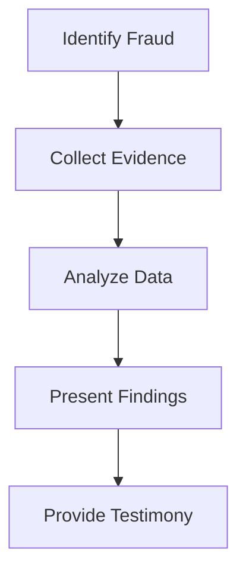

## 14.7 Communicating Complex Information

In the realm of forensic accounting and fraud examination, expert witnesses play a crucial role in legal proceedings. Their ability to communicate complex information effectively to judges and juries can significantly influence the outcome of a case. This section delves into the strategies and techniques for simplifying technical terms and concepts, ensuring clarity and comprehension among non-expert audiences.

### Understanding the Audience

Before diving into communication strategies, it's essential to understand the audience. Judges and juries often lack specialized knowledge in forensic accounting, making it crucial for expert witnesses to tailor their communication to a lay audience. Here are some key considerations:

- **Background Knowledge**: Assess the general level of financial literacy among the audience. Avoid assuming any prior knowledge of accounting principles.
- **Attention Span**: Legal proceedings can be lengthy and complex. Keep explanations concise and engaging to maintain attention.
- **Emotional State**: Recognize that jurors may be under stress or emotional strain. Simplifying information can help them process and retain key points.

### Simplifying Technical Terms

One of the primary challenges in forensic accounting testimony is translating technical jargon into understandable language. Here are some strategies:

- **Use Analogies and Metaphors**: Relate complex concepts to everyday experiences. For example, compare financial statement fraud to "painting a rosy picture" to make a company appear healthier than it is.
- **Define Terms Clearly**: When introducing technical terms, provide clear definitions and examples. For instance, explain "asset misappropriation" as stealing or misusing company resources.
- **Avoid Overloading with Details**: Focus on the most critical information. Too many details can overwhelm the audience and obscure the main points.

### Structuring the Testimony

A well-structured testimony can enhance understanding and retention. Consider the following structure:

1. **Introduction**: Begin with a brief overview of your role and the purpose of your testimony. Clearly state the key points you will cover.
2. **Main Body**: Present the evidence and analysis in a logical sequence. Use headings and subheadings to organize the content.
3. **Conclusion**: Summarize the main points and reiterate the significance of your findings.

### Visual Aids and Exhibits

Visual aids can be powerful tools for conveying complex information. Here are some tips for using them effectively:

- **Charts and Graphs**: Use charts and graphs to illustrate trends and comparisons. Ensure they are clearly labeled and easy to interpret.
- **Diagrams**: Create diagrams to show relationships and processes. For example, a flowchart can depict the steps in a fraudulent scheme.
- **Mermaid.js Diagrams**: Utilize Mermaid.js to create interactive diagrams that enhance understanding.

### Engaging the Audience

Engagement is key to effective communication. Here are some techniques to keep the audience engaged:

- **Storytelling**: Use narratives to illustrate points. A compelling story can make complex information more relatable and memorable.
- **Interactive Elements**: Encourage questions and interactions. This can clarify misunderstandings and reinforce key points.
- **Body Language**: Maintain eye contact and use gestures to emphasize important points. A confident demeanor can enhance credibility.

### Handling Cross-Examination

Cross-examination can be challenging, but preparation and composure are vital. Here are some strategies:

- **Anticipate Questions**: Prepare for potential questions and challenges. Consider the opposing counsel's perspective and address weaknesses in your testimony.
- **Stay Calm and Composed**: Maintain a calm demeanor, even under pressure. Take your time to think before responding.
- **Clarify Misunderstandings**: If a question is unclear or misleading, ask for clarification. Ensure your responses are clear and concise.

### Real-World Applications and Case Studies

To illustrate the practical application of these strategies, consider the following case study:

**Case Study: The Enron Scandal**

In the Enron scandal, expert witnesses played a pivotal role in unraveling the complex financial manipulations. By simplifying technical concepts and using visual aids, they helped the jury understand the fraudulent activities and their impact on stakeholders.

### Best Practices and Common Pitfalls

Here are some best practices and common pitfalls to be aware of:

- **Best Practices**:
  - Practice your testimony to ensure clarity and confidence.
  - Use plain language and avoid unnecessary jargon.
  - Tailor your communication to the specific audience.

- **Common Pitfalls**:
  - Overcomplicating explanations with excessive details.
  - Failing to engage the audience or maintain their attention.
  - Becoming defensive or argumentative during cross-examination.

### Regulatory Considerations

In Canada, expert witnesses must adhere to specific guidelines and standards. Familiarize yourself with the relevant regulations and ensure compliance in your testimony. Refer to CPA Canada and other authoritative resources for guidance.

### Conclusion

Communicating complex information effectively is a critical skill for forensic accountants serving as expert witnesses. By understanding the audience, simplifying technical terms, and using engaging communication strategies, you can enhance the clarity and impact of your testimony. Practice and preparation are key to delivering a compelling and persuasive presentation in legal settings.

### Additional Resources

For further exploration of this topic, consider the following resources:

- CPA Canada: [www.cpacanada.ca](https://www.cpacanada.ca)
- International Financial Reporting Standards (IFRS): [www.ifrs.org](https://www.ifrs.org)
- Accounting Standards for Private Enterprises (ASPE): [www.frascanada.ca](https://www.frascanada.ca)

## **Ready to Test Your Knowledge?**



### What is a key strategy for simplifying technical terms for a lay audience?

- [x] Use analogies and metaphors
- [ ] Use more technical jargon
- [ ] Provide lengthy explanations
- [ ] Avoid using any examples

> **Explanation:** Analogies and metaphors help relate complex concepts to familiar experiences, making them easier to understand.

### Which of the following is an effective way to engage the audience during testimony?

- [x] Storytelling
- [ ] Using complex charts
- [ ] Avoiding eye contact
- [ ] Speaking in monotone

> **Explanation:** Storytelling makes information relatable and memorable, helping to maintain the audience's attention.

### What should be avoided when presenting complex information?

- [ ] Using visual aids
- [x] Overloading with details
- [ ] Structuring the testimony
- [ ] Engaging the audience

> **Explanation:** Overloading with details can overwhelm the audience and obscure the main points.

### How can expert witnesses prepare for cross-examination?

- [x] Anticipate questions
- [ ] Avoid practicing responses
- [ ] Focus only on their testimony
- [ ] Ignore the opposing counsel's perspective

> **Explanation:** Anticipating questions helps expert witnesses prepare for challenges and address weaknesses in their testimony.

### What is an effective structure for testimony?

- [x] Introduction, Main Body, Conclusion
- [ ] Conclusion, Introduction, Main Body
- [ ] Main Body, Conclusion, Introduction
- [ ] Random order

> **Explanation:** A structured testimony with an introduction, main body, and conclusion enhances understanding and retention.

### Why is it important to understand the audience in legal proceedings?

- [x] To tailor communication to their level of understanding
- [ ] To impress them with technical jargon
- [ ] To focus solely on the evidence
- [ ] To avoid engaging with them

> **Explanation:** Understanding the audience helps tailor communication to their level of understanding, ensuring clarity and comprehension.

### Which of the following is a common pitfall in expert testimony?

- [ ] Using plain language
- [ ] Practicing the testimony
- [x] Overcomplicating explanations
- [ ] Engaging the audience

> **Explanation:** Overcomplicating explanations with excessive details can confuse the audience and detract from the main points.

### How can visual aids be used effectively in testimony?

- [x] By ensuring they are clearly labeled and easy to interpret
- [ ] By using as many as possible
- [ ] By avoiding any labels
- [ ] By making them complex

> **Explanation:** Clear labeling and simplicity in visual aids help convey information effectively and enhance understanding.

### What role do expert witnesses play in legal proceedings?

- [x] Communicating complex information clearly
- [ ] Confusing the jury with technical terms
- [ ] Focusing only on their credentials
- [ ] Avoiding interaction with the audience

> **Explanation:** Expert witnesses are responsible for communicating complex information clearly to help the jury understand the evidence.

### True or False: Expert witnesses should avoid using any visual aids during testimony.

- [ ] True
- [x] False

> **Explanation:** Visual aids are valuable tools for illustrating complex information and enhancing comprehension during testimony.


