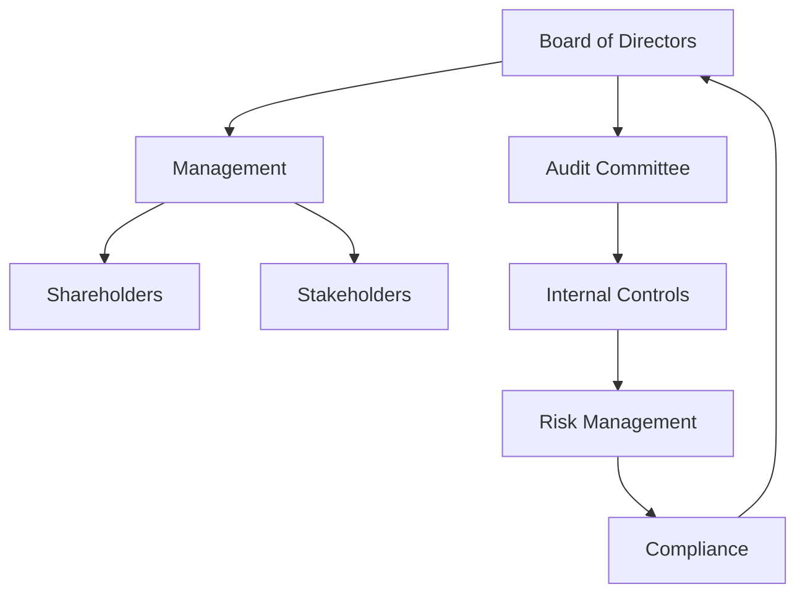

## 19.8 Best Practices in Corporate Governance

Corporate governance plays a pivotal role in the integrity and success of organizations. It encompasses the systems, principles, and processes by which companies are directed and controlled. Effective corporate governance ensures accountability, fairness, and transparency in a company's relationship with its stakeholders. This section explores best practices in corporate governance, focusing on strategies to strengthen governance frameworks and prevent fraud.

### Understanding Corporate Governance

Corporate governance involves a set of relationships between a company’s management, its board, its shareholders, and other stakeholders. It provides the structure through which the objectives of the company are set, and the means of attaining those objectives and monitoring performance are determined. The key components of corporate governance include:

- **Board of Directors**: The board is responsible for overseeing the management of the company and ensuring that the company operates in the best interests of its shareholders and stakeholders.
- **Management**: Management is responsible for the day-to-day operations of the company and for implementing the strategic direction set by the board.
- **Shareholders**: Shareholders provide the capital necessary for the company to operate and have a vested interest in the company's success.
- **Stakeholders**: Stakeholders include employees, customers, suppliers, and the community, all of whom are affected by the company's operations.

### Importance of Corporate Governance in Fraud Prevention

Corporate governance is crucial in preventing fraud and ensuring the ethical operation of businesses. Strong governance frameworks can deter fraudulent activities by:

- **Establishing a Culture of Integrity**: A strong ethical culture, led by the board and senior management, sets the tone for the entire organization.
- **Enhancing Transparency and Accountability**: Clear reporting lines and accountability mechanisms help ensure that actions and decisions are transparent and can be scrutinized.
- **Implementing Robust Internal Controls**: Effective internal controls can prevent and detect fraud by ensuring that financial transactions are recorded accurately and that assets are safeguarded.
- **Facilitating Effective Risk Management**: Identifying and managing risks proactively helps organizations anticipate potential fraud risks and implement measures to mitigate them.

### Key Principles of Effective Corporate Governance

1. **Accountability**: Organizations should clearly define roles and responsibilities to ensure that management and the board are accountable for their actions.

2. **Transparency**: Companies should provide timely and accurate information to stakeholders, enabling informed decision-making.

3. **Fairness**: All stakeholders should be treated equitably, with policies in place to prevent conflicts of interest.

4. **Responsibility**: Organizations should act responsibly towards stakeholders and the environment, considering the broader impact of their actions.

5. **Independence**: The board should include independent directors who can provide objective oversight and challenge management decisions.

### Best Practices in Corporate Governance

#### 1. Strengthening Board Oversight

- **Diverse and Skilled Board Members**: A board with diverse backgrounds and expertise can provide a broader perspective and more effective oversight.
- **Regular Training and Development**: Continuous education for board members on governance trends and risk management enhances their ability to fulfill their roles.
- **Clear Board Committees**: Establishing specialized committees (e.g., audit, risk, and ethics committees) ensures focused attention on critical areas.

#### 2. Enhancing Internal Controls

- **Comprehensive Internal Control Systems**: Implement robust systems to monitor financial reporting, compliance, and operational processes.
- **Regular Audits and Reviews**: Conduct internal and external audits regularly to assess the effectiveness of controls and identify areas for improvement.
- **Segregation of Duties**: Ensure that no single individual has control over all aspects of any critical process to prevent fraud.

#### 3. Promoting Ethical Leadership

- **Code of Conduct**: Develop and enforce a code of conduct that outlines expected behaviors and ethical standards for all employees.
- **Ethical Leadership from the Top**: Leaders should model ethical behavior and promote a culture of integrity throughout the organization.
- **Whistleblower Mechanisms**: Establish confidential channels for reporting unethical behavior without fear of retaliation.

#### 4. Effective Risk Management

- **Risk Assessment Frameworks**: Implement frameworks to identify, assess, and prioritize risks, including fraud risks.
- **Continuous Monitoring**: Use technology and data analytics to monitor transactions and detect anomalies in real-time.
- **Crisis Management Plans**: Prepare for potential fraud incidents with well-defined crisis management and response plans.

#### 5. Ensuring Regulatory Compliance

- **Stay Informed on Regulations**: Keep abreast of changes in laws and regulations affecting corporate governance and fraud prevention.
- **Compliance Programs**: Develop comprehensive compliance programs that address legal and regulatory requirements.
- **Regular Training**: Provide ongoing training for employees on compliance issues and the importance of adhering to regulations.

### Real-World Applications and Case Studies

#### Case Study: Enron and the Importance of Governance

The Enron scandal highlighted the catastrophic consequences of poor corporate governance. Enron's board failed to provide adequate oversight, allowing management to engage in fraudulent accounting practices. The scandal led to the bankruptcy of Enron and significant financial losses for shareholders. This case underscores the importance of strong governance frameworks and the need for independent oversight.

#### Canadian Context: Nortel Networks Corporation

Nortel Networks Corporation, once a leading telecommunications company, collapsed due to accounting fraud and poor governance practices. The lack of effective internal controls and oversight allowed executives to manipulate financial statements, leading to the company's downfall. This case emphasizes the need for robust internal controls and accountability mechanisms in Canadian companies.

### Implementing Best Practices: Step-by-Step Guidance

1. **Assess Current Governance Practices**: Conduct a thorough review of existing governance structures and identify areas for improvement.
2. **Develop a Governance Framework**: Create a comprehensive framework that outlines roles, responsibilities, and processes for governance.
3. **Engage Stakeholders**: Involve key stakeholders in the development and implementation of governance practices to ensure buy-in and support.
4. **Monitor and Evaluate**: Continuously monitor governance practices and evaluate their effectiveness, making adjustments as needed.

### Diagrams and Visual Aids

To enhance understanding, the following diagram illustrates the relationship between key components of corporate governance:

### Common Pitfalls and Challenges

- **Lack of Board Independence**: Boards that lack independent members may fail to provide objective oversight.
- **Inadequate Risk Management**: Failure to identify and manage risks can lead to unexpected fraud incidents.
- **Poor Communication**: Ineffective communication between the board, management, and stakeholders can hinder governance efforts.

### Strategies to Overcome Challenges

- **Enhance Board Independence**: Recruit independent directors who can provide unbiased oversight and challenge management decisions.
- **Strengthen Risk Management**: Implement comprehensive risk management frameworks and use technology to monitor risks continuously.
- **Improve Communication**: Establish clear communication channels and ensure that stakeholders are informed and engaged.

### Conclusion

Effective corporate governance is essential for preventing fraud and ensuring the long-term success of organizations. By implementing best practices in governance, companies can enhance transparency, accountability, and ethical behavior, reducing the risk of fraud and building trust with stakeholders. As you prepare for the Canadian Accounting Exams, understanding these principles and their application in real-world scenarios will be crucial for your success.

---

## **Ready to Test Your Knowledge?**



### Which of the following is a key principle of effective corporate governance?

- [x] Accountability
- [ ] Profitability
- [ ] Market Share
- [ ] Innovation

> **Explanation:** Accountability ensures that management and the board are responsible for their actions, a fundamental principle of corporate governance.

### What is the role of the board of directors in corporate governance?

- [x] Overseeing management
- [ ] Managing day-to-day operations
- [ ] Providing capital
- [ ] Purchasing supplies

> **Explanation:** The board of directors is responsible for overseeing management and ensuring the company operates in the best interests of its shareholders.

### How can organizations promote ethical leadership?

- [x] Developing a code of conduct
- [ ] Increasing salaries
- [ ] Reducing work hours
- [ ] Expanding product lines

> **Explanation:** A code of conduct outlines expected behaviors and ethical standards, promoting ethical leadership within the organization.

### What is a common pitfall in corporate governance?

- [x] Lack of board independence
- [ ] High employee turnover
- [ ] Excessive marketing
- [ ] Rapid expansion

> **Explanation:** A lack of board independence can hinder objective oversight and lead to governance failures.

### Which of the following is a component of corporate governance?

- [x] Board of Directors
- [ ] Marketing Department
- [ ] Product Development Team
- [ ] Customer Service

> **Explanation:** The board of directors is a key component of corporate governance, responsible for overseeing management.

### What is the purpose of internal controls in corporate governance?

- [x] To prevent and detect fraud
- [ ] To increase sales
- [ ] To improve customer satisfaction
- [ ] To enhance brand image

> **Explanation:** Internal controls are designed to prevent and detect fraud, ensuring accurate financial reporting and safeguarding assets.

### How can companies ensure regulatory compliance?

- [x] Developing comprehensive compliance programs
- [ ] Increasing advertising budgets
- [ ] Expanding into new markets
- [ ] Offering discounts

> **Explanation:** Compliance programs address legal and regulatory requirements, helping companies ensure adherence to regulations.

### What is the significance of transparency in corporate governance?

- [x] It enables informed decision-making
- [ ] It increases profits
- [ ] It reduces competition
- [ ] It enhances creativity

> **Explanation:** Transparency provides stakeholders with timely and accurate information, enabling informed decision-making.

### Which of the following is a strategy to overcome governance challenges?

- [x] Strengthen risk management
- [ ] Increase product variety
- [ ] Reduce employee benefits
- [ ] Focus on short-term gains

> **Explanation:** Strengthening risk management helps organizations identify and mitigate potential risks, overcoming governance challenges.

### True or False: Effective corporate governance can deter fraudulent activities.

- [x] True
- [ ] False

> **Explanation:** Effective corporate governance establishes a culture of integrity and accountability, deterring fraudulent activities.


