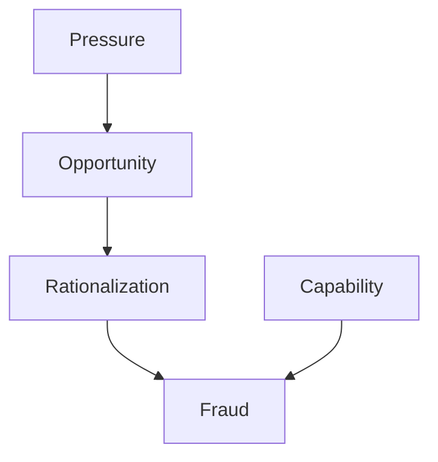

## 2.1 Understanding Fraud and Its Elements

Fraud is a pervasive issue that affects organizations globally, leading to significant financial losses, reputational damage, and legal consequences. As a forensic accountant, understanding the intricacies of fraud is crucial for effective detection, prevention, and investigation. This section delves into the core elements of fraud, providing a comprehensive overview that will enhance your knowledge and prepare you for the Canadian Accounting Exams.

### What is Fraud?

Fraud is a deliberate act of deception intended to secure an unfair or unlawful gain. It involves misrepresentation, concealment, or omission of information to deceive others. In the context of financial settings, fraud can manifest in various forms, including financial statement fraud, asset misappropriation, and corruption.

**Key Characteristics of Fraud:**

- **Intentional Deception:** Unlike errors, fraud involves deliberate actions to deceive.
- **Unlawful Gain:** The primary motive is to obtain benefits or avoid obligations unlawfully.
- **Misrepresentation:** Fraud often involves falsifying or omitting critical information.

### The Elements of Fraud

To effectively combat fraud, it's essential to understand its fundamental elements. These elements serve as the foundation for identifying and proving fraudulent activities.

1. **Misrepresentation of Material Facts:**
   - Fraud involves the intentional distortion of material facts. These are facts that, if known, would influence the decision-making process of the victim. For instance, falsifying financial statements to inflate a company's financial health is a common form of misrepresentation.

2. **Knowledge of Falsity:**
   - The perpetrator must be aware that the information being presented is false. This knowledge distinguishes fraud from honest mistakes or errors. In forensic accounting, proving the perpetrator's awareness of falsity is crucial for establishing fraudulent intent.

3. **Intent to Deceive:**
   - Intent is a critical component of fraud. The perpetrator must have a deliberate intention to deceive the victim. This element is often challenging to prove, as it requires demonstrating the perpetrator's state of mind at the time of the fraudulent act.

4. **Reliance by the Victim:**
   - For fraud to occur, the victim must have relied on the false information. This reliance leads to the victim making decisions or taking actions based on the misrepresented facts. For example, investors may rely on falsified financial statements to make investment decisions.

5. **Resulting Damages:**
   - Fraud must result in actual damages or harm to the victim. These damages can be financial, such as monetary losses, or non-financial, such as reputational damage. In forensic accounting, quantifying these damages is essential for legal proceedings and restitution.

### Types of Fraud in Financial Settings

Fraud can take various forms in financial settings, each with distinct characteristics and implications. Understanding these types is crucial for identifying and addressing fraudulent activities.

#### 1. Financial Statement Fraud

Financial statement fraud involves the intentional misrepresentation of financial information to deceive stakeholders. This type of fraud is often perpetrated by management to present a false picture of a company's financial health. Common techniques include:

- **Revenue Recognition Schemes:** Manipulating revenue figures to inflate earnings.
- **Overstating Assets:** Inflating asset values to enhance the balance sheet.
- **Understating Liabilities:** Concealing liabilities to improve financial ratios.

**Case Study: Enron Corporation**

Enron's collapse is a classic example of financial statement fraud. The company used complex accounting practices to hide debt and inflate profits, leading to one of the largest bankruptcies in history. This case highlights the importance of transparency and ethical financial reporting.

#### 2. Asset Misappropriation

Asset misappropriation is the most common form of occupational fraud, involving the theft or misuse of an organization's assets. This type of fraud can occur at any level of the organization and includes:

- **Embezzlement:** Employees diverting funds for personal use.
- **Inventory Theft:** Stealing physical goods or inventory.
- **Payroll Fraud:** Manipulating payroll systems to issue unauthorized payments.

**Example: A Canadian Retail Chain**

A Canadian retail chain discovered that an employee had been embezzling funds by creating fictitious vendor accounts. The fraud was uncovered through a routine audit, emphasizing the importance of robust internal controls.

#### 3. Corruption and Bribery

Corruption involves the abuse of power for personal gain, often through bribery or kickbacks. This type of fraud is prevalent in procurement processes and government contracts. Key forms include:

- **Bribery:** Offering or receiving something of value to influence decisions.
- **Kickbacks:** Receiving a portion of the proceeds from a transaction as a reward for facilitating the deal.

**Scenario: Government Contracting**

In a government contracting scenario, a procurement officer might accept bribes from suppliers in exchange for awarding contracts. This not only undermines fair competition but also leads to substandard services and products.

### The Fraud Triangle and Diamond Models

Understanding the motivations and conditions that lead to fraud is essential for prevention and detection. The Fraud Triangle and Diamond Models provide valuable insights into the factors that contribute to fraudulent behavior.

#### The Fraud Triangle

The Fraud Triangle, developed by criminologist Donald Cressey, identifies three key elements that drive individuals to commit fraud:

1. **Pressure:** Financial or personal pressures that motivate individuals to commit fraud. This could include financial difficulties, addiction, or unrealistic performance expectations.

2. **Opportunity:** The presence of conditions that allow fraud to occur, such as weak internal controls or lack of oversight. Opportunity is often the only element over which organizations have control.

3. **Rationalization:** The mental process by which individuals justify their fraudulent actions. Common rationalizations include believing that the fraud is temporary or that they deserve the benefits.

#### The Fraud Diamond

The Fraud Diamond expands on the Fraud Triangle by adding a fourth element:

4. **Capability:** The individual's ability to commit fraud, which includes traits such as intelligence, confidence, and the ability to exploit weaknesses in the system.

**Diagram: Fraud Triangle and Diamond**

### Behavioral Red Flags of Fraudsters

Recognizing behavioral red flags can aid in the early detection of fraud. While not definitive proof of fraud, these indicators warrant further investigation:

- **Living Beyond Means:** Employees living a lifestyle inconsistent with their income.
- **Unusual Financial Transactions:** Frequent or large transactions that lack a clear business purpose.
- **Reluctance to Share Duties:** Employees who resist delegating tasks or taking vacations, potentially to conceal fraudulent activities.
- **Defensive Behavior:** Overly defensive or secretive behavior when questioned about financial matters.

### Motives and Rationalizations for Fraud

Understanding the motives and rationalizations behind fraudulent behavior is crucial for developing effective prevention strategies. Common motives include:

- **Financial Gain:** The desire for financial benefits, often driven by personal financial pressures.
- **Revenge:** Perpetrators may commit fraud as a form of retaliation against perceived injustices.
- **Ego and Status:** The need to maintain a certain lifestyle or status can drive individuals to commit fraud.

Rationalizations often involve justifying the fraudulent behavior as a temporary measure or believing that the organization owes them.

### Impact of Fraud on Organizations

Fraud can have devastating effects on organizations, including:

- **Financial Losses:** Direct monetary losses due to theft or misrepresentation.
- **Reputational Damage:** Loss of trust among stakeholders, leading to decreased business opportunities.
- **Legal Consequences:** Regulatory fines, legal fees, and potential criminal charges.
- **Operational Disruption:** Disruption of business operations due to investigations and corrective actions.

### Occupational Fraud and Abuse

Occupational fraud refers to fraud committed by individuals within the organization, often exploiting their position of trust. This type of fraud is prevalent across industries and can take various forms, including asset misappropriation, corruption, and financial statement fraud.

**Example: A Canadian Manufacturing Company**

A Canadian manufacturing company discovered that a senior executive had been inflating expense reports for personal gain. The fraud was uncovered through an anonymous tip, highlighting the importance of whistleblower programs.

### Case Studies of Major Fraud Incidents

Examining real-world fraud cases provides valuable insights into the methods and consequences of fraudulent activities. Here are some notable examples:

#### 1. WorldCom Fraud Case

WorldCom, a telecommunications company, engaged in one of the largest accounting frauds in history by inflating assets by over $11 billion. The fraud was orchestrated by top executives and involved improper accounting for expenses and revenue.

#### 2. Bernie Madoff Ponzi Scheme

Bernie Madoff's Ponzi scheme defrauded investors of billions of dollars by promising high returns and using new investors' funds to pay existing investors. This case underscores the importance of due diligence and skepticism in investment decisions.

#### 3. Satyam Computer Services Fraud

Satyam, an Indian IT company, engaged in financial statement fraud by overstating revenue and assets. The fraud was uncovered when the company's chairman confessed, leading to a significant scandal and regulatory reforms in India.

### Best Practices for Fraud Prevention

Preventing fraud requires a proactive approach that encompasses robust internal controls, ethical culture, and continuous monitoring. Here are some best practices:

- **Establish Strong Internal Controls:** Implement comprehensive controls to detect and prevent fraudulent activities. This includes segregation of duties, regular audits, and access controls.

- **Promote an Ethical Culture:** Foster a culture of integrity and transparency through leadership, training, and clear ethical guidelines.

- **Implement Whistleblower Programs:** Encourage employees to report suspicious activities through anonymous reporting channels.

- **Conduct Regular Risk Assessments:** Continuously assess and mitigate fraud risks through risk management frameworks.

### Conclusion

Understanding fraud and its elements is fundamental for forensic accountants and professionals preparing for the Canadian Accounting Exams. By grasping the core components of fraud, recognizing behavioral red flags, and implementing effective prevention strategies, you can play a vital role in safeguarding organizations against fraudulent activities.

---

## **Ready to Test Your Knowledge?**



### What is a key characteristic of fraud?

- [x] Intentional deception
- [ ] Accidental error
- [ ] Unintentional oversight
- [ ] Honest mistake

> **Explanation:** Fraud involves intentional deception to secure an unfair or unlawful gain, distinguishing it from errors or oversights.

### Which element is NOT part of the Fraud Triangle?

- [x] Capability
- [ ] Pressure
- [ ] Opportunity
- [ ] Rationalization

> **Explanation:** Capability is part of the Fraud Diamond, not the Fraud Triangle, which includes pressure, opportunity, and rationalization.

### What is a common form of financial statement fraud?

- [x] Revenue recognition schemes
- [ ] Inventory theft
- [ ] Payroll fraud
- [ ] Bribery

> **Explanation:** Revenue recognition schemes involve manipulating revenue figures to inflate earnings, a common form of financial statement fraud.

### What is the primary motive behind most frauds?

- [x] Financial gain
- [ ] Revenge
- [ ] Ego and status
- [ ] Altruism

> **Explanation:** Financial gain is the primary motive behind most frauds, driven by personal financial pressures or desires.

### Which of the following is a behavioral red flag of fraudsters?

- [x] Living beyond means
- [ ] Taking frequent vacations
- [ ] Sharing duties willingly
- [ ] Transparent financial transactions

> **Explanation:** Living beyond means is a behavioral red flag, indicating a lifestyle inconsistent with known income.

### What is asset misappropriation?

- [x] Theft or misuse of an organization's assets
- [ ] Manipulating revenue figures
- [ ] Offering or receiving bribes
- [ ] Concealing liabilities

> **Explanation:** Asset misappropriation involves the theft or misuse of an organization's assets, such as embezzlement or inventory theft.

### Which case involved a Ponzi scheme?

- [x] Bernie Madoff
- [ ] Enron
- [ ] WorldCom
- [ ] Satyam

> **Explanation:** Bernie Madoff orchestrated a Ponzi scheme, defrauding investors by using new investors' funds to pay existing ones.

### What is the role of forensic accountants in fraud prevention?

- [x] Detecting and investigating fraudulent activities
- [ ] Only preparing financial statements
- [ ] Solely conducting audits
- [ ] Ignoring internal controls

> **Explanation:** Forensic accountants play a crucial role in detecting and investigating fraudulent activities, as well as implementing prevention strategies.

### Which of the following is a type of occupational fraud?

- [x] Asset misappropriation
- [ ] Revenue recognition schemes
- [ ] Bribery
- [ ] Consumer fraud

> **Explanation:** Asset misappropriation is a type of occupational fraud, involving theft or misuse of an organization's assets.

### Fraud must result in actual damages or harm to the victim.

- [x] True
- [ ] False

> **Explanation:** True. Fraud must result in actual damages or harm, such as financial losses or reputational damage, to be considered fraud.


