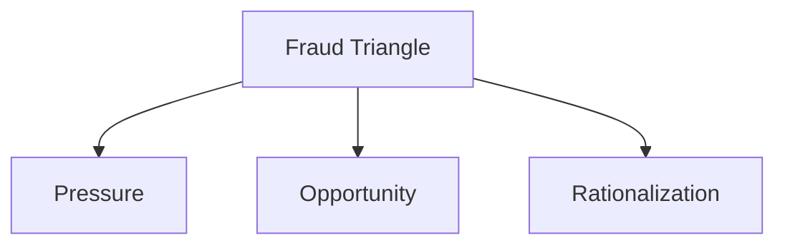

## 2.5 Motives and Rationalizations for Fraud

Fraud is a complex phenomenon that often involves a combination of psychological, situational, and systemic factors. Understanding the motives and rationalizations behind fraudulent behavior is crucial for forensic accountants and fraud examiners. This section delves into the psychological drivers that lead individuals to commit fraud, exploring the underlying motives and the rationalizations they use to justify their actions.

### Understanding the Fraud Triangle

The Fraud Triangle is a widely recognized framework that helps explain why individuals commit fraud. It consists of three components: **Pressure**, **Opportunity**, and **Rationalization**. Each component plays a critical role in the decision-making process of a fraudster.

#### Pressure

Pressure refers to the financial or emotional stress that motivates an individual to commit fraud. This pressure can stem from various sources, such as personal financial problems, addiction, or the desire to maintain a certain lifestyle. In a corporate setting, pressure might also arise from unrealistic performance expectations or the need to meet financial targets.

#### Opportunity

Opportunity is the perceived ability to commit fraud without getting caught. Weak internal controls, lack of oversight, and inadequate segregation of duties can create opportunities for fraud. Individuals are more likely to engage in fraudulent activities if they believe they can do so undetected.

#### Rationalization

Rationalization involves the mental process of justifying fraudulent behavior. Individuals often rationalize their actions to align with their personal values or to alleviate guilt. Common rationalizations include believing that the fraud is temporary, that they deserve the money, or that their actions are harmless.

### Motives for Fraud

Motives for fraud can be broadly categorized into financial, non-financial, and situational factors. Understanding these motives is essential for identifying potential fraud risks and implementing effective prevention strategies.

#### Financial Motives

1. **Personal Financial Gain**: The most common motive for fraud is personal financial gain. Individuals may commit fraud to pay off debts, support a lavish lifestyle, or achieve financial independence.

2. **Greed**: Greed is a powerful motivator that drives individuals to commit fraud even when they are financially stable. The desire for more wealth and power can lead to unethical behavior.

3. **Financial Pressure**: Financial pressure from personal circumstances, such as medical bills, divorce, or gambling debts, can push individuals to commit fraud as a means of relief.

#### Non-Financial Motives

1. **Revenge**: Some individuals commit fraud to retaliate against an employer or organization they feel has wronged them. This motive is often driven by anger or resentment.

2. **Power and Control**: The desire for power and control can motivate individuals to commit fraud, especially in positions of authority. They may manipulate financial records to assert dominance or influence over others.

3. **Recognition and Status**: The need for recognition and status can lead individuals to commit fraud to enhance their reputation or career prospects. This is often seen in cases of resume fraud or academic dishonesty.

#### Situational Motives

1. **Opportunity and Temptation**: Situational factors, such as weak internal controls or lack of oversight, can create opportunities for fraud. Individuals may be tempted to exploit these vulnerabilities for personal gain.

2. **Peer Pressure**: In some cases, individuals commit fraud due to peer pressure or a desire to fit in with a group. This is common in corporate environments where unethical behavior is normalized.

3. **Organizational Culture**: A toxic organizational culture that prioritizes profits over ethics can motivate individuals to commit fraud. Employees may feel compelled to engage in unethical behavior to meet performance targets or secure promotions.

### Rationalizations for Fraud

Rationalizations are the justifications individuals use to legitimize their fraudulent actions. Understanding these rationalizations is crucial for identifying potential fraudsters and addressing the root causes of fraudulent behavior.

#### Common Rationalizations

1. **"I'm Just Borrowing"**: Individuals may rationalize their actions by convincing themselves that they are merely borrowing money and intend to repay it later. This rationalization is common in embezzlement cases.

2. **"Everyone Does It"**: Some individuals justify their actions by believing that fraud is a common practice and that they are simply following the norm. This rationalization is often seen in environments with a culture of unethical behavior.

3. **"I Deserve It"**: Individuals may rationalize fraud by believing that they deserve the money or benefits due to their hard work or perceived unfair treatment. This rationalization is common in cases of expense reimbursement fraud.

4. **"No One Will Get Hurt"**: Some individuals justify their actions by believing that their fraud will not harm anyone. This rationalization is often used in cases of financial statement fraud, where individuals believe that manipulating numbers is harmless.

5. **"It's for a Good Cause"**: Individuals may rationalize fraud by convincing themselves that their actions are for a noble purpose, such as supporting a family member or funding a charitable cause.

### Case Studies and Real-World Examples

To illustrate the motives and rationalizations for fraud, let's examine some real-world case studies and examples.

#### Case Study: Enron Scandal

The Enron scandal is a classic example of financial statement fraud driven by greed and the desire for power. Executives at Enron manipulated financial statements to inflate profits and hide debts, rationalizing their actions by believing they were protecting the company's reputation and shareholder value.

#### Example: Expense Reimbursement Fraud

In a case of expense reimbursement fraud, an employee submitted false expense claims to receive additional compensation. The employee rationalized their actions by believing they deserved the extra money due to their hard work and long hours.

#### Scenario: Academic Fraud

A university professor committed academic fraud by falsifying research data to secure funding and enhance their reputation. The professor rationalized their actions by believing that the ends justified the means and that their research would ultimately benefit society.

### Strategies for Detecting and Preventing Fraud

Understanding the motives and rationalizations for fraud is essential for developing effective detection and prevention strategies. Here are some best practices for addressing these psychological drivers:

1. **Enhance Internal Controls**: Strengthen internal controls and oversight to reduce opportunities for fraud. Implement regular audits and reviews to identify potential vulnerabilities.

2. **Promote Ethical Culture**: Foster an ethical organizational culture that prioritizes integrity and transparency. Encourage open communication and provide employees with clear guidelines on ethical behavior.

3. **Provide Training and Awareness**: Educate employees on the importance of ethical behavior and the consequences of fraud. Conduct regular training sessions to raise awareness of fraud risks and prevention strategies.

4. **Implement Whistleblower Programs**: Establish whistleblower programs and hotlines to encourage employees to report suspicious activities. Ensure that whistleblowers are protected from retaliation.

5. **Conduct Behavioral Analysis**: Monitor employee behavior for red flags and warning signs of fraud. Conduct regular assessments to identify individuals who may be at risk of committing fraud.

### Conclusion

Motives and rationalizations for fraud are complex and multifaceted, involving a combination of psychological, situational, and systemic factors. By understanding these drivers, forensic accountants and fraud examiners can better identify potential fraud risks and implement effective prevention strategies. Through enhanced internal controls, ethical culture, and employee training, organizations can reduce the likelihood of fraud and protect their assets.

## **Ready to Test Your Knowledge?**



### What is the Fraud Triangle?

- [x] A framework consisting of Pressure, Opportunity, and Rationalization
- [ ] A tool used to calculate financial ratios
- [ ] A method for analyzing financial statements
- [ ] A legal framework for prosecuting fraud

> **Explanation:** The Fraud Triangle is a framework that explains why individuals commit fraud, consisting of Pressure, Opportunity, and Rationalization.

### Which of the following is a financial motive for fraud?

- [x] Personal financial gain
- [ ] Revenge
- [ ] Power and control
- [ ] Recognition and status

> **Explanation:** Personal financial gain is a financial motive for fraud, as individuals may commit fraud to achieve financial independence or support a lavish lifestyle.

### What is a common rationalization for committing fraud?

- [x] "I'm just borrowing"
- [ ] "It's illegal"
- [ ] "It's too risky"
- [ ] "It's unnecessary"

> **Explanation:** "I'm just borrowing" is a common rationalization where individuals convince themselves that they are merely borrowing money and intend to repay it later.

### Which of the following is a non-financial motive for fraud?

- [x] Revenge
- [ ] Financial pressure
- [ ] Personal financial gain
- [ ] Opportunity

> **Explanation:** Revenge is a non-financial motive for fraud, driven by anger or resentment towards an employer or organization.

### How can organizations reduce opportunities for fraud?

- [x] Enhance internal controls
- [ ] Ignore suspicious activities
- [ ] Reduce employee salaries
- [ ] Eliminate financial audits

> **Explanation:** Enhancing internal controls and oversight can reduce opportunities for fraud by identifying potential vulnerabilities.

### What role does organizational culture play in fraud?

- [x] It can motivate individuals to commit fraud
- [ ] It has no impact on fraud
- [ ] It only affects financial motives
- [ ] It prevents all fraud

> **Explanation:** A toxic organizational culture that prioritizes profits over ethics can motivate individuals to commit fraud.

### What is a situational motive for fraud?

- [x] Opportunity and temptation
- [ ] Personal financial gain
- [ ] Greed
- [ ] Recognition and status

> **Explanation:** Opportunity and temptation are situational motives for fraud, as individuals may exploit vulnerabilities for personal gain.

### Which of the following is a strategy for preventing fraud?

- [x] Promote ethical culture
- [ ] Ignore employee behavior
- [ ] Reduce internal controls
- [ ] Eliminate whistleblower programs

> **Explanation:** Promoting an ethical culture encourages integrity and transparency, reducing the likelihood of fraud.

### What is a common rationalization used in financial statement fraud?

- [x] "No one will get hurt"
- [ ] "It's illegal"
- [ ] "It's too risky"
- [ ] "It's unnecessary"

> **Explanation:** "No one will get hurt" is a rationalization used in financial statement fraud, where individuals believe manipulating numbers is harmless.

### True or False: Greed is a financial motive for fraud.

- [x] True
- [ ] False

> **Explanation:** True. Greed is a financial motive for fraud, driving individuals to commit fraud even when they are financially stable.


