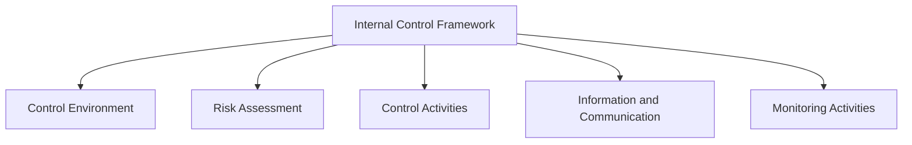

## 6.7 Auditing Techniques for Fraud Detection

Fraud detection is a critical component of forensic accounting, and auditing techniques play a pivotal role in identifying and preventing fraudulent activities. In this section, we will delve into the various auditing methods used to detect fraud, focusing on strategies that enhance the effectiveness of audits in uncovering fraudulent acts. This comprehensive guide will equip you with the knowledge and tools necessary to excel in fraud detection, both for your exams and in professional practice.

### Understanding the Role of Auditing in Fraud Detection

Auditing involves examining financial records and processes to ensure accuracy and compliance with established standards. When it comes to fraud detection, auditors must go beyond traditional methods to identify anomalies and red flags that may indicate fraudulent activities. The primary goal is to provide reasonable assurance that financial statements are free from material misstatement, whether due to error or fraud.

#### Key Objectives of Fraud Detection Audits

1. **Identify Fraud Risks:** Assess the likelihood and impact of potential fraud risks within an organization.
2. **Evaluate Internal Controls:** Determine the effectiveness of internal controls in preventing and detecting fraud.
3. **Analyze Financial Data:** Use analytical procedures to identify unusual trends or discrepancies.
4. **Investigate Red Flags:** Follow up on suspicious activities or anomalies detected during the audit.
5. **Report Findings:** Communicate findings to stakeholders and recommend corrective actions.

### Planning and Risk Assessment

Effective fraud detection begins with thorough planning and risk assessment. Auditors must understand the organization's environment, industry-specific risks, and the potential for fraud. This involves:

- **Conducting a Fraud Risk Assessment:** Identify areas where fraud is most likely to occur by evaluating the organization's processes, controls, and external factors.
- **Understanding the Fraud Triangle:** Familiarize yourself with the fraud triangle, which consists of pressure, opportunity, and rationalization. These elements help auditors identify potential fraudsters and vulnerable areas.
- **Setting Audit Objectives:** Define clear objectives that align with the organization's risk profile and regulatory requirements.

#### Practical Example: Fraud Risk Assessment in a Retail Company

Consider a retail company with multiple locations. An auditor conducting a fraud risk assessment might focus on areas such as inventory management, cash handling, and vendor relationships. By analyzing past incidents and industry trends, the auditor can identify high-risk areas and tailor the audit plan accordingly.

### Data Analysis and Analytical Procedures

Data analysis is a powerful tool in fraud detection, enabling auditors to identify patterns and anomalies that may indicate fraudulent activities. Key techniques include:

- **Trend Analysis:** Compare financial data over time to identify unusual fluctuations or inconsistencies.
- **Ratio Analysis:** Use financial ratios to assess the organization's performance and detect anomalies.
- **Benford's Law:** Apply Benford's Law to detect irregularities in numerical data, such as expense reports or sales figures.

#### Case Study: Using Data Analysis to Detect Fraudulent Transactions

In a case involving a manufacturing company, auditors used data analysis to identify discrepancies in raw material purchases. By analyzing purchase orders and supplier invoices, they discovered a pattern of inflated prices and unauthorized transactions, leading to the uncovering of a kickback scheme.

### Internal Controls and Compliance

Strong internal controls are essential for preventing and detecting fraud. Auditors must evaluate the design and effectiveness of these controls, focusing on:

- **Segregation of Duties:** Ensure that critical tasks are divided among multiple employees to prevent unauthorized actions.
- **Authorization and Approval Processes:** Verify that transactions are properly authorized and approved by responsible parties.
- **Access Controls:** Assess the security of information systems and physical assets to prevent unauthorized access.

#### Diagram: Internal Control Framework

### Auditing Techniques for Fraud Detection

1. **Substantive Testing:** Perform detailed testing of transactions and account balances to verify their accuracy and completeness. This includes vouching, tracing, and confirmation procedures.
   
2. **Control Testing:** Evaluate the effectiveness of internal controls by testing their design and operation. This involves walkthroughs, observation, and re-performance of control activities.

3. **Forensic Auditing:** Employ specialized techniques to investigate suspected fraud, such as digital forensics, document examination, and interviewing techniques.

4. **Continuous Auditing:** Implement real-time monitoring of transactions and controls to detect anomalies promptly. This approach leverages technology and data analytics for ongoing fraud detection.

#### Scenario: Substantive Testing in a Financial Audit

During a financial audit of a construction company, auditors performed substantive testing on large contracts and payments. By tracing payments to supporting documentation and confirming balances with subcontractors, they identified discrepancies that suggested fraudulent billing practices.

### Reporting and Communication

Effective communication of audit findings is crucial for addressing fraud risks and implementing corrective actions. Auditors should:

- **Prepare Clear and Concise Reports:** Highlight key findings, risks, and recommendations in a structured format.
- **Engage with Stakeholders:** Communicate with management, the board of directors, and other relevant parties to ensure understanding and action on audit findings.
- **Follow Up on Recommendations:** Monitor the implementation of recommended actions to address identified fraud risks.

### Best Practices in Fraud Detection Audits

- **Maintain Professional Skepticism:** Approach audits with a questioning mind and be alert to conditions that may indicate fraud.
- **Stay Informed on Industry Trends:** Keep up-to-date with emerging fraud schemes and industry-specific risks.
- **Leverage Technology:** Utilize advanced data analytics and forensic tools to enhance fraud detection capabilities.
- **Collaborate with Experts:** Work with forensic accountants, legal advisors, and IT specialists to address complex fraud cases.

### Common Pitfalls and Challenges

- **Overreliance on Internal Controls:** Assuming that strong controls eliminate fraud risk can lead to complacency. Always verify control effectiveness through testing.
- **Inadequate Risk Assessment:** Failing to identify all relevant fraud risks can result in undetected fraud.
- **Poor Communication:** Ineffective reporting and stakeholder engagement can hinder the implementation of corrective actions.

### Conclusion

Auditing techniques for fraud detection are essential tools for forensic accountants and auditors. By understanding and applying these methods, you can effectively identify and prevent fraudulent activities, safeguarding the integrity of financial statements and organizational assets. As you prepare for your exams and future career, focus on mastering these techniques and staying informed about emerging trends and challenges in fraud detection.

## **Ready to Test Your Knowledge?**



### What is the primary goal of fraud detection audits?

- [x] To provide reasonable assurance that financial statements are free from material misstatement
- [ ] To ensure all transactions are recorded accurately
- [ ] To improve the efficiency of internal controls
- [ ] To maximize company profits

> **Explanation:** The primary goal of fraud detection audits is to provide reasonable assurance that financial statements are free from material misstatement, whether due to error or fraud.

### Which element is NOT part of the fraud triangle?

- [ ] Pressure
- [x] Opportunity
- [ ] Rationalization
- [ ] Motivation

> **Explanation:** The fraud triangle consists of pressure, opportunity, and rationalization. Motivation is not a separate element but is often related to pressure.

### What technique involves comparing financial data over time to identify unusual fluctuations?

- [ ] Ratio Analysis
- [x] Trend Analysis
- [ ] Benford's Law
- [ ] Substantive Testing

> **Explanation:** Trend analysis involves comparing financial data over time to identify unusual fluctuations or inconsistencies.

### What is the purpose of segregation of duties in internal controls?

- [x] To prevent unauthorized actions by dividing critical tasks among multiple employees
- [ ] To ensure all transactions are recorded accurately
- [ ] To improve the efficiency of operations
- [ ] To maximize company profits

> **Explanation:** Segregation of duties is an internal control measure designed to prevent unauthorized actions by dividing critical tasks among multiple employees.

### Which auditing technique involves real-time monitoring of transactions and controls?

- [ ] Substantive Testing
- [ ] Control Testing
- [x] Continuous Auditing
- [ ] Forensic Auditing

> **Explanation:** Continuous auditing involves real-time monitoring of transactions and controls to detect anomalies promptly.

### What is the role of forensic auditing in fraud detection?

- [ ] To improve the efficiency of internal controls
- [ ] To ensure compliance with financial reporting standards
- [x] To investigate suspected fraud using specialized techniques
- [ ] To maximize company profits

> **Explanation:** Forensic auditing employs specialized techniques to investigate suspected fraud, such as digital forensics and document examination.

### What should auditors do to ensure effective communication of audit findings?

- [ ] Focus solely on financial data
- [x] Prepare clear and concise reports
- [ ] Avoid engaging with stakeholders
- [ ] Ignore follow-up on recommendations

> **Explanation:** Auditors should prepare clear and concise reports, engage with stakeholders, and follow up on recommendations to ensure effective communication of audit findings.

### What is a common pitfall in fraud detection audits?

- [ ] Overreliance on technology
- [x] Overreliance on internal controls
- [ ] Inadequate use of data analytics
- [ ] Excessive stakeholder engagement

> **Explanation:** A common pitfall in fraud detection audits is overreliance on internal controls, assuming they eliminate fraud risk without verification.

### What is the benefit of using Benford's Law in fraud detection?

- [ ] It improves the efficiency of internal controls
- [ ] It ensures compliance with financial reporting standards
- [x] It helps detect irregularities in numerical data
- [ ] It maximizes company profits

> **Explanation:** Benford's Law helps detect irregularities in numerical data, such as expense reports or sales figures, which may indicate fraud.

### True or False: Auditors should always assume that strong internal controls eliminate the risk of fraud.

- [ ] True
- [x] False

> **Explanation:** False. Auditors should not assume that strong internal controls eliminate the risk of fraud. They must verify control effectiveness through testing.


