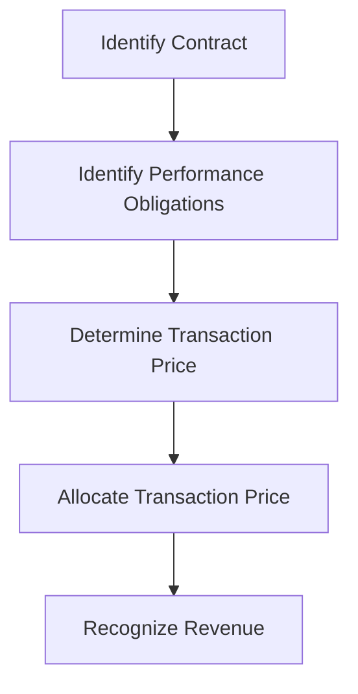

## 1.10 International Financial Reporting Standards (IFRS) vs. GAAP

### Introduction

In the realm of accounting, two dominant frameworks guide the preparation and presentation of financial statements: International Financial Reporting Standards (IFRS) and Generally Accepted Accounting Principles (GAAP). While both aim to provide transparency, consistency, and comparability in financial reporting, they differ in their approach, application, and underlying principles. Understanding these differences is crucial for accountants, especially those preparing for Canadian accounting exams, as Canada has adopted IFRS for publicly accountable enterprises while private enterprises may use Accounting Standards for Private Enterprises (ASPE), which is more aligned with GAAP.

### Overview of IFRS and GAAP

#### International Financial Reporting Standards (IFRS)

IFRS is a set of accounting standards developed by the International Accounting Standards Board (IASB). It is designed to bring consistency to accounting language, practices, and statements across international borders. IFRS is principle-based, providing broad guidelines that can be applied to various situations, allowing for flexibility and professional judgment.

#### Generally Accepted Accounting Principles (GAAP)

GAAP, primarily used in the United States, is a collection of accounting standards and common industry practices. It is rule-based, offering detailed rules and procedures for financial reporting. The Financial Accounting Standards Board (FASB) is responsible for establishing and maintaining GAAP.

### Key Differences Between IFRS and GAAP

#### 1. Conceptual Framework

- **Principle vs. Rule-Based:** IFRS is principle-based, offering broad guidelines and requiring professional judgment. GAAP is rule-based, providing specific rules and detailed guidance.
  
- **Objective of Financial Reporting:** Both frameworks aim to provide financial information that is useful to investors, creditors, and other stakeholders. However, IFRS places a stronger emphasis on providing information that reflects the economic reality of transactions.

#### 2. Revenue Recognition

- **IFRS:** Follows a five-step model for revenue recognition, focusing on the transfer of control rather than the transfer of risks and rewards.
  
- **GAAP:** Historically followed a more prescriptive approach, but recent updates have aligned GAAP more closely with IFRS through the adoption of the ASC 606 standard.

#### 3. Inventory Valuation

- **IFRS:** Does not allow the use of the Last-In, First-Out (LIFO) method for inventory valuation.
  
- **GAAP:** Permits the use of LIFO, which can result in different inventory and cost of goods sold figures.

#### 4. Financial Statement Presentation

- **IFRS:** Requires a classified statement of financial position, separating current and non-current items, and provides more flexibility in the presentation of the income statement.
  
- **GAAP:** Offers more detailed guidance on the format and presentation of financial statements, including specific line items that must be included.

#### 5. Property, Plant, and Equipment (PP&E)

- **IFRS:** Allows for revaluation of PP&E to fair value, provided it can be measured reliably.
  
- **GAAP:** Generally requires PP&E to be carried at historical cost, with revaluation not permitted.

#### 6. Intangible Assets

- **IFRS:** Allows for the capitalization of development costs when certain criteria are met.
  
- **GAAP:** Generally requires research and development costs to be expensed as incurred.

#### 7. Leases

- **IFRS:** Under IFRS 16, all leases are recognized on the balance sheet, eliminating the distinction between operating and finance leases for lessees.
  
- **GAAP:** Maintains a distinction between operating and finance leases, with different accounting treatments.

### Practical Examples and Case Studies

#### Example 1: Revenue Recognition

Consider a software company that sells licenses and provides ongoing support. Under IFRS, the company would identify separate performance obligations for the license and support, recognizing revenue as each obligation is satisfied. Under GAAP, the company would follow similar steps under ASC 606, but the historical approach would have required more detailed guidance on the timing and amount of revenue recognition.

#### Example 2: Inventory Valuation

A manufacturing company using LIFO under GAAP may report lower net income during periods of rising prices due to higher cost of goods sold. If the same company were to report under IFRS, it would need to switch to FIFO or another acceptable method, potentially resulting in higher reported income.

### Real-World Applications

#### Canadian Context

In Canada, publicly accountable enterprises are required to use IFRS, while private enterprises may choose between IFRS and ASPE. This dual framework allows Canadian companies to select the standards that best suit their reporting needs, balancing international comparability with domestic relevance.

#### Global Perspective

The convergence of IFRS and GAAP has been a significant focus for standard setters, aiming to reduce differences and improve global comparability. While progress has been made, key differences remain, impacting multinational companies operating in jurisdictions that require different standards.

### Step-by-Step Guidance

#### Revenue Recognition under IFRS

1. **Identify the Contract:** Determine whether a contract exists and identify its terms.
2. **Identify Performance Obligations:** Separate the contract into distinct performance obligations.
3. **Determine the Transaction Price:** Calculate the total amount of consideration expected.
4. **Allocate the Transaction Price:** Distribute the transaction price to each performance obligation.
5. **Recognize Revenue:** Recognize revenue as each performance obligation is satisfied.

#### Preparing Financial Statements

- **Balance Sheet:** Under IFRS, classify assets and liabilities as current or non-current. Under GAAP, follow specific presentation requirements.
- **Income Statement:** IFRS allows more flexibility in format, while GAAP requires specific line items.
- **Cash Flow Statement:** Both frameworks require a statement of cash flows, but classification of certain items may differ.

### Diagrams and Visuals

Below is a diagram illustrating the revenue recognition process under IFRS:

### Best Practices and Common Pitfalls

- **Professional Judgment:** Under IFRS, exercise professional judgment in applying principles, especially in areas like revenue recognition and asset valuation.
- **Compliance:** Ensure compliance with the specific requirements of each framework, particularly when preparing consolidated financial statements for multinational entities.
- **Continuous Learning:** Stay updated on changes to standards, as both IFRS and GAAP evolve to address emerging issues and improve financial reporting quality.

### References and Additional Resources

- **CPA Canada:** Offers resources and guidance on the application of IFRS and ASPE in Canada.
- **IASB and FASB Websites:** Provide access to the full text of IFRS and GAAP standards, updates, and educational materials.
- **IFRS Foundation:** Offers training modules and case studies to deepen understanding of IFRS applications.

### Summary

Understanding the differences between IFRS and GAAP is essential for accountants, particularly those working in or with Canadian companies. While both frameworks aim to provide transparent and comparable financial information, their approaches and specific requirements differ. By mastering these differences, you can enhance your financial reporting skills and better prepare for the Canadian accounting exams.

## **Ready to Test Your Knowledge?**



### Which of the following is a key difference between IFRS and GAAP?

- [x] IFRS is principle-based, while GAAP is rule-based.
- [ ] IFRS allows LIFO inventory valuation, while GAAP does not.
- [ ] GAAP requires the revaluation of PP&E, while IFRS does not.
- [ ] IFRS mandates specific income statement formats, while GAAP does not.

> **Explanation:** IFRS is principle-based, providing broad guidelines, while GAAP is rule-based, offering specific rules and procedures.

### Under IFRS, how are development costs treated?

- [x] They can be capitalized if certain criteria are met.
- [ ] They must be expensed as incurred.
- [ ] They are always treated as intangible assets.
- [ ] They are recognized as liabilities.

> **Explanation:** IFRS allows for the capitalization of development costs when specific criteria are met, unlike GAAP, which generally requires expensing.

### Which inventory valuation method is not permitted under IFRS?

- [x] LIFO
- [ ] FIFO
- [ ] Weighted Average
- [ ] Specific Identification

> **Explanation:** IFRS does not allow the use of the Last-In, First-Out (LIFO) method for inventory valuation.

### What is a major focus of IFRS in financial reporting?

- [x] Reflecting the economic reality of transactions.
- [ ] Providing detailed rules for every transaction.
- [ ] Ensuring all companies use the same financial statement format.
- [ ] Mandating the use of historical cost for all assets.

> **Explanation:** IFRS emphasizes providing information that reflects the economic reality of transactions, allowing for flexibility and professional judgment.

### How does GAAP treat research and development costs?

- [x] They must be expensed as incurred.
- [ ] They can be capitalized if certain criteria are met.
- [x] They are recognized as liabilities.
- [ ] They are always treated as intangible assets.

> **Explanation:** GAAP generally requires research and development costs to be expensed as incurred, unlike IFRS, which allows capitalization under certain conditions.

### Which of the following is true about lease accounting under IFRS?

- [x] All leases are recognized on the balance sheet.
- [ ] Only finance leases are recognized on the balance sheet.
- [ ] Operating leases are not recognized on the balance sheet.
- [ ] Lease accounting is identical to GAAP.

> **Explanation:** IFRS 16 requires all leases to be recognized on the balance sheet, eliminating the distinction between operating and finance leases for lessees.

### What is the primary objective of financial reporting under both IFRS and GAAP?

- [x] Providing useful information to investors and creditors.
- [ ] Ensuring tax compliance.
- [x] Standardizing financial statement formats.
- [ ] Eliminating the need for professional judgment.

> **Explanation:** Both IFRS and GAAP aim to provide financial information that is useful to investors, creditors, and other stakeholders.

### How does IFRS handle the revaluation of PP&E?

- [x] Allows revaluation to fair value if reliably measurable.
- [ ] Requires historical cost accounting.
- [ ] Mandates annual revaluation.
- [ ] Prohibits revaluation under any circumstances.

> **Explanation:** IFRS permits the revaluation of PP&E to fair value, provided it can be measured reliably, unlike GAAP, which generally requires historical cost.

### Which framework provides more detailed guidance on financial statement presentation?

- [x] GAAP
- [ ] IFRS
- [ ] Both provide the same level of detail.
- [ ] Neither provides detailed guidance.

> **Explanation:** GAAP offers more detailed guidance on the format and presentation of financial statements compared to IFRS.

### True or False: IFRS and GAAP have completely converged, eliminating all differences.

- [ ] True
- [x] False

> **Explanation:** While there has been significant convergence between IFRS and GAAP, key differences still exist, impacting financial reporting and analysis.


