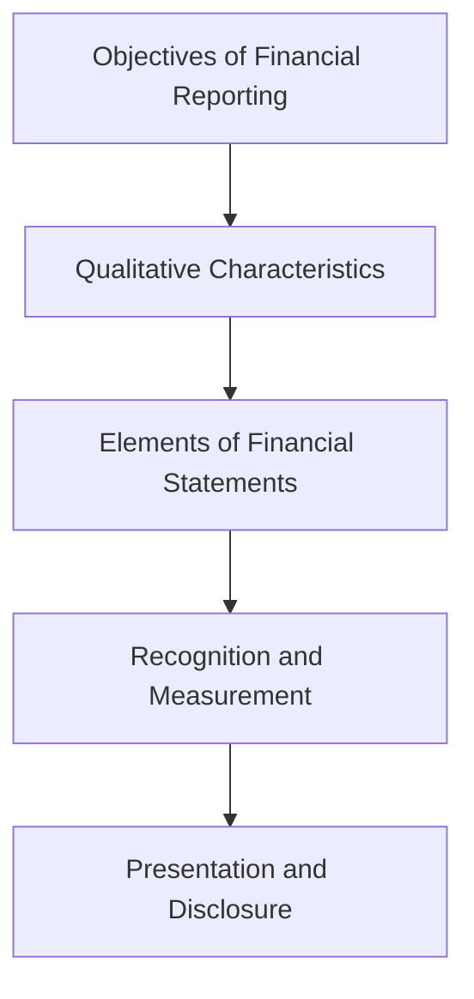

## 1.11 The IASB and FASB Conceptual Framework Projects

The International Accounting Standards Board (IASB) and the Financial Accounting Standards Board (FASB) are two of the most influential bodies in the world of accounting standards. Their joint efforts in developing a conceptual framework aim to harmonize accounting standards globally, providing a consistent foundation for financial reporting. This section explores the collaborative efforts and differences between the IASB and FASB in developing the conceptual framework, offering insights into their impact on accounting practices and standards.

### Introduction to the Conceptual Framework

The conceptual framework serves as a theoretical foundation for accounting standards, guiding the development and application of financial reporting standards. It provides a coherent system of interrelated objectives and fundamentals that lead to consistent standards and that prescribe the nature, function, and limits of financial accounting and financial statements. The framework is crucial for preparers of financial statements, auditors, and users of financial information, as it enhances the comparability and reliability of financial statements.

### The Role of IASB and FASB

The IASB is responsible for developing International Financial Reporting Standards (IFRS), which are used in over 140 countries. The FASB, on the other hand, develops Generally Accepted Accounting Principles (GAAP) used primarily in the United States. Both boards aim to provide high-quality, transparent, and comparable financial information to help investors and other users make informed economic decisions.

### Historical Context and Evolution

The conceptual framework projects of the IASB and FASB have evolved over time, reflecting changes in the economic environment, advances in technology, and shifts in user needs. Initially, the two boards worked independently, but in 2002, they formalized their collaboration through the Norwalk Agreement, committing to the convergence of IFRS and US GAAP.

### Key Components of the Conceptual Framework

The conceptual framework comprises several key components:

1. **Objectives of Financial Reporting**: The primary objective is to provide financial information that is useful to existing and potential investors, lenders, and other creditors in making decisions about providing resources to the entity.

2. **Qualitative Characteristics of Useful Financial Information**: These include relevance, faithful representation, comparability, verifiability, timeliness, and understandability.

3. **Elements of Financial Statements**: The framework defines the elements of financial statements, such as assets, liabilities, equity, income, and expenses.

4. **Recognition and Measurement**: Criteria for recognizing and measuring the elements of financial statements are established to ensure that financial information is complete and reliable.

5. **Presentation and Disclosure**: Guidelines for presenting and disclosing financial information are provided to enhance the transparency and comparability of financial statements.

### Collaborative Efforts: The Joint Conceptual Framework Project

The IASB and FASB launched a joint project to develop a common conceptual framework that would serve as a foundation for both IFRS and US GAAP. The project aimed to improve financial reporting by providing a more complete, clear, and updated framework.

#### Phases of the Joint Project

The joint project was divided into several phases, each addressing different aspects of the conceptual framework:

- **Phase A: Objectives and Qualitative Characteristics**: This phase focused on refining the objectives of financial reporting and the qualitative characteristics of useful financial information.

- **Phase B: Elements and Recognition**: This phase aimed to define the elements of financial statements and establish criteria for their recognition.

- **Phase C: Measurement**: The boards explored different measurement bases and their implications for financial reporting.

- **Phase D: Reporting Entity**: This phase addressed the concept of the reporting entity and its boundaries.

- **Phase E: Presentation and Disclosure**: The focus was on improving the presentation and disclosure of financial information.

- **Phase F: Framework for a General Purpose Financial Reporting**: This phase aimed to provide a comprehensive framework for general-purpose financial reporting.

### Differences and Challenges

Despite their collaborative efforts, the IASB and FASB faced several challenges and differences in their approach to the conceptual framework:

- **Cultural and Regulatory Differences**: The boards operate in different regulatory environments, which can lead to differences in priorities and approaches.

- **Stakeholder Interests**: The needs and expectations of stakeholders in different regions can vary, influencing the development of the framework.

- **Technical and Practical Challenges**: Developing a comprehensive and universally applicable framework involves complex technical and practical challenges.

### Impact on Global Accounting Standards

The joint conceptual framework project has significantly impacted global accounting standards, promoting convergence and enhancing the quality and comparability of financial reporting. The framework serves as a reference point for developing and interpreting accounting standards, ensuring consistency and coherence in financial reporting.

### Practical Examples and Case Studies

To illustrate the practical application of the conceptual framework, consider the following examples:

- **Revenue Recognition**: The framework provides guidance on recognizing revenue, ensuring that it is reported in a manner that reflects the economic substance of transactions.

- **Fair Value Measurement**: The framework establishes principles for measuring assets and liabilities at fair value, enhancing the relevance and reliability of financial information.

- **Lease Accounting**: The framework guides the recognition and measurement of lease transactions, ensuring that financial statements reflect the economic reality of lease arrangements.

### Real-World Applications and Regulatory Scenarios

The conceptual framework is applied in various regulatory scenarios, influencing the development and interpretation of accounting standards. For example, the framework guides the IASB and FASB in addressing emerging issues such as digitalization, sustainability, and global economic changes.

### Step-by-Step Guidance

To effectively apply the conceptual framework, consider the following steps:

1. **Understand the Objectives**: Familiarize yourself with the objectives of financial reporting and how they guide the development of accounting standards.

2. **Identify Qualitative Characteristics**: Recognize the qualitative characteristics of useful financial information and their role in enhancing the quality of financial reporting.

3. **Define Elements**: Understand the elements of financial statements and the criteria for their recognition and measurement.

4. **Apply Measurement Principles**: Apply appropriate measurement principles to ensure that financial information is relevant and reliable.

5. **Ensure Proper Presentation and Disclosure**: Follow guidelines for presenting and disclosing financial information to enhance transparency and comparability.

### Diagrams and Visuals

To enhance understanding, consider the following diagram illustrating the relationship between the components of the conceptual framework:

### Best Practices and Common Pitfalls

When applying the conceptual framework, consider the following best practices:

- **Stay Informed**: Keep up-to-date with developments in accounting standards and the conceptual framework.

- **Focus on Substance Over Form**: Ensure that financial reporting reflects the economic substance of transactions.

- **Avoid Over-Reliance on Rules**: Use professional judgment to apply principles-based standards effectively.

Common pitfalls to avoid include:

- **Ignoring Qualitative Characteristics**: Failing to consider the qualitative characteristics of useful financial information can lead to misleading financial reporting.

- **Inconsistent Application**: Inconsistent application of the framework can undermine the comparability and reliability of financial statements.

### References and Additional Resources

For further exploration, consider the following resources:

- **International Financial Reporting Standards (IFRS)**: The official standards and interpretations issued by the IASB.

- **Generally Accepted Accounting Principles (GAAP)**: The official standards and interpretations issued by the FASB.

- **CPA Canada**: Provides resources and guidance on Canadian accounting standards and practices.

### Summary and Key Points

The IASB and FASB conceptual framework projects play a crucial role in harmonizing global accounting standards, providing a consistent foundation for financial reporting. By understanding and applying the framework, accountants can enhance the quality and comparability of financial statements, supporting informed economic decision-making.

## **Ready to Test Your Knowledge?**



### What is the primary objective of the conceptual framework?

- [x] To provide a consistent foundation for financial reporting standards
- [ ] To increase the complexity of financial reporting
- [ ] To eliminate the need for professional judgment
- [ ] To focus solely on quantitative information

> **Explanation:** The primary objective of the conceptual framework is to provide a consistent foundation for financial reporting standards, enhancing the comparability and reliability of financial statements.

### Which boards collaborated on the joint conceptual framework project?

- [x] IASB and FASB
- [ ] AICPA and PCAOB
- [ ] SEC and CSA
- [ ] IFRS and GAAP

> **Explanation:** The IASB and FASB collaborated on the joint conceptual framework project to harmonize global accounting standards.

### What are the qualitative characteristics of useful financial information?

- [x] Relevance, faithful representation, comparability, verifiability, timeliness, understandability
- [ ] Complexity, ambiguity, inconsistency, opacity
- [ ] Simplicity, uniformity, predictability, rigidity
- [ ] Exclusivity, confidentiality, subjectivity, flexibility

> **Explanation:** The qualitative characteristics of useful financial information include relevance, faithful representation, comparability, verifiability, timeliness, and understandability.

### What is the Norwalk Agreement?

- [x] An agreement between the IASB and FASB to converge IFRS and US GAAP
- [ ] A treaty between Canada and the US on tax matters
- [ ] A framework for auditing standards
- [ ] A guideline for ethical accounting practices

> **Explanation:** The Norwalk Agreement is an agreement between the IASB and FASB to converge IFRS and US GAAP, promoting harmonization of accounting standards.

### What phase of the joint project focused on measurement?

- [x] Phase C
- [ ] Phase A
- [ ] Phase B
- [ ] Phase D

> **Explanation:** Phase C of the joint project focused on measurement, exploring different measurement bases and their implications for financial reporting.

### What is the role of the conceptual framework in revenue recognition?

- [x] It provides guidance on recognizing revenue to reflect the economic substance of transactions
- [ ] It eliminates the need for revenue recognition
- [ ] It mandates a single method for all revenue recognition
- [ ] It focuses solely on cash-based transactions

> **Explanation:** The conceptual framework provides guidance on recognizing revenue, ensuring that it is reported in a manner that reflects the economic substance of transactions.

### What is a common pitfall when applying the conceptual framework?

- [x] Ignoring qualitative characteristics
- [ ] Over-reliance on professional judgment
- [ ] Consistent application
- [ ] Focusing on substance over form

> **Explanation:** A common pitfall when applying the conceptual framework is ignoring the qualitative characteristics of useful financial information, which can lead to misleading financial reporting.

### What is the impact of the conceptual framework on global accounting standards?

- [x] It promotes convergence and enhances the quality and comparability of financial reporting
- [ ] It increases the complexity of accounting standards
- [ ] It limits the use of professional judgment
- [ ] It focuses solely on regional standards

> **Explanation:** The conceptual framework promotes convergence and enhances the quality and comparability of financial reporting, supporting informed economic decision-making.

### What is the significance of the reporting entity concept in the framework?

- [x] It defines the boundaries of the entity for financial reporting purposes
- [ ] It eliminates the need for separate financial statements
- [ ] It focuses solely on individual transactions
- [ ] It mandates a single reporting format for all entities

> **Explanation:** The reporting entity concept in the framework defines the boundaries of the entity for financial reporting purposes, ensuring that financial statements reflect the economic activities of the entity.

### True or False: The conceptual framework eliminates the need for professional judgment.

- [ ] True
- [x] False

> **Explanation:** False. The conceptual framework does not eliminate the need for professional judgment; rather, it provides a foundation for applying principles-based standards effectively.


