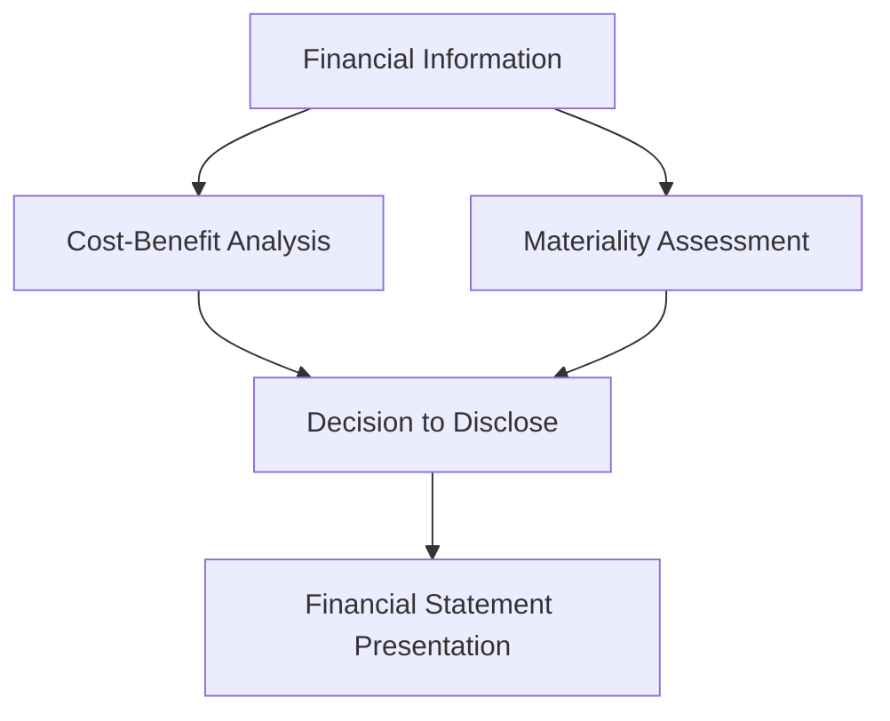

## 1.7 Constraints in Accounting Information

In the realm of accounting, constraints play a crucial role in shaping the way financial information is reported and interpreted. These constraints ensure that the information provided in financial statements is both useful and relevant to users, while also being feasible to produce. This section delves into the primary constraints of accounting information: cost-benefit considerations and materiality. Understanding these constraints is essential for anyone preparing for Canadian accounting exams, as they underpin many of the decisions made in financial reporting.

### Cost-Benefit Considerations

The cost-benefit constraint, also known as the cost constraint, is a fundamental concept in accounting that requires the benefits of providing financial information to outweigh the costs of obtaining and presenting it. This constraint ensures that the resources expended in gathering, processing, and disseminating financial information are justified by the value that this information provides to users.

#### Understanding the Cost-Benefit Constraint

The cost-benefit analysis involves evaluating the costs associated with producing financial information against the benefits that users derive from that information. Costs can include the time, effort, and financial resources required to collect and process data, while benefits are typically measured in terms of improved decision-making by users of the financial statements.

**Example:** A company may consider whether to implement a new accounting software system. The costs would include the purchase price of the software, training for employees, and potential disruptions during the transition period. The benefits might include more accurate financial reporting, faster processing times, and enhanced decision-making capabilities.

#### Practical Application in Financial Reporting

In practice, the cost-benefit constraint affects decisions such as the level of detail included in financial statements, the frequency of reporting, and the adoption of new accounting standards. For example, smaller companies might opt for less frequent reporting or simplified disclosures if the costs of detailed reporting outweigh the benefits for their specific user base.

**Case Study:** A small Canadian manufacturing firm evaluates whether to adopt a new International Financial Reporting Standard (IFRS) that requires extensive disclosures. After conducting a cost-benefit analysis, the firm decides that the costs of compliance, including additional audit fees and staff training, exceed the benefits for its limited group of stakeholders, who are primarily interested in basic financial metrics.

#### Challenges and Considerations

One of the main challenges in applying the cost-benefit constraint is quantifying the benefits of financial information, which can often be subjective. Additionally, different stakeholders may perceive the benefits differently, leading to potential conflicts in decision-making.

**Strategy:** To address these challenges, companies can engage with their stakeholders to understand their needs and preferences, ensuring that the financial information provided aligns with user expectations while remaining cost-effective.

### Materiality in Accounting

Materiality is another critical constraint in accounting that determines the significance of financial information. Information is considered material if its omission or misstatement could influence the economic decisions of users based on the financial statements.

#### Defining Materiality

Materiality is a relative concept, meaning that what is material for one company may not be material for another. The determination of materiality involves both quantitative and qualitative assessments. Quantitatively, materiality is often assessed as a percentage of key financial metrics, such as revenue, net income, or total assets. Qualitatively, materiality considers the nature of the information and its potential impact on decision-making.

**Example:** A $10,000 error in a small business with annual revenues of $500,000 might be considered material, whereas the same error in a multinational corporation with revenues of $50 billion would likely be immaterial.

#### Application in Financial Reporting

Materiality influences various aspects of financial reporting, including the level of detail in disclosures, the aggregation of financial data, and the recognition of certain transactions. Companies must assess materiality when deciding whether to disclose specific information or when determining the appropriate level of aggregation for financial statement items.

**Scenario:** A Canadian retailer evaluates whether to disclose a pending lawsuit in its financial statements. Although the potential financial impact is relatively small, the lawsuit involves allegations of unethical business practices, which could affect the company's reputation. In this case, the qualitative aspect of materiality suggests that disclosure is warranted.

#### Regulatory Guidance and Standards

Both IFRS and Generally Accepted Accounting Principles (GAAP) provide guidance on materiality, emphasizing its importance in ensuring that financial statements are not misleading. Under IFRS, materiality is a pervasive concept that applies to all aspects of financial reporting, while GAAP provides specific thresholds and guidelines for assessing materiality.

**Reference:** According to IFRS Practice Statement 2, "Making Materiality Judgements," materiality is an entity-specific aspect of relevance based on the nature or magnitude, or both, of the items to which the information relates.

#### Challenges in Determining Materiality

Determining materiality can be challenging due to its subjective nature and the need to balance quantitative and qualitative factors. Companies must exercise professional judgment in assessing materiality, considering both the financial and non-financial implications of their decisions.

**Best Practice:** To enhance consistency and transparency, companies can establish materiality thresholds and guidelines, which are reviewed and updated regularly to reflect changes in the business environment and stakeholder expectations.

### Interaction Between Cost-Benefit and Materiality

The constraints of cost-benefit and materiality often interact in the decision-making process. For example, a company may decide not to disclose certain information if the costs of disclosure exceed the benefits, even if the information is considered material. Conversely, if information is deemed highly material, a company might incur significant costs to ensure its accurate and timely disclosure.

**Diagram: Interaction Between Cost-Benefit and Materiality**

### Real-World Applications and Implications

Understanding and applying the constraints of cost-benefit and materiality is crucial for accountants and financial professionals. These constraints guide the preparation and presentation of financial statements, ensuring that they provide relevant and reliable information to users.

#### Case Study: Implementation of New Accounting Standards

Consider a Canadian technology company faced with implementing a new accounting standard that requires detailed disclosures about software development costs. The company conducts a cost-benefit analysis and determines that the benefits of enhanced transparency and improved investor confidence outweigh the costs of compliance. However, the company also assesses materiality and decides to focus its disclosures on major projects that significantly impact its financial position, rather than providing exhaustive details on all development activities.

### Best Practices for Applying Constraints

1. **Engage Stakeholders:** Regularly communicate with stakeholders to understand their information needs and preferences, ensuring that financial reporting aligns with user expectations.

2. **Establish Guidelines:** Develop clear guidelines and thresholds for assessing materiality and conducting cost-benefit analyses, promoting consistency and transparency in decision-making.

3. **Exercise Professional Judgment:** Encourage the use of professional judgment in evaluating the significance of financial information, considering both quantitative and qualitative factors.

4. **Review and Update Policies:** Regularly review and update accounting policies and procedures to reflect changes in the business environment and regulatory requirements.

5. **Document Decisions:** Maintain thorough documentation of decisions related to cost-benefit and materiality assessments, providing a clear rationale for the approach taken.

### Conclusion

The constraints of cost-benefit and materiality are integral to the accounting process, influencing the preparation and presentation of financial statements. By understanding and applying these constraints, accountants and financial professionals can ensure that financial information is both relevant and reliable, meeting the needs of users while remaining feasible to produce. As you prepare for your Canadian accounting exams, consider how these constraints impact financial reporting decisions and practice applying them in various scenarios.

## **Ready to Test Your Knowledge?**



### Which of the following best describes the cost-benefit constraint in accounting?

- [x] The benefits of providing financial information should outweigh the costs of obtaining and presenting it.
- [ ] The costs of financial reporting should be minimized regardless of the benefits.
- [ ] Financial information should be provided only if it is free of cost.
- [ ] The cost of financial reporting should be equal to the benefits derived from it.

> **Explanation:** The cost-benefit constraint requires that the benefits of providing financial information outweigh the costs involved in obtaining and presenting it.

### What is the primary purpose of the materiality constraint in accounting?

- [x] To ensure that financial information is significant enough to influence the decisions of users.
- [ ] To reduce the cost of financial reporting.
- [ ] To ensure that all financial information is disclosed, regardless of its significance.
- [ ] To limit the amount of financial information provided to users.

> **Explanation:** Materiality ensures that only information significant enough to influence users' decisions is included in financial statements.

### Which of the following is a qualitative factor in assessing materiality?

- [x] The nature of the information and its potential impact on decision-making.
- [ ] The percentage of total assets.
- [ ] The percentage of net income.
- [ ] The percentage of total revenue.

> **Explanation:** Qualitative factors in materiality assessment include the nature of the information and its potential impact on decision-making.

### How do cost-benefit considerations affect financial reporting?

- [x] They influence the level of detail included in financial statements and the adoption of new standards.
- [ ] They ensure that all financial information is disclosed, regardless of cost.
- [ ] They require that financial statements be prepared at the lowest possible cost.
- [ ] They have no impact on financial reporting.

> **Explanation:** Cost-benefit considerations affect the level of detail in financial statements and the adoption of new standards, ensuring that the benefits outweigh the costs.

### What is the relationship between cost-benefit and materiality constraints?

- [x] They often interact in decision-making, influencing disclosure and presentation.
- [ ] They are independent and do not affect each other.
- [ ] They are synonymous and interchangeable.
- [ ] They always lead to the same decision regarding financial reporting.

> **Explanation:** Cost-benefit and materiality constraints often interact, influencing decisions about disclosure and presentation in financial reporting.

### Which of the following is a challenge in applying the cost-benefit constraint?

- [x] Quantifying the benefits of financial information.
- [ ] Identifying the costs of financial reporting.
- [ ] Ensuring that all information is disclosed.
- [ ] Minimizing the costs of financial reporting.

> **Explanation:** Quantifying the benefits of financial information can be subjective and challenging, making it difficult to apply the cost-benefit constraint.

### What is a best practice for applying materiality in financial reporting?

- [x] Establishing clear thresholds and guidelines for assessing materiality.
- [ ] Disclosing all financial information, regardless of its significance.
- [ ] Focusing solely on quantitative factors.
- [ ] Ignoring stakeholder preferences.

> **Explanation:** Establishing clear thresholds and guidelines for assessing materiality promotes consistency and transparency in financial reporting.

### How can companies address challenges in determining materiality?

- [x] By exercising professional judgment and considering both quantitative and qualitative factors.
- [ ] By focusing only on quantitative factors.
- [ ] By ignoring qualitative factors.
- [ ] By disclosing all information, regardless of materiality.

> **Explanation:** Companies can address challenges in determining materiality by exercising professional judgment and considering both quantitative and qualitative factors.

### What is a key takeaway from understanding accounting constraints?

- [x] They ensure that financial information is both relevant and reliable while being feasible to produce.
- [ ] They limit the amount of financial information provided to users.
- [ ] They require that all financial information be disclosed, regardless of cost.
- [ ] They have no impact on financial reporting decisions.

> **Explanation:** Accounting constraints ensure that financial information is relevant and reliable while being feasible to produce, guiding financial reporting decisions.

### True or False: Materiality is a fixed concept that applies equally to all companies.

- [ ] True
- [x] False

> **Explanation:** Materiality is a relative concept that varies between companies, depending on their size, industry, and specific circumstances.


