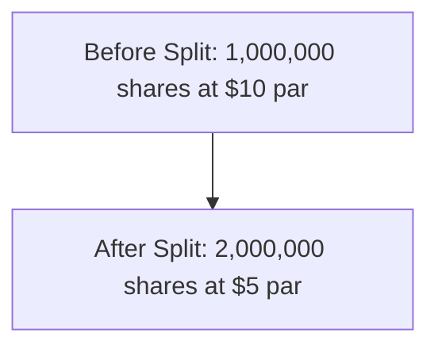
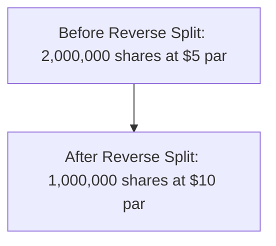

## 10.5 Stock Splits and Reverse Stock Splits

In the realm of corporate finance and accounting, stock splits and reverse stock splits are strategic maneuvers that companies use to adjust their share price and the number of shares outstanding. These actions can significantly impact shareholders' equity, market perception, and the company's financial statements. This section will delve into the purpose, accounting treatment, and implications of stock splits and reverse stock splits, providing you with a comprehensive understanding essential for Canadian accounting exams and professional practice.

### Understanding Stock Splits

A stock split occurs when a company decides to increase the number of its outstanding shares by issuing more shares to current shareholders. This process does not change the company's market capitalization but reduces the price per share, making the stock more affordable and potentially more attractive to investors.

#### Purpose of Stock Splits

1. **Enhancing Liquidity:** By reducing the share price, stock splits can make shares more accessible to a broader range of investors, increasing trading volume and liquidity.
   
2. **Market Perception:** A lower share price can make a stock appear more affordable, potentially attracting more retail investors and enhancing market perception.
   
3. **Index Eligibility:** Some stock indices have price limits for inclusion. A stock split can help a company meet these criteria, allowing its shares to be included in major indices.

#### Types of Stock Splits

- **Forward Stock Split:** This is the most common type of stock split, where the number of shares increases, and the price per share decreases proportionally. For example, in a 2-for-1 split, shareholders receive an additional share for each share they own, doubling the number of shares while halving the price per share.

- **Fractional Stock Split:** In some cases, companies may issue fractional shares. For instance, a 3-for-2 split means for every two shares owned, shareholders receive an additional 1.5 shares.

#### Accounting for Stock Splits

From an accounting perspective, stock splits do not affect the total value of shareholders' equity. Instead, they involve a memorandum entry to adjust the par value per share and the number of shares outstanding. Here's how it works:

- **Memorandum Entry:** The company records a memorandum entry to reflect the change in the number of shares and the new par value per share. This entry does not affect the balance sheet or income statement directly.

- **Example:** Consider a company with 1 million shares outstanding at $10 par value. In a 2-for-1 split, the number of shares doubles to 2 million, and the par value per share halves to $5.

### Understanding Reverse Stock Splits

A reverse stock split is the opposite of a stock split. It reduces the number of shares outstanding while increasing the price per share. This action is often used to meet stock exchange listing requirements or improve the stock's market perception.

#### Purpose of Reverse Stock Splits

1. **Compliance with Listing Requirements:** Stock exchanges often have minimum price requirements. A reverse split can help a company meet these criteria and avoid delisting.

2. **Market Perception:** Increasing the share price can enhance the stock's image, making it appear more valuable and stable to investors.

3. **Reducing Volatility:** A higher share price can reduce the stock's volatility, as small price changes represent a smaller percentage of the total share price.

#### Types of Reverse Stock Splits

- **Standard Reverse Split:** This involves consolidating shares, such as a 1-for-2 reverse split, where shareholders receive one share for every two shares they own, effectively halving the number of shares and doubling the price per share.

- **Fractional Reverse Split:** Similar to fractional stock splits, fractional reverse splits adjust shares in non-integer ratios, such as a 1-for-3 split.

#### Accounting for Reverse Stock Splits

Reverse stock splits require adjustments to the par value per share and the number of shares outstanding, similar to stock splits but in reverse. The accounting treatment includes:

- **Memorandum Entry:** A memorandum entry is made to reflect the reduced number of shares and the increased par value per share. This entry does not impact the balance sheet or income statement directly.

- **Example:** If a company has 2 million shares outstanding at $5 par value, a 1-for-2 reverse split results in 1 million shares at $10 par value.

### Impact on Financial Statements

While stock splits and reverse stock splits do not directly affect the financial statements, they have implications for financial analysis and reporting:

- **Earnings Per Share (EPS):** Stock splits and reverse splits affect the calculation of EPS. After a split, the number of shares used in EPS calculations must be adjusted to reflect the new share count.

- **Historical Comparisons:** When analyzing historical data, it's essential to adjust past share counts and prices to ensure consistency and comparability.

- **Disclosure Requirements:** Companies must disclose stock splits and reverse splits in their financial statements, including the rationale and impact on share counts and par values.

### Real-World Applications and Regulatory Considerations

In Canada, companies must adhere to the International Financial Reporting Standards (IFRS) as adopted in Canada when accounting for stock splits and reverse stock splits. Key considerations include:

- **IFRS Compliance:** Ensure that all memorandum entries and disclosures comply with IFRS requirements, particularly IAS 33, which governs EPS calculations.

- **Regulatory Filings:** Companies must file appropriate regulatory documents with securities commissions and stock exchanges, detailing the split or reverse split.

- **Investor Communication:** Clear communication with investors is crucial to explain the rationale and expected outcomes of the split or reverse split.

### Practical Examples and Case Studies

To illustrate the practical application of stock splits and reverse stock splits, consider the following scenarios:

#### Case Study 1: Forward Stock Split

A Canadian technology company, TechInnovate Inc., decides to implement a 3-for-1 stock split to enhance liquidity and attract more investors. Before the split, the company has 500,000 shares outstanding at $150 per share. After the split, the number of shares increases to 1.5 million, and the price per share decreases to $50.

- **Impact on Shareholders' Equity:** The total value of shareholders' equity remains unchanged, but the increased share count and reduced price per share make the stock more accessible.

- **Market Reaction:** The stock split generates positive market sentiment, leading to increased trading volume and a broader investor base.

#### Case Study 2: Reverse Stock Split

A Canadian mining company, Northern Resources Ltd., faces delisting from the Toronto Stock Exchange due to its low share price. To comply with listing requirements, the company implements a 1-for-5 reverse stock split. Before the split, the company has 10 million shares outstanding at $0.80 per share. After the split, the number of shares decreases to 2 million, and the price per share increases to $4.

- **Impact on Shareholders' Equity:** The reverse split consolidates shares, maintaining the total value of shareholders' equity while improving the stock's market perception.

- **Regulatory Compliance:** The reverse split enables Northern Resources Ltd. to meet the exchange's minimum price requirements, avoiding delisting.

### Best Practices and Common Pitfalls

When considering stock splits or reverse stock splits, companies should adhere to best practices and be aware of common pitfalls:

- **Strategic Alignment:** Ensure that the decision aligns with the company's strategic goals and market conditions.

- **Investor Communication:** Clearly communicate the rationale and expected outcomes to investors to avoid confusion and maintain trust.

- **Regulatory Compliance:** Adhere to all regulatory requirements and ensure accurate and transparent disclosures.

- **Avoid Overuse:** Frequent stock splits or reverse splits can signal instability and may negatively impact investor confidence.

### Conclusion

Stock splits and reverse stock splits are powerful tools in a company's financial strategy, influencing market perception, liquidity, and compliance with regulatory requirements. Understanding their purpose, accounting treatment, and impact on financial statements is crucial for Canadian accounting professionals and exam candidates. By mastering these concepts, you will be well-prepared to address related questions on the Canadian Accounting Exams and apply this knowledge in your professional practice.

## **Ready to Test Your Knowledge?**



### What is the primary purpose of a stock split?

- [x] To increase the number of shares and reduce the price per share
- [ ] To decrease the number of shares and increase the price per share
- [ ] To change the company's market capitalization
- [ ] To affect the company's earnings per share

> **Explanation:** A stock split increases the number of shares outstanding and reduces the price per share, making the stock more accessible to investors without changing the company's market capitalization.

### How does a reverse stock split affect the number of shares and price per share?

- [ ] Increases both the number of shares and price per share
- [x] Decreases the number of shares and increases the price per share
- [ ] Increases the number of shares and decreases the price per share
- [ ] Decreases both the number of shares and price per share

> **Explanation:** A reverse stock split decreases the number of shares outstanding while increasing the price per share, often to meet stock exchange listing requirements.

### Which of the following is a common reason for a company to perform a reverse stock split?

- [ ] To increase liquidity by lowering the share price
- [x] To comply with stock exchange listing requirements
- [ ] To double the company's market capitalization
- [ ] To reduce the company's total equity

> **Explanation:** Companies often perform reverse stock splits to comply with stock exchange listing requirements, particularly when their share price falls below the minimum threshold.

### What is the effect of a stock split on a company's market capitalization?

- [ ] Increases market capitalization
- [ ] Decreases market capitalization
- [x] Market capitalization remains unchanged
- [ ] Market capitalization doubles

> **Explanation:** A stock split does not affect a company's market capitalization. It only changes the number of shares outstanding and the price per share.

### In a 2-for-1 stock split, how does the par value per share change?

- [ ] Doubles
- [ ] Remains the same
- [x] Halves
- [ ] Triples

> **Explanation:** In a 2-for-1 stock split, the par value per share is halved as the number of shares doubles.

### How should a company disclose a stock split in its financial statements?

- [x] Through a memorandum entry and disclosure in the notes
- [ ] By adjusting the income statement
- [ ] By changing the balance sheet totals
- [ ] By issuing a new financial statement

> **Explanation:** A stock split is disclosed through a memorandum entry and in the notes to the financial statements, as it does not directly affect the balance sheet or income statement totals.

### What is a potential downside of frequent stock splits?

- [ ] Increased liquidity
- [ ] Enhanced market perception
- [x] Signaling instability to investors
- [ ] Compliance with listing requirements

> **Explanation:** Frequent stock splits can signal instability and may negatively impact investor confidence, as they might perceive the company as lacking a clear long-term strategy.

### How does a reverse stock split impact earnings per share (EPS)?

- [x] Increases EPS
- [ ] Decreases EPS
- [ ] EPS remains unchanged
- [ ] Doubles EPS

> **Explanation:** A reverse stock split increases EPS because it reduces the number of shares outstanding, which increases the EPS calculation.

### Which accounting standard governs the calculation of EPS after a stock split?

- [ ] IAS 16
- [ ] IAS 1
- [x] IAS 33
- [ ] IFRS 9

> **Explanation:** IAS 33 governs the calculation of EPS, including adjustments required after a stock split or reverse stock split.

### True or False: A reverse stock split always leads to an increase in a company's market capitalization.

- [ ] True
- [x] False

> **Explanation:** False. A reverse stock split does not change the company's market capitalization; it only alters the number of shares outstanding and the price per share.


