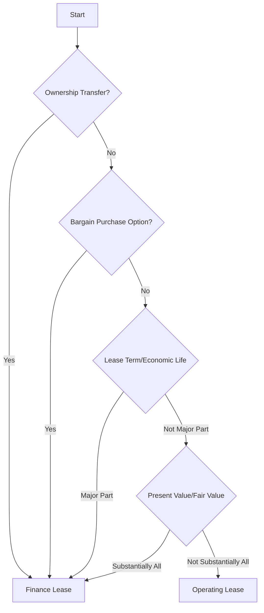

## 13.5 Lease Classification Tests

### Introduction to Lease Classification

Lease classification is a critical aspect of accounting that determines how leases are reported in financial statements. For both lessees and lessors, understanding the criteria for classifying leases as either finance (capital) or operating leases is essential. This section will delve into the lease classification tests, providing a comprehensive guide to the criteria used under International Financial Reporting Standards (IFRS 16) and Accounting Standards for Private Enterprises (ASPE) in Canada.

### Understanding Lease Classification

Lease classification affects the balance sheet, income statement, and cash flow statement. The classification determines whether a lease is recognized as a right-of-use asset and a corresponding liability (finance lease) or treated as a rental expense (operating lease). The distinction impacts financial ratios, tax considerations, and compliance with regulatory requirements.

### Lease Classification Criteria

#### IFRS 16 Criteria

Under IFRS 16, a lease is classified as a finance lease if it transfers substantially all the risks and rewards incidental to ownership of an underlying asset. The following criteria are used to determine this:

1. **Ownership Transfer**: The lease transfers ownership of the asset to the lessee by the end of the lease term.
2. **Purchase Option**: The lessee has an option to purchase the asset at a price expected to be sufficiently lower than the fair value at the date the option becomes exercisable.
3. **Lease Term**: The lease term is for the major part of the economic life of the asset, even if title is not transferred.
4. **Present Value**: The present value of the lease payments amounts to at least substantially all of the fair value of the leased asset.
5. **Specialized Nature**: The leased assets are of such a specialized nature that only the lessee can use them without major modifications.

If none of these criteria are met, the lease is classified as an operating lease.

#### ASPE Criteria

Under ASPE Section 3065, the criteria for classifying a lease as a capital lease (finance lease) are similar, with some differences in thresholds and emphasis:

1. **Transfer of Ownership**: The lease transfers ownership of the asset to the lessee by the end of the lease term.
2. **Bargain Purchase Option**: The lease contains a bargain purchase option.
3. **Lease Term**: The lease term is equal to a major portion (usually 75% or more) of the estimated economic life of the leased property.
4. **Present Value**: The present value of the minimum lease payments amounts to substantially all (usually 90% or more) of the fair value of the leased property.

### Practical Examples

#### Example 1: Office Equipment Lease

A company leases office equipment with a fair value of $100,000. The lease term is 5 years, and the economic life of the equipment is 7 years. The present value of lease payments is $95,000.

- **IFRS 16 Analysis**: The present value of lease payments is 95% of the fair value, meeting the criterion for a finance lease.
- **ASPE Analysis**: The lease term is 71% of the economic life, and the present value is 95% of the fair value, classifying it as a capital lease.

#### Example 2: Vehicle Lease

A company leases a vehicle for 3 years, with no option to purchase. The economic life of the vehicle is 8 years, and the present value of lease payments is 50% of the vehicle's fair value.

- **IFRS 16 Analysis**: The lease does not meet any criteria for a finance lease, so it is classified as an operating lease.
- **ASPE Analysis**: Similarly, the lease is classified as an operating lease under ASPE.

### Real-World Applications

Lease classification has significant implications for financial reporting and analysis. For instance, finance leases increase assets and liabilities on the balance sheet, affecting leverage ratios. Operating leases, on the other hand, impact the income statement through rental expenses, influencing profitability metrics.

### Regulatory Scenarios

#### Canadian Context

In Canada, IFRS 16 is mandatory for public companies, while private enterprises may choose between IFRS and ASPE. Understanding the differences in lease classification criteria is crucial for compliance and accurate financial reporting.

#### Global Comparisons

Globally, lease accounting standards have converged, but differences remain. For example, U.S. GAAP under ASC 842 has similar criteria but emphasizes different aspects, such as the importance of lease term and present value thresholds.

### Step-by-Step Guidance for Lease Classification

1. **Identify Lease Components**: Determine the lease term, payments, and any options for purchase or renewal.
2. **Assess Ownership Transfer**: Evaluate whether ownership transfers at the end of the lease term.
3. **Evaluate Purchase Options**: Consider any options to purchase the asset at a bargain price.
4. **Calculate Lease Term and Economic Life**: Compare the lease term to the asset's economic life.
5. **Compute Present Value**: Calculate the present value of lease payments and compare it to the asset's fair value.
6. **Determine Asset Specialization**: Assess whether the asset is specialized for the lessee's use.

### Diagrams and Charts

To enhance understanding, the following diagram illustrates the decision-making process for lease classification:

### Best Practices and Common Pitfalls

- **Best Practices**: Regularly review lease agreements to ensure compliance with the latest standards. Use software tools for accurate present value calculations.
- **Common Pitfalls**: Misclassifying leases due to incorrect assessment of economic life or present value can lead to financial misstatements.

### References to Canadian Standards

- **IFRS 16**: Leases
- **ASPE Section 3065**: Leases
- **CPA Canada**: Guidelines and resources for lease accounting

### Summary

Lease classification is a nuanced process that requires careful analysis of lease terms and conditions. By understanding the criteria under IFRS 16 and ASPE, accountants can ensure accurate financial reporting and compliance with Canadian standards.

### Ready to Test Your Knowledge?



### Which of the following is a criterion for classifying a lease as a finance lease under IFRS 16?

- [x] The lease transfers ownership of the asset to the lessee by the end of the lease term.
- [ ] The lease term is less than 50% of the economic life of the asset.
- [ ] The lease payments are variable.
- [ ] The asset is not specialized.

> **Explanation:** Under IFRS 16, a lease is classified as a finance lease if it transfers ownership of the asset to the lessee by the end of the lease term.

### What percentage of the fair value of the leased asset must the present value of lease payments be to classify a lease as a finance lease under ASPE?

- [x] 90% or more
- [ ] 75% or more
- [ ] 50% or more
- [ ] 100% or more

> **Explanation:** Under ASPE, the present value of the minimum lease payments must be 90% or more of the fair value of the leased asset to classify it as a capital lease.

### Which of the following is NOT a criterion for lease classification under IFRS 16?

- [ ] Ownership transfer
- [x] Lease payments are made quarterly
- [ ] Bargain purchase option
- [ ] Lease term is for the major part of the asset's economic life

> **Explanation:** Lease payments being made quarterly is not a criterion for lease classification under IFRS 16.

### Under ASPE, what is the typical threshold for the lease term relative to the asset's economic life to classify it as a capital lease?

- [x] 75% or more
- [ ] 50% or more
- [ ] 100% or more
- [ ] 25% or more

> **Explanation:** Under ASPE, the lease term must be equal to a major portion, typically 75% or more, of the asset's estimated economic life to classify it as a capital lease.

### Which standard is mandatory for public companies in Canada for lease accounting?

- [x] IFRS 16
- [ ] ASPE Section 3065
- [ ] ASC 842
- [ ] GAAP

> **Explanation:** IFRS 16 is mandatory for public companies in Canada for lease accounting.

### What is the impact of classifying a lease as a finance lease on the balance sheet?

- [x] Increases assets and liabilities
- [ ] Only increases assets
- [ ] Only increases liabilities
- [ ] Has no impact on the balance sheet

> **Explanation:** Classifying a lease as a finance lease increases both assets and liabilities on the balance sheet.

### Which of the following is a key difference between IFRS 16 and ASPE in lease classification?

- [x] Thresholds for present value and lease term
- [ ] Requirement for ownership transfer
- [ ] Definition of a lease
- [ ] Treatment of variable lease payments

> **Explanation:** A key difference between IFRS 16 and ASPE in lease classification is the thresholds for present value and lease term.

### What is the purpose of lease classification tests?

- [x] To determine the appropriate accounting treatment for leases
- [ ] To calculate lease payments
- [ ] To negotiate lease terms
- [ ] To assess the creditworthiness of the lessee

> **Explanation:** Lease classification tests are used to determine the appropriate accounting treatment for leases.

### Which of the following is a common pitfall in lease classification?

- [x] Misclassifying leases due to incorrect assessment of economic life
- [ ] Overestimating lease payments
- [ ] Underestimating the fair value of the asset
- [ ] Misinterpreting the lease term

> **Explanation:** Misclassifying leases due to incorrect assessment of economic life is a common pitfall in lease classification.

### True or False: Under IFRS 16, all leases must be classified as finance leases.

- [ ] True
- [x] False

> **Explanation:** False. Under IFRS 16, leases can be classified as either finance or operating leases based on specific criteria.


