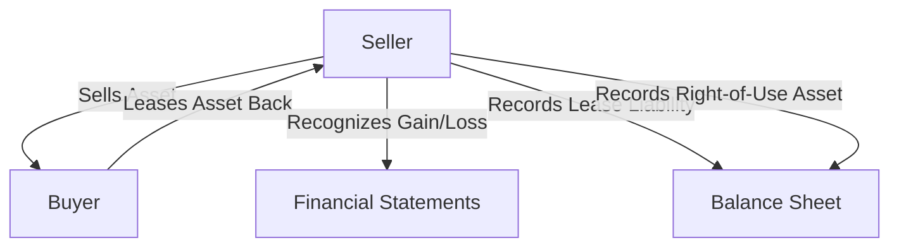

## 13.9 Sale and Leaseback Transactions

### Introduction

Sale and leaseback transactions are a common financial strategy used by companies to unlock the value of their assets while retaining the right to use them. This arrangement involves selling an asset to a buyer and then leasing it back from the buyer, allowing the seller to convert a fixed asset into liquid capital while continuing to utilize the asset operationally. This section delves into the accounting treatment of sale and leaseback transactions under Canadian accounting standards, providing insights into their practical applications, benefits, and challenges.

### Understanding Sale and Leaseback Transactions

A sale and leaseback transaction can be broken down into two main components:

1. **Sale Component**: The initial sale of the asset from the seller to the buyer.
2. **Leaseback Component**: The subsequent lease of the asset from the buyer back to the seller.

This dual nature requires careful consideration of both the sale and lease aspects to ensure compliance with accounting standards such as the International Financial Reporting Standards (IFRS) and Accounting Standards for Private Enterprises (ASPE) in Canada.

### Accounting Treatment Under IFRS and ASPE

#### IFRS 16: Leases

Under IFRS 16, the accounting treatment for sale and leaseback transactions hinges on whether the transfer of the asset qualifies as a sale. The standard requires entities to apply the principles of IFRS 15, "Revenue from Contracts with Customers," to determine if a sale has occurred.

- **Sale Occurs**: If the transfer qualifies as a sale, the seller-lessee recognizes any gain or loss on the sale, adjusted for the leaseback. The asset is derecognized, and a right-of-use asset and lease liability are recognized for the leaseback.
- **No Sale Occurs**: If the transfer does not qualify as a sale, the transaction is treated as a financing arrangement. The seller-lessee continues to recognize the asset and recognizes a financial liability equal to the proceeds received.

#### ASPE 3065: Leases

Under ASPE, the treatment of sale and leaseback transactions is similar but with some differences in recognition and measurement criteria. ASPE requires a careful assessment of the risks and rewards of ownership to determine whether a sale has occurred.

- **Sale and Leaseback as a Sale**: If the risks and rewards are transferred, the transaction is recognized as a sale, and the leaseback is accounted for as a lease.
- **Financing Arrangement**: If the risks and rewards are not transferred, the transaction is treated as a financing arrangement, similar to IFRS.

### Key Considerations in Sale and Leaseback Transactions

#### Determining the Sale

The determination of whether a sale has occurred is crucial. Under IFRS 15, a sale is recognized when control of the asset is transferred to the buyer. This involves assessing:

- **Transfer of Control**: Does the buyer have the ability to direct the use of and obtain substantially all the remaining benefits from the asset?
- **Risks and Rewards**: Are the risks and rewards of ownership transferred to the buyer?

#### Leaseback Arrangements

Once a sale is determined, the leaseback arrangement must be assessed. Key considerations include:

- **Lease Classification**: Is the lease classified as a finance lease or an operating lease? This classification affects the recognition and measurement of the leaseback.
- **Lease Terms**: The terms of the leaseback, including lease payments, lease term, and any options to extend or terminate, must be carefully evaluated.

### Practical Applications and Benefits

Sale and leaseback transactions offer several practical benefits:

- **Liquidity**: Companies can convert illiquid assets into cash, improving liquidity and financial flexibility.
- **Off-Balance Sheet Financing**: Depending on the lease classification, sale and leaseback transactions can provide off-balance sheet financing, enhancing financial ratios.
- **Tax Benefits**: Potential tax benefits may arise from the transaction, depending on the jurisdiction and specific tax regulations.

### Challenges and Risks

Despite their benefits, sale and leaseback transactions present challenges:

- **Complex Accounting**: The dual nature of the transaction requires careful accounting treatment to ensure compliance with standards.
- **Market Conditions**: The success of a sale and leaseback transaction depends on favorable market conditions, including asset valuation and lease terms.
- **Regulatory Compliance**: Companies must navigate complex regulatory environments to ensure compliance with accounting and tax regulations.

### Real-World Examples and Case Studies

Consider the following example of a sale and leaseback transaction:

**Example**: A manufacturing company sells its factory building to a real estate investment firm for $10 million and leases it back for 10 years. The company recognizes a gain on the sale, adjusted for the leaseback, and records a right-of-use asset and lease liability for the leaseback.

**Case Study**: A retail chain uses sale and leaseback transactions to finance expansion. By selling and leasing back its store locations, the chain raises capital for new store openings while maintaining operational control of its existing locations.

### Compliance and Regulatory Considerations

In Canada, companies must adhere to IFRS and ASPE standards, as well as any additional regulatory requirements. Key considerations include:

- **Disclosure Requirements**: Companies must provide detailed disclosures about the terms and conditions of sale and leaseback transactions, including the nature of the leaseback and any significant judgments made.
- **Tax Implications**: Companies must consider the tax implications of sale and leaseback transactions, including potential capital gains taxes and changes in tax basis.

### Step-by-Step Guidance for Sale and Leaseback Transactions

1. **Assess the Sale**: Determine if the transfer qualifies as a sale under IFRS 15 or ASPE criteria.
2. **Evaluate the Leaseback**: Classify the leaseback as a finance or operating lease based on lease terms and conditions.
3. **Recognize and Measure**: Recognize and measure the sale, gain or loss, right-of-use asset, and lease liability as applicable.
4. **Disclose**: Provide comprehensive disclosures in financial statements, including the nature of the transaction, key terms, and any significant judgments.

### Diagrams and Visuals

To enhance understanding, consider the following diagram illustrating the flow of a sale and leaseback transaction:

### Best Practices and Common Pitfalls

**Best Practices**:

- **Thorough Analysis**: Conduct a thorough analysis of the transaction to ensure compliance with accounting standards.
- **Professional Advice**: Seek professional advice to navigate complex regulatory environments and tax implications.
- **Clear Documentation**: Maintain clear documentation of the transaction, including contracts, lease terms, and accounting judgments.

**Common Pitfalls**:

- **Misclassification**: Incorrectly classifying the leaseback can lead to significant accounting errors.
- **Inadequate Disclosures**: Failing to provide adequate disclosures can result in regulatory scrutiny and penalties.
- **Overvaluation**: Overvaluing the asset can lead to inflated financial statements and potential legal issues.

### Conclusion

Sale and leaseback transactions are a powerful financial tool for companies seeking to unlock the value of their assets while maintaining operational control. By understanding the accounting treatment, practical applications, and regulatory considerations, companies can effectively leverage these transactions to enhance liquidity, improve financial ratios, and achieve strategic objectives.

### References and Further Reading

- **IFRS 16: Leases**: International Financial Reporting Standards as adopted in Canada.
- **ASPE 3065: Leases**: Accounting Standards for Private Enterprises in Canada.
- **CPA Canada**: Resources and guidelines for Canadian accounting professionals.

---

## **Ready to Test Your Knowledge?**



### What is a sale and leaseback transaction?

- [x] A transaction where an asset is sold and then leased back from the buyer.
- [ ] A transaction where a lease is terminated and the asset is sold.
- [ ] A transaction where an asset is leased and then sold to a third party.
- [ ] A transaction where a lease is converted into a sale.

> **Explanation:** A sale and leaseback transaction involves selling an asset and then leasing it back from the buyer, allowing the seller to retain use of the asset while converting it into liquid capital.

### Under IFRS 16, when is a sale recognized in a sale and leaseback transaction?

- [x] When control of the asset is transferred to the buyer.
- [ ] When the leaseback agreement is signed.
- [ ] When the asset is delivered to the buyer.
- [ ] When the first lease payment is made.

> **Explanation:** Under IFRS 16, a sale is recognized when control of the asset is transferred to the buyer, in accordance with IFRS 15.

### What is the primary benefit of a sale and leaseback transaction?

- [x] Improved liquidity by converting assets into cash.
- [ ] Reduced operating expenses.
- [ ] Increased asset depreciation.
- [ ] Enhanced employee benefits.

> **Explanation:** The primary benefit of a sale and leaseback transaction is improved liquidity, as it allows companies to convert fixed assets into cash while retaining the use of the assets.

### How is a leaseback classified if the risks and rewards of ownership are transferred?

- [x] As a sale and leaseback transaction.
- [ ] As a financing arrangement.
- [ ] As an operating lease.
- [ ] As a capital lease.

> **Explanation:** If the risks and rewards of ownership are transferred, the leaseback is classified as a sale and leaseback transaction.

### Which standard governs the accounting treatment of sale and leaseback transactions under IFRS?

- [x] IFRS 16
- [ ] IFRS 15
- [ ] IFRS 9
- [ ] IFRS 13

> **Explanation:** IFRS 16 governs the accounting treatment of sale and leaseback transactions, with guidance on determining whether a sale has occurred.

### What is a common pitfall in sale and leaseback transactions?

- [x] Misclassification of the leaseback.
- [ ] Overvaluation of the lease payments.
- [ ] Underreporting of asset depreciation.
- [ ] Misstatement of tax liabilities.

> **Explanation:** A common pitfall in sale and leaseback transactions is the misclassification of the leaseback, which can lead to significant accounting errors.

### What should companies provide in their financial statements regarding sale and leaseback transactions?

- [x] Comprehensive disclosures about the terms and conditions.
- [ ] Detailed tax calculations.
- [ ] Employee benefit summaries.
- [ ] Marketing strategies.

> **Explanation:** Companies should provide comprehensive disclosures in their financial statements regarding the terms and conditions of sale and leaseback transactions.

### What is the impact of sale and leaseback transactions on financial ratios?

- [x] They can improve liquidity ratios.
- [ ] They decrease profitability ratios.
- [ ] They increase leverage ratios.
- [ ] They have no impact on financial ratios.

> **Explanation:** Sale and leaseback transactions can improve liquidity ratios by converting fixed assets into cash.

### How are sale and leaseback transactions treated if no sale is recognized?

- [x] As a financing arrangement.
- [ ] As an operating lease.
- [ ] As a capital lease.
- [ ] As an asset disposal.

> **Explanation:** If no sale is recognized, sale and leaseback transactions are treated as a financing arrangement.

### True or False: Sale and leaseback transactions can provide off-balance sheet financing.

- [x] True
- [ ] False

> **Explanation:** True. Depending on the lease classification, sale and leaseback transactions can provide off-balance sheet financing, enhancing financial ratios.


