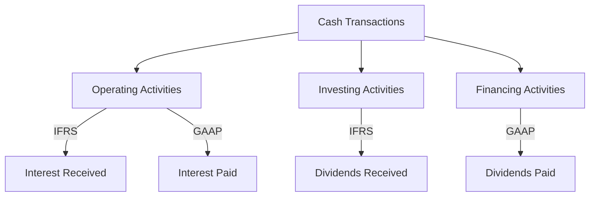

## 16.12 International Variations in Cash Flow Reporting

Understanding the nuances of international variations in cash flow reporting is crucial for accounting professionals, especially those preparing for Canadian accounting exams. This section delves into the differences between the International Financial Reporting Standards (IFRS) and Generally Accepted Accounting Principles (GAAP) in the United States, focusing on the formats, requirements, and practical implications of cash flow statements. 

### Introduction to Cash Flow Statements

Cash flow statements provide vital information about a company's liquidity, solvency, and financial flexibility. They are divided into three main sections: operating activities, investing activities, and financing activities. The statement of cash flows helps stakeholders assess a company's ability to generate cash and meet its obligations, making it an essential component of financial reporting.

### Key Differences Between IFRS and GAAP

#### 1. **Classification of Interest and Dividends**

- **IFRS:** Under IFRS, companies have the flexibility to classify interest and dividends received and paid as either operating, investing, or financing activities. This flexibility allows companies to align their cash flow statements with their business models. For example, a financial institution might classify interest received as operating cash flow, while a manufacturing company might classify it as investing cash flow.

- **GAAP:** In contrast, U.S. GAAP is more prescriptive. Interest received and paid must be classified as operating activities, while dividends paid are classified as financing activities. Dividends received are classified as operating activities. This rigidity can sometimes lead to less alignment with a company's business operations.

#### 2. **Direct vs. Indirect Method**

- **IFRS and GAAP:** Both IFRS and GAAP allow the use of either the direct or indirect method for reporting cash flows from operating activities. However, IFRS encourages the use of the direct method, which provides more detailed information by showing cash receipts and payments. Despite this encouragement, most companies under both standards use the indirect method due to its simplicity and the ease of preparation, as it adjusts net income for non-cash transactions.

#### 3. **Disclosure Requirements**

- **IFRS:** IFRS requires entities to disclose the components of cash and cash equivalents and provide a reconciliation of the amounts in the statement of cash flows with the equivalent items reported in the statement of financial position.

- **GAAP:** GAAP also requires disclosure of cash and cash equivalents, but it has more detailed requirements regarding the disclosure of non-cash investing and financing activities, which must be presented in a separate schedule or in the notes to the financial statements.

### Practical Implications for Canadian Accountants

Canadian accountants must be adept at navigating both IFRS and GAAP, especially when dealing with multinational corporations or cross-border transactions. Understanding these variations is crucial for accurate financial reporting and compliance with regulatory requirements.

#### Example: Classification of Interest Payments

Consider a Canadian company with operations in both Canada and the United States. Under IFRS, the company might classify interest payments as financing activities, aligning with its capital structure strategy. However, for its U.S. operations, it must classify these payments as operating activities under GAAP. This difference can affect the comparability of cash flow statements and requires careful consideration when consolidating financial statements.

### Case Study: Multinational Corporation

Let's examine a hypothetical multinational corporation, GlobalTech Inc., which operates in both IFRS and GAAP jurisdictions. GlobalTech faces challenges in standardizing its cash flow reporting due to the differing classification rules.

- **IFRS Reporting:** GlobalTech classifies interest received as investing activities and interest paid as financing activities, reflecting its strategic focus on investment and capital management.

- **GAAP Reporting:** For its U.S. subsidiary, GlobalTech must classify both interest received and paid as operating activities, which can lead to discrepancies in cash flow analysis across its global operations.

This case highlights the importance of understanding international variations and the need for effective communication and reconciliation processes within multinational entities.

### Real-World Applications and Regulatory Scenarios

#### 1. **Cross-Border Transactions**

Accountants dealing with cross-border transactions must be vigilant about the differences in cash flow reporting standards. For instance, a Canadian company acquiring a U.S. firm must adjust its cash flow reporting to comply with GAAP, which may involve reclassifying certain cash flows and ensuring consistent reporting across the consolidated entity.

#### 2. **Regulatory Compliance**

Compliance with both IFRS and GAAP is essential for companies listed on multiple stock exchanges. Canadian accountants must ensure that financial statements meet the requirements of each jurisdiction, which may involve additional disclosures or reconciliations.

### Step-by-Step Guidance for Preparing Cash Flow Statements

1. **Identify Cash Flow Activities:** Begin by categorizing cash flows into operating, investing, and financing activities. Consider the specific requirements of IFRS and GAAP for classification.

2. **Choose the Reporting Method:** Decide whether to use the direct or indirect method for operating activities. While the indirect method is more common, the direct method can provide more transparency and detail.

3. **Prepare the Statement:** Compile the cash flow statement, ensuring that all cash flows are accurately classified and reported. Pay special attention to non-cash transactions and their disclosure requirements.

4. **Reconcile with Financial Position:** Ensure that the cash flow statement aligns with the statement of financial position, providing a clear reconciliation of cash and cash equivalents.

5. **Disclose Additional Information:** Include necessary disclosures, such as non-cash transactions and the components of cash and cash equivalents, to comply with IFRS or GAAP requirements.

### Diagrams and Visual Aids

To enhance understanding, let's use a Mermaid.js diagram to illustrate the flow of cash transactions and their classification under IFRS and GAAP.

### Best Practices and Common Pitfalls

#### Best Practices

- **Stay Informed:** Keep up-to-date with changes in IFRS and GAAP standards to ensure compliance and accurate reporting.

- **Use Technology:** Leverage accounting software that supports multiple reporting standards to streamline the preparation of cash flow statements.

- **Communicate Clearly:** Ensure clear communication with stakeholders about the differences in cash flow reporting and their implications for financial analysis.

#### Common Pitfalls

- **Misclassification of Cash Flows:** Avoid errors in classifying cash flows, which can lead to misleading financial statements and affect decision-making.

- **Inadequate Disclosures:** Ensure that all required disclosures are included, as omissions can result in non-compliance and potential penalties.

### Conclusion

Understanding international variations in cash flow reporting is essential for Canadian accountants, especially those involved in multinational operations. By mastering the differences between IFRS and GAAP, accountants can ensure accurate financial reporting, facilitate cross-border transactions, and enhance their professional expertise.

### References and Additional Resources

- **International Financial Reporting Standards (IFRS):** [IFRS Foundation](https://www.ifrs.org/)
- **Generally Accepted Accounting Principles (GAAP):** [Financial Accounting Standards Board (FASB)](https://www.fasb.org/)
- **CPA Canada:** [CPA Canada Resources](https://www.cpacanada.ca/)

---

## **Ready to Test Your Knowledge?**



### What is the primary difference in the classification of interest received under IFRS and GAAP?

- [x] IFRS allows flexibility; GAAP classifies it as operating.
- [ ] Both classify it as investing.
- [ ] Both classify it as financing.
- [ ] IFRS classifies it as financing; GAAP as investing.

> **Explanation:** IFRS allows companies to classify interest received as operating, investing, or financing, while GAAP requires it to be classified as operating.

### Under which standard is the direct method for cash flow reporting encouraged?

- [x] IFRS
- [ ] GAAP
- [ ] Both IFRS and GAAP
- [ ] Neither IFRS nor GAAP

> **Explanation:** IFRS encourages the use of the direct method for reporting cash flows from operating activities, although it is not mandatory.

### How does GAAP require dividends paid to be classified?

- [ ] Operating activities
- [ ] Investing activities
- [x] Financing activities
- [ ] Either operating or financing activities

> **Explanation:** Under GAAP, dividends paid are classified as financing activities.

### Which method is more commonly used for reporting cash flows from operating activities?

- [ ] Direct method
- [x] Indirect method
- [ ] Cash method
- [ ] Accrual method

> **Explanation:** The indirect method is more commonly used because it is simpler and adjusts net income for non-cash transactions.

### What is a common pitfall in cash flow reporting?

- [x] Misclassification of cash flows
- [ ] Over-disclosure of non-cash transactions
- [ ] Using the direct method
- [ ] Aligning with business operations

> **Explanation:** Misclassification of cash flows can lead to misleading financial statements and affect decision-making.

### Which standard requires more detailed disclosure of non-cash investing and financing activities?

- [ ] IFRS
- [x] GAAP
- [ ] Both IFRS and GAAP
- [ ] Neither IFRS nor GAAP

> **Explanation:** GAAP requires more detailed disclosure of non-cash investing and financing activities.

### What should Canadian accountants focus on when dealing with cross-border transactions?

- [x] Understanding differences in cash flow reporting standards
- [ ] Aligning with IFRS only
- [ ] Aligning with GAAP only
- [ ] Avoiding reconciliation processes

> **Explanation:** Understanding differences in cash flow reporting standards is crucial for accurate financial reporting and compliance.

### How are dividends received classified under IFRS?

- [x] Can be classified as operating, investing, or financing
- [ ] Must be classified as operating
- [ ] Must be classified as investing
- [ ] Must be classified as financing

> **Explanation:** IFRS allows dividends received to be classified as operating, investing, or financing activities.

### What is the impact of using the direct method for cash flow reporting?

- [ ] It simplifies the preparation process.
- [x] It provides more detailed information.
- [ ] It reduces the need for disclosures.
- [ ] It aligns with GAAP requirements.

> **Explanation:** The direct method provides more detailed information by showing cash receipts and payments.

### True or False: IFRS requires a reconciliation of cash and cash equivalents in the statement of cash flows.

- [x] True
- [ ] False

> **Explanation:** IFRS requires entities to provide a reconciliation of the amounts in the statement of cash flows with the equivalent items reported in the statement of financial position.


