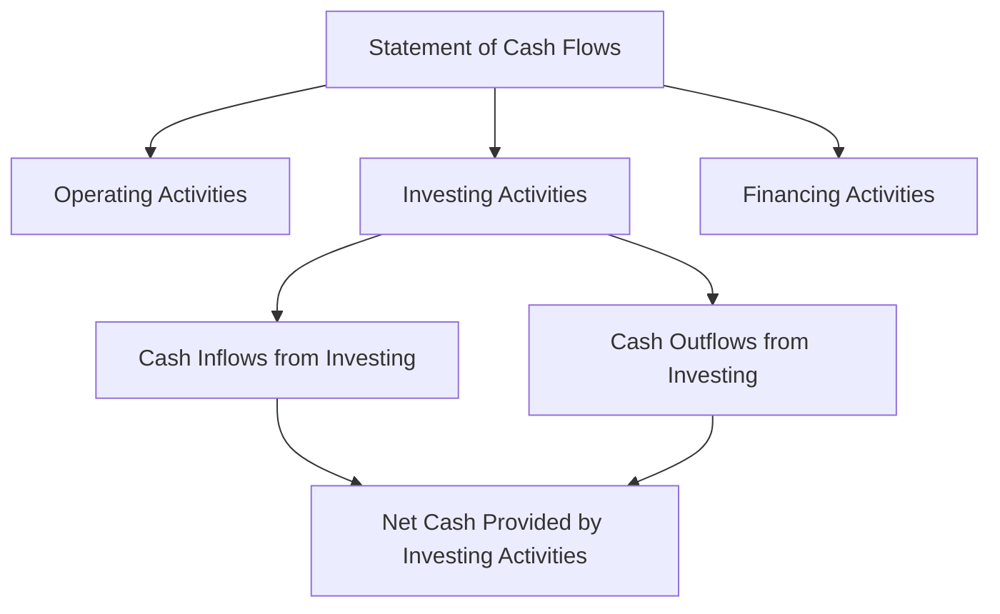

## 16.6 Cash Flows from Investing Activities

Cash flows from investing activities are a crucial component of the statement of cash flows, reflecting the cash used in or generated from the acquisition and disposal of long-term assets. This section will provide an in-depth exploration of investing activities, their significance, and how they are reported in financial statements, particularly within the context of Canadian accounting standards.

### Understanding Investing Activities

Investing activities encompass transactions that involve the purchase and sale of long-term assets and other investments not classified as cash equivalents. These activities are essential for a company's growth and expansion, as they often involve capital expenditures on property, plant, and equipment (PP&E), as well as investments in securities and other entities.

#### Key Components of Investing Activities

1. **Capital Expenditures (CapEx):** These are funds used by a company to acquire, upgrade, and maintain physical assets such as property, industrial buildings, or equipment. CapEx is a critical part of investing activities as it reflects the company's investment in its future operations.

2. **Proceeds from Sale of Assets:** This includes cash received from the sale of long-term assets, such as equipment or real estate. These transactions are crucial for companies looking to divest non-core assets or generate cash flow.

3. **Investments in Securities:** Companies often invest in stocks, bonds, or other financial instruments. The purchase and sale of these securities are considered investing activities.

4. **Acquisition and Disposal of Subsidiaries:** When a company acquires or disposes of a subsidiary, the cash flows associated with these transactions are reported under investing activities.

5. **Loans Made to Other Entities:** Cash flows related to loans given to other entities, including repayments received, fall under investing activities.

### Reporting Cash Flows from Investing Activities

The statement of cash flows categorizes cash flows into operating, investing, and financing activities. Investing activities are reported in the second section of the statement, following operating activities. The net cash flow from investing activities is calculated by subtracting cash outflows from cash inflows related to investing transactions.

#### Example of Cash Flow Statement Structure

### Detailed Analysis of Investing Activities

#### Acquisition of Long-term Assets

The acquisition of long-term assets, such as PP&E, is a significant cash outflow in investing activities. These assets are essential for a company's operations and future growth. The cash outflow is recorded at the time of purchase and includes all costs necessary to bring the asset to its intended use, such as installation and transportation costs.

**Example:** A manufacturing company purchases new machinery for $500,000, including installation and transportation costs. This transaction is recorded as a cash outflow in the investing activities section of the cash flow statement.

#### Disposal of Long-term Assets

Disposing of long-term assets generates cash inflows, which are reported in the investing activities section. The cash received from the sale of an asset is recorded, and any gain or loss on the sale is reported in the income statement.

**Example:** A company sells a piece of equipment for $200,000, which was originally purchased for $250,000. The cash inflow of $200,000 is recorded in the investing activities section, while the $50,000 loss is reported in the income statement.

#### Investments in Securities

Purchases and sales of securities are common investing activities. Companies may invest in stocks, bonds, or other financial instruments as part of their investment strategy. The cash flows from these transactions are reported in the investing activities section.

**Example:** A company purchases bonds worth $100,000 and later sells them for $120,000. The purchase is recorded as a cash outflow, while the sale is recorded as a cash inflow, resulting in a net cash inflow of $20,000.

#### Acquisition and Disposal of Subsidiaries

When a company acquires or disposes of a subsidiary, the cash flows associated with these transactions are significant and must be reported in the investing activities section. The cash paid for acquisition or received from disposal is recorded, along with any related transaction costs.

**Example:** A company acquires a subsidiary for $1 million. The cash outflow of $1 million is recorded in the investing activities section. If the subsidiary is later sold for $1.2 million, the cash inflow is recorded, reflecting a net cash inflow of $200,000.

#### Loans Made to Other Entities

Loans given to other entities and repayments received are part of investing activities. The cash outflow occurs when the loan is made, and the inflow occurs when repayments are received.

**Example:** A company lends $50,000 to a partner company. The cash outflow is recorded when the loan is made. If the partner repays $10,000, this is recorded as a cash inflow in the investing activities section.

### Canadian Accounting Standards and Regulations

In Canada, the reporting of cash flows from investing activities is governed by the International Financial Reporting Standards (IFRS) as adopted by the Canadian Accounting Standards Board (AcSB). The Accounting Standards for Private Enterprises (ASPE) also provide guidelines for private companies.

#### IFRS Guidelines

Under IFRS, cash flows from investing activities should be reported separately from operating and financing activities. The standard requires that cash flows be classified based on the nature of the transaction, ensuring clarity and consistency in financial reporting.

#### ASPE Guidelines

ASPE provides similar guidelines for private enterprises, emphasizing the importance of clear and consistent reporting of cash flows. The standards require that cash flows from investing activities be reported separately, providing users with a clear view of the company's investment activities.

### Practical Examples and Case Studies

#### Case Study 1: TechCorp's Expansion Strategy

TechCorp, a leading technology company, embarked on an expansion strategy involving significant investments in new technology and infrastructure. The company purchased new servers and software licenses, resulting in substantial cash outflows reported in the investing activities section. Additionally, TechCorp sold outdated equipment, generating cash inflows that partially offset the outflows.

**Analysis:** TechCorp's investing activities reflect its strategic focus on growth and innovation. The cash flow statement provides stakeholders with insights into the company's investment priorities and future potential.

#### Case Study 2: GreenEnergy's Asset Disposal

GreenEnergy, a renewable energy company, decided to divest non-core assets to focus on its core business. The company sold several wind farms, generating significant cash inflows reported in the investing activities section. These inflows were used to fund new solar projects, aligning with the company's strategic objectives.

**Analysis:** GreenEnergy's cash flow statement highlights its strategic shift towards solar energy, providing stakeholders with valuable information on the company's investment strategy and financial health.

### Real-world Applications and Regulatory Scenarios

Investing activities have real-world implications for companies and their stakeholders. Understanding these activities is crucial for financial analysts, investors, and regulators.

#### Financial Analysts

Analysts use cash flow statements to assess a company's investment strategy and financial health. By examining cash flows from investing activities, analysts can determine whether a company is investing in growth or divesting assets to improve liquidity.

#### Investors

Investors rely on cash flow statements to make informed decisions. Cash flows from investing activities provide insights into a company's future prospects and strategic priorities, helping investors evaluate potential risks and returns.

#### Regulators

Regulators require companies to report cash flows accurately and transparently. Investing activities must be disclosed in compliance with accounting standards, ensuring that stakeholders have access to reliable financial information.

### Best Practices and Common Pitfalls

#### Best Practices

1. **Clear Classification:** Ensure that cash flows are accurately classified as operating, investing, or financing activities. Misclassification can lead to misleading financial statements.

2. **Consistent Reporting:** Maintain consistency in reporting cash flows across periods, providing stakeholders with a clear view of trends and changes in investment activities.

3. **Detailed Disclosures:** Provide detailed disclosures of significant investing activities, including acquisitions, disposals, and investments in securities.

#### Common Pitfalls

1. **Misclassification of Cash Flows:** Confusing operating and investing activities can result in inaccurate financial statements. Ensure that transactions are correctly classified based on their nature.

2. **Incomplete Disclosures:** Failing to disclose significant investing activities can mislead stakeholders and result in regulatory penalties.

3. **Ignoring Non-cash Transactions:** Non-cash investing activities, such as asset exchanges, must be disclosed in the notes to the financial statements, even though they do not appear in the cash flow statement.

### Exam Strategies and Practical Tips

1. **Understand the Classification:** Familiarize yourself with the classification of cash flows and the criteria for categorizing transactions as investing activities.

2. **Practice with Real-world Examples:** Analyze real-world financial statements to understand how companies report cash flows from investing activities.

3. **Stay Updated on Standards:** Keep abreast of changes in accounting standards and regulations that may impact the reporting of investing activities.

4. **Use Mnemonics:** Develop mnemonic devices to remember key concepts and classifications related to investing activities.

5. **Work Through Practice Problems:** Solve practice problems and case studies to reinforce your understanding of cash flows from investing activities.

### Summary

Cash flows from investing activities are a vital component of the statement of cash flows, providing insights into a company's investment strategy and financial health. By understanding the classification, reporting, and analysis of these activities, you can gain a deeper understanding of a company's financial statements and make informed decisions as an analyst, investor, or regulator.

---

## **Ready to Test Your Knowledge?**



### Which of the following is considered a cash outflow from investing activities?

- [x] Purchase of new machinery
- [ ] Payment of dividends
- [ ] Issuance of common stock
- [ ] Repayment of a loan

> **Explanation:** The purchase of new machinery is a cash outflow from investing activities as it involves acquiring long-term assets.

### What is the primary purpose of reporting cash flows from investing activities?

- [x] To provide insights into a company's investment strategy and financial health
- [ ] To determine a company's profitability
- [ ] To assess a company's liquidity
- [ ] To evaluate a company's operating efficiency

> **Explanation:** Reporting cash flows from investing activities helps stakeholders understand a company's investment strategy and financial health.

### Which of the following transactions would be classified under investing activities?

- [x] Sale of a subsidiary
- [ ] Payment of interest on a loan
- [ ] Collection of accounts receivable
- [ ] Payment of salaries

> **Explanation:** The sale of a subsidiary is classified under investing activities as it involves the disposal of a long-term investment.

### How are cash inflows from the sale of long-term assets reported in the cash flow statement?

- [x] As cash inflows in the investing activities section
- [ ] As cash inflows in the operating activities section
- [ ] As cash inflows in the financing activities section
- [ ] As cash outflows in the investing activities section

> **Explanation:** Cash inflows from the sale of long-term assets are reported in the investing activities section of the cash flow statement.

### Which accounting standard governs the reporting of cash flows from investing activities in Canada?

- [x] IFRS
- [ ] GAAP
- [ ] ASPE
- [ ] CPA

> **Explanation:** In Canada, the reporting of cash flows from investing activities is governed by the International Financial Reporting Standards (IFRS).

### What is a common pitfall in reporting cash flows from investing activities?

- [x] Misclassification of cash flows
- [ ] Overstating revenues
- [ ] Underreporting expenses
- [ ] Ignoring liabilities

> **Explanation:** Misclassification of cash flows is a common pitfall that can lead to inaccurate financial statements.

### Which of the following is a best practice in reporting cash flows from investing activities?

- [x] Providing detailed disclosures of significant investing activities
- [ ] Combining operating and investing activities
- [ ] Minimizing disclosures to simplify reporting
- [ ] Ignoring non-cash transactions

> **Explanation:** Providing detailed disclosures of significant investing activities is a best practice that ensures transparency and accuracy.

### What should be done with non-cash investing activities in financial statements?

- [x] Disclose them in the notes to the financial statements
- [ ] Ignore them as they do not involve cash
- [ ] Report them as cash inflows
- [ ] Report them as cash outflows

> **Explanation:** Non-cash investing activities should be disclosed in the notes to the financial statements, even though they do not appear in the cash flow statement.

### How can analysts use cash flows from investing activities?

- [x] To assess a company's investment strategy and financial health
- [ ] To calculate a company's net income
- [ ] To determine a company's tax liability
- [ ] To evaluate a company's customer satisfaction

> **Explanation:** Analysts use cash flows from investing activities to assess a company's investment strategy and financial health.

### True or False: Cash flows from investing activities include cash flows from the issuance of common stock.

- [ ] True
- [x] False

> **Explanation:** Cash flows from the issuance of common stock are classified under financing activities, not investing activities.


