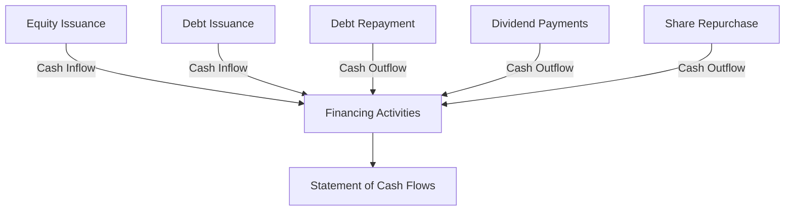

## 16.7 Cash Flows from Financing Activities

Understanding cash flows from financing activities is crucial for anyone preparing for Canadian accounting exams or working in the accounting field. This section delves into the complexities of financing activities, which are integral to a company's financial health and strategic growth. Financing activities involve transactions that affect the equity and debt of a company, and they are reflected in the statement of cash flows, providing insights into how a company raises capital and repays its obligations.

### Overview of Financing Activities

Financing activities are transactions that result in changes in the size and composition of the equity capital and borrowings of a company. These activities are crucial for understanding how a company funds its operations and growth. They include:

- **Issuance of Equity**: Raising capital through the sale of shares.
- **Issuance of Debt**: Borrowing funds through loans or bond issuance.
- **Repayment of Debt**: Paying back borrowed funds.
- **Payment of Dividends**: Distributing profits to shareholders.
- **Repurchase of Shares**: Buying back company shares from the market.

### Importance of Financing Activities

Financing activities provide insights into a company's financial strategy and capital structure. They reveal how a company is financing its operations, whether through debt or equity, and how it manages its financial obligations. Key reasons why understanding financing activities is important include:

- **Assessing Financial Health**: Analyzing cash flows from financing activities helps assess a company's ability to raise capital and meet its financial commitments.
- **Evaluating Capital Structure**: Understanding the balance between debt and equity financing is crucial for evaluating a company's risk and return profile.
- **Strategic Decision-Making**: Insights into financing activities inform strategic decisions regarding capital raising, debt management, and shareholder returns.

### Components of Cash Flows from Financing Activities

#### 1. Issuance of Equity

Issuing equity involves selling shares to investors to raise capital. This can be done through:

- **Initial Public Offerings (IPOs)**: The first sale of stock by a private company to the public.
- **Secondary Offerings**: Additional sales of shares by a company that is already publicly traded.
- **Private Placements**: Selling shares to a select group of investors rather than the public.

**Example:** A company issues 1,000,000 shares at $10 each, raising $10,000,000 in cash.

#### 2. Issuance of Debt

Debt issuance involves borrowing funds through instruments such as:

- **Bonds**: Long-term debt securities issued to investors.
- **Loans**: Borrowing from financial institutions or other entities.

**Example:** A company issues bonds worth $5,000,000 with a 5% interest rate, receiving cash proceeds.

#### 3. Repayment of Debt

Repaying debt involves returning borrowed funds to lenders, which can include:

- **Principal Repayments**: Paying back the original amount borrowed.
- **Interest Payments**: Paying interest on borrowed funds.

**Example:** A company repays a $2,000,000 loan, reducing its debt obligations.

#### 4. Payment of Dividends

Dividends are payments made to shareholders from a company's profits. They can be in the form of:

- **Cash Dividends**: Direct cash payments to shareholders.
- **Stock Dividends**: Additional shares issued to shareholders.

**Example:** A company pays $1,000,000 in cash dividends to its shareholders.

#### 5. Repurchase of Shares

Share repurchases involve buying back company shares from the market, which can:

- **Increase Earnings Per Share (EPS)**: By reducing the number of shares outstanding.
- **Return Capital to Shareholders**: Providing an alternative to dividends.

**Example:** A company repurchases 500,000 shares at $20 each, spending $10,000,000 in cash.

### Accounting Standards and Regulatory Considerations

In Canada, the accounting treatment of cash flows from financing activities is guided by International Financial Reporting Standards (IFRS) as adopted in Canada. Key standards include:

- **IAS 7 Statement of Cash Flows**: Provides guidance on the classification and presentation of cash flows from financing activities.
- **IFRS 9 Financial Instruments**: Addresses the recognition and measurement of financial liabilities and equity instruments.

#### Key Considerations:

- **Classification**: Proper classification of cash flows as financing activities is crucial for accurate financial reporting.
- **Disclosure**: Companies must provide detailed disclosures about their financing activities, including the nature and amount of cash flows.

### Practical Examples and Case Studies

#### Example 1: Equity Issuance

**Scenario:** ABC Corp, a Canadian technology company, decides to go public to raise capital for expansion. It issues 2,000,000 shares at $15 each through an IPO.

**Analysis:** The cash inflow from the equity issuance is $30,000,000, which is recorded as a financing activity in the statement of cash flows. This transaction increases the company's equity and provides funds for growth initiatives.

#### Example 2: Debt Issuance and Repayment

**Scenario:** XYZ Ltd, a manufacturing firm, issues $10,000,000 in bonds with a 6% interest rate to finance new equipment. Later, it repays $3,000,000 of the bond principal.

**Analysis:** The bond issuance results in a $10,000,000 cash inflow, while the repayment leads to a $3,000,000 cash outflow. Both transactions are recorded as financing activities, reflecting the company's debt management strategy.

#### Example 3: Dividend Payments

**Scenario:** DEF Inc, a retail company, declares and pays $2,500,000 in cash dividends to its shareholders.

**Analysis:** The cash outflow for dividend payments is recorded as a financing activity, indicating the company's commitment to returning profits to shareholders.

### Diagrams and Visual Aids

To enhance understanding, the following diagram illustrates the flow of cash from financing activities:

### Best Practices and Common Pitfalls

#### Best Practices:

- **Accurate Classification**: Ensure that all financing activities are correctly classified in the statement of cash flows.
- **Detailed Disclosures**: Provide comprehensive disclosures about financing activities to enhance transparency.
- **Strategic Planning**: Align financing activities with the company's strategic goals and financial health.

#### Common Pitfalls:

- **Misclassification**: Incorrectly classifying financing activities can lead to inaccurate financial reporting.
- **Inadequate Disclosures**: Failing to provide sufficient information about financing activities can obscure a company's financial strategy.

### Exam Tips and Strategies

- **Understand Key Concepts**: Familiarize yourself with the types of financing activities and their impact on financial statements.
- **Practice Calculations**: Work through examples of equity and debt transactions to strengthen your understanding.
- **Review Standards**: Study relevant IFRS and Canadian accounting standards to ensure compliance with reporting requirements.

### Real-World Applications

In practice, understanding cash flows from financing activities is essential for financial analysts, investors, and corporate managers. It provides insights into a company's financial strategy, capital structure, and ability to meet its financial obligations. By analyzing these cash flows, stakeholders can make informed decisions about investing, lending, and managing financial resources.

### Summary

Cash flows from financing activities are a critical component of the statement of cash flows, reflecting a company's financial strategy and capital management. By understanding the intricacies of equity and debt transactions, dividend payments, and share repurchases, you can gain valuable insights into a company's financial health and strategic direction. This knowledge is essential for success in Canadian accounting exams and professional practice.

## **Ready to Test Your Knowledge?**



### Which of the following is considered a financing activity?

- [x] Issuance of bonds
- [ ] Purchase of inventory
- [ ] Sale of equipment
- [ ] Payment of salaries

> **Explanation:** Issuance of bonds is a financing activity as it involves raising funds through debt.

### What is the impact of share repurchases on earnings per share (EPS)?

- [x] Increases EPS
- [ ] Decreases EPS
- [ ] No impact on EPS
- [ ] Depends on the market conditions

> **Explanation:** Share repurchases reduce the number of shares outstanding, thereby increasing EPS.

### Which accounting standard provides guidance on cash flows from financing activities?

- [x] IAS 7
- [ ] IFRS 15
- [ ] IAS 16
- [ ] IFRS 9

> **Explanation:** IAS 7 provides guidance on the classification and presentation of cash flows, including financing activities.

### What is the primary purpose of issuing equity?

- [x] Raising capital
- [ ] Reducing debt
- [ ] Paying dividends
- [ ] Increasing inventory

> **Explanation:** Issuing equity is primarily done to raise capital for business operations and growth.

### Which of the following is a cash outflow from financing activities?

- [x] Payment of dividends
- [ ] Receipt of interest
- [ ] Sale of investments
- [ ] Purchase of fixed assets

> **Explanation:** Payment of dividends is a cash outflow from financing activities as it involves returning profits to shareholders.

### How are cash dividends classified in the statement of cash flows?

- [x] Financing activities
- [ ] Operating activities
- [ ] Investing activities
- [ ] Non-cash activities

> **Explanation:** Cash dividends are classified as financing activities because they involve cash outflows related to equity.

### What is the effect of debt repayment on cash flows from financing activities?

- [x] Decreases cash flows
- [ ] Increases cash flows
- [ ] No effect on cash flows
- [ ] Depends on the interest rate

> **Explanation:** Debt repayment results in a cash outflow, decreasing cash flows from financing activities.

### Which of the following is NOT a financing activity?

- [x] Purchase of equipment
- [ ] Issuance of shares
- [ ] Repayment of loans
- [ ] Payment of dividends

> **Explanation:** Purchase of equipment is an investing activity, not a financing activity.

### What is the impact of issuing bonds on a company's liabilities?

- [x] Increases liabilities
- [ ] Decreases liabilities
- [ ] No impact on liabilities
- [ ] Depends on the bond terms

> **Explanation:** Issuing bonds increases a company's liabilities as it involves borrowing funds.

### True or False: Share repurchases are considered a financing activity.

- [x] True
- [ ] False

> **Explanation:** Share repurchases are considered a financing activity as they involve cash outflows to buy back shares.


