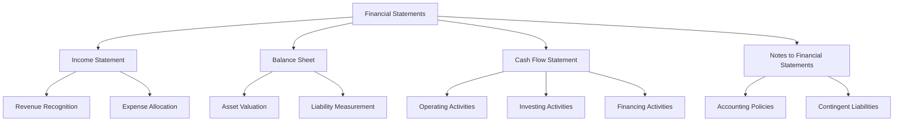

## 17.10 Limitations of Financial Statement Analysis

Financial statement analysis is a critical tool for accountants, investors, and other stakeholders to assess the financial health and performance of a company. However, while it provides valuable insights, it is not without its limitations. Understanding these limitations is crucial for making informed decisions and avoiding potential pitfalls. This section explores the various constraints and challenges associated with financial statement analysis, providing a comprehensive understanding for those preparing for Canadian accounting exams.

### 1. **Historical Nature of Financial Statements**

Financial statements are historical documents. They reflect past transactions and events, which may not necessarily predict future performance. This historical perspective can be a significant limitation, especially in rapidly changing industries or economic environments. For example, a company may have shown strong financial performance in the past, but if the market dynamics have shifted, these historical figures may not be indicative of future success.

### 2. **Accounting Policies and Estimates**

The use of different accounting policies and estimates can significantly affect the comparability of financial statements across different companies. For instance, companies may use different methods for inventory valuation (FIFO, LIFO, or average cost) or depreciation (straight-line vs. declining balance), leading to variations in reported profits and asset values. These differences can complicate the analysis and comparison of financial statements.

**Example:** Consider two companies in the same industry, one using FIFO and the other using LIFO for inventory valuation. During periods of rising prices, the FIFO company will report higher profits than the LIFO company, even if their operational performance is similar.

### 3. **Non-Financial Information**

Financial statements do not capture non-financial information, which can be crucial for a comprehensive analysis. Factors such as customer satisfaction, brand strength, employee morale, and market conditions are not reflected in the financial statements but can significantly impact a company's future performance.

**Case Study:** A technology company may have strong financials, but if it is losing market share to competitors due to inferior product innovation, its future prospects may be bleak. This non-financial information is not captured in the financial statements.

### 4. **Impact of Inflation**

Inflation can distort financial statements, particularly when comparing figures over time. Historical cost accounting does not adjust for changes in the purchasing power of money, which can lead to misleading conclusions. For example, a company may appear to have increased its revenue, but when adjusted for inflation, the real growth may be negligible or even negative.

### 5. **Subjectivity in Financial Reporting**

Financial statements often involve subjective judgments and estimates, such as provisions for bad debts, warranty liabilities, and impairment of assets. These subjective elements can introduce bias and affect the reliability of the financial statements.

**Example:** A company may choose to understate its allowance for doubtful accounts to inflate its net income, presenting a more favorable financial position than is warranted.

### 6. **Complexity and Volume of Information**

The complexity and sheer volume of information in financial statements can be overwhelming, especially for those not well-versed in accounting principles. This complexity can lead to misinterpretation or oversight of critical information.

**Diagram: Financial Statement Complexity**

### 7. **Window Dressing**

Companies may engage in "window dressing" to make their financial statements appear more attractive. This practice involves manipulating financial data to present a more favorable picture of the company's financial position or performance. Common techniques include timing the recognition of revenue and expenses or engaging in transactions that temporarily boost financial metrics.

**Example:** A company may delay recognizing expenses until after the financial reporting period to inflate current period profits.

### 8. **Lack of Forward-Looking Information**

Financial statements primarily provide historical data and lack forward-looking information. While management's discussion and analysis (MD&A) sections may offer some insights into future prospects, they are not part of the audited financial statements and may lack objectivity.

### 9. **Regulatory and Compliance Issues**

Different regulatory environments and accounting standards (such as IFRS vs. GAAP) can lead to variations in financial reporting. These differences can complicate the comparison of financial statements across jurisdictions.

**Comparison Table: IFRS vs. GAAP**

| Aspect                    | IFRS                                    | GAAP                                   |
|---------------------------|-----------------------------------------|----------------------------------------|
| Inventory Valuation       | Does not allow LIFO                     | Allows LIFO                            |
| Revenue Recognition       | Based on a five-step model              | Industry-specific guidance             |
| Financial Statement Format| More flexible                           | More prescriptive                      |
| Impairment of Assets      | Single-step approach                    | Two-step approach                      |

### 10. **Economic and Industry Conditions**

Financial statement analysis may not fully account for broader economic and industry conditions that can impact a company's performance. Factors such as economic downturns, changes in consumer preferences, or technological advancements can significantly affect a company's financial health.

**Scenario:** A retail company may show strong financials, but if there is an economic recession, consumer spending may decline, impacting future revenue and profitability.

### 11. **Human Error and Fraud**

Human error and fraud can compromise the integrity of financial statements. Errors in data entry, misapplication of accounting principles, or intentional manipulation of financial data can lead to inaccurate financial statements.

**Case Study:** The Enron scandal is a notorious example where fraudulent accounting practices led to misleading financial statements, ultimately resulting in the company's collapse.

### 12. **Overreliance on Ratios**

While financial ratios are valuable tools for analysis, overreliance on them can be misleading. Ratios are based on historical financial data and may not capture the full picture of a company's financial health. Additionally, different industries have different benchmarks, making cross-industry comparisons challenging.

**Example:** A high current ratio may indicate strong liquidity, but if it results from excessive inventory, it may not be a positive indicator.

### 13. **Limitations of Comparative Analysis**

Comparative analysis can be limited by differences in accounting policies, business models, and market conditions. Comparing financial statements of companies with different fiscal year-ends or operating in different regulatory environments can lead to inaccurate conclusions.

### 14. **Impact of Non-Recurring Items**

Non-recurring items, such as gains or losses from asset sales or restructuring charges, can distort a company's financial performance. These items can create a misleading picture of a company's ongoing profitability.

**Example:** A company may report a significant profit due to the sale of a major asset, but this does not reflect its core operational performance.

### 15. **Ethical Considerations**

Ethical considerations play a crucial role in financial statement analysis. Analysts must be aware of potential biases and conflicts of interest that can affect the interpretation of financial data.

**Best Practices:**

- Maintain professional skepticism.
- Verify information from multiple sources.
- Be aware of potential conflicts of interest.

### 16. **Strategies to Mitigate Limitations**

To mitigate the limitations of financial statement analysis, consider the following strategies:

- **Use Multiple Analysis Tools:** Combine financial statement analysis with other tools, such as market analysis and qualitative assessments, to gain a comprehensive understanding.
- **Adjust for Inflation:** Use inflation-adjusted figures for more accurate comparisons over time.
- **Consider Non-Financial Information:** Incorporate non-financial metrics, such as customer satisfaction and market share, into the analysis.
- **Stay Informed:** Keep abreast of changes in accounting standards and regulatory requirements.

### 17. **Conclusion**

While financial statement analysis is an essential tool for evaluating a company's financial health, it is important to recognize its limitations. By understanding these constraints and employing strategies to mitigate them, analysts can make more informed decisions and provide valuable insights to stakeholders.

---

## **Ready to Test Your Knowledge?**



### Which of the following is a limitation of financial statement analysis?

- [x] Historical nature of financial statements
- [ ] Forward-looking information
- [ ] Non-financial information
- [ ] All of the above

> **Explanation:** Financial statements are historical documents and do not provide forward-looking or non-financial information.

### How can inflation impact financial statement analysis?

- [x] It can distort historical cost figures.
- [ ] It enhances the comparability of financial data.
- [ ] It has no impact on financial analysis.
- [ ] It simplifies the interpretation of financial statements.

> **Explanation:** Inflation can distort historical cost figures, making it difficult to compare financial data over time.

### What is "window dressing" in financial reporting?

- [x] Manipulating financial data to present a more favorable picture
- [ ] Providing additional disclosures in financial statements
- [ ] Adjusting for inflation in financial statements
- [ ] Comparing financial statements across different companies

> **Explanation:** "Window dressing" involves manipulating financial data to make financial statements appear more attractive.

### Why is overreliance on financial ratios a limitation?

- [x] Ratios are based on historical data and may not capture the full picture.
- [ ] Ratios provide comprehensive insights into financial health.
- [ ] Ratios are always accurate and reliable.
- [ ] Ratios are not used in financial analysis.

> **Explanation:** Overreliance on ratios can be misleading as they are based on historical data and may not capture the complete financial picture.

### What is a common limitation when comparing financial statements across companies?

- [x] Differences in accounting policies
- [ ] Similar business models
- [ ] Consistent market conditions
- [ ] Identical fiscal year-ends

> **Explanation:** Differences in accounting policies can complicate the comparison of financial statements across companies.

### How can non-recurring items affect financial analysis?

- [x] They can distort a company's ongoing profitability.
- [ ] They provide a clear picture of operational performance.
- [ ] They have no impact on financial analysis.
- [ ] They simplify the interpretation of financial statements.

> **Explanation:** Non-recurring items can distort a company's financial performance by not reflecting its core operational activities.

### What is a strategy to mitigate the limitations of financial statement analysis?

- [x] Use multiple analysis tools
- [ ] Rely solely on financial ratios
- [ ] Ignore non-financial information
- [ ] Focus only on historical data

> **Explanation:** Using multiple analysis tools can provide a more comprehensive understanding and mitigate the limitations of financial statement analysis.

### Which of the following is not a limitation of financial statement analysis?

- [ ] Historical nature of financial statements
- [ ] Subjectivity in financial reporting
- [x] Objective and unbiased data
- [ ] Complexity of financial statements

> **Explanation:** Objective and unbiased data is not a limitation; it is a desired characteristic of financial statements.

### What role do ethical considerations play in financial statement analysis?

- [x] They help ensure unbiased interpretation of financial data.
- [ ] They have no impact on financial analysis.
- [ ] They complicate the analysis process.
- [ ] They are irrelevant to financial statement analysis.

> **Explanation:** Ethical considerations help ensure that financial data is interpreted without bias or conflicts of interest.

### True or False: Financial statements provide comprehensive forward-looking information.

- [ ] True
- [x] False

> **Explanation:** Financial statements primarily provide historical data and lack comprehensive forward-looking information.


