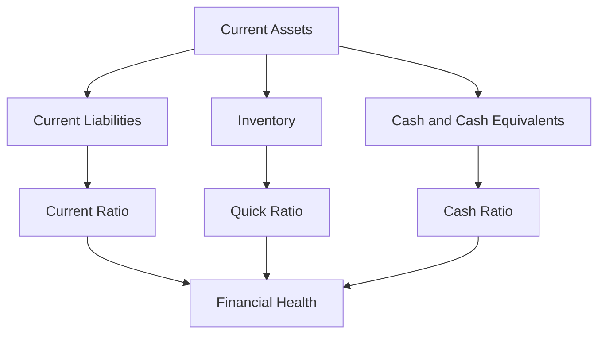

## 17.3 Ratio Analysis: Liquidity Ratios

Liquidity ratios are essential tools in financial analysis, providing insights into a company's ability to meet its short-term obligations. These ratios are vital for stakeholders, including investors, creditors, and management, as they assess the financial health and operational efficiency of a business. In this section, we will delve into the key liquidity ratios, their calculations, interpretations, and practical applications in the context of Canadian accounting standards.

### Understanding Liquidity Ratios

Liquidity ratios measure a company's capacity to cover its short-term liabilities with its short-term assets. These ratios are crucial indicators of financial stability and operational efficiency. A company with high liquidity ratios is generally considered financially healthy, as it can easily meet its short-term obligations without resorting to external financing.

### Key Liquidity Ratios

#### 1. Current Ratio

The current ratio is one of the most widely used liquidity ratios. It measures a company's ability to pay off its short-term liabilities with its short-term assets. The formula for calculating the current ratio is:

 \text{Current Ratio} = \frac{\text{Current Assets}}{\text{Current Liabilities}} 

- **Interpretation:** A current ratio greater than 1 indicates that the company has more current assets than current liabilities, suggesting good short-term financial health. However, an excessively high current ratio may indicate inefficient use of resources.
- **Example:** If a company has current assets of $500,000 and current liabilities of $300,000, the current ratio would be 1.67, indicating a strong liquidity position.

#### 2. Quick Ratio (Acid-Test Ratio)

The quick ratio is a more stringent measure of liquidity than the current ratio. It excludes inventory from current assets, focusing on the most liquid assets. The formula is:

 \text{Quick Ratio} = \frac{\text{Current Assets} - \text{Inventory}}{\text{Current Liabilities}} 

- **Interpretation:** A quick ratio of 1 or higher is generally considered satisfactory, indicating that the company can meet its short-term liabilities without relying on the sale of inventory.
- **Example:** With current assets of $500,000, inventory of $150,000, and current liabilities of $300,000, the quick ratio would be 1.17, suggesting adequate liquidity.

#### 3. Cash Ratio

The cash ratio is the most conservative liquidity ratio, considering only cash and cash equivalents. It measures a company's ability to pay off its short-term liabilities with its most liquid assets. The formula is:

 \text{Cash Ratio} = \frac{\text{Cash and Cash Equivalents}}{\text{Current Liabilities}} 

- **Interpretation:** A cash ratio of 1 indicates that the company can cover its short-term liabilities entirely with cash and cash equivalents. A lower ratio may suggest potential liquidity issues.
- **Example:** If a company has cash and cash equivalents of $200,000 and current liabilities of $300,000, the cash ratio would be 0.67, indicating a reliance on other current assets to meet obligations.

### Practical Applications and Considerations

#### Importance in Financial Analysis

Liquidity ratios are crucial for assessing a company's short-term financial health. They provide insights into the company's operational efficiency and its ability to manage working capital effectively. High liquidity ratios generally indicate a strong financial position, while low ratios may signal potential liquidity issues.

#### Impact on Stakeholders

- **Investors:** Use liquidity ratios to assess the risk associated with investing in a company. High liquidity ratios may indicate a lower risk of financial distress.
- **Creditors:** Evaluate a company's ability to repay short-term debts. Creditors prefer companies with high liquidity ratios, as they are more likely to meet their obligations.
- **Management:** Monitor liquidity ratios to ensure efficient working capital management and to make informed financial decisions.

#### Limitations of Liquidity Ratios

While liquidity ratios provide valuable insights, they have limitations:

- **Static Nature:** Liquidity ratios are based on balance sheet figures, which are static and may not reflect the company's current financial position.
- **Industry Variations:** Different industries have varying liquidity requirements. Comparing liquidity ratios across industries may not provide meaningful insights.
- **Exclusion of Cash Flow:** Liquidity ratios do not consider cash flow, which is a critical component of a company's financial health.

### Real-World Applications

#### Case Study: Retail Industry

In the retail industry, liquidity ratios are particularly important due to the high level of inventory. Retailers often have lower quick ratios because of significant inventory holdings. However, a high current ratio may still indicate good liquidity if inventory turnover is high.

#### Regulatory Considerations

In Canada, companies must adhere to International Financial Reporting Standards (IFRS) as adopted by the Canadian Accounting Standards Board (AcSB). These standards emphasize the importance of liquidity analysis in financial reporting and disclosures.

### Enhancing Liquidity Ratios

Companies can improve their liquidity ratios by:

- **Improving Inventory Management:** Reducing excess inventory can enhance the quick ratio.
- **Enhancing Receivables Collection:** Accelerating the collection of accounts receivable improves cash flow and liquidity.
- **Managing Payables Efficiently:** Extending payment terms with suppliers can improve liquidity without affecting operations.

### Visualizing Liquidity Ratios

To better understand the relationship between liquidity ratios and financial health, consider the following diagram:

### Best Practices and Common Pitfalls

- **Regular Monitoring:** Regularly monitor liquidity ratios to identify trends and potential issues early.
- **Industry Benchmarks:** Compare liquidity ratios with industry benchmarks to gain meaningful insights.
- **Avoid Overemphasis:** Avoid overemphasizing liquidity ratios at the expense of other financial metrics.

### Conclusion

Liquidity ratios are vital tools in financial analysis, providing insights into a company's ability to meet short-term obligations. By understanding and applying these ratios, stakeholders can make informed decisions about a company's financial health and operational efficiency. While liquidity ratios have limitations, they remain an essential component of comprehensive financial analysis.

## **Ready to Test Your Knowledge?**



### What does a current ratio greater than 1 indicate?

- [x] The company has more current assets than current liabilities.
- [ ] The company is in financial distress.
- [ ] The company has more liabilities than assets.
- [ ] The company is not using its resources efficiently.

> **Explanation:** A current ratio greater than 1 indicates that the company has more current assets than current liabilities, suggesting good short-term financial health.

### Which liquidity ratio excludes inventory from current assets?

- [ ] Current Ratio
- [x] Quick Ratio
- [ ] Cash Ratio
- [ ] Debt Ratio

> **Explanation:** The quick ratio excludes inventory from current assets, focusing on the most liquid assets to assess a company's ability to meet short-term obligations.

### What is the formula for the cash ratio?

- [ ] Cash and Cash Equivalents / Total Assets
- [x] Cash and Cash Equivalents / Current Liabilities
- [ ] Current Assets / Current Liabilities
- [ ] Total Liabilities / Total Assets

> **Explanation:** The cash ratio is calculated by dividing cash and cash equivalents by current liabilities, measuring a company's ability to pay off short-term liabilities with its most liquid assets.

### Why might a high current ratio be a concern?

- [ ] It indicates financial distress.
- [ ] It suggests a lack of liquidity.
- [x] It may indicate inefficient use of resources.
- [ ] It shows a lack of profitability.

> **Explanation:** A high current ratio may indicate inefficient use of resources, as it suggests that the company may have excess current assets that are not being utilized effectively.

### How can a company improve its quick ratio?

- [x] By reducing excess inventory
- [ ] By increasing liabilities
- [x] By enhancing receivables collection
- [ ] By decreasing cash reserves

> **Explanation:** A company can improve its quick ratio by reducing excess inventory and enhancing receivables collection, thereby increasing its most liquid assets.

### What is the primary focus of liquidity ratios?

- [x] Assessing a company's ability to meet short-term obligations
- [ ] Evaluating long-term financial stability
- [ ] Measuring profitability
- [ ] Analyzing market performance

> **Explanation:** Liquidity ratios primarily focus on assessing a company's ability to meet short-term obligations, providing insights into its financial health and operational efficiency.

### Which stakeholders are most interested in liquidity ratios?

- [x] Creditors
- [ ] Shareholders
- [x] Investors
- [ ] Competitors

> **Explanation:** Creditors and investors are most interested in liquidity ratios as they assess the risk associated with lending to or investing in a company.

### What is a limitation of liquidity ratios?

- [ ] They are dynamic and change frequently.
- [ ] They provide insights into long-term financial health.
- [x] They are based on static balance sheet figures.
- [ ] They consider cash flow.

> **Explanation:** A limitation of liquidity ratios is that they are based on static balance sheet figures, which may not reflect the company's current financial position.

### What does a cash ratio of 1 indicate?

- [x] The company can cover its short-term liabilities entirely with cash and cash equivalents.
- [ ] The company is in financial distress.
- [ ] The company has excess cash reserves.
- [ ] The company is not using its cash efficiently.

> **Explanation:** A cash ratio of 1 indicates that the company can cover its short-term liabilities entirely with cash and cash equivalents, suggesting strong liquidity.

### True or False: Liquidity ratios consider cash flow.

- [ ] True
- [x] False

> **Explanation:** False. Liquidity ratios do not consider cash flow; they are based on balance sheet figures, which are static and may not reflect the company's current financial position.


