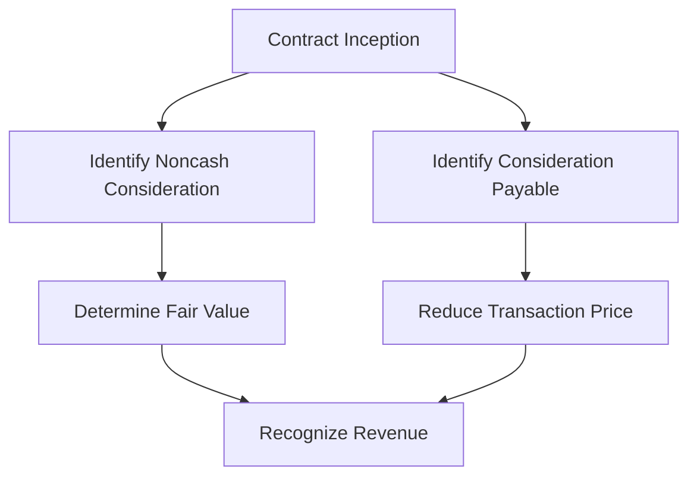

## 3.10 Noncash Consideration and Consideration Payable to a Customer

In the realm of accounting, revenue recognition is a critical aspect that ensures the accuracy and reliability of financial statements. Among the various complexities involved in revenue recognition, accounting for noncash consideration and consideration payable to a customer presents unique challenges. This section delves into these intricacies, offering a comprehensive understanding of how to account for such transactions under Canadian accounting standards, including IFRS and ASPE.

### Understanding Noncash Consideration

Noncash consideration refers to the exchange of goods, services, or other non-monetary assets in a transaction instead of cash. This type of consideration requires careful evaluation to determine its fair value and appropriate recognition in financial statements.

#### Key Concepts in Noncash Consideration

1. **Fair Value Measurement**: The fair value of noncash consideration is determined at the contract inception. It involves estimating the price that would be received to sell an asset or paid to transfer a liability in an orderly transaction between market participants.

2. **Types of Noncash Consideration**:
   - **Goods and Services**: Often exchanged in barter transactions or as part of a promotional campaign.
   - **Equity Instruments**: Such as shares or stock options issued as part of a transaction.

3. **Recognition and Measurement**: Noncash consideration is recognized at its fair value. If the fair value cannot be reliably measured, the consideration is measured indirectly by reference to the stand-alone selling price of the goods or services promised in exchange.

4. **Impact on Revenue Recognition**: The inclusion of noncash consideration affects the transaction price and, consequently, the amount of revenue recognized.

#### Practical Example

Consider a technology company that provides software licenses in exchange for advertising services. The company must determine the fair value of the advertising services received and recognize revenue equivalent to this value.

### Consideration Payable to a Customer

Consideration payable to a customer refers to payments made by an entity to its customer, which can take various forms, such as cash payments, credits, or discounts. These payments are often used as incentives or rebates to encourage purchases.

#### Key Concepts in Consideration Payable

1. **Reduction of Transaction Price**: Consideration payable to a customer is typically accounted for as a reduction of the transaction price, unless the payment is in exchange for a distinct good or service.

2. **Timing of Recognition**: The reduction in the transaction price is recognized at the later of when the entity recognizes revenue for the transfer of the related goods or services or when the entity pays or promises to pay the consideration.

3. **Types of Consideration Payable**:
   - **Volume Rebates**: Discounts provided based on the volume of purchases.
   - **Slotting Fees**: Payments made to retailers for shelf space.
   - **Cooperative Advertising**: Payments made to customers to subsidize their advertising costs.

4. **Impact on Financial Statements**: Consideration payable affects the net revenue recognized and can impact profitability metrics.

#### Practical Example

A consumer goods company offers a rebate to retailers based on the volume of products purchased. The company must account for this rebate as a reduction in the transaction price, affecting the revenue recognized.

### Accounting Standards and Guidelines

#### IFRS 15 and ASPE 3400

Both IFRS 15 and ASPE 3400 provide guidance on accounting for noncash consideration and consideration payable to a customer. The core principle is to recognize revenue in a manner that depicts the transfer of promised goods or services to customers in an amount that reflects the consideration to which the entity expects to be entitled.

1. **IFRS 15**: Under IFRS 15, the transaction price includes any noncash consideration, measured at fair value. Consideration payable to a customer is treated as a reduction of the transaction price unless it is for a distinct good or service.

2. **ASPE 3400**: Similar to IFRS 15, ASPE 3400 requires the measurement of noncash consideration at fair value and the reduction of the transaction price for consideration payable to a customer.

### Challenges and Considerations

1. **Estimating Fair Value**: Determining the fair value of noncash consideration can be challenging, especially when market data is limited or unavailable.

2. **Complex Contracts**: Contracts involving multiple performance obligations or variable consideration require careful analysis to ensure accurate revenue recognition.

3. **Regulatory Compliance**: Entities must ensure compliance with relevant accounting standards and disclosure requirements, which may vary between jurisdictions.

4. **Impact on Financial Ratios**: Noncash consideration and consideration payable can affect key financial ratios, such as gross margin and net profit margin, influencing stakeholders' perceptions.

### Best Practices for Accounting Professionals

1. **Thorough Contract Review**: Carefully review contracts to identify all forms of consideration and performance obligations.

2. **Use of Valuation Techniques**: Employ appropriate valuation techniques to estimate the fair value of noncash consideration.

3. **Regular Updates and Training**: Stay informed about changes in accounting standards and participate in ongoing professional development.

4. **Clear Documentation**: Maintain detailed documentation of the assumptions and methods used in estimating fair value and recognizing revenue.

### Real-World Applications and Case Studies

#### Case Study: Barter Transactions in the Media Industry

In the media industry, barter transactions are common, where advertising space is exchanged for goods or services. A media company must determine the fair value of the advertising space provided and recognize revenue accordingly. This involves assessing market rates for similar advertising services and ensuring compliance with IFRS 15.

#### Case Study: Rebates in the Retail Sector

A retail company offers volume rebates to its customers, which are contingent on achieving certain sales targets. The company must estimate the expected rebate amount and recognize it as a reduction in the transaction price, impacting the revenue recognized in financial statements.

### Diagrams and Visual Aids

To enhance understanding, the following diagram illustrates the flow of accounting for noncash consideration and consideration payable to a customer:

### Conclusion

Accounting for noncash consideration and consideration payable to a customer is a complex yet essential aspect of revenue recognition. By understanding the principles and guidelines outlined in IFRS 15 and ASPE 3400, accounting professionals can ensure accurate financial reporting and compliance with regulatory standards. Through practical examples and case studies, this section provides valuable insights into the application of these concepts in real-world scenarios.

## **Ready to Test Your Knowledge?**



### What is noncash consideration?

- [x] Consideration in the form of goods, services, or other non-monetary assets
- [ ] Consideration in the form of cash only
- [ ] Consideration that is not recognized in financial statements
- [ ] Consideration that is always measured at cost

> **Explanation:** Noncash consideration refers to the exchange of goods, services, or other non-monetary assets instead of cash.

### How is the fair value of noncash consideration determined?

- [x] At the contract inception
- [ ] At the end of the reporting period
- [ ] When the goods or services are delivered
- [ ] When the customer pays

> **Explanation:** The fair value of noncash consideration is determined at the contract inception, ensuring accurate revenue recognition.

### What is consideration payable to a customer?

- [x] Payments made by an entity to its customer
- [ ] Payments received from a customer
- [ ] Noncash consideration exchanged with a customer
- [ ] Consideration that is not recognized in financial statements

> **Explanation:** Consideration payable to a customer refers to payments made by an entity to its customer, often as incentives or rebates.

### How is consideration payable to a customer typically accounted for?

- [x] As a reduction of the transaction price
- [ ] As an increase in the transaction price
- [ ] As a separate liability
- [ ] As a distinct revenue stream

> **Explanation:** Consideration payable to a customer is typically accounted for as a reduction of the transaction price unless it is for a distinct good or service.

### What are volume rebates?

- [x] Discounts provided based on the volume of purchases
- [ ] Payments made for shelf space
- [ ] Noncash consideration exchanged with a customer
- [ ] Consideration that is not recognized in financial statements

> **Explanation:** Volume rebates are discounts provided to customers based on the volume of purchases, affecting the transaction price.

### Under IFRS 15, how is noncash consideration included in the transaction price?

- [x] Measured at fair value
- [ ] Measured at cost
- [ ] Not included in the transaction price
- [ ] Included only if it exceeds a certain threshold

> **Explanation:** Under IFRS 15, noncash consideration is included in the transaction price and measured at fair value.

### What is a common challenge in accounting for noncash consideration?

- [x] Estimating fair value
- [ ] Recognizing cash payments
- [ ] Identifying distinct goods or services
- [ ] Calculating interest expense

> **Explanation:** A common challenge in accounting for noncash consideration is estimating its fair value, especially when market data is limited.

### What is the impact of consideration payable on financial statements?

- [x] It affects the net revenue recognized
- [ ] It increases the transaction price
- [ ] It is recorded as a separate expense
- [ ] It has no impact on financial statements

> **Explanation:** Consideration payable affects the net revenue recognized and can impact profitability metrics.

### What is the core principle of revenue recognition under IFRS 15?

- [x] Recognize revenue in a manner that depicts the transfer of promised goods or services
- [ ] Recognize revenue only when cash is received
- [ ] Recognize revenue based on the cost of goods sold
- [ ] Recognize revenue at the end of the reporting period

> **Explanation:** The core principle of revenue recognition under IFRS 15 is to recognize revenue in a manner that depicts the transfer of promised goods or services to customers.

### True or False: Noncash consideration is always measured at cost.

- [ ] True
- [x] False

> **Explanation:** False. Noncash consideration is measured at fair value, not cost, to ensure accurate revenue recognition.


