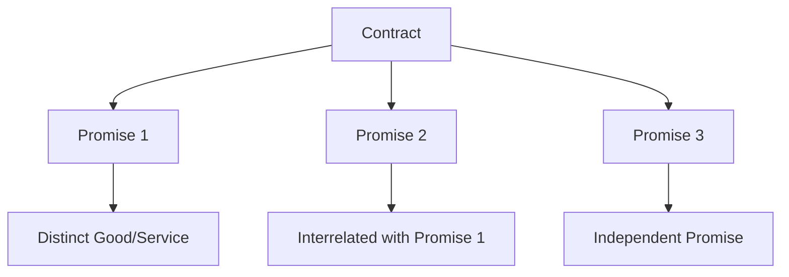

## 3.3 Identifying Performance Obligations

In the realm of intermediate accounting, identifying performance obligations is a pivotal step in the revenue recognition process. This section will delve into the complexities of determining distinct goods or services that constitute performance obligations within a contract, aligning with the International Financial Reporting Standards (IFRS) as adopted in Canada. Understanding this concept is crucial for accounting professionals and students preparing for Canadian accounting exams.

### Understanding Performance Obligations

**Performance obligations** are promises in a contract to transfer distinct goods or services to a customer. According to IFRS 15, a performance obligation is a promise to transfer either a distinct good or service or a series of distinct goods or services that are substantially the same and have the same pattern of transfer to the customer.

#### Key Characteristics of Performance Obligations

1. **Distinct Goods or Services**: A good or service is distinct if the customer can benefit from it on its own or together with other readily available resources, and it is separately identifiable from other promises in the contract.

2. **Series of Distinct Goods or Services**: If a series of distinct goods or services are substantially the same and have the same pattern of transfer, they are treated as a single performance obligation.

3. **Promises in a Contract**: These can be explicit, implicit, or arise from customary business practices.

### Distinct Goods or Services

To determine if a good or service is distinct, two criteria must be met:

1. **Capable of Being Distinct**: The customer can benefit from the good or service either on its own or with other resources that are readily available.

2. **Distinct within the Context of the Contract**: The promise to transfer the good or service is separately identifiable from other promises in the contract.

#### Practical Examples

- **Software License**: A software license that can be used independently by the customer is distinct.
- **Installation Services**: Installation services that significantly modify or customize the software may not be distinct if they are highly interrelated with the software.

### Identifying Promises in a Contract

Contracts may contain multiple promises, and it is essential to identify each promise to determine the performance obligations. Promises can be:

- **Explicitly Stated**: Clearly outlined in the contract terms.
- **Implicit**: Implied by customary business practices or the customer’s expectations.
- **Arising from Legal or Statutory Requirements**: Obligations that are legally binding.

#### Case Study: Construction Contracts

In a construction contract, promises might include:

- Design services
- Construction of the building
- Post-construction maintenance

Each of these promises needs to be evaluated to determine if they are distinct performance obligations.

### Series of Distinct Goods or Services

A series of distinct goods or services is treated as a single performance obligation if:

- Each distinct good or service in the series is substantially the same.
- They have the same pattern of transfer to the customer.

#### Example: Subscription Services

Consider a subscription service that provides monthly access to a software platform. Each month’s access is distinct, but they are substantially the same and transferred in the same pattern, thus treated as a single performance obligation.

### Separately Identifiable Promises

To determine if a promise is separately identifiable, consider:

- **Integration Services**: Are the goods or services highly interrelated?
- **Modification or Customization**: Does one significantly modify or customize another?
- **Interdependence**: Are the goods or services highly dependent on or interrelated with each other?

#### Diagram: Separately Identifiable Promises

### Challenges in Identifying Performance Obligations

Identifying performance obligations can be challenging due to:

- **Complex Contracts**: Contracts with multiple goods or services.
- **Judgment and Estimates**: Requires significant judgment to determine distinct goods or services.
- **Changes in Contract Terms**: Modifications can affect the identification of performance obligations.

### Best Practices for Identifying Performance Obligations

1. **Thorough Contract Review**: Analyze all terms and conditions.
2. **Understand Customer Expectations**: Consider what the customer expects to receive.
3. **Consultation with Legal and Accounting Experts**: Seek guidance when dealing with complex contracts.

### Common Pitfalls and How to Avoid Them

- **Overlooking Implicit Promises**: Ensure all promises, explicit and implicit, are considered.
- **Misjudging Distinctiveness**: Carefully evaluate if goods or services are truly distinct.
- **Ignoring Integration Services**: Consider the interrelation of goods or services.

### Regulatory Considerations

In Canada, the IFRS 15 standard governs revenue recognition, including the identification of performance obligations. It is crucial to stay updated with any changes or amendments to the standards.

### Real-World Applications

- **Telecommunications**: Bundled services such as phone, internet, and television.
- **Automotive**: Sale of vehicles with maintenance packages.
- **Software**: Licensing with support and updates.

### Conclusion

Identifying performance obligations is a critical step in the revenue recognition process. By understanding the criteria for distinct goods or services and recognizing the challenges involved, accounting professionals can ensure accurate financial reporting. This knowledge is not only essential for passing Canadian accounting exams but also for practical application in the accounting profession.

## **Ready to Test Your Knowledge?**



### Which of the following is a key characteristic of a performance obligation?

- [x] Distinct goods or services
- [ ] Implicit promises only
- [ ] Legal obligations only
- [ ] Non-distinct services

> **Explanation:** A performance obligation involves distinct goods or services, which can be explicit, implicit, or legal obligations.

### What criteria must be met for a good or service to be considered distinct?

- [x] Capable of being distinct and distinct within the context of the contract
- [ ] Only capable of being distinct
- [ ] Only distinct within the context of the contract
- [ ] Neither of the above

> **Explanation:** A good or service must be capable of being distinct and distinct within the context of the contract to be considered distinct.

### In a subscription service, how are the monthly services treated?

- [x] As a single performance obligation
- [ ] As multiple performance obligations
- [ ] As implicit promises
- [ ] As legal obligations

> **Explanation:** Monthly services in a subscription are treated as a single performance obligation if they are substantially the same and have the same pattern of transfer.

### What is a common pitfall in identifying performance obligations?

- [x] Overlooking implicit promises
- [ ] Overestimating distinctiveness
- [ ] Ignoring explicit promises
- [ ] Misjudging contract terms

> **Explanation:** A common pitfall is overlooking implicit promises, which should be considered along with explicit promises.

### Which of the following is an example of a distinct good or service?

- [x] A software license that can be used independently
- [ ] Installation services that modify the software
- [x] A standalone product
- [ ] An integrated service

> **Explanation:** A software license that can be used independently is distinct, as is a standalone product.

### What is the significance of integration services in identifying performance obligations?

- [x] They indicate interrelated goods or services
- [ ] They simplify the identification process
- [ ] They are always distinct
- [ ] They are not considered in the process

> **Explanation:** Integration services indicate that goods or services are interrelated, affecting their distinctiveness.

### How should changes in contract terms be handled?

- [x] By reassessing performance obligations
- [ ] By ignoring them
- [x] By consulting experts
- [ ] By treating them as implicit promises

> **Explanation:** Changes in contract terms should be handled by reassessing performance obligations and consulting experts if necessary.

### What role do customer expectations play in identifying performance obligations?

- [x] They help determine distinct goods or services
- [ ] They are irrelevant
- [ ] They complicate the process
- [ ] They simplify the process

> **Explanation:** Customer expectations help determine what goods or services are distinct and should be considered.

### Why is it important to stay updated with IFRS 15 standards?

- [x] To ensure compliance with revenue recognition
- [ ] To simplify accounting processes
- [ ] To ignore changes in contract terms
- [ ] To focus on implicit promises only

> **Explanation:** Staying updated with IFRS 15 standards ensures compliance with revenue recognition requirements.

### True or False: Performance obligations can only be explicit promises.

- [ ] True
- [x] False

> **Explanation:** Performance obligations can be explicit, implicit, or arise from legal or statutory requirements.


