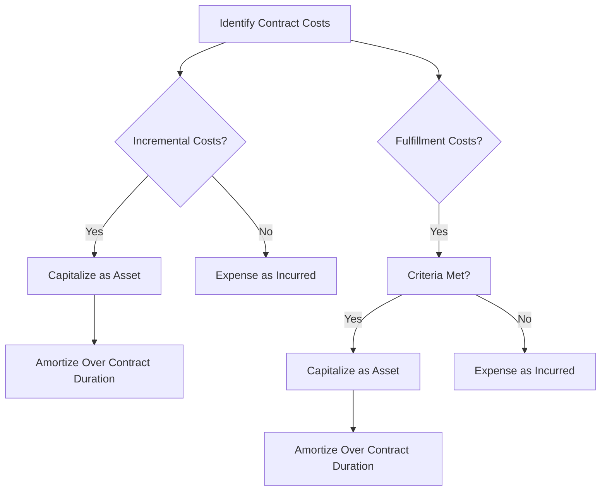

## 3.7 Contract Costs: Incremental Costs and Fulfillment Costs

In the realm of intermediate accounting, understanding the nuances of contract costs is pivotal for accurate revenue recognition. This section delves into the intricacies of accounting for costs incurred in obtaining or fulfilling a contract, focusing on incremental costs and fulfillment costs. These concepts are essential for those preparing for Canadian accounting exams, as they align with both International Financial Reporting Standards (IFRS) and Accounting Standards for Private Enterprises (ASPE) in Canada.

### Understanding Contract Costs

Contract costs are expenses that a company incurs to obtain and fulfill a contract with a customer. These costs are crucial in determining the profitability of a contract and ensuring compliance with accounting standards. The IFRS 15 standard, "Revenue from Contracts with Customers," provides guidance on how to account for these costs, emphasizing the importance of recognizing them in a manner that reflects the transfer of goods or services to customers.

### Incremental Costs of Obtaining a Contract

**Definition:** Incremental costs are costs that a company would not have incurred if the contract had not been obtained. These costs are directly attributable to securing a specific contract and are recognized as an asset if the company expects to recover them.

#### Examples of Incremental Costs

- **Sales Commissions:** Payments to sales personnel that are directly tied to securing a contract.
- **Legal Fees:** Costs associated with drafting and negotiating contract terms.
- **Bid Costs:** Expenses incurred in the process of bidding for a contract, provided they are directly attributable to a specific contract.

#### Accounting Treatment

Incremental costs should be capitalized as an asset if they are expected to be recovered. This asset is then amortized on a systematic basis that is consistent with the pattern of transfer of goods or services to the customer. If the amortization period is one year or less, the costs can be expensed as incurred.

#### Practical Example

Consider a software company that incurs a $10,000 sales commission to secure a $100,000 contract. If the company expects to recover this cost through the contract's revenue, it should capitalize the $10,000 as an asset and amortize it over the contract's duration.

### Fulfillment Costs

**Definition:** Fulfillment costs are costs incurred to fulfill a contract with a customer. These costs are recognized as an asset if they meet specific criteria outlined in IFRS 15.

#### Criteria for Capitalization

1. **Directly Related to the Contract:** Costs must be directly attributable to fulfilling the contract.
2. **Generate or Enhance Resources:** The costs should generate or enhance resources that will be used to satisfy performance obligations in the future.
3. **Expected to be Recovered:** The costs must be expected to be recovered through the contract's revenue.

#### Examples of Fulfillment Costs

- **Direct Labor Costs:** Wages paid to employees directly involved in fulfilling the contract.
- **Materials and Supplies:** Costs of materials used specifically for the contract.
- **Allocation of Overhead:** Indirect costs that are allocated to the contract based on a systematic and rational basis.

#### Accounting Treatment

Fulfillment costs meeting the criteria are capitalized as an asset and amortized over the period in which the related revenue is recognized. This ensures that expenses are matched with the revenue they help generate, adhering to the matching principle.

#### Practical Example

A construction company incurs $50,000 in direct labor and materials costs to fulfill a contract. If these costs meet the capitalization criteria, they should be recorded as an asset and amortized over the contract's duration.

### Challenges and Considerations

- **Judgment in Capitalization:** Determining which costs qualify for capitalization requires significant judgment and understanding of the contract terms.
- **Impairment Testing:** Capitalized contract costs must be tested for impairment regularly to ensure they are recoverable.
- **Regulatory Compliance:** Adherence to IFRS 15 and ASPE standards is crucial for accurate financial reporting and compliance.

### Real-World Application

In practice, companies must carefully assess their contract costs to ensure they are accounted for correctly. This involves detailed analysis and documentation to support the capitalization and amortization of these costs. Companies must also stay updated with any changes in accounting standards that may impact the treatment of contract costs.

### Diagrams and Visuals

To enhance understanding, let's visualize the process of accounting for contract costs using a flowchart:

### Best Practices

- **Documentation:** Maintain thorough documentation to support the capitalization of contract costs.
- **Regular Review:** Periodically review capitalized costs for impairment and adjust as necessary.
- **Training and Awareness:** Ensure that accounting personnel are well-versed in the latest standards and practices related to contract costs.

### Common Pitfalls

- **Overcapitalization:** Avoid capitalizing costs that do not meet the criteria, as this can lead to overstated assets and net income.
- **Neglecting Impairment:** Failing to test for impairment can result in carrying amounts that are not recoverable.
- **Inconsistent Application:** Ensure consistent application of accounting policies across contracts to maintain comparability and reliability in financial reporting.

### Exam Focus

For Canadian accounting exams, focus on understanding the criteria for capitalizing contract costs and the implications of these costs on financial statements. Be prepared to analyze scenarios and determine the appropriate accounting treatment for various contract costs.

### Conclusion

Contract costs, including incremental and fulfillment costs, play a vital role in revenue recognition and financial reporting. By understanding the criteria for capitalization and the accounting treatment of these costs, you can ensure accurate and compliant financial statements. This knowledge is essential for success in Canadian accounting exams and professional practice.

---

## **Ready to Test Your Knowledge?**



### Which of the following is considered an incremental cost of obtaining a contract?

- [x] Sales commissions directly tied to securing a contract
- [ ] General administrative expenses
- [ ] Overhead costs
- [ ] Depreciation of office equipment

> **Explanation:** Sales commissions are directly attributable to securing a contract and are considered incremental costs.

### What is the primary criterion for capitalizing fulfillment costs?

- [x] Costs must be directly related to fulfilling the contract
- [ ] Costs must be incurred before the contract is signed
- [ ] Costs must be less than 10% of the contract value
- [ ] Costs must be recoverable within one year

> **Explanation:** Fulfillment costs must be directly related to fulfilling the contract to be capitalized.

### How should incremental costs be treated if they are expected to be recovered?

- [x] Capitalized as an asset
- [ ] Expensed immediately
- [ ] Deferred as a liability
- [ ] Recorded as revenue

> **Explanation:** Incremental costs expected to be recovered should be capitalized as an asset.

### What is the appropriate accounting treatment for fulfillment costs that do not meet capitalization criteria?

- [x] Expense as incurred
- [ ] Capitalize as an asset
- [ ] Defer as a liability
- [ ] Recognize as revenue

> **Explanation:** Fulfillment costs that do not meet capitalization criteria should be expensed as incurred.

### Which of the following is NOT a fulfillment cost?

- [x] General administrative expenses
- [ ] Direct labor costs
- [ ] Materials and supplies
- [ ] Allocation of overhead

> **Explanation:** General administrative expenses are not directly related to fulfilling a contract and are not considered fulfillment costs.

### What is the purpose of amortizing capitalized contract costs?

- [x] To match expenses with the revenue they help generate
- [ ] To increase net income
- [ ] To reduce tax liability
- [ ] To comply with legal requirements

> **Explanation:** Amortizing capitalized contract costs ensures that expenses are matched with the revenue they help generate.

### When should capitalized contract costs be tested for impairment?

- [x] Regularly, to ensure they are recoverable
- [ ] Only at the end of the contract
- [ ] When the contract is signed
- [ ] When the contract is completed

> **Explanation:** Regular impairment testing ensures that capitalized contract costs are recoverable.

### What should be done if capitalized contract costs are found to be impaired?

- [x] Write down the asset to its recoverable amount
- [ ] Increase the amortization period
- [ ] Defer the impairment loss
- [ ] Recognize as revenue

> **Explanation:** If capitalized contract costs are impaired, they should be written down to their recoverable amount.

### Which accounting standard provides guidance on contract costs?

- [x] IFRS 15
- [ ] IFRS 9
- [ ] ASPE 1000
- [ ] GAAP 200

> **Explanation:** IFRS 15 provides guidance on accounting for contract costs.

### True or False: Incremental costs can be expensed immediately if the amortization period is one year or less.

- [x] True
- [ ] False

> **Explanation:** Incremental costs can be expensed immediately if the amortization period is one year or less.


