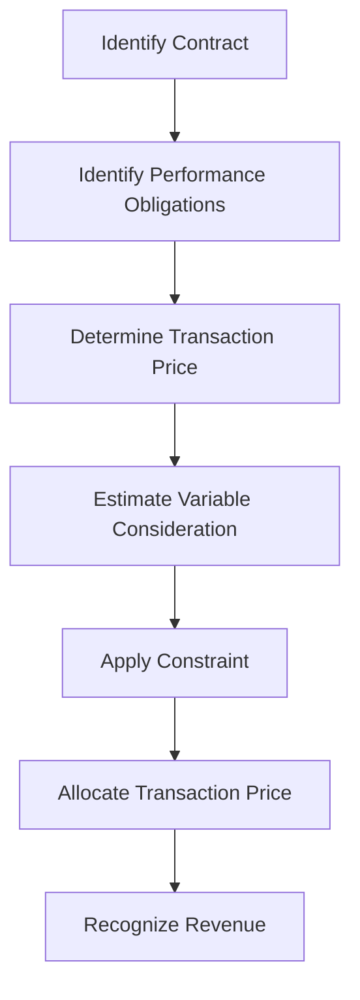

## 3.8 Variable Consideration and the Constraint

In the realm of accounting, revenue recognition is a cornerstone that determines how and when revenue is recorded in financial statements. A critical aspect of this process is dealing with variable consideration, which refers to the portion of the transaction price in a contract that can vary due to discounts, rebates, refunds, credits, price concessions, incentives, performance bonuses, penalties, or other similar items. Understanding how to account for variable consideration and the constraints on recognizing such revenue is essential for accurate financial reporting and compliance with accounting standards.

### Understanding Variable Consideration

Variable consideration arises in contracts where the amount of revenue to be received is not fixed and can change based on future events. This variability can stem from several factors, including:

- **Discounts and Rebates:** Offered to customers as part of sales promotions or volume purchases.
- **Performance Bonuses:** Earned based on achieving specific targets or milestones.
- **Penalties:** Imposed for failing to meet contractual obligations.
- **Price Concessions:** Granted to customers for various reasons, including competitive pricing pressures.

The challenge in accounting for variable consideration lies in estimating the amount of consideration to which the entity expects to be entitled and recognizing it in a manner that reflects the transfer of promised goods or services to the customer.

### The Five-Step Revenue Recognition Model

To address the complexities of revenue recognition, the International Financial Reporting Standards (IFRS) and the Accounting Standards for Private Enterprises (ASPE) in Canada have adopted a five-step model. This model provides a framework for recognizing revenue in a consistent and transparent manner. The five steps are:

1. **Identify the Contract with a Customer:** A contract is an agreement between two or more parties that creates enforceable rights and obligations.
2. **Identify the Performance Obligations in the Contract:** Performance obligations are promises to transfer distinct goods or services to the customer.
3. **Determine the Transaction Price:** The transaction price is the amount of consideration to which an entity expects to be entitled in exchange for transferring promised goods or services.
4. **Allocate the Transaction Price to the Performance Obligations:** The transaction price is allocated to each performance obligation based on the relative standalone selling prices.
5. **Recognize Revenue When (or As) the Entity Satisfies a Performance Obligation:** Revenue is recognized when control of the goods or services is transferred to the customer.

### Estimating Variable Consideration

When estimating variable consideration, entities must use either the expected value method or the most likely amount method:

- **Expected Value Method:** This method involves summing the probability-weighted amounts in a range of possible consideration amounts. It is suitable when there are multiple outcomes and the entity has experience with similar contracts.
  
- **Most Likely Amount Method:** This method involves selecting the single most likely amount from a range of possible outcomes. It is appropriate when the contract has only two possible outcomes.

### The Constraint on Variable Consideration

A key aspect of accounting for variable consideration is the constraint, which limits the amount of variable consideration that can be included in the transaction price. The constraint ensures that revenue is not overstated and is only recognized to the extent that it is highly probable that a significant reversal will not occur when the uncertainty is resolved.

#### Applying the Constraint

To apply the constraint, entities must assess the likelihood and magnitude of a revenue reversal. Factors to consider include:

- **Experience with Similar Contracts:** Historical data can provide insights into the likelihood of achieving performance targets or incurring penalties.
- **Market Conditions:** Changes in market conditions can affect the ability to meet contractual obligations.
- **Customer Creditworthiness:** The financial stability of the customer can impact the likelihood of receiving payment.
- **Contractual Terms:** Specific terms and conditions in the contract may influence the variability of consideration.

### Practical Examples and Scenarios

#### Example 1: Volume Discounts

A company sells products to a customer with a volume discount arrangement. The customer receives a 5% discount if they purchase more than 1,000 units in a year. At the beginning of the year, the company estimates that the customer will purchase 1,200 units. The expected value method is used to estimate the variable consideration, and the constraint is applied to ensure that the revenue recognized reflects the expected discount.

#### Example 2: Performance Bonuses

A construction company enters into a contract to build a bridge, with a performance bonus of $500,000 if the project is completed within 18 months. Based on past experience, the company estimates a 70% probability of completing the project on time. The most likely amount method is used to estimate the bonus, and the constraint is applied to limit the revenue recognized to the amount that is highly probable of not being reversed.

### Real-World Applications and Regulatory Scenarios

In practice, accounting for variable consideration requires careful judgment and adherence to regulatory standards. Canadian accounting standards, including IFRS 15, Revenue from Contracts with Customers, provide guidance on how to account for variable consideration and apply the constraint. Compliance with these standards ensures that financial statements provide a true and fair view of an entity's financial performance.

### Step-by-Step Guidance for Accounting Procedures

1. **Identify Variable Consideration:** Determine the elements of the contract that introduce variability in the transaction price.
2. **Estimate Variable Consideration:** Choose the appropriate method (expected value or most likely amount) to estimate the variable consideration.
3. **Apply the Constraint:** Assess the likelihood and magnitude of a revenue reversal and apply the constraint to limit the recognized revenue.
4. **Allocate the Transaction Price:** Distribute the transaction price, including the constrained variable consideration, to the performance obligations.
5. **Recognize Revenue:** Record revenue as performance obligations are satisfied, ensuring that the recognized amount reflects the constraint.

### Diagrams and Visuals

### Best Practices and Common Pitfalls

**Best Practices:**

- **Use Historical Data:** Leverage past experiences to inform estimates of variable consideration.
- **Regularly Update Estimates:** Reassess estimates as new information becomes available.
- **Document Judgments:** Maintain thorough documentation of the judgments and assumptions used in estimating variable consideration.

**Common Pitfalls:**

- **Overestimating Revenue:** Failing to adequately apply the constraint can lead to overstated revenue.
- **Inconsistent Application:** Applying different methods across similar contracts can result in inconsistent financial reporting.
- **Ignoring Market Changes:** Not considering changes in market conditions can lead to inaccurate estimates.

### References to Official Canadian Accounting Standards

- **IFRS 15, Revenue from Contracts with Customers:** Provides comprehensive guidance on revenue recognition, including variable consideration.
- **CPA Canada Handbook:** Offers detailed explanations and examples of applying accounting standards in practice.

### Summary and Key Points

- **Variable Consideration:** Refers to the portion of the transaction price that can vary due to discounts, bonuses, penalties, etc.
- **Estimation Methods:** Use the expected value or most likely amount method to estimate variable consideration.
- **Constraint:** Limits the amount of variable consideration included in the transaction price to prevent significant revenue reversals.
- **Regulatory Compliance:** Adhere to IFRS 15 and other relevant standards to ensure accurate financial reporting.

### Sample Exam-Style Questions

To reinforce your understanding of variable consideration and the constraint, consider the following practice questions:

## **Ready to Test Your Knowledge?**



### What is variable consideration in revenue recognition?

- [x] Consideration that can vary due to discounts, rebates, or performance bonuses
- [ ] Fixed consideration in a contract
- [ ] Consideration that is always paid in cash
- [ ] Consideration that is not subject to any conditions

> **Explanation:** Variable consideration refers to the portion of the transaction price that can change based on future events, such as discounts or performance bonuses.

### Which method is used to estimate variable consideration when there are multiple possible outcomes?

- [x] Expected value method
- [ ] Most likely amount method
- [ ] Fixed amount method
- [ ] Probability method

> **Explanation:** The expected value method involves summing the probability-weighted amounts in a range of possible consideration amounts, suitable for multiple outcomes.

### What is the purpose of the constraint on variable consideration?

- [x] To limit revenue recognition to amounts that are highly probable not to be reversed
- [ ] To maximize revenue recognition
- [ ] To ignore variable consideration
- [ ] To ensure all revenue is recognized immediately

> **Explanation:** The constraint ensures that revenue is recognized only to the extent that it is highly probable that a significant reversal will not occur.

### In which scenario is the most likely amount method appropriate?

- [x] When the contract has only two possible outcomes
- [ ] When there are multiple possible outcomes
- [ ] When the outcome is uncertain
- [ ] When the transaction price is fixed

> **Explanation:** The most likely amount method is used when there are only two possible outcomes, selecting the single most likely amount.

### Which of the following factors should be considered when applying the constraint?

- [x] Experience with similar contracts
- [x] Market conditions
- [ ] The color of the product
- [x] Customer creditworthiness

> **Explanation:** Factors such as experience with similar contracts, market conditions, and customer creditworthiness are important in assessing the likelihood of a revenue reversal.

### How should an entity account for a volume discount arrangement?

- [x] Estimate the expected discount and apply the constraint
- [ ] Ignore the discount until it is realized
- [ ] Recognize the full revenue without considering the discount
- [ ] Apply the discount to all sales regardless of volume

> **Explanation:** An entity should estimate the expected discount using the appropriate method and apply the constraint to ensure accurate revenue recognition.

### What is the role of historical data in estimating variable consideration?

- [x] To inform estimates based on past experiences
- [ ] To ignore past experiences
- [ ] To ensure estimates are always conservative
- [ ] To replace current market conditions

> **Explanation:** Historical data provides insights into similar contracts and helps inform estimates of variable consideration.

### What is the impact of not applying the constraint adequately?

- [x] Overstated revenue
- [ ] Understated revenue
- [ ] Accurate revenue recognition
- [ ] No impact on revenue

> **Explanation:** Failing to adequately apply the constraint can lead to overstated revenue, as it may not reflect the true likelihood of a reversal.

### Which accounting standard provides guidance on variable consideration?

- [x] IFRS 15, Revenue from Contracts with Customers
- [ ] IFRS 9, Financial Instruments
- [ ] IFRS 16, Leases
- [ ] IAS 2, Inventories

> **Explanation:** IFRS 15 provides comprehensive guidance on revenue recognition, including the treatment of variable consideration.

### True or False: The constraint on variable consideration ensures that revenue is recognized only when it is certain.

- [x] False
- [ ] True

> **Explanation:** The constraint ensures that revenue is recognized to the extent that it is highly probable that a significant reversal will not occur, not necessarily when it is certain.



By mastering the concepts of variable consideration and the constraint, you will be well-prepared to tackle related questions on the Canadian Accounting Exams and apply these principles in your professional accounting practice.
