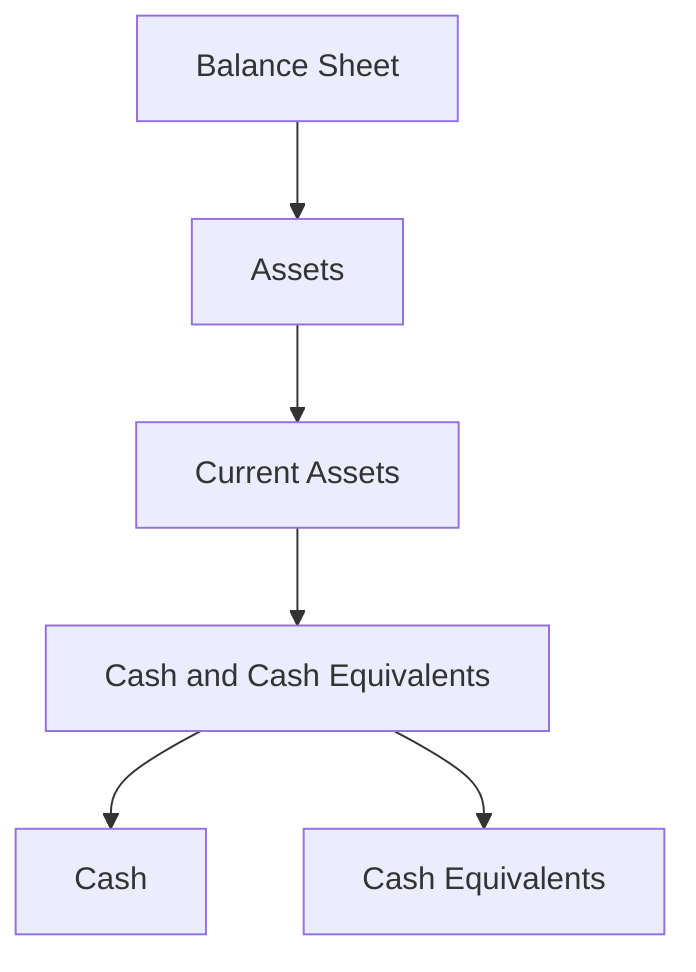

## 4.1 Classification of Cash and Cash Equivalents

In the realm of accounting, cash and cash equivalents are fundamental components of a company's financial health and liquidity. Understanding their classification is crucial for both preparing and analyzing financial statements. This section delves into the definition, classification, and presentation of cash and cash equivalents on the balance sheet, providing a comprehensive guide for those preparing for Canadian accounting exams.

### Understanding Cash and Cash Equivalents

**Cash** refers to the most liquid asset a company holds, including currency, coins, and funds available in bank accounts. **Cash equivalents**, on the other hand, are short-term, highly liquid investments that are readily convertible to known amounts of cash and are subject to an insignificant risk of changes in value. These typically include treasury bills, commercial paper, and money market funds.

#### Key Characteristics of Cash Equivalents

To qualify as a cash equivalent, an investment must meet the following criteria:

1. **Short-Term Maturity**: Typically, cash equivalents have a maturity of three months or less from the date of acquisition.
2. **High Liquidity**: They must be easily convertible to a known amount of cash.
3. **Insignificant Risk**: The risk of changes in value must be minimal.

### Presentation on the Balance Sheet

On the balance sheet, cash and cash equivalents are presented as the first line item under current assets. This placement reflects their liquidity and importance in meeting short-term obligations. The classification and presentation of these items can significantly impact a company's liquidity ratios and overall financial analysis.

#### Example of Balance Sheet Presentation

### Accounting Standards and Guidelines

In Canada, the classification and presentation of cash and cash equivalents are guided by the International Financial Reporting Standards (IFRS) and the Accounting Standards for Private Enterprises (ASPE). Both frameworks provide specific criteria for what constitutes cash and cash equivalents and how they should be reported.

#### IFRS Guidelines

Under IFRS, cash and cash equivalents are defined in IAS 7 - Statement of Cash Flows. The standard emphasizes the importance of these items in assessing a company's liquidity and financial flexibility.

#### ASPE Guidelines

ASPE Section 1540 - Cash Flow Statements provides similar guidance for private enterprises in Canada, aligning closely with IFRS but allowing for some differences in presentation and disclosure.

### Practical Examples and Scenarios

Consider a company with the following short-term investments:

- **Treasury Bills**: Maturing in 60 days
- **Commercial Paper**: Maturing in 90 days
- **Equity Securities**: Readily marketable but with significant price volatility

In this scenario, the treasury bills and commercial paper would be classified as cash equivalents due to their short maturity and low risk. However, the equity securities, despite being liquid, would not qualify as cash equivalents due to their price volatility.

### Real-World Applications

In practice, the classification of cash and cash equivalents can influence a company's financial strategy and decision-making. For instance, maintaining a higher level of cash equivalents can enhance a company's liquidity position, making it more attractive to investors and creditors.

### Regulatory Considerations

When preparing financial statements, it is essential to comply with the relevant accounting standards and regulations. This includes ensuring that cash and cash equivalents are accurately classified and disclosed, providing a clear picture of the company's liquidity.

### Common Challenges and Pitfalls

One common challenge in classifying cash and cash equivalents is determining the appropriate cutoff for short-term investments. Companies must carefully assess the maturity and risk profile of each investment to ensure accurate classification.

### Best Practices for Classification

1. **Regular Review**: Periodically review the classification of cash and cash equivalents to ensure compliance with accounting standards.
2. **Clear Documentation**: Maintain clear documentation of the criteria used to classify investments as cash equivalents.
3. **Consistent Application**: Apply the classification criteria consistently across reporting periods.

### Exam Preparation Tips

For those preparing for Canadian accounting exams, it is crucial to understand the principles and criteria for classifying cash and cash equivalents. Practice identifying and classifying various types of investments, and familiarize yourself with the relevant accounting standards.

### Conclusion

The classification of cash and cash equivalents is a fundamental aspect of financial reporting, impacting a company's liquidity analysis and financial strategy. By understanding the criteria and guidelines for classification, you can enhance your ability to prepare and analyze financial statements effectively.

---

## **Ready to Test Your Knowledge?**



### What is the primary characteristic of cash equivalents?

- [x] High liquidity and short-term maturity
- [ ] Long-term investment potential
- [ ] High return on investment
- [ ] Significant risk of value change

> **Explanation:** Cash equivalents are characterized by high liquidity and short-term maturity, typically with a maturity of three months or less.

### Which of the following is NOT considered a cash equivalent?

- [ ] Treasury bills
- [ ] Commercial paper
- [x] Equity securities
- [ ] Money market funds

> **Explanation:** Equity securities are not considered cash equivalents due to their potential for significant price volatility.

### Under IFRS, where are cash and cash equivalents presented on the balance sheet?

- [x] As the first line item under current assets
- [ ] Under long-term investments
- [ ] As a separate line item under liabilities
- [ ] In the equity section

> **Explanation:** Cash and cash equivalents are presented as the first line item under current assets on the balance sheet.

### What is the maximum maturity period for an investment to be classified as a cash equivalent?

- [ ] Six months
- [x] Three months
- [ ] One year
- [ ] Nine months

> **Explanation:** To be classified as a cash equivalent, an investment must have a maturity of three months or less from the date of acquisition.

### Which accounting standard provides guidance on cash and cash equivalents under IFRS?

- [x] IAS 7 - Statement of Cash Flows
- [ ] IFRS 9 - Financial Instruments
- [ ] IAS 16 - Property, Plant, and Equipment
- [ ] IFRS 15 - Revenue from Contracts with Customers

> **Explanation:** IAS 7 - Statement of Cash Flows provides guidance on the classification and presentation of cash and cash equivalents under IFRS.

### How does the classification of cash and cash equivalents impact liquidity ratios?

- [x] It directly affects liquidity ratios by influencing the calculation of current assets.
- [ ] It has no impact on liquidity ratios.
- [ ] It affects only long-term solvency ratios.
- [ ] It impacts only profitability ratios.

> **Explanation:** The classification of cash and cash equivalents directly affects liquidity ratios by influencing the calculation of current assets.

### What is a common pitfall when classifying cash equivalents?

- [x] Misclassifying investments with significant risk as cash equivalents
- [ ] Overestimating the maturity period
- [ ] Underestimating the return on investment
- [ ] Classifying all short-term investments as cash equivalents

> **Explanation:** A common pitfall is misclassifying investments with significant risk as cash equivalents, which should have minimal risk of value change.

### Why is it important to regularly review the classification of cash and cash equivalents?

- [x] To ensure compliance with accounting standards and accurate financial reporting
- [ ] To increase the company's profitability
- [ ] To reduce the company's tax liability
- [ ] To enhance the company's market value

> **Explanation:** Regularly reviewing the classification of cash and cash equivalents ensures compliance with accounting standards and accurate financial reporting.

### Which of the following is a best practice for classifying cash equivalents?

- [x] Consistent application of classification criteria across reporting periods
- [ ] Classifying all investments as cash equivalents
- [ ] Ignoring the maturity period of investments
- [ ] Prioritizing high-return investments for classification

> **Explanation:** Consistent application of classification criteria across reporting periods is a best practice for classifying cash equivalents.

### True or False: The classification of cash and cash equivalents has no impact on a company's financial strategy.

- [ ] True
- [x] False

> **Explanation:** False. The classification of cash and cash equivalents can significantly impact a company's financial strategy, particularly in terms of liquidity management.


