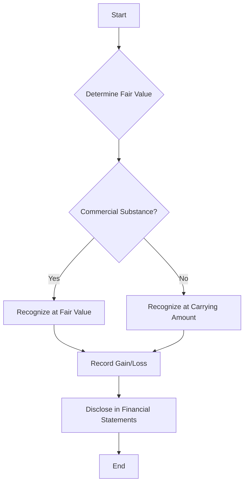

## 6.10 Nonmonetary Exchanges

Nonmonetary exchanges are transactions where assets are exchanged without the involvement of cash or cash equivalents. These exchanges are common in business operations and can include the trade of property, plant, and equipment (PP&E), intangible assets, or other non-cash assets. Understanding the accounting treatment of nonmonetary exchanges is crucial for accurately reflecting the financial position and performance of an entity. This section will delve into the principles, standards, and practical applications of nonmonetary exchanges, with a focus on Canadian accounting standards.

### Understanding Nonmonetary Exchanges

Nonmonetary exchanges occur when two parties exchange assets without monetary consideration. These transactions can be complex, as they require the determination of fair value and consideration of any commercial substance involved in the exchange. The primary accounting standards governing nonmonetary exchanges are the International Financial Reporting Standards (IFRS) and the Accounting Standards for Private Enterprises (ASPE) in Canada.

#### Key Concepts and Definitions

- **Fair Value:** The price that would be received to sell an asset or paid to transfer a liability in an orderly transaction between market participants at the measurement date.
- **Commercial Substance:** An exchange has commercial substance if the future cash flows of the entity are expected to change significantly as a result of the transaction.
- **Carrying Amount:** The amount at which an asset is recognized in the balance sheet after deducting any accumulated depreciation and impairment losses.

### Accounting Standards for Nonmonetary Exchanges

#### IFRS Guidelines

Under IFRS, nonmonetary exchanges are accounted for based on the fair value of the assets exchanged, provided the transaction has commercial substance. The key standard governing these exchanges is IAS 16, "Property, Plant and Equipment," which outlines the criteria for recognizing and measuring PP&E.

- **Recognition and Measurement:** If the exchange has commercial substance and the fair value of the assets can be reliably measured, the exchanged asset is recognized at its fair value. If the exchange lacks commercial substance or fair value cannot be reliably measured, the asset is recognized at the carrying amount of the asset given up.

- **Commercial Substance:** An exchange has commercial substance if the configuration of the cash flows of the asset received differs significantly from the configuration of the cash flows of the asset given up, or if the entity-specific value of the asset received differs from the entity-specific value of the asset given up.

#### ASPE Guidelines

Under ASPE, the guidance for nonmonetary exchanges is provided by Section 3831, "Non-Monetary Transactions." The principles are similar to IFRS, with some differences in application.

- **Measurement at Fair Value:** Nonmonetary transactions are measured at fair value unless the transaction lacks commercial substance, the fair value of neither the asset received nor the asset given up can be reliably measured, or the exchange is a non-reciprocal transfer to owners.

- **Commercial Substance Considerations:** Similar to IFRS, the exchange must have commercial substance for fair value measurement. However, ASPE provides more specific guidance on determining commercial substance, focusing on the significance of changes in cash flows.

### Practical Examples and Case Studies

#### Example 1: Exchange of Machinery

Company A exchanges a piece of machinery with Company B. The fair value of the machinery given up by Company A is $50,000, and the fair value of the machinery received is $52,000. The carrying amount of Company A's machinery is $45,000.

- **IFRS Treatment:** Since the exchange has commercial substance and fair values can be reliably measured, Company A recognizes the machinery received at $52,000 and records a gain of $7,000 ($52,000 - $45,000).

- **ASPE Treatment:** The treatment is similar under ASPE, provided the transaction has commercial substance. Company A recognizes the machinery at $52,000 and records a gain of $7,000.

#### Example 2: Exchange Lacking Commercial Substance

Company C exchanges a delivery truck with Company D. The fair value of the truck given up by Company C is $30,000, and the carrying amount is $28,000. The fair value of the truck received is $29,000, but the exchange lacks commercial substance.

- **IFRS Treatment:** Since the exchange lacks commercial substance, Company C recognizes the truck received at the carrying amount of the truck given up, $28,000, and no gain or loss is recorded.

- **ASPE Treatment:** The treatment is consistent with IFRS. The truck is recognized at $28,000, with no gain or loss recorded.

### Real-World Applications and Regulatory Scenarios

Nonmonetary exchanges are prevalent in industries where companies frequently trade assets, such as real estate, automotive, and technology sectors. Understanding the accounting treatment of these exchanges is essential for compliance with financial reporting standards and accurate financial analysis.

#### Regulatory Considerations

- **Disclosure Requirements:** Entities must disclose the nature and financial effects of nonmonetary exchanges in their financial statements. This includes the fair values of the assets exchanged and any gains or losses recognized.

- **Tax Implications:** Nonmonetary exchanges can have significant tax implications, as the recognition of gains or losses may affect taxable income. Companies must consider the tax treatment of these transactions under Canadian tax laws.

### Step-by-Step Guidance for Accounting Procedures

1. **Determine the Fair Value:** Assess the fair value of the assets involved in the exchange. This may require market research, appraisals, or the use of valuation models.

2. **Evaluate Commercial Substance:** Analyze whether the exchange has commercial substance by considering changes in cash flows or entity-specific values.

3. **Recognize the Asset:** If the exchange has commercial substance and fair values can be reliably measured, recognize the asset received at its fair value. Otherwise, use the carrying amount of the asset given up.

4. **Record Gains or Losses:** Calculate and record any gains or losses resulting from the exchange. This involves comparing the fair value of the asset received to the carrying amount of the asset given up.

5. **Disclose in Financial Statements:** Provide detailed disclosures in the financial statements, including the nature of the exchange, fair values, and any recognized gains or losses.

### Diagrams and Visual Aids

To enhance understanding, the following Mermaid.js diagram illustrates the decision-making process for accounting nonmonetary exchanges:

### Best Practices and Common Pitfalls

#### Best Practices

- **Accurate Valuation:** Ensure fair values are determined using reliable and consistent methods.
- **Comprehensive Analysis:** Thoroughly evaluate commercial substance to avoid misclassification.
- **Detailed Disclosures:** Provide clear and comprehensive disclosures to enhance transparency.

#### Common Pitfalls

- **Overlooking Commercial Substance:** Failing to assess commercial substance can lead to incorrect accounting treatment.
- **Inaccurate Fair Value Measurement:** Using unreliable valuation methods can result in misstated financial statements.
- **Inadequate Disclosures:** Insufficient disclosures may lead to regulatory scrutiny and reduced stakeholder confidence.

### References to Canadian Accounting Standards

- **IFRS:** Refer to IAS 16, "Property, Plant and Equipment," for guidance on nonmonetary exchanges.
- **ASPE:** Consult Section 3831, "Non-Monetary Transactions," for specific guidance under ASPE.
- **CPA Canada:** Utilize resources from CPA Canada for additional insights and examples.

### Summary and Key Takeaways

Nonmonetary exchanges are a critical aspect of accounting for PP&E and other non-cash assets. Understanding the principles of fair value measurement, commercial substance, and disclosure requirements is essential for accurate financial reporting. By following best practices and avoiding common pitfalls, accountants can ensure compliance with Canadian accounting standards and provide valuable insights into an entity's financial position.

### Practice Questions and Exercises

To reinforce your understanding of nonmonetary exchanges, consider the following practice questions and scenarios. These exercises will help you apply the concepts discussed and prepare for Canadian accounting exams.

## **Ready to Test Your Knowledge?**



### What is the primary accounting standard governing nonmonetary exchanges under IFRS?

- [x] IAS 16, "Property, Plant and Equipment"
- [ ] IFRS 9, "Financial Instruments"
- [ ] IAS 2, "Inventories"
- [ ] IFRS 15, "Revenue from Contracts with Customers"

> **Explanation:** IAS 16 provides guidance on the recognition and measurement of property, plant, and equipment, including nonmonetary exchanges.

### When does a nonmonetary exchange have commercial substance?

- [x] When the future cash flows of the entity are expected to change significantly
- [ ] When the fair value of the asset received is greater than the asset given up
- [ ] When the exchange involves cash consideration
- [ ] When the carrying amount of the asset given up is higher than its fair value

> **Explanation:** An exchange has commercial substance if it results in significant changes in the entity's future cash flows.

### How should an asset be recognized if a nonmonetary exchange lacks commercial substance under IFRS?

- [x] At the carrying amount of the asset given up
- [ ] At the fair value of the asset received
- [ ] At the fair value of the asset given up
- [ ] At the carrying amount of the asset received

> **Explanation:** If the exchange lacks commercial substance, the asset is recognized at the carrying amount of the asset given up.

### What is the key difference between IFRS and ASPE regarding nonmonetary exchanges?

- [x] ASPE provides more specific guidance on determining commercial substance
- [ ] IFRS requires all exchanges to be measured at fair value
- [ ] ASPE does not require disclosure of nonmonetary exchanges
- [ ] IFRS allows for more flexibility in fair value measurement

> **Explanation:** ASPE offers more detailed guidance on assessing commercial substance compared to IFRS.

### Which of the following is a common pitfall in accounting for nonmonetary exchanges?

- [x] Overlooking commercial substance
- [ ] Using consistent valuation methods
- [ ] Providing detailed disclosures
- [ ] Accurately measuring fair value

> **Explanation:** Failing to assess commercial substance can lead to incorrect accounting treatment.

### What should be disclosed in financial statements regarding nonmonetary exchanges?

- [x] The nature and financial effects of the exchanges
- [ ] Only the fair value of the assets received
- [ ] The carrying amount of the assets given up
- [ ] The tax implications of the exchanges

> **Explanation:** Entities must disclose the nature and financial effects, including fair values and any gains or losses.

### In a nonmonetary exchange, when is a gain or loss recognized?

- [x] When the fair value of the asset received differs from the carrying amount of the asset given up
- [ ] When the carrying amount of the asset received is higher than its fair value
- [ ] When the exchange lacks commercial substance
- [ ] When the fair value of the asset given up is equal to its carrying amount

> **Explanation:** A gain or loss is recognized when there is a difference between the fair value of the asset received and the carrying amount of the asset given up.

### What is the carrying amount of an asset?

- [x] The amount at which an asset is recognized in the balance sheet after deducting any accumulated depreciation and impairment losses
- [ ] The fair value of the asset at the measurement date
- [ ] The original cost of the asset
- [ ] The market value of the asset

> **Explanation:** The carrying amount is the recognized amount in the balance sheet, net of depreciation and impairment.

### How are nonmonetary exchanges typically treated for tax purposes in Canada?

- [x] They may affect taxable income due to recognized gains or losses
- [ ] They are always tax-neutral
- [ ] They have no impact on taxable income
- [ ] They are exempt from tax reporting

> **Explanation:** Nonmonetary exchanges can impact taxable income through recognized gains or losses.

### True or False: Under IFRS, all nonmonetary exchanges must be recognized at fair value.

- [ ] True
- [x] False

> **Explanation:** Nonmonetary exchanges are recognized at fair value only if they have commercial substance and fair values can be reliably measured.



By mastering the concepts and principles of nonmonetary exchanges, you will be well-prepared to tackle related questions on Canadian accounting exams and apply this knowledge in professional practice.
