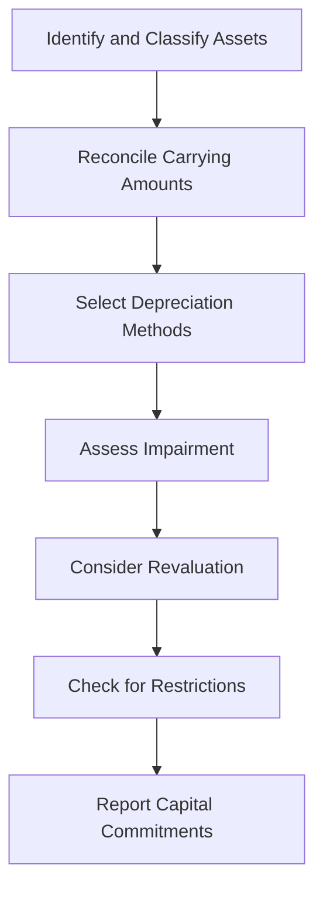

## 6.12 Disclosure Requirements for PP&E

In the realm of financial reporting, the disclosure of Property, Plant, and Equipment (PP&E) is a critical component that provides stakeholders with essential insights into a company's asset management and financial health. This section delves into the comprehensive disclosure requirements for PP&E, focusing on Canadian accounting standards, including International Financial Reporting Standards (IFRS) as adopted in Canada and Accounting Standards for Private Enterprises (ASPE). By understanding these requirements, you will be better equipped to prepare accurate and transparent financial statements, a crucial skill for success in Canadian accounting exams and professional practice.

### Understanding PP&E in Financial Reporting

PP&E represents tangible long-term assets that a company uses in its operations to generate revenue. These assets typically include land, buildings, machinery, vehicles, and equipment. The proper disclosure of PP&E in financial statements is vital for several reasons:

- **Transparency:** Provides stakeholders with a clear view of the company's investment in long-term assets.
- **Comparability:** Allows for the comparison of financial statements across different periods and with other companies.
- **Decision-Making:** Assists investors, creditors, and management in making informed decisions based on the company's asset utilization and financial position.

### Key Disclosure Requirements under IFRS and ASPE

#### 1. **Carrying Amount of Each Class of PP&E**

Under both IFRS and ASPE, companies must disclose the carrying amount of each class of PP&E. This includes the net book value after deducting accumulated depreciation and impairment losses. Common classes of PP&E include:

- Land
- Buildings
- Machinery and Equipment
- Vehicles
- Furniture and Fixtures

**Example:** A manufacturing company might disclose the carrying amounts as follows:

- Land: $2,000,000
- Buildings: $5,000,000
- Machinery and Equipment: $3,500,000
- Vehicles: $750,000
- Furniture and Fixtures: $250,000

#### 2. **Reconciliation of Carrying Amounts**

A reconciliation of the carrying amounts at the beginning and end of the period is required. This reconciliation should include:

- Additions
- Disposals
- Depreciation
- Impairment losses
- Reversals of impairment losses
- Revaluations

**Example:** Consider a company with the following reconciliation for machinery and equipment:

- Opening Balance: $3,000,000
- Additions: $600,000
- Disposals: ($100,000)
- Depreciation: ($400,000)
- Closing Balance: $3,100,000

#### 3. **Depreciation Methods and Useful Lives**

The financial statements must disclose the depreciation methods used for each class of PP&E and the useful lives or depreciation rates applied. This information helps users understand how the company allocates the cost of its assets over time.

**Example:** A company might use the straight-line method for buildings with a useful life of 25 years and the declining balance method for machinery with a rate of 20%.

#### 4. **Impairment Losses and Reversals**

Companies must disclose any impairment losses recognized or reversed during the period. This includes the events and circumstances leading to the impairment and the amount recognized or reversed.

**Example:** If a company recognizes an impairment loss of $200,000 on its machinery due to technological obsolescence, this should be disclosed along with the reasons for the impairment.

#### 5. **Revaluation Model**

If a company uses the revaluation model, it must disclose:

- The effective date of the revaluation
- Whether an independent valuer was involved
- The methods and significant assumptions applied in estimating the fair values
- The carrying amount of each class of revalued assets

**Example:** A real estate company might revalue its buildings every three years, engaging an independent valuer to determine fair values based on market conditions.

#### 6. **Restrictions on Title and Pledged Assets**

Disclosure of any restrictions on the title of PP&E and assets pledged as security for liabilities is required. This information is crucial for understanding the company's financial obligations and asset availability.

**Example:** A company might disclose that its manufacturing plant is pledged as collateral for a long-term loan.

#### 7. **Capital Commitments**

Companies must disclose any capital commitments related to PP&E, such as contracts for future asset purchases or construction projects. This provides insight into the company's future investment plans and financial obligations.

**Example:** A company might have a capital commitment of $500,000 for the construction of a new warehouse.

### Practical Examples and Case Studies

#### Case Study: XYZ Manufacturing Ltd.

XYZ Manufacturing Ltd. is a Canadian company that produces automotive parts. In its financial statements, XYZ discloses the following information about its PP&E:

- **Carrying Amounts:** The company reports a carrying amount of $10 million for its machinery and equipment.
- **Depreciation Method:** XYZ uses the straight-line method with a useful life of 10 years for its machinery.
- **Impairment Loss:** Due to a decline in market demand, XYZ recognizes an impairment loss of $500,000 on its machinery.
- **Capital Commitments:** The company has a capital commitment of $1 million for the purchase of new machinery.

#### Real-World Application: IFRS vs. ASPE

While IFRS and ASPE share many similarities in PP&E disclosure requirements, there are notable differences. For instance, IFRS allows for the revaluation model, whereas ASPE typically uses the cost model. Understanding these differences is crucial for Canadian accounting exams and professional practice.

### Step-by-Step Guidance for PP&E Disclosure

1. **Identify and Classify Assets:** Determine the classes of PP&E and their carrying amounts.
2. **Reconcile Carrying Amounts:** Prepare a reconciliation of the opening and closing balances, including additions, disposals, and depreciation.
3. **Select Depreciation Methods:** Choose appropriate depreciation methods and useful lives for each class of assets.
4. **Assess Impairment:** Evaluate assets for impairment and disclose any losses or reversals.
5. **Consider Revaluation:** If applicable, disclose revaluation details, including methods and assumptions.
6. **Check for Restrictions:** Identify any restrictions on title or pledged assets and disclose them.
7. **Report Capital Commitments:** Disclose any significant capital commitments related to PP&E.

### Diagrams and Visual Aids

To enhance understanding, consider the following diagram illustrating the PP&E disclosure process:

### Best Practices and Common Pitfalls

- **Best Practices:**
  - Ensure consistency in asset classification and depreciation methods.
  - Regularly review assets for impairment indicators.
  - Engage independent valuers for revaluations to enhance credibility.

- **Common Pitfalls:**
  - Failing to update useful lives or depreciation methods as asset conditions change.
  - Overlooking disclosure of pledged assets or capital commitments.
  - Inadequate documentation of impairment assessments and revaluations.

### References to Canadian Accounting Standards

- **IFRS:** Refer to IAS 16 Property, Plant, and Equipment for detailed disclosure requirements.
- **ASPE:** Consult Section 3061 Property, Plant, and Equipment for guidance on disclosure under ASPE.
- **CPA Canada:** Utilize CPA Canada's resources for additional insights and practice materials.

### Conclusion

Understanding and applying the disclosure requirements for PP&E is essential for accurate financial reporting and successful exam preparation. By mastering these concepts, you will enhance your ability to prepare transparent and compliant financial statements, a critical skill for any aspiring accountant in Canada.

## **Ready to Test Your Knowledge?**



### What is the primary purpose of disclosing the carrying amount of each class of PP&E?

- [x] To provide transparency and comparability in financial statements
- [ ] To determine the market value of assets
- [ ] To calculate tax liabilities
- [ ] To assess the company's liquidity

> **Explanation:** Disclosing the carrying amount of each class of PP&E provides stakeholders with transparency and comparability, allowing them to understand the company's investment in long-term assets.

### Which method of depreciation is commonly used for buildings?

- [x] Straight-line method
- [ ] Declining balance method
- [ ] Units of production method
- [ ] Sum-of-the-years'-digits method

> **Explanation:** The straight-line method is commonly used for buildings as it allocates the cost evenly over the useful life of the asset.

### What should a company disclose if it uses the revaluation model for PP&E?

- [x] The effective date of the revaluation
- [x] Whether an independent valuer was involved
- [ ] The original purchase price of the asset
- [ ] The depreciation method used

> **Explanation:** When using the revaluation model, companies must disclose the effective date of the revaluation and whether an independent valuer was involved, among other details.

### What is a capital commitment in the context of PP&E disclosure?

- [x] A contractual obligation to purchase or construct assets
- [ ] A pledge of assets as collateral
- [ ] An impairment loss on assets
- [ ] A method of depreciation

> **Explanation:** A capital commitment refers to a contractual obligation to purchase or construct assets, providing insight into the company's future investment plans.

### Which of the following is a common pitfall in PP&E disclosure?

- [x] Failing to update useful lives or depreciation methods
- [ ] Engaging independent valuers for revaluations
- [x] Overlooking disclosure of pledged assets
- [ ] Regularly reviewing assets for impairment

> **Explanation:** Common pitfalls include failing to update useful lives or depreciation methods and overlooking the disclosure of pledged assets.

### What is the significance of disclosing restrictions on the title of PP&E?

- [x] It informs stakeholders about the availability of assets for use or sale
- [ ] It determines the depreciation method to be used
- [ ] It affects the calculation of carrying amounts
- [ ] It impacts the company's tax liabilities

> **Explanation:** Disclosing restrictions on the title of PP&E informs stakeholders about the availability of assets for use or sale, which is crucial for assessing the company's financial obligations.

### How does the disclosure of impairment losses enhance financial reporting?

- [x] It provides insight into the company's asset management and financial health
- [ ] It reduces the company's tax liabilities
- [ ] It increases the carrying amount of assets
- [ ] It eliminates the need for depreciation

> **Explanation:** Disclosing impairment losses provides insight into the company's asset management and financial health, enhancing transparency and decision-making.

### What is the role of CPA Canada in PP&E disclosure?

- [x] To provide resources and guidance for accurate financial reporting
- [ ] To set tax rates for asset depreciation
- [ ] To conduct asset valuations for companies
- [ ] To determine the useful lives of assets

> **Explanation:** CPA Canada provides resources and guidance for accurate financial reporting, helping accountants understand and apply disclosure requirements.

### Why is it important to engage independent valuers for revaluations?

- [x] To enhance the credibility and accuracy of asset valuations
- [ ] To reduce the cost of asset management
- [ ] To simplify the depreciation process
- [ ] To eliminate the need for impairment assessments

> **Explanation:** Engaging independent valuers enhances the credibility and accuracy of asset valuations, ensuring that revaluations reflect fair market conditions.

### True or False: ASPE allows companies to use the revaluation model for PP&E.

- [ ] True
- [x] False

> **Explanation:** ASPE typically uses the cost model and does not allow for the revaluation model, unlike IFRS which permits revaluation of PP&E.


