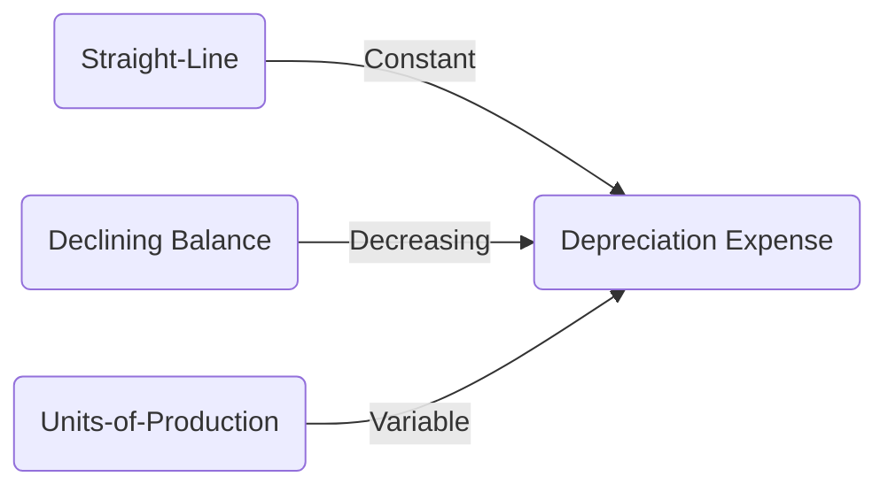

## 6.3 Depreciation Methods and Calculations

Depreciation is a fundamental concept in accounting, particularly when dealing with Property, Plant, and Equipment (PP&E). It represents the allocation of the cost of tangible assets over their useful lives. Understanding depreciation is crucial for accurately reflecting the value of assets on the balance sheet and determining the expense on the income statement. This section delves into the various methods of depreciation, their calculations, and their implications under Canadian accounting standards.

### Understanding Depreciation

Depreciation is not about valuing an asset but rather about allocating its cost over time. This allocation reflects the consumption of the asset's economic benefits. Depreciation affects both the balance sheet and the income statement, impacting financial ratios and tax calculations.

#### Key Concepts in Depreciation

- **Useful Life:** The period over which an asset is expected to be usable for its intended purpose.
- **Residual Value (Salvage Value):** The estimated amount that an entity would currently obtain from the disposal of the asset, after deducting the estimated costs of disposal.
- **Depreciable Amount:** The cost of an asset, or other amount substituted for cost, less its residual value.

### Depreciation Methods

Several methods exist for calculating depreciation, each with its own set of assumptions and implications. The choice of method can affect financial reporting and tax obligations.

#### 1. Straight-Line Depreciation

The straight-line method is the most straightforward and commonly used depreciation method. It allocates an equal amount of depreciation each year over the asset's useful life.

**Formula:**

 \text{Annual Depreciation Expense} = \frac{\text{Cost of Asset} - \text{Residual Value}}{\text{Useful Life}} 

**Example:**

Consider a machine purchased for $100,000 with a residual value of $10,000 and a useful life of 9 years. The annual depreciation expense would be:

 \frac{100,000 - 10,000}{9} = 10,000 

**Advantages:**

- Simplicity and ease of calculation.
- Consistent expense recognition.

**Disadvantages:**

- Does not account for the actual usage or wear and tear of the asset.

#### 2. Declining Balance Method

The declining balance method accelerates depreciation, recognizing more expense in the earlier years of an asset's life. This method is suitable for assets that lose value quickly.

**Formula:**

 \text{Depreciation Expense} = \text{Book Value at Beginning of Year} \times \text{Depreciation Rate} 

The depreciation rate is often double the straight-line rate, hence the name "double declining balance."

**Example:**

For the same machine, if the depreciation rate is 20%, the first year's depreciation would be:

 100,000 \times 0.20 = 20,000 

**Advantages:**

- Matches higher expense with higher revenue in early years.
- Reflects the rapid decline in asset value.

**Disadvantages:**

- More complex calculations.
- May not be suitable for all asset types.

#### 3. Units-of-Production Method

This method ties depreciation to the actual usage of the asset, making it ideal for machinery and equipment.

**Formula:**

 \text{Depreciation Expense} = \frac{\text{(Cost - Residual Value)} \times \text{Units Produced in Period}}{\text{Total Estimated Units}} 

**Example:**

If the machine is expected to produce 90,000 units over its life, and it produces 10,000 units in the first year, the depreciation would be:

 \frac{(100,000 - 10,000) \times 10,000}{90,000} = 10,000 

**Advantages:**

- Aligns expense with actual usage.
- Provides a more accurate reflection of asset consumption.

**Disadvantages:**

- Requires estimation of total production capacity.
- Can lead to fluctuating expenses.

### Regulatory Considerations in Canada

In Canada, the choice of depreciation method can be influenced by the accounting framework in use, such as IFRS or ASPE. Both frameworks allow for flexibility in choosing a method that best reflects the pattern of economic benefits.

#### IFRS Considerations

Under IFRS, depreciation methods should reflect the pattern in which the asset's future economic benefits are expected to be consumed. Changes in the method are permissible if they provide a more accurate reflection of this pattern.

#### ASPE Considerations

ASPE also allows for various depreciation methods, emphasizing consistency and the reflection of asset use. Changes in methods require justification and disclosure.

### Practical Examples and Scenarios

#### Case Study: Depreciation in Manufacturing

A manufacturing company purchases a piece of equipment for $500,000 with an expected residual value of $50,000 and a useful life of 10 years. The company expects to produce 100,000 units with this equipment.

- **Straight-Line:** Annual depreciation is $45,000.
- **Declining Balance (20%):** First-year depreciation is $100,000.
- **Units-of-Production:** If 10,000 units are produced in the first year, depreciation is $45,000.

Each method provides a different perspective on asset consumption, affecting financial statements and tax calculations.

#### Real-World Application: Tax Implications

In Canada, tax regulations may prescribe specific depreciation methods, such as the Capital Cost Allowance (CCA) system, which often uses a declining balance approach. Understanding these regulations is crucial for compliance and tax planning.

### Best Practices and Common Pitfalls

- **Consistency:** Once a method is chosen, it should be applied consistently to similar asset classes.
- **Review and Adjust:** Regularly review the useful life and residual value estimates to ensure they remain relevant.
- **Disclosure:** Clearly disclose the depreciation methods and assumptions used in financial statements.

### Visualizing Depreciation Methods

Below is a simple diagram illustrating the depreciation expense over time for different methods:

### Exam Preparation Tips

- **Understand the Formulas:** Memorize and practice the formulas for each method.
- **Practice Problems:** Work through various scenarios to understand the impact of each method.
- **Regulatory Knowledge:** Familiarize yourself with Canadian accounting standards and tax regulations related to depreciation.

### Summary

Depreciation is a critical concept in accounting, affecting financial statements and tax obligations. By understanding the different methods and their implications, you can make informed decisions that align with business objectives and regulatory requirements.

## **Ready to Test Your Knowledge?**



### Which depreciation method allocates an equal amount of depreciation each year?

- [x] Straight-Line Method
- [ ] Declining Balance Method
- [ ] Units-of-Production Method
- [ ] Sum-of-the-Years'-Digits Method

> **Explanation:** The straight-line method allocates an equal amount of depreciation each year over the asset's useful life.

### What is the main advantage of the declining balance method?

- [x] It matches higher expenses with higher revenues in early years.
- [ ] It is the simplest method to calculate.
- [ ] It results in the lowest depreciation expense.
- [ ] It is required by Canadian tax regulations.

> **Explanation:** The declining balance method accelerates depreciation, recognizing more expense in the earlier years of an asset's life, which matches higher expenses with higher revenues.

### How is the depreciation expense calculated in the units-of-production method?

- [x] By multiplying the depreciable amount by the units produced in the period and dividing by total estimated units.
- [ ] By dividing the cost of the asset by its useful life.
- [ ] By applying a fixed percentage to the book value at the beginning of the year.
- [ ] By subtracting the residual value from the cost and dividing by the useful life.

> **Explanation:** The units-of-production method calculates depreciation based on actual usage, using the formula: \((\text{Cost - Residual Value}) \times \text{Units Produced in Period} / \text{Total Estimated Units}\).

### Which method is most suitable for assets that lose value quickly?

- [x] Declining Balance Method
- [ ] Straight-Line Method
- [ ] Units-of-Production Method
- [ ] Sum-of-the-Years'-Digits Method

> **Explanation:** The declining balance method is suitable for assets that lose value quickly as it accelerates depreciation.

### What is the impact of choosing different depreciation methods on financial statements?

- [x] It affects both the balance sheet and the income statement.
- [ ] It only affects the balance sheet.
- [ ] It only affects the income statement.
- [ ] It has no impact on financial statements.

> **Explanation:** Depreciation affects both the balance sheet (through accumulated depreciation) and the income statement (through depreciation expense).

### Under IFRS, how should depreciation methods be chosen?

- [x] They should reflect the pattern in which the asset's future economic benefits are expected to be consumed.
- [ ] They should be the same for all assets within a company.
- [ ] They should be based on the method that results in the lowest tax liability.
- [ ] They should be changed annually to reflect market conditions.

> **Explanation:** Under IFRS, depreciation methods should reflect the pattern in which the asset's future economic benefits are expected to be consumed.

### What is a common pitfall when applying depreciation methods?

- [x] Failing to regularly review useful life and residual value estimates.
- [ ] Using the straight-line method for all assets.
- [ ] Applying different methods to similar asset classes.
- [ ] Not disclosing the method used in financial statements.

> **Explanation:** A common pitfall is failing to regularly review useful life and residual value estimates to ensure they remain relevant.

### In Canada, what system is often used for tax depreciation?

- [x] Capital Cost Allowance (CCA)
- [ ] Straight-Line Depreciation
- [ ] Units-of-Production Method
- [ ] Sum-of-the-Years'-Digits Method

> **Explanation:** In Canada, the Capital Cost Allowance (CCA) system is often used for tax depreciation, which typically uses a declining balance approach.

### Which depreciation method ties expense to actual usage?

- [x] Units-of-Production Method
- [ ] Straight-Line Method
- [ ] Declining Balance Method
- [ ] Sum-of-the-Years'-Digits Method

> **Explanation:** The units-of-production method ties depreciation expense to actual usage, making it ideal for machinery and equipment.

### True or False: The choice of depreciation method can affect tax obligations.

- [x] True
- [ ] False

> **Explanation:** True. The choice of depreciation method can affect tax obligations, as different methods may result in different tax liabilities.


