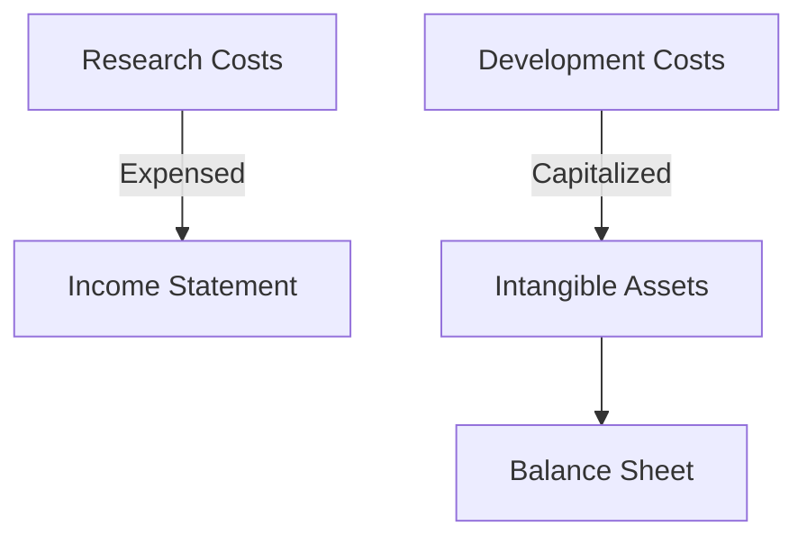

## 7.1 Identification and Recognition of Intangible Assets

In the realm of accounting, intangible assets represent a critical component of a company's financial statements. Unlike tangible assets, intangible assets do not have a physical presence but hold significant value due to their ability to generate future economic benefits. This section will delve into the identification and recognition of intangible assets, providing you with the necessary knowledge to excel in your Canadian accounting exams and professional practice.

### Understanding Intangible Assets

**Intangible Assets Defined:**

Intangible assets are non-physical assets that provide economic benefits to an entity over a period of time. They include items such as patents, trademarks, copyrights, franchises, and goodwill. These assets are crucial for businesses as they often represent a substantial portion of a company's value, especially in industries driven by intellectual property and brand recognition.

**Characteristics of Intangible Assets:**

1. **Identifiability:** Intangible assets must be identifiable, meaning they can be separated from the entity and sold, transferred, licensed, rented, or exchanged.
2. **Non-physical Nature:** Unlike tangible assets, intangible assets do not have a physical form.
3. **Future Economic Benefits:** Intangible assets are expected to generate future economic benefits, such as revenue or cost savings.
4. **Control:** The entity must have control over the asset, allowing it to obtain the benefits and restrict others from accessing them.

### Criteria for Recognition of Intangible Assets

The recognition of intangible assets on the balance sheet is governed by specific criteria outlined in accounting standards such as the International Financial Reporting Standards (IFRS) and Accounting Standards for Private Enterprises (ASPE) in Canada.

**Recognition Criteria:**

1. **Probable Future Economic Benefits:** It must be probable that the expected future economic benefits attributable to the asset will flow to the entity.
2. **Reliable Measurement of Cost:** The cost of the asset can be measured reliably.

**IFRS vs. ASPE:**

- **IFRS (IAS 38):** Under IFRS, intangible assets are recognized if it is probable that future economic benefits will flow to the entity and the cost of the asset can be measured reliably. Internally generated goodwill is not recognized as an intangible asset.
- **ASPE (Section 3064):** Similar to IFRS, ASPE requires that intangible assets be recognized if they meet the criteria of identifiability, control, and future economic benefits. However, ASPE provides more specific guidance on certain types of intangible assets, such as research and development costs.

### Types of Intangible Assets

**1. Patents:**

Patents provide exclusive rights to an invention or process for a specified period, typically 20 years. They are recognized as intangible assets when acquired or developed internally, provided they meet the recognition criteria.

**2. Trademarks:**

Trademarks are recognizable signs, designs, or expressions that distinguish products or services. They are recognized when acquired or developed, with costs including registration and legal fees.

**3. Copyrights:**

Copyrights grant exclusive rights to creators of original works, such as literature, music, and software. They are recognized when acquired or developed, with costs including registration and legal fees.

**4. Franchises:**

Franchises are agreements that allow a franchisee to operate a business using the franchisor's brand and business model. Franchise fees paid are recognized as intangible assets.

**5. Goodwill:**

Goodwill arises when a company acquires another entity for more than the fair value of its net identifiable assets. It is recognized only in business combinations and is not amortized but tested for impairment annually.

### Recognition of Internally Generated Intangible Assets

Internally generated intangible assets pose unique challenges in accounting due to the difficulty in measuring their cost and future economic benefits. The recognition of these assets is subject to stringent criteria.

**Research and Development Costs:**

- **Research Costs:** Generally expensed as incurred, as the future economic benefits are uncertain.
- **Development Costs:** Capitalized as intangible assets if they meet specific criteria, including technical feasibility, intention to complete, ability to use or sell, and reliable measurement of costs.

**Mermaid Diagram:**

### Practical Examples and Case Studies

**Example 1: Patent Acquisition**

A company acquires a patent for $100,000, which is expected to generate future economic benefits. The cost is reliably measurable, and the patent is recognized as an intangible asset on the balance sheet.

**Example 2: Trademark Development**

A company develops a trademark internally, incurring $50,000 in registration and legal fees. The trademark is recognized as an intangible asset if it meets the recognition criteria.

**Case Study: Goodwill Recognition**

Company A acquires Company B for $1 million. The fair value of Company B's net identifiable assets is $800,000. The excess $200,000 is recognized as goodwill on Company A's balance sheet.

### Challenges in Recognizing Intangible Assets

**1. Measurement Uncertainty:**

The cost of internally generated intangible assets can be difficult to measure, leading to challenges in recognition.

**2. Impairment Testing:**

Intangible assets with indefinite useful lives, such as goodwill, require annual impairment testing, which can be complex and subjective.

**3. Regulatory Compliance:**

Companies must adhere to accounting standards and regulations, which can vary between jurisdictions, adding complexity to the recognition process.

### Best Practices for Recognizing Intangible Assets

1. **Thorough Documentation:** Maintain detailed records of costs incurred in developing or acquiring intangible assets.
2. **Regular Impairment Testing:** Conduct annual impairment tests for intangible assets with indefinite useful lives to ensure accurate valuation.
3. **Compliance with Standards:** Stay updated on changes in accounting standards and ensure compliance with IFRS or ASPE as applicable.

### Exam Tips and Strategies

- **Understand Recognition Criteria:** Familiarize yourself with the criteria for recognizing intangible assets under IFRS and ASPE.
- **Practice with Examples:** Work through practical examples and case studies to reinforce your understanding.
- **Focus on Key Assets:** Pay attention to commonly tested intangible assets such as patents, trademarks, and goodwill.

### Summary

Intangible assets play a crucial role in financial reporting, representing significant value for many companies. Understanding the identification and recognition criteria for these assets is essential for accounting professionals and students preparing for Canadian accounting exams. By mastering the concepts outlined in this section, you will be well-equipped to handle questions related to intangible assets on your exams and in your professional career.

## **Ready to Test Your Knowledge?**



### Which of the following is a characteristic of intangible assets?

- [x] Non-physical nature
- [ ] Tangible form
- [ ] Short-term benefit
- [ ] Easily replaceable

> **Explanation:** Intangible assets are characterized by their non-physical nature, meaning they do not have a tangible form like physical assets.

### What is the primary criterion for recognizing an intangible asset on the balance sheet?

- [x] Probable future economic benefits
- [ ] High market value
- [ ] Short useful life
- [ ] Easily transferable

> **Explanation:** The primary criterion for recognizing an intangible asset is the probability of future economic benefits flowing to the entity.

### Under IFRS, which of the following is not recognized as an intangible asset?

- [x] Internally generated goodwill
- [ ] Acquired patent
- [ ] Purchased trademark
- [ ] Developed software

> **Explanation:** Internally generated goodwill is not recognized as an intangible asset under IFRS, whereas acquired patents, purchased trademarks, and developed software can be recognized if they meet the criteria.

### Which accounting standard governs the recognition of intangible assets under IFRS?

- [x] IAS 38
- [ ] IAS 16
- [ ] IFRS 9
- [ ] IFRS 15

> **Explanation:** IAS 38 governs the recognition and measurement of intangible assets under IFRS.

### What is the treatment of research costs under IFRS?

- [x] Expensed as incurred
- [ ] Capitalized as an asset
- [ ] Deferred until completion
- [ ] Amortized over useful life

> **Explanation:** Research costs are expensed as incurred under IFRS because the future economic benefits are uncertain.

### Which of the following is an example of an intangible asset?

- [x] Trademark
- [ ] Inventory
- [ ] Equipment
- [ ] Land

> **Explanation:** A trademark is an example of an intangible asset, as it is a non-physical asset that provides economic benefits.

### How is goodwill recognized in financial statements?

- [x] Only in business combinations
- [ ] As a result of internal development
- [ ] Through regular operations
- [ ] As a separate line item in income statement

> **Explanation:** Goodwill is recognized only in business combinations when the purchase price exceeds the fair value of net identifiable assets.

### What is the purpose of impairment testing for intangible assets?

- [x] To ensure accurate valuation
- [ ] To increase asset value
- [ ] To defer expenses
- [ ] To eliminate liabilities

> **Explanation:** Impairment testing ensures that intangible assets are accurately valued and not carried at amounts exceeding their recoverable amounts.

### Which of the following costs can be capitalized as development costs?

- [x] Costs incurred after technical feasibility is established
- [ ] Initial research costs
- [ ] Marketing expenses
- [ ] General administrative costs

> **Explanation:** Development costs can be capitalized once technical feasibility is established and other criteria are met.

### True or False: Trademarks can be recognized as intangible assets if developed internally.

- [x] True
- [ ] False

> **Explanation:** Trademarks can be recognized as intangible assets if developed internally and they meet the recognition criteria.


