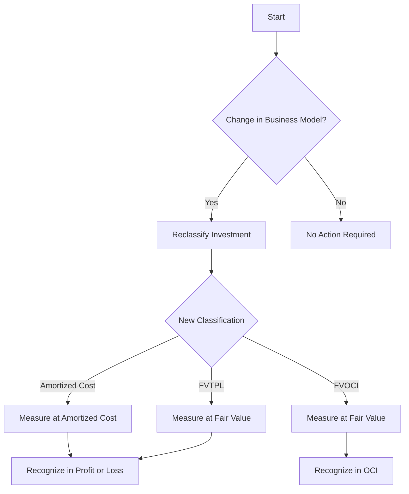

## 8.10 Transfer and Reclassification of Investments

In the realm of intermediate accounting, understanding the transfer and reclassification of investments is crucial for accurate financial reporting and compliance with accounting standards. This section delves into the complexities of transferring and reclassifying investments, focusing on the implications under International Financial Reporting Standards (IFRS) as adopted in Canada, and Accounting Standards for Private Enterprises (ASPE).

### Understanding Investment Categories

Before exploring the transfer and reclassification processes, it's essential to understand the primary categories of investments:

1. **Held-to-Maturity (HTM) Investments**: Debt securities that a company has the positive intent and ability to hold until maturity.
2. **Trading Securities**: Investments bought and held primarily for sale in the near term to generate income on short-term price differences.
3. **Available-for-Sale (AFS) Securities**: Investments not classified as trading or held-to-maturity. These can be equity or debt securities.

Each category has distinct accounting treatments, particularly concerning valuation and income recognition, which are crucial when considering transfers and reclassifications.

### Regulatory Framework and Standards

#### International Financial Reporting Standards (IFRS)

Under IFRS, particularly IFRS 9 - Financial Instruments, the classification and measurement of financial assets are based on the business model for managing the financial assets and the contractual cash flow characteristics of the financial asset. IFRS 9 requires entities to classify financial assets into three categories:

- **Amortized Cost**
- **Fair Value Through Other Comprehensive Income (FVOCI)**
- **Fair Value Through Profit or Loss (FVTPL)**

#### Accounting Standards for Private Enterprises (ASPE)

ASPE provides a different framework, focusing on cost or amortized cost and fair value. The choice between these depends on the nature of the investment and the enterprise's intent.

### Transfer and Reclassification: Key Concepts

#### Transfer Between Categories

Transfers between investment categories can occur due to changes in management's intent or changes in circumstances. For instance, a company might decide to hold a trading security to maturity, necessitating a reclassification.

#### Reclassification Criteria

1. **Change in Business Model**: A significant change in the business model for managing financial assets can trigger reclassification under IFRS 9.
2. **Change in Management Intent**: Under ASPE, a change in management's intent regarding the holding period of an investment can lead to reclassification.

### Accounting Implications of Transfers

#### IFRS Guidelines

Under IFRS 9, reclassification is only permitted if there is a change in the business model for managing financial assets. The reclassification is applied prospectively from the reclassification date, and previously recognized gains, losses, or interest are not restated.

- **From Amortized Cost to FVOCI/FVTPL**: The asset is remeasured at fair value, with any difference recognized in profit or loss or other comprehensive income, depending on the new classification.
- **From FVOCI to Amortized Cost/FVTPL**: The fair value at the reclassification date becomes the new carrying amount.
- **From FVTPL to Amortized Cost/FVOCI**: The fair value at the reclassification date becomes the new carrying amount, with any gain or loss recognized in profit or loss.

#### ASPE Guidelines

Under ASPE, reclassification is more flexible, allowing for changes based on management's intent. The accounting treatment varies depending on the direction of the transfer:

- **From Cost to Fair Value**: The investment is remeasured at fair value, with any difference recognized in net income.
- **From Fair Value to Cost**: The fair value at the reclassification date becomes the new cost basis.

### Practical Examples and Case Studies

#### Example 1: Reclassification Under IFRS

A Canadian company initially classifies a bond investment as amortized cost. Due to a strategic shift, the company decides to manage the bond as part of a portfolio measured at fair value through other comprehensive income (FVOCI). The bond is reclassified, and the fair value adjustment is recognized in other comprehensive income.

#### Example 2: Reclassification Under ASPE

A private enterprise holds equity investments initially classified at cost. Due to a change in management's intent to sell these investments in the near term, they are reclassified to fair value. The difference between the carrying amount and fair value is recognized in net income.

### Real-World Applications and Challenges

#### Compliance Considerations

- **Documentation**: Adequate documentation of the rationale for reclassification is crucial for compliance and audit purposes.
- **Disclosure Requirements**: Both IFRS and ASPE require detailed disclosures about reclassification, including the reasons for the change and its impact on financial statements.

#### Common Challenges

- **Judgment and Estimates**: Determining the appropriate category and timing for reclassification often involves significant judgment and estimates.
- **Market Volatility**: Fluctuations in market conditions can complicate the assessment of fair value and the decision to reclassify.

### Best Practices and Strategies

1. **Regular Review of Investment Portfolios**: Periodically review investment portfolios to ensure alignment with the business model and management's intent.
2. **Robust Internal Controls**: Implement strong internal controls to monitor changes in intent and market conditions that may trigger reclassification.
3. **Comprehensive Training**: Provide ongoing training for accounting and finance teams on the latest standards and reclassification procedures.

### Diagrams and Visual Aids

To better understand the reclassification process, consider the following flowchart illustrating the decision-making process for reclassifying investments under IFRS:

### Summary

Understanding the transfer and reclassification of investments is essential for accurate financial reporting and compliance with accounting standards. By mastering these concepts, you can ensure that your financial statements reflect the true economic substance of your investment activities.

### References and Further Reading

- **IFRS 9 - Financial Instruments**: Detailed guidance on the classification and measurement of financial assets.
- **CPA Canada**: Resources and updates on Canadian accounting standards.
- **ASPE Guidelines**: Comprehensive overview of accounting standards for private enterprises.

## **Ready to Test Your Knowledge?**



### What is the primary reason for reclassifying investments under IFRS?

- [x] Change in the business model for managing financial assets
- [ ] Change in market conditions
- [ ] Change in management personnel
- [ ] Change in accounting software

> **Explanation:** Under IFRS 9, reclassification is only permitted if there is a change in the business model for managing financial assets.

### When reclassifying from amortized cost to FVOCI under IFRS, where is the fair value adjustment recognized?

- [ ] In net income
- [x] In other comprehensive income
- [ ] In retained earnings
- [ ] In cash flow statement

> **Explanation:** When reclassifying to FVOCI, the fair value adjustment is recognized in other comprehensive income.

### Under ASPE, what triggers a reclassification of investments?

- [ ] Change in market conditions
- [x] Change in management's intent
- [ ] Change in accounting policy
- [ ] Change in regulatory requirements

> **Explanation:** Under ASPE, reclassification is based on a change in management's intent regarding the holding period of an investment.

### What is the impact of reclassifying from FVTPL to amortized cost under IFRS?

- [x] The fair value at the reclassification date becomes the new carrying amount
- [ ] The investment is written off
- [ ] The investment is sold
- [ ] The investment is revalued at cost

> **Explanation:** The fair value at the reclassification date becomes the new carrying amount when reclassifying from FVTPL to amortized cost.

### Which of the following is a common challenge in reclassifying investments?

- [x] Judgment and estimates
- [ ] Lack of investment options
- [ ] High transaction costs
- [ ] Limited market access

> **Explanation:** Determining the appropriate category and timing for reclassification often involves significant judgment and estimates.

### What documentation is crucial for compliance when reclassifying investments?

- [ ] Tax returns
- [ ] Marketing materials
- [x] Rationale for reclassification
- [ ] Employee contracts

> **Explanation:** Adequate documentation of the rationale for reclassification is crucial for compliance and audit purposes.

### How often should investment portfolios be reviewed for potential reclassification?

- [ ] Annually
- [ ] Bi-annually
- [x] Periodically
- [ ] Never

> **Explanation:** Periodically reviewing investment portfolios ensures alignment with the business model and management's intent.

### What is the primary focus of ASPE when reclassifying investments?

- [ ] Market conditions
- [x] Management's intent
- [ ] Regulatory changes
- [ ] Economic forecasts

> **Explanation:** ASPE focuses on management's intent regarding the holding period of an investment for reclassification.

### In the context of investment reclassification, what does FVOCI stand for?

- [ ] Fair Value Through Operating Income
- [ ] Fair Value Through Other Income
- [x] Fair Value Through Other Comprehensive Income
- [ ] Fair Value Through Original Cost

> **Explanation:** FVOCI stands for Fair Value Through Other Comprehensive Income, a category under IFRS 9.

### True or False: Under IFRS, previously recognized gains or losses are restated during reclassification.

- [ ] True
- [x] False

> **Explanation:** Under IFRS, previously recognized gains or losses are not restated during reclassification.


