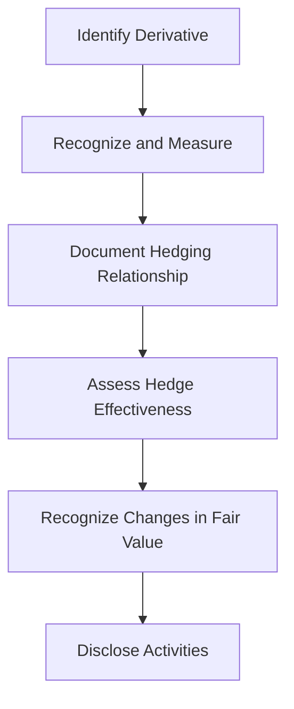

## 8.9 Derivatives and Hedging Activities

Derivatives and hedging activities are crucial components of modern financial management and accounting. They play a significant role in risk management, allowing companies to mitigate potential losses due to fluctuations in interest rates, foreign exchange rates, and commodity prices. This section provides an in-depth exploration of derivatives and hedging activities, focusing on Canadian accounting standards and practices.

### Understanding Derivatives

Derivatives are financial instruments whose value is derived from the value of an underlying asset, index, or rate. Common types of derivatives include forwards, futures, options, and swaps. These instruments are used for various purposes, including hedging, speculation, and arbitrage.

#### Types of Derivatives

1. **Forwards and Futures**: Contracts that obligate the buyer to purchase, and the seller to sell, an asset at a predetermined future date and price. While forwards are customized contracts traded over-the-counter (OTC), futures are standardized and traded on exchanges.

2. **Options**: Contracts that give the holder the right, but not the obligation, to buy or sell an asset at a specified price before a certain date. Options can be call options (right to buy) or put options (right to sell).

3. **Swaps**: Contracts in which two parties exchange cash flows or other financial instruments. Common types include interest rate swaps and currency swaps.

#### Accounting for Derivatives

Accounting for derivatives involves recognizing and measuring these instruments on the balance sheet and recognizing changes in their fair value in the income statement. The International Financial Reporting Standards (IFRS) and the Accounting Standards for Private Enterprises (ASPE) in Canada provide guidance on the accounting treatment of derivatives.

**Key Accounting Standards:**

- **IFRS 9: Financial Instruments**: This standard outlines the requirements for recognizing and measuring financial assets and liabilities, including derivatives. It emphasizes the use of fair value measurement and provides guidance on hedge accounting.

- **ASPE Section 3856: Financial Instruments**: This section provides guidance for private enterprises in Canada on accounting for financial instruments, including derivatives.

### Hedging Activities

Hedging involves using derivatives to offset potential losses in other investments. Companies engage in hedging to protect themselves against adverse price movements in interest rates, foreign exchange rates, and commodity prices.

#### Types of Hedges

1. **Fair Value Hedge**: A hedge of the exposure to changes in the fair value of a recognized asset or liability or an unrecognized firm commitment. The gain or loss on the hedging instrument is recognized in profit or loss.

2. **Cash Flow Hedge**: A hedge of the exposure to variability in cash flows that is attributable to a particular risk associated with a recognized asset or liability or a highly probable forecast transaction. The effective portion of the gain or loss on the hedging instrument is recognized in other comprehensive income.

3. **Net Investment Hedge**: A hedge of the foreign currency exposure of a net investment in a foreign operation. The effective portion of the gain or loss on the hedging instrument is recognized in other comprehensive income.

#### Hedge Accounting

Hedge accounting aligns the accounting treatment of the hedging instrument and the hedged item, reducing volatility in the income statement. To qualify for hedge accounting, a hedging relationship must meet specific criteria:

- **Hedging Relationship Documentation**: At the inception of the hedge, the entity must formally designate and document the hedging relationship, including the risk management objective and strategy.

- **Effectiveness Assessment**: The hedge must be expected to be highly effective in achieving offsetting changes in fair value or cash flows attributable to the hedged risk.

- **Ongoing Effectiveness Testing**: The effectiveness of the hedge must be assessed on an ongoing basis.

### Practical Examples and Case Studies

**Example 1: Interest Rate Swap**

A Canadian company with a variable-rate loan enters into an interest rate swap to exchange its variable interest payments for fixed payments. This swap is designated as a cash flow hedge. The company documents the hedging relationship and assesses its effectiveness. Changes in the fair value of the swap are recognized in other comprehensive income, offsetting the variability in interest payments.

**Example 2: Foreign Currency Forward Contract**

A Canadian exporter enters into a forward contract to sell US dollars in six months to hedge against foreign exchange risk. The forward contract is designated as a fair value hedge of a firm commitment. The company recognizes changes in the fair value of the forward contract in profit or loss, offsetting changes in the fair value of the firm commitment.

### Real-World Applications and Regulatory Scenarios

In Canada, companies must comply with IFRS or ASPE when accounting for derivatives and hedging activities. The use of derivatives is subject to regulatory oversight to ensure transparency and mitigate systemic risk. Companies must disclose their derivative positions, risk management strategies, and the impact of hedging activities on financial statements.

**Regulatory Bodies:**

- **CPA Canada**: Provides guidance and resources for accounting professionals on the application of accounting standards.

- **Canadian Securities Administrators (CSA)**: Oversees securities regulation in Canada, including disclosure requirements for derivatives.

### Step-by-Step Guidance for Accounting Procedures

1. **Identify the Derivative Instrument**: Determine the type of derivative and its purpose (e.g., hedging, speculation).

2. **Recognize and Measure the Derivative**: Record the derivative at fair value on the balance sheet.

3. **Document the Hedging Relationship**: If applicable, document the hedging relationship, risk management objective, and strategy.

4. **Assess Hedge Effectiveness**: Perform initial and ongoing effectiveness testing to ensure the hedge meets the criteria for hedge accounting.

5. **Recognize Changes in Fair Value**: Depending on the type of hedge, recognize changes in fair value in profit or loss or other comprehensive income.

6. **Disclose Derivative and Hedging Activities**: Provide disclosures in the financial statements, including the nature and extent of derivative activities and their impact on financial performance.

### Diagrams and Visuals

### Best Practices, Common Pitfalls, and Strategies

**Best Practices:**

- Maintain comprehensive documentation of hedging relationships and risk management strategies.
- Regularly assess the effectiveness of hedges and adjust strategies as needed.
- Stay informed about changes in accounting standards and regulatory requirements.

**Common Pitfalls:**

- Failing to adequately document hedging relationships, leading to disqualification from hedge accounting.
- Inaccurate measurement of derivatives, resulting in financial statement misstatements.
- Overlooking the impact of derivatives on liquidity and financial ratios.

**Strategies:**

- Implement robust internal controls to monitor derivative activities and ensure compliance with accounting standards.
- Use technology to streamline derivative accounting and reporting processes.
- Engage in continuous professional development to stay current with industry trends and best practices.

### References and Additional Resources

- **IFRS 9: Financial Instruments**: Provides comprehensive guidance on accounting for financial instruments, including derivatives.
- **CPA Canada**: Offers resources and guidance on accounting standards and professional development.
- **Canadian Securities Administrators (CSA)**: Oversees securities regulation and provides disclosure requirements for derivatives.

### Summary

Derivatives and hedging activities are essential tools for managing financial risk. Understanding the accounting treatment of these instruments is crucial for preparing accurate financial statements and making informed business decisions. By following best practices and staying informed about regulatory requirements, companies can effectively use derivatives to enhance financial performance and mitigate risk.

## **Ready to Test Your Knowledge?**



### What is a derivative?

- [x] A financial instrument whose value is derived from an underlying asset
- [ ] A direct investment in a company's stock
- [ ] A type of fixed income security
- [ ] A form of government bond

> **Explanation:** A derivative is a financial instrument whose value is derived from the value of an underlying asset, such as a stock, bond, or commodity.

### What is the primary purpose of hedging?

- [x] To mitigate potential losses due to market fluctuations
- [ ] To speculate on future market movements
- [ ] To increase leverage in a portfolio
- [ ] To diversify investment holdings

> **Explanation:** The primary purpose of hedging is to mitigate potential losses due to market fluctuations, such as changes in interest rates, foreign exchange rates, or commodity prices.

### Which of the following is a type of derivative?

- [x] Option
- [ ] Equity
- [ ] Bond
- [ ] Mutual fund

> **Explanation:** An option is a type of derivative that gives the holder the right, but not the obligation, to buy or sell an asset at a specified price before a certain date.

### What is a fair value hedge?

- [x] A hedge of the exposure to changes in the fair value of a recognized asset or liability
- [ ] A hedge of the exposure to variability in cash flows
- [ ] A hedge of a net investment in a foreign operation
- [ ] A hedge of anticipated future transactions

> **Explanation:** A fair value hedge is a hedge of the exposure to changes in the fair value of a recognized asset or liability or an unrecognized firm commitment.

### What is the key accounting standard for derivatives under IFRS?

- [x] IFRS 9: Financial Instruments
- [ ] IFRS 15: Revenue from Contracts with Customers
- [ ] IFRS 16: Leases
- [ ] IFRS 17: Insurance Contracts

> **Explanation:** IFRS 9: Financial Instruments is the key accounting standard for derivatives, providing guidance on recognizing and measuring financial instruments.

### What must be documented at the inception of a hedge?

- [x] The hedging relationship, risk management objective, and strategy
- [ ] The expected return on the hedge
- [ ] The potential gains from the hedge
- [ ] The historical performance of the hedge

> **Explanation:** At the inception of a hedge, the hedging relationship, risk management objective, and strategy must be formally documented.

### What is the effective portion of a cash flow hedge recognized in?

- [x] Other comprehensive income
- [ ] Profit or loss
- [ ] Retained earnings
- [ ] Shareholders' equity

> **Explanation:** The effective portion of a cash flow hedge is recognized in other comprehensive income, offsetting variability in cash flows.

### Which of the following is a common pitfall in hedge accounting?

- [x] Failing to adequately document hedging relationships
- [ ] Overestimating the effectiveness of the hedge
- [ ] Underestimating the cost of the hedge
- [ ] Ignoring the impact of derivatives on cash flow

> **Explanation:** Failing to adequately document hedging relationships can lead to disqualification from hedge accounting.

### What is the role of CPA Canada in derivatives accounting?

- [x] Provides guidance and resources for accounting professionals
- [ ] Regulates the trading of derivatives
- [ ] Sets international accounting standards
- [ ] Audits financial statements of public companies

> **Explanation:** CPA Canada provides guidance and resources for accounting professionals on the application of accounting standards, including those related to derivatives.

### True or False: Hedge accounting reduces volatility in the income statement.

- [x] True
- [ ] False

> **Explanation:** True. Hedge accounting aligns the accounting treatment of the hedging instrument and the hedged item, reducing volatility in the income statement.


