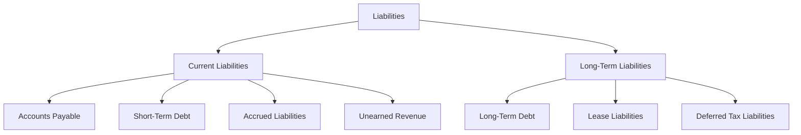

## 9.10 Presentation and Disclosure of Liabilities

In the realm of financial accounting, the presentation and disclosure of liabilities are pivotal in providing stakeholders with a clear understanding of an entity's financial obligations. This section delves into the intricacies of how liabilities, both current and long-term, are reported in financial statements, highlighting the necessary disclosures as per Canadian and international accounting standards.

### Understanding Liabilities

Liabilities are obligations that a company owes to external parties, arising from past transactions or events, which are expected to result in an outflow of resources embodying economic benefits. They are classified into two main categories:

- **Current Liabilities:** Obligations expected to be settled within one year or the entity's operating cycle, whichever is longer.
- **Long-Term Liabilities:** Obligations not expected to be settled within the next year or operating cycle.

### Importance of Proper Presentation and Disclosure

The accurate presentation and disclosure of liabilities are crucial for several reasons:

1. **Transparency:** Ensures that stakeholders have a clear view of the company's financial health.
2. **Compliance:** Adheres to regulatory requirements and accounting standards, such as IFRS and ASPE.
3. **Decision-Making:** Provides essential information for investors, creditors, and management to make informed decisions.
4. **Risk Assessment:** Helps in assessing the financial risks associated with the company's obligations.

### Presentation of Liabilities in Financial Statements

The presentation of liabilities in financial statements involves categorizing them into current and non-current sections. This classification aids users in assessing the company's liquidity and long-term solvency.

#### Current Liabilities

Current liabilities are typically listed in order of their maturity or liquidity. Common examples include:

- **Accounts Payable:** Amounts owed to suppliers for goods and services received.
- **Short-Term Debt:** Loans and borrowings due within a year.
- **Accrued Liabilities:** Expenses incurred but not yet paid, such as wages and taxes.
- **Unearned Revenue:** Payments received before delivering goods or services.

#### Long-Term Liabilities

Long-term liabilities are obligations that extend beyond one year. They are crucial for understanding a company's long-term financial commitments. Examples include:

- **Long-Term Debt:** Bonds payable, mortgages, and other borrowings due after one year.
- **Lease Liabilities:** Obligations under lease agreements classified as finance leases.
- **Deferred Tax Liabilities:** Taxes payable in future periods due to temporary differences between accounting and tax bases.

### Disclosure Requirements for Liabilities

Disclosure requirements for liabilities are designed to provide additional context and detail beyond what is presented on the face of the financial statements. These disclosures are governed by accounting standards such as IFRS and ASPE.

#### Key Disclosure Elements

1. **Nature and Terms of Liabilities:** Detailed description of the nature, terms, and conditions of significant liabilities.
2. **Maturity Analysis:** Information on the timing of cash flows related to liabilities.
3. **Interest Rates and Covenants:** Disclosure of interest rates, covenants, and any breaches thereof.
4. **Contingent Liabilities:** Information on potential liabilities that may arise from past events, depending on future occurrences.
5. **Fair Value Information:** Disclosure of the fair value of financial liabilities, where applicable.

#### IFRS and ASPE Requirements

Under IFRS, IAS 1 "Presentation of Financial Statements" and IAS 37 "Provisions, Contingent Liabilities and Contingent Assets" provide guidance on the presentation and disclosure of liabilities. ASPE, used by private enterprises in Canada, has similar requirements but may differ in certain aspects.

### Practical Examples and Case Studies

To illustrate the application of these principles, consider the following scenarios:

#### Example 1: Presentation of Current Liabilities

A manufacturing company reports the following current liabilities in its balance sheet:

- Accounts Payable: $500,000
- Short-Term Debt: $200,000
- Accrued Liabilities: $150,000
- Unearned Revenue: $100,000

The company provides detailed notes explaining the nature of each liability, the terms of the short-term debt, and the expected timing of settlement.

#### Example 2: Disclosure of Long-Term Debt

A corporation issues bonds with a face value of $1,000,000, maturing in 10 years. The notes to the financial statements disclose:

- The interest rate and payment schedule.
- Any covenants associated with the bonds.
- The fair value of the bonds at the reporting date.

### Real-World Applications and Regulatory Scenarios

In practice, companies must navigate various regulatory requirements when presenting and disclosing liabilities. For instance, public companies in Canada must comply with securities regulations, which may impose additional disclosure obligations.

#### Compliance Considerations

- **CPA Canada Handbook:** Provides authoritative guidance on accounting standards applicable in Canada.
- **Securities Regulations:** Public companies must adhere to additional disclosure requirements set by regulatory bodies such as the Canadian Securities Administrators (CSA).

### Step-by-Step Guidance for Preparing Disclosures

1. **Identify Liabilities:** Start by identifying all liabilities, both current and long-term, on the balance sheet.
2. **Classify Liabilities:** Categorize liabilities based on their maturity and nature.
3. **Prepare Notes:** Draft detailed notes to the financial statements, providing additional information on significant liabilities.
4. **Review Compliance:** Ensure that disclosures meet the requirements of relevant accounting standards and regulatory bodies.
5. **Update Regularly:** Regularly review and update disclosures to reflect changes in liabilities or accounting standards.

### Diagrams and Visual Aids

To enhance understanding, consider the following diagram illustrating the classification of liabilities:

### Best Practices and Common Pitfalls

#### Best Practices

- **Consistency:** Ensure consistent classification and disclosure of liabilities across reporting periods.
- **Transparency:** Provide clear and comprehensive disclosures to enhance stakeholder understanding.
- **Proactive Compliance:** Stay informed about changes in accounting standards and regulatory requirements.

#### Common Pitfalls

- **Omitting Disclosures:** Failing to disclose significant liabilities or changes in terms can lead to compliance issues.
- **Inaccurate Classification:** Misclassifying liabilities can mislead stakeholders about the company's financial position.

### References and Further Reading

- **IFRS Standards:** Refer to the International Financial Reporting Standards for detailed guidance on liability presentation and disclosure.
- **CPA Canada Handbook:** Explore the CPA Canada Handbook for authoritative guidance on Canadian accounting standards.
- **Additional Resources:** Consider additional study materials and practice exams to deepen your understanding of liability presentation and disclosure.

### Summary and Key Points

- Liabilities are categorized into current and long-term based on their maturity.
- Proper presentation and disclosure are crucial for transparency and compliance.
- Accounting standards such as IFRS and ASPE provide guidance on disclosure requirements.
- Practical examples and real-world applications illustrate the importance of accurate liability reporting.

### Exam Strategies and Practical Tips

- **Familiarize Yourself with Standards:** Understand the key requirements of IFRS and ASPE related to liabilities.
- **Practice Disclosure Preparation:** Work through examples of liability disclosures to build confidence.
- **Stay Updated:** Keep abreast of changes in accounting standards and regulatory requirements.

## **Ready to Test Your Knowledge?**



### Which of the following is a current liability?

- [x] Accounts Payable
- [ ] Bonds Payable
- [ ] Lease Liabilities
- [ ] Deferred Tax Liabilities

> **Explanation:** Accounts Payable is a current liability, typically settled within one year.

### What is the primary purpose of liability disclosure in financial statements?

- [x] To provide transparency and comply with accounting standards
- [ ] To increase the company's market value
- [ ] To reduce tax liabilities
- [ ] To attract more investors

> **Explanation:** Liability disclosure aims to provide transparency and ensure compliance with accounting standards.

### Which standard provides guidance on the presentation of liabilities under IFRS?

- [x] IAS 1
- [ ] IAS 2
- [ ] IAS 16
- [ ] IAS 37

> **Explanation:** IAS 1 "Presentation of Financial Statements" provides guidance on the presentation of liabilities.

### What information is typically included in the disclosure of long-term debt?

- [x] Interest rates and payment schedules
- [ ] Inventory turnover ratios
- [ ] Current asset details
- [ ] Revenue recognition policies

> **Explanation:** Disclosures for long-term debt usually include interest rates and payment schedules.

### Which of the following is a long-term liability?

- [x] Bonds Payable
- [ ] Accounts Payable
- [ ] Accrued Liabilities
- [ ] Unearned Revenue

> **Explanation:** Bonds Payable is a long-term liability, typically due after one year.

### What does the maturity analysis in liability disclosure provide?

- [x] Information on the timing of cash flows related to liabilities
- [ ] Details of the company's revenue streams
- [ ] Analysis of market trends
- [ ] Breakdown of shareholder equity

> **Explanation:** Maturity analysis provides information on when liabilities are expected to be settled.

### Which of the following is a requirement under IFRS for liability disclosure?

- [x] Fair value information
- [ ] Historical cost details
- [ ] Future revenue projections
- [ ] Marketing strategies

> **Explanation:** IFRS requires the disclosure of fair value information for financial liabilities.

### What is the impact of misclassifying liabilities in financial statements?

- [x] It can mislead stakeholders about the company's financial position
- [ ] It improves the company's credit rating
- [ ] It enhances the company's profitability
- [ ] It reduces the company's tax obligations

> **Explanation:** Misclassifying liabilities can mislead stakeholders regarding the company's financial health.

### Which of the following is a contingent liability?

- [x] A potential obligation depending on a future event
- [ ] A fixed obligation due within one year
- [ ] An obligation settled in the current period
- [ ] An obligation with no future cash outflow

> **Explanation:** Contingent liabilities depend on the occurrence of a future event.

### True or False: Consistency in liability classification is not important for financial reporting.

- [ ] True
- [x] False

> **Explanation:** Consistency in liability classification is crucial for accurate and reliable financial reporting.


