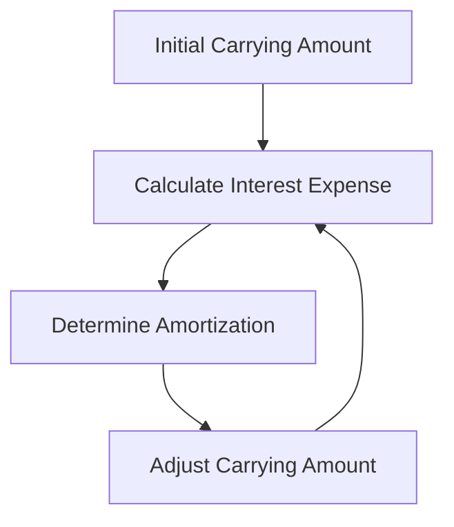

## 9.7 Amortization of Bond Discounts and Premiums

Understanding the amortization of bond discounts and premiums is crucial for accounting professionals, especially those preparing for Canadian accounting exams. This section delves into the methods used to amortize these financial instruments, providing a comprehensive guide that aligns with Canadian accounting standards and practices.

### Introduction to Bond Discounts and Premiums

When a company issues bonds, they may be sold at a discount or a premium. A bond is sold at a discount when its issue price is less than its face value, and at a premium when its issue price exceeds its face value. This difference arises due to variations in market interest rates compared to the bond's coupon rate.

**Key Terms:**
- **Face Value:** The amount the issuer agrees to repay at maturity.
- **Coupon Rate:** The interest rate stated on the bond.
- **Market Rate:** The interest rate prevailing in the market at the time of issuance.
- **Discount:** Occurs when the coupon rate is lower than the market rate.
- **Premium:** Occurs when the coupon rate is higher than the market rate.

### Importance of Amortization

Amortization of bond discounts and premiums is essential for accurately reflecting the cost of borrowing over the life of the bond. It ensures that interest expense reported in the financial statements aligns with the economic reality of the bond's cost.

### Methods of Amortization

There are two primary methods for amortizing bond discounts and premiums:

1. **Effective Interest Method**
2. **Straight-Line Method**

#### Effective Interest Method

The effective interest method is the preferred method under both IFRS and ASPE, as it provides a more accurate representation of interest expense over time. This method calculates interest expense based on the carrying amount of the bond at the beginning of each period and the market interest rate at issuance.

**Steps for the Effective Interest Method:**
1. **Calculate the Initial Carrying Amount:** This is the issue price of the bond.
2. **Determine the Effective Interest Rate:** This is the market rate at the time of issuance.
3. **Calculate Interest Expense:** Multiply the carrying amount by the effective interest rate.
4. **Determine Amortization Amount:** Subtract the coupon payment from the interest expense.
5. **Adjust Carrying Amount:** Add the amortization amount to the carrying amount for discounts, or subtract it for premiums.

**Example:**
Consider a bond with a face value of $100,000, a coupon rate of 5%, a market rate of 6%, and a 5-year term. The bond is issued at a discount for $95,000.

- **Year 1:**
  - Carrying Amount: $95,000
  - Interest Expense: $95,000 x 6% = $5,700
  - Coupon Payment: $100,000 x 5% = $5,000
  - Amortization: $5,700 - $5,000 = $700
  - New Carrying Amount: $95,700

This process continues each year, adjusting the carrying amount and recalculating interest expense.

#### Straight-Line Method

The straight-line method is simpler and involves spreading the total discount or premium evenly over the bond's life. While not as precise as the effective interest method, it is sometimes used for ease of calculation.

**Steps for the Straight-Line Method:**
1. **Calculate Total Discount or Premium:** Subtract the issue price from the face value for a discount, or vice versa for a premium.
2. **Divide by Number of Periods:** Spread the total amount evenly over the bond's term.
3. **Adjust Carrying Amount:** Add or subtract the amortization amount each period.

**Example:**
Using the same bond as above, with a $5,000 discount:

- **Annual Amortization:** $5,000 / 5 years = $1,000
- **Adjust Carrying Amount:** Add $1,000 each year to the carrying amount.

### Comparison of Methods

The effective interest method provides a more accurate reflection of interest expense, aligning with the bond's economic cost. The straight-line method, while easier, may not accurately reflect the bond's cost, especially if there's a significant difference between the coupon and market rates.

### Regulatory Insights

Under IFRS, the effective interest method is required for amortizing bond discounts and premiums. ASPE allows for the straight-line method if the results are not materially different from the effective interest method.

### Practical Applications

- **Financial Reporting:** Accurate amortization affects the income statement and balance sheet, impacting interest expense and the carrying amount of liabilities.
- **Tax Implications:** Differences in amortization methods can affect taxable income, as interest expense is deductible.
- **Investment Analysis:** Understanding amortization helps in analyzing bond investments and assessing their true cost.

### Common Challenges and Solutions

- **Complex Calculations:** The effective interest method can be complex, requiring precise calculations. Use spreadsheet software to automate calculations.
- **Regulatory Compliance:** Ensure compliance with IFRS or ASPE, as applicable. Regularly review standards for updates.

### Case Study: Canadian Corporation

Consider a Canadian corporation issuing a 10-year bond with a face value of $1,000,000, a coupon rate of 4%, and a market rate of 5%. The bond is issued at a discount for $920,000.

**Year 1 Calculations:**
- **Carrying Amount:** $920,000
- **Interest Expense:** $920,000 x 5% = $46,000
- **Coupon Payment:** $1,000,000 x 4% = $40,000
- **Amortization:** $46,000 - $40,000 = $6,000
- **New Carrying Amount:** $926,000

This process continues annually, adjusting the carrying amount and recalculating interest expense.

### Diagrams and Visuals

To enhance understanding, consider the following diagram illustrating the effective interest method:

### Summary

Amortizing bond discounts and premiums is a critical aspect of financial accounting, ensuring that interest expense reflects the true cost of borrowing. The effective interest method, while complex, provides a more accurate representation than the straight-line method. Understanding these concepts is essential for Canadian accounting exams and professional practice.

### References

- **IFRS 9:** Financial Instruments
- **CPA Canada:** Accounting Standards for Private Enterprises (ASPE)
- **Additional Resources:** Practice exams, CPA Canada guidelines, and financial accounting textbooks.

## **Ready to Test Your Knowledge?**



### Which method provides a more accurate reflection of interest expense over time?

- [x] Effective Interest Method
- [ ] Straight-Line Method
- [ ] Both methods are equally accurate
- [ ] Neither method is accurate

> **Explanation:** The effective interest method provides a more accurate reflection of interest expense over time as it accounts for the changing carrying amount of the bond.

### What is the carrying amount of a bond initially issued at a discount?

- [x] Less than the face value
- [ ] Equal to the face value
- [ ] More than the face value
- [ ] It varies depending on the market rate

> **Explanation:** A bond issued at a discount has a carrying amount less than its face value.

### Under which accounting standard is the effective interest method required?

- [x] IFRS
- [ ] ASPE
- [ ] Both IFRS and ASPE
- [ ] Neither IFRS nor ASPE

> **Explanation:** IFRS requires the use of the effective interest method for amortizing bond discounts and premiums.

### How is the amortization amount calculated in the effective interest method?

- [x] Interest Expense minus Coupon Payment
- [ ] Coupon Payment minus Interest Expense
- [ ] Carrying Amount times Coupon Rate
- [ ] Face Value times Market Rate

> **Explanation:** The amortization amount is calculated as the interest expense minus the coupon payment in the effective interest method.

### What is the impact of amortization on the carrying amount of a bond issued at a premium?

- [x] Decreases the carrying amount
- [ ] Increases the carrying amount
- [ ] Has no impact on the carrying amount
- [ ] Depends on the market rate

> **Explanation:** Amortization of a premium decreases the carrying amount of the bond over time.

### Which method spreads the total discount or premium evenly over the bond's life?

- [ ] Effective Interest Method
- [x] Straight-Line Method
- [ ] Both methods
- [ ] Neither method

> **Explanation:** The straight-line method spreads the total discount or premium evenly over the bond's life.

### What is the coupon payment for a bond with a face value of $100,000 and a coupon rate of 5%?

- [x] $5,000
- [ ] $10,000
- [ ] $50,000
- [ ] $500

> **Explanation:** The coupon payment is calculated as the face value times the coupon rate, which is $100,000 x 5% = $5,000.

### What is the primary advantage of the effective interest method?

- [x] More accurate reflection of interest expense
- [ ] Simplicity of calculations
- [ ] Even distribution of amortization
- [ ] Compliance with ASPE

> **Explanation:** The primary advantage of the effective interest method is its more accurate reflection of interest expense over the bond's life.

### How does the straight-line method affect the financial statements compared to the effective interest method?

- [x] May not accurately reflect interest expense
- [ ] Provides a more accurate reflection of interest expense
- [ ] Has no impact on financial statements
- [ ] Is required under IFRS

> **Explanation:** The straight-line method may not accurately reflect interest expense, especially if there's a significant difference between the coupon and market rates.

### True or False: The effective interest method is always required under ASPE.

- [ ] True
- [x] False

> **Explanation:** Under ASPE, the straight-line method can be used if the results are not materially different from the effective interest method.


