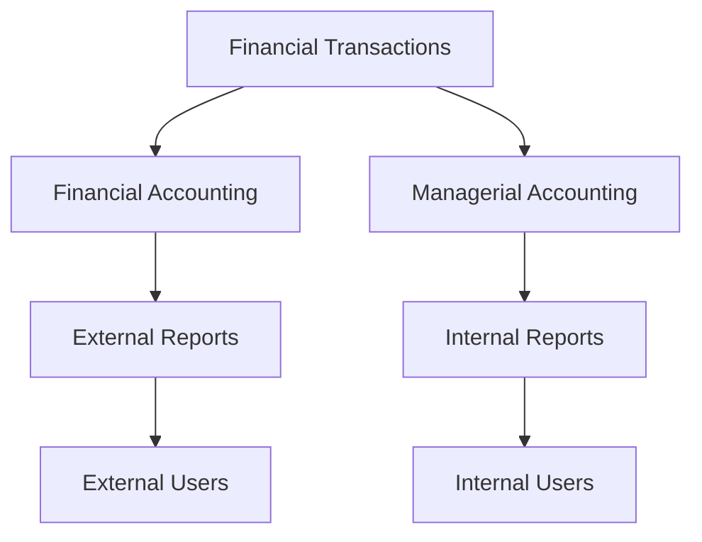

## 1.2 Differences Between Financial and Managerial Accounting

In the realm of accounting, two primary branches serve distinct purposes: financial accounting and managerial accounting. While both are crucial to the financial health and strategic planning of an organization, they differ significantly in their objectives, users, time frames, and reporting standards. Understanding these differences is essential for anyone preparing for Canadian Accounting Exams or pursuing a career in accounting.

### **1.2.1 Users of Financial and Managerial Accounting**

**Financial Accounting Users:**

Financial accounting is primarily designed for external users. These include investors, creditors, regulators, and other stakeholders who require standardized financial information to make informed decisions. The reports generated through financial accounting, such as the balance sheet, income statement, and cash flow statement, provide a snapshot of an organization's financial health and performance over a specific period.

**Managerial Accounting Users:**

In contrast, managerial accounting is tailored for internal users within the organization, such as managers and executives. The primary goal is to provide detailed financial and non-financial information that aids in decision-making, planning, and controlling operations. Managerial accounting reports are not bound by external reporting standards, allowing for more flexibility and customization to meet the specific needs of the organization.

### **1.2.2 Time Frame and Reporting Frequency**

**Financial Accounting Time Frame:**

Financial accounting typically focuses on historical data. It reports on the financial performance and position of an organization at the end of a fiscal period, usually quarterly or annually. This backward-looking approach is essential for assessing past performance and ensuring compliance with regulatory requirements.

**Managerial Accounting Time Frame:**

Managerial accounting, on the other hand, is forward-looking. It emphasizes future projections and real-time data to support strategic planning and operational control. Reports can be generated as frequently as needed—daily, weekly, or monthly—depending on the organization's requirements. This flexibility allows managers to respond quickly to changing business conditions.

### **1.2.3 Nature of Reports**

**Financial Accounting Reports:**

The reports produced by financial accounting are highly standardized and must comply with established accounting principles and standards, such as the International Financial Reporting Standards (IFRS) or Accounting Standards for Private Enterprises (ASPE) in Canada. These reports are intended to provide a consistent and comparable view of an organization's financial performance and position.

**Managerial Accounting Reports:**

In managerial accounting, reports are more detailed and can be customized to address specific management needs. They often include budgets, forecasts, variance analyses, and cost-benefit analyses. The lack of standardized formats allows for greater adaptability, enabling managers to focus on specific areas of interest or concern.

### **1.2.4 Regulatory Requirements**

**Financial Accounting Regulations:**

Financial accounting is subject to strict regulatory oversight. Organizations must adhere to accounting standards and regulations to ensure transparency and consistency in financial reporting. This compliance is crucial for maintaining investor confidence and meeting legal obligations.

**Managerial Accounting Regulations:**

Managerial accounting is not bound by external regulations. The focus is on providing relevant and timely information to internal users, which means that the reports can be tailored to the unique needs of the organization without the constraints of standardized formats or regulatory requirements.

### **1.2.5 Focus and Objectives**

**Financial Accounting Focus:**

The primary objective of financial accounting is to provide a true and fair view of an organization's financial performance and position. It focuses on accuracy, reliability, and comparability to meet the needs of external stakeholders.

**Managerial Accounting Focus:**

Managerial accounting aims to enhance decision-making and improve organizational efficiency. It focuses on providing actionable insights and supporting strategic planning and operational control. The emphasis is on relevance and timeliness rather than strict adherence to standardized formats.

### **1.2.6 Examples and Case Studies**

To illustrate these differences, consider the following examples:

**Example 1: Budgeting**

In financial accounting, budgeting is used to prepare financial statements that reflect the organization's financial position at the end of a fiscal period. In managerial accounting, budgeting is a dynamic tool used for planning and controlling operations, allowing managers to allocate resources effectively and monitor performance against targets.

**Example 2: Cost Analysis**

Financial accounting focuses on historical cost data to assess past performance. Managerial accounting, however, uses cost analysis to support decision-making, such as determining the cost-effectiveness of a new project or identifying areas for cost reduction.

**Case Study: A Canadian Manufacturing Company**

A Canadian manufacturing company uses financial accounting to prepare its annual financial statements in compliance with IFRS. These statements are used by investors and creditors to assess the company's financial health. Simultaneously, the company employs managerial accounting to develop detailed production budgets, analyze variances, and optimize resource allocation. This dual approach enables the company to meet external reporting requirements while enhancing internal decision-making and operational efficiency.

### **1.2.7 Real-World Applications and Regulatory Scenarios**

In practice, financial and managerial accounting often intersect. For instance, a company's financial accounting team may collaborate with managerial accountants to ensure that financial data is accurately reflected in internal reports. This collaboration is essential for aligning strategic objectives with financial performance.

**Regulatory Scenario:**

In Canada, organizations must comply with IFRS for financial reporting. However, managerial accounting practices are not regulated, allowing companies to develop internal reporting systems that best suit their needs. This distinction highlights the importance of understanding both financial and managerial accounting principles to ensure compliance and support effective decision-making.

### **1.2.8 Diagrams and Visuals**

To better understand the flow of information in financial and managerial accounting, consider the following diagram:

This diagram illustrates how financial transactions are processed through both financial and managerial accounting systems, resulting in reports for external and internal users, respectively.

### **1.2.9 Best Practices and Common Pitfalls**

**Best Practices:**

- **Integration:** Ensure seamless integration between financial and managerial accounting systems to provide consistent and accurate information.
- **Customization:** Tailor managerial accounting reports to meet the specific needs of the organization, focusing on areas that require attention.
- **Compliance:** Maintain compliance with financial accounting standards to ensure transparency and reliability in external reporting.

**Common Pitfalls:**

- **Overemphasis on Historical Data:** Relying solely on historical data can limit the effectiveness of managerial accounting. Incorporate forward-looking analyses to enhance decision-making.
- **Lack of Communication:** Poor communication between financial and managerial accounting teams can lead to discrepancies and inefficiencies. Foster collaboration to align objectives and improve outcomes.

### **1.2.10 Conclusion**

Understanding the differences between financial and managerial accounting is crucial for anyone involved in the accounting profession. While financial accounting focuses on providing standardized reports for external users, managerial accounting is geared towards supporting internal decision-making and strategic planning. By recognizing these distinctions, you can better appreciate the role each plays in the financial health and success of an organization.

### **1.2.11 References and Further Reading**

- **International Financial Reporting Standards (IFRS):** [IFRS Foundation](https://www.ifrs.org/)
- **Accounting Standards for Private Enterprises (ASPE):** [CPA Canada](https://www.cpacanada.ca/)
- **CPA Canada Resources:** [CPA Canada](https://www.cpacanada.ca/)

### **1.2.12 Practice Questions and Exercises**

To reinforce your understanding of the differences between financial and managerial accounting, consider the following practice questions and exercises:

1. Compare and contrast the primary users of financial and managerial accounting.
2. Explain how the time frame and reporting frequency differ between financial and managerial accounting.
3. Discuss the regulatory requirements for financial accounting and how they differ from managerial accounting.
4. Provide examples of how managerial accounting can support strategic decision-making within an organization.

---

## **Ready to Test Your Knowledge?**



### Which of the following is a primary user of financial accounting information?

- [x] Investors
- [ ] Managers
- [ ] Employees
- [ ] Suppliers

> **Explanation:** Investors are primary users of financial accounting information as they rely on standardized financial statements to make investment decisions.

### What is the main focus of managerial accounting?

- [ ] Historical data
- [x] Decision-making
- [ ] Regulatory compliance
- [ ] Tax reporting

> **Explanation:** Managerial accounting focuses on providing relevant information for decision-making, planning, and controlling operations within an organization.

### How often are financial accounting reports typically generated?

- [x] Quarterly or annually
- [ ] Daily
- [ ] Weekly
- [ ] Monthly

> **Explanation:** Financial accounting reports are usually generated quarterly or annually to provide a summary of an organization's financial performance and position.

### Which accounting branch is more flexible in its reporting?

- [ ] Financial accounting
- [x] Managerial accounting

> **Explanation:** Managerial accounting is more flexible as it is not bound by external reporting standards, allowing for customized reports to meet internal needs.

### What is a common pitfall in managerial accounting?

- [ ] Overemphasis on future projections
- [x] Overemphasis on historical data
- [ ] Lack of regulatory compliance
- [ ] Excessive standardization

> **Explanation:** Overemphasis on historical data can limit the effectiveness of managerial accounting, which should incorporate forward-looking analyses.

### Which accounting type is subject to strict regulatory oversight?

- [x] Financial accounting
- [ ] Managerial accounting

> **Explanation:** Financial accounting is subject to strict regulatory oversight to ensure transparency and consistency in financial reporting.

### What is the primary objective of financial accounting?

- [x] To provide a true and fair view of an organization's financial performance
- [ ] To enhance decision-making
- [ ] To support strategic planning
- [ ] To optimize resource allocation

> **Explanation:** The primary objective of financial accounting is to provide a true and fair view of an organization's financial performance and position.

### Which of the following is an example of a managerial accounting report?

- [ ] Balance sheet
- [ ] Income statement
- [x] Budget variance analysis
- [ ] Cash flow statement

> **Explanation:** Budget variance analysis is an example of a managerial accounting report used for internal decision-making and performance evaluation.

### What is the focus of financial accounting reports?

- [x] Accuracy and reliability
- [ ] Relevance and timeliness
- [ ] Flexibility and customization
- [ ] Future projections

> **Explanation:** Financial accounting reports focus on accuracy and reliability to meet the needs of external stakeholders.

### Managerial accounting is primarily used by external stakeholders.

- [ ] True
- [x] False

> **Explanation:** Managerial accounting is primarily used by internal stakeholders, such as managers and executives, to support decision-making and strategic planning.



---
