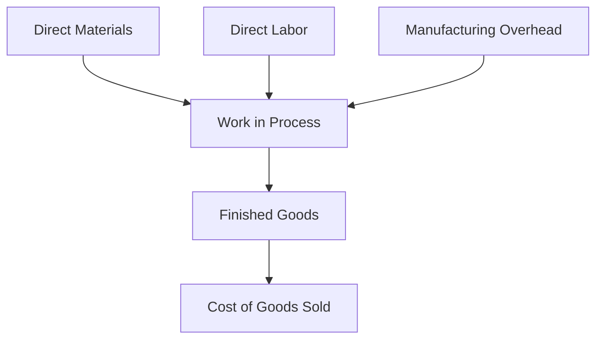

## 1.7 Introduction to Cost Terms and Purposes

In the realm of managerial accounting, understanding cost terms and their purposes is fundamental to effective decision-making, planning, and control. This section will delve into the various cost concepts, classifications, and their significance in managerial accounting. As you prepare for the Canadian Accounting Exams, mastering these concepts will not only aid in your exam success but also equip you with the knowledge necessary for practical application in the field.

### Understanding Cost Terms

Cost terms in managerial accounting are used to describe the various expenses that a business incurs in the process of producing goods or providing services. These terms help in categorizing costs for better analysis and decision-making. Let's explore some of the key cost terms:

1. **Direct Costs**: These are costs that can be directly traced to a specific cost object, such as a product, department, or project. Examples include direct materials and direct labor.

2. **Indirect Costs**: Costs that cannot be directly traced to a specific cost object. These are often referred to as overhead costs, such as utilities, rent, and administrative salaries.

3. **Variable Costs**: Costs that change in proportion to the level of production or sales volume. For example, raw materials and sales commissions.

4. **Fixed Costs**: Costs that remain constant regardless of the level of production or sales volume, such as rent and salaries.

5. **Mixed Costs**: Costs that have both fixed and variable components, such as a utility bill that has a fixed service charge plus a variable charge based on usage.

6. **Sunk Costs**: Costs that have already been incurred and cannot be recovered. These should not affect future business decisions.

7. **Opportunity Costs**: The potential benefit that is foregone when one alternative is chosen over another. This is crucial for decision-making.

8. **Relevant Costs**: Costs that will be affected by a decision and should be considered in decision-making processes.

9. **Irrelevant Costs**: Costs that will not be affected by a decision and should not be considered in decision-making processes.

### Purposes of Cost Terms in Managerial Accounting

Understanding cost terms is essential for several purposes in managerial accounting:

1. **Budgeting and Planning**: Accurate cost information is crucial for preparing budgets and planning for future activities. It helps in setting realistic financial goals and allocating resources efficiently.

2. **Cost Control**: By understanding different cost behaviors, managers can implement effective cost control measures to minimize waste and optimize resource utilization.

3. **Pricing Decisions**: Cost information is vital for setting prices that cover costs and generate profits. It helps in determining the minimum price at which a product can be sold without incurring losses.

4. **Performance Evaluation**: Cost terms are used to evaluate the performance of different departments or projects. By comparing actual costs to budgeted costs, managers can assess efficiency and identify areas for improvement.

5. **Decision Making**: Cost information aids in making informed decisions regarding product lines, production processes, and investment opportunities. It helps in analyzing the financial implications of different alternatives.

6. **Financial Reporting**: Accurate cost data is essential for preparing financial statements that reflect the true financial position of the business.

### Cost Classifications

Cost classifications are essential for organizing costs into categories that facilitate analysis and decision-making. Here are some common cost classifications:

1. **By Behavior**: Costs are classified as variable, fixed, or mixed based on how they change with the level of activity.

2. **By Function**: Costs are classified as manufacturing or non-manufacturing costs. Manufacturing costs include direct materials, direct labor, and manufacturing overhead. Non-manufacturing costs include selling and administrative expenses.

3. **By Traceability**: Costs are classified as direct or indirect based on their traceability to a cost object.

4. **By Relevance**: Costs are classified as relevant or irrelevant based on their impact on decision-making.

5. **By Controllability**: Costs are classified as controllable or uncontrollable based on the extent to which they can be influenced by management.

### Real-World Applications and Examples

To illustrate the application of cost terms and classifications, let's consider a manufacturing company that produces bicycles. The company incurs various costs, such as:

- **Direct Materials**: The cost of raw materials like steel and rubber used in manufacturing the bicycles.
- **Direct Labor**: Wages paid to workers directly involved in assembling the bicycles.
- **Manufacturing Overhead**: Indirect costs such as factory rent, utilities, and maintenance.
- **Selling Expenses**: Costs incurred in marketing and selling the bicycles, such as advertising and sales commissions.
- **Administrative Expenses**: Costs related to the general administration of the company, such as office salaries and supplies.

By classifying these costs, the company can better analyze its cost structure, identify areas for cost reduction, and make informed pricing decisions.

### Diagrams and Visuals

To enhance your understanding of cost terms and classifications, let's visualize the flow of costs in a manufacturing organization using a diagram:

This diagram illustrates how direct materials, direct labor, and manufacturing overhead flow into work in process, which then becomes finished goods and ultimately cost of goods sold.

### Common Pitfalls and Best Practices

Understanding cost terms and classifications is crucial, but there are common pitfalls to avoid:

1. **Ignoring Indirect Costs**: Focusing solely on direct costs can lead to inaccurate cost analysis. It's important to consider indirect costs as well.

2. **Misclassifying Costs**: Incorrectly classifying costs can lead to poor decision-making. Ensure that costs are accurately categorized based on their behavior, function, and traceability.

3. **Overlooking Opportunity Costs**: Failing to consider opportunity costs can result in suboptimal decisions. Always evaluate the potential benefits of alternative options.

4. **Neglecting Fixed Costs**: While variable costs are important, fixed costs also play a significant role in cost analysis. Consider both when making decisions.

To avoid these pitfalls, adopt best practices such as:

- Regularly reviewing and updating cost classifications to reflect changes in the business environment.
- Using cost data to support strategic decision-making and long-term planning.
- Continuously monitoring cost behavior to identify trends and opportunities for cost reduction.

### Regulatory Considerations

In Canada, accounting standards such as the International Financial Reporting Standards (IFRS) and Accounting Standards for Private Enterprises (ASPE) provide guidelines for cost reporting and classification. Familiarize yourself with these standards to ensure compliance and accuracy in financial reporting.

### Practice Problems and Exercises

To reinforce your understanding of cost terms and classifications, try solving the following practice problems:

1. Classify the following costs as direct or indirect: factory rent, raw materials, production supervisor salary, and sales commissions.

2. A company produces 1,000 units of a product. The total variable cost is $5,000, and the total fixed cost is $10,000. Calculate the total cost per unit.

3. Identify the opportunity cost in the following scenario: A company can produce either 500 units of Product A or 300 units of Product B. The profit from Product A is $2,000, and the profit from Product B is $3,000.

### Summary

Understanding cost terms and their purposes is fundamental to managerial accounting. By mastering these concepts, you can make informed decisions, optimize resource utilization, and contribute to the financial success of an organization. As you prepare for the Canadian Accounting Exams, focus on the key cost terms, classifications, and their applications in real-world scenarios.

### Additional Resources

For further exploration of cost terms and managerial accounting concepts, consider the following resources:

- CPA Canada: [CPA Canada](https://www.cpacanada.ca/)
- International Financial Reporting Standards (IFRS): [IFRS](https://www.ifrs.org/)
- Accounting Standards for Private Enterprises (ASPE): [ASPE](https://www.frascanada.ca/en/aspe)

---

## **Ready to Test Your Knowledge?**



### Which of the following is a direct cost?

- [x] Direct materials
- [ ] Factory rent
- [ ] Administrative salaries
- [ ] Utilities

> **Explanation:** Direct materials are costs that can be directly traced to a specific cost object, such as a product.

### What type of cost remains constant regardless of production levels?

- [ ] Variable cost
- [ ] Mixed cost
- [x] Fixed cost
- [ ] Opportunity cost

> **Explanation:** Fixed costs remain constant regardless of the level of production or sales volume.

### Which cost classification is based on traceability to a cost object?

- [ ] By behavior
- [x] By traceability
- [ ] By function
- [ ] By relevance

> **Explanation:** Costs are classified by traceability as direct or indirect based on their ability to be traced to a cost object.

### What is the potential benefit foregone when one alternative is chosen over another?

- [ ] Sunk cost
- [x] Opportunity cost
- [ ] Fixed cost
- [ ] Variable cost

> **Explanation:** Opportunity cost is the potential benefit that is foregone when one alternative is chosen over another.

### Which of the following is an example of a mixed cost?

- [ ] Direct labor
- [x] Utility bill with a fixed service charge and variable usage charge
- [ ] Raw materials
- [ ] Rent

> **Explanation:** Mixed costs have both fixed and variable components, such as a utility bill with a fixed service charge and variable usage charge.

### What is the purpose of cost classification by behavior?

- [ ] To allocate costs to cost objects
- [x] To analyze how costs change with activity levels
- [ ] To determine cost traceability
- [ ] To evaluate performance

> **Explanation:** Cost classification by behavior helps analyze how costs change with different levels of activity.

### Which cost should not affect future business decisions?

- [ ] Variable cost
- [ ] Fixed cost
- [ ] Opportunity cost
- [x] Sunk cost

> **Explanation:** Sunk costs have already been incurred and cannot be recovered, so they should not affect future business decisions.

### What is the primary purpose of understanding cost terms in managerial accounting?

- [ ] To prepare tax returns
- [ ] To comply with financial reporting standards
- [x] To aid in decision-making, planning, and control
- [ ] To calculate depreciation

> **Explanation:** Understanding cost terms aids in decision-making, planning, and control, which are primary functions of managerial accounting.

### Which of the following costs is relevant for decision-making?

- [ ] Sunk cost
- [x] Relevant cost
- [ ] Irrelevant cost
- [ ] Fixed cost

> **Explanation:** Relevant costs are those that will be affected by a decision and should be considered in decision-making processes.

### True or False: Fixed costs can be controlled by management in the short term.

- [ ] True
- [x] False

> **Explanation:** Fixed costs are generally not controllable by management in the short term as they remain constant regardless of production levels.


