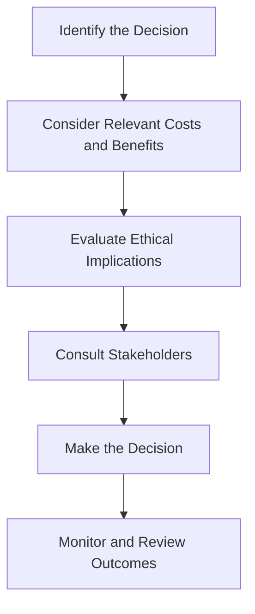

## 10.10 Ethical Issues in Short-Term Decisions

In the realm of managerial accounting, short-term decision-making often presents a complex landscape where ethical considerations must be balanced against the pursuit of profitability. This section delves into the ethical challenges that arise when making decisions focused on short-term gains, providing insights into how these decisions can impact the long-term sustainability and reputation of an organization.

### Understanding Short-Term Decision-Making

Short-term decisions in managerial accounting typically involve choices that affect the immediate financial performance of a company. These decisions can include pricing strategies, cost-cutting measures, and resource allocation. While the primary goal is often to enhance profitability, the ethical implications of these decisions cannot be overlooked.

#### Key Concepts in Short-Term Decision-Making

1. **Relevant Costs and Benefits**: These are the costs and benefits that will be directly affected by a decision. Ethical considerations arise when deciding which costs and benefits to prioritize.

2. **Opportunity Costs**: The potential benefits lost when one alternative is chosen over another. Ethical dilemmas can occur when opportunity costs are ignored or misrepresented.

3. **Sunk Costs**: Past costs that cannot be recovered. Ethical issues may arise if sunk costs are used to justify future decisions.

4. **Differential Analysis**: A method used to compare the financial outcomes of different decisions. Ethical challenges can emerge when data is manipulated to favor a particular outcome.

### Ethical Considerations in Short-Term Decision-Making

When making short-term decisions, managerial accountants must navigate a variety of ethical challenges. These challenges often stem from the pressure to deliver immediate financial results, which can lead to decisions that compromise ethical standards.

#### Common Ethical Issues

1. **Misrepresentation of Financial Data**: Presenting financial data in a way that is misleading or inaccurate to achieve short-term goals can damage an organization's credibility and lead to legal consequences.

2. **Pressure to Meet Financial Targets**: The pressure to meet or exceed financial targets can lead to unethical practices, such as manipulating earnings or cutting corners on quality.

3. **Conflict of Interest**: Decisions that benefit the decision-maker at the expense of the organization or its stakeholders can create ethical conflicts.

4. **Neglecting Long-Term Consequences**: Focusing solely on short-term gains can lead to decisions that harm the organization's long-term sustainability and reputation.

5. **Impact on Stakeholders**: Short-term decisions can have adverse effects on employees, customers, suppliers, and the community. Ethical decision-making requires considering the impact on all stakeholders.

### Case Studies and Real-World Applications

To illustrate the ethical challenges in short-term decision-making, let's explore some real-world scenarios and case studies relevant to the Canadian accounting profession.

#### Case Study 1: The Cost-Cutting Dilemma

A Canadian manufacturing company faces declining profits and decides to implement cost-cutting measures to improve its financial performance. The company considers reducing its workforce and outsourcing production to a country with lower labor costs. While these measures may improve short-term profitability, they raise ethical concerns about employee welfare and the quality of the products.

**Ethical Considerations**:
- **Employee Welfare**: How will layoffs impact the employees and their families?
- **Quality Control**: Will outsourcing compromise the quality of the products?
- **Reputation**: How will these decisions affect the company's reputation in the long run?

#### Case Study 2: Manipulating Earnings

A publicly traded company is under pressure to meet its quarterly earnings targets. The management team considers accelerating revenue recognition by offering deep discounts to customers who agree to purchase products before the end of the quarter. While this strategy may help meet short-term targets, it raises ethical issues related to revenue recognition and financial transparency.

**Ethical Considerations**:
- **Revenue Recognition**: Is the revenue being recognized in accordance with Canadian accounting standards?
- **Transparency**: Are stakeholders being misled about the company's financial performance?
- **Long-Term Impact**: How will this decision affect future sales and customer relationships?

### Regulatory and Compliance Considerations

In Canada, managerial accountants must adhere to strict ethical standards and regulations. The Chartered Professional Accountants of Canada (CPA Canada) provides guidelines and a code of conduct to ensure ethical practices in accounting.

#### Key Regulatory Frameworks

1. **International Financial Reporting Standards (IFRS)**: Adopted in Canada, IFRS provides guidelines for financial reporting and emphasizes transparency and accountability.

2. **Accounting Standards for Private Enterprises (ASPE)**: These standards apply to private enterprises in Canada and emphasize ethical financial reporting.

3. **CPA Canada Code of Conduct**: This code outlines the ethical responsibilities of accountants, including integrity, objectivity, and professional competence.

### Strategies for Ethical Decision-Making

To navigate the ethical challenges of short-term decision-making, managerial accountants can employ several strategies:

1. **Ethical Training and Awareness**: Regular training on ethical standards and decision-making can help accountants recognize and address ethical dilemmas.

2. **Stakeholder Engagement**: Involving stakeholders in the decision-making process can provide diverse perspectives and help identify potential ethical issues.

3. **Long-Term Perspective**: Balancing short-term goals with long-term sustainability can lead to more ethical decision-making.

4. **Transparency and Accountability**: Maintaining transparency in financial reporting and decision-making processes can build trust and credibility.

5. **Ethical Leadership**: Leaders who model ethical behavior can influence the organization's culture and encourage ethical decision-making.

### Practical Examples and Scenarios

To further illustrate ethical issues in short-term decision-making, consider the following scenarios:

#### Scenario 1: Pricing Decisions

A company is considering lowering its prices to gain market share. While this decision may increase sales in the short term, it could lead to a price war with competitors and erode profit margins. Ethical considerations include the impact on competitors, the sustainability of the pricing strategy, and the potential for misleading customers about the value of the products.

#### Scenario 2: Resource Allocation

A company must decide how to allocate limited resources among various projects. Prioritizing projects that offer the highest short-term returns may neglect projects that are important for long-term growth and innovation. Ethical considerations include fairness in resource distribution and the potential impact on the company's strategic goals.

### Diagrams and Visual Aids

To enhance understanding, consider the following diagram illustrating the ethical decision-making process:

### Best Practices and Common Pitfalls

#### Best Practices

1. **Adopt a Code of Ethics**: Implementing a code of ethics can guide decision-making and promote ethical behavior.

2. **Encourage Whistleblowing**: Creating a safe environment for reporting unethical behavior can help identify and address ethical issues.

3. **Conduct Ethical Audits**: Regular audits can identify potential ethical risks and ensure compliance with ethical standards.

#### Common Pitfalls

1. **Ignoring Long-Term Consequences**: Focusing solely on short-term gains can lead to decisions that harm the organization in the long run.

2. **Overlooking Stakeholder Impact**: Failing to consider the impact on stakeholders can lead to ethical conflicts and damage relationships.

3. **Rationalizing Unethical Behavior**: Justifying unethical decisions as necessary for achieving short-term goals can erode ethical standards.

### Conclusion

Ethical issues in short-term decision-making present significant challenges for managerial accountants. By understanding the ethical implications of their decisions and employing strategies to promote ethical behavior, accountants can navigate these challenges and contribute to the long-term success and integrity of their organizations.

### References and Further Reading

- CPA Canada. (n.d.). Code of Conduct. Retrieved from [CPA Canada](https://www.cpacanada.ca)
- International Financial Reporting Standards (IFRS). (n.d.). Retrieved from [IFRS](https://www.ifrs.org)
- Accounting Standards for Private Enterprises (ASPE). (n.d.). Retrieved from [CPA Canada](https://www.cpacanada.ca)

## **Ready to Test Your Knowledge?**



### Which of the following is a common ethical issue in short-term decision-making?

- [x] Misrepresentation of financial data
- [ ] Long-term strategic planning
- [ ] Employee training programs
- [ ] Market expansion strategies

> **Explanation:** Misrepresentation of financial data is a common ethical issue as it can lead to misleading stakeholders about the company's true financial position.

### What is the primary goal of short-term decision-making in managerial accounting?

- [x] Enhance immediate financial performance
- [ ] Improve long-term sustainability
- [ ] Increase employee satisfaction
- [ ] Expand market presence

> **Explanation:** The primary goal of short-term decision-making is to enhance immediate financial performance, although this must be balanced with ethical considerations.

### Which regulatory framework is adopted in Canada for financial reporting?

- [x] International Financial Reporting Standards (IFRS)
- [ ] Generally Accepted Accounting Principles (GAAP)
- [ ] Sarbanes-Oxley Act
- [ ] Financial Accounting Standards Board (FASB)

> **Explanation:** Canada has adopted the International Financial Reporting Standards (IFRS) for financial reporting.

### What is a potential consequence of focusing solely on short-term gains?

- [x] Harm to long-term sustainability
- [ ] Increased employee morale
- [ ] Enhanced brand reputation
- [ ] Improved customer loyalty

> **Explanation:** Focusing solely on short-term gains can harm long-term sustainability by neglecting strategic goals and stakeholder relationships.

### Which strategy can help promote ethical decision-making in short-term decisions?

- [x] Ethical training and awareness
- [ ] Increasing sales targets
- [ ] Reducing operational costs
- [ ] Expanding product lines

> **Explanation:** Ethical training and awareness can help accountants recognize and address ethical dilemmas in decision-making.

### What is the role of opportunity costs in short-term decision-making?

- [x] Consider potential benefits lost when choosing an alternative
- [ ] Determine sunk costs
- [ ] Identify fixed costs
- [ ] Calculate variable costs

> **Explanation:** Opportunity costs represent the potential benefits lost when one alternative is chosen over another, which is crucial in decision-making.

### How can stakeholder engagement benefit short-term decision-making?

- [x] Provide diverse perspectives and identify ethical issues
- [ ] Increase financial performance
- [ ] Reduce production costs
- [ ] Enhance marketing strategies

> **Explanation:** Engaging stakeholders can provide diverse perspectives and help identify potential ethical issues in decision-making.

### What is a common pitfall in short-term decision-making?

- [x] Ignoring long-term consequences
- [ ] Conducting regular audits
- [ ] Implementing a code of ethics
- [ ] Encouraging whistleblowing

> **Explanation:** Ignoring long-term consequences is a common pitfall that can lead to decisions harming the organization's future.

### Which of the following is an ethical consideration in pricing decisions?

- [x] Impact on competitors and sustainability
- [ ] Increasing production efficiency
- [ ] Expanding product lines
- [ ] Enhancing customer service

> **Explanation:** Ethical considerations in pricing decisions include the impact on competitors and the sustainability of the pricing strategy.

### True or False: Ethical leadership has no impact on an organization's culture.

- [ ] True
- [x] False

> **Explanation:** Ethical leadership significantly impacts an organization's culture by influencing ethical behavior and decision-making.


