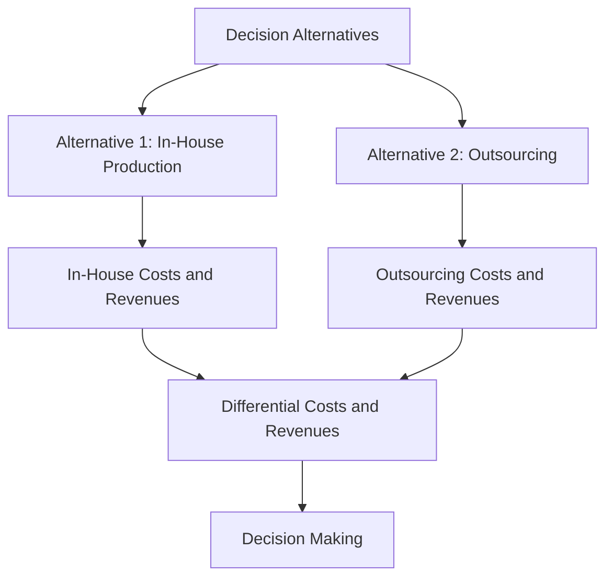

## 10.2 Differential Costs and Revenues

In the realm of managerial accounting, understanding differential costs and revenues is crucial for effective decision-making. These concepts help managers evaluate the financial implications of different business choices, ensuring that resources are allocated efficiently and profitably. This section will delve into the intricacies of differential costs and revenues, providing you with the knowledge and tools needed to excel in your Canadian accounting exams and in your professional career.

### Understanding Differential Costs and Revenues

**Differential Costs** are the costs that differ between two or more alternatives. They are also known as incremental costs. These costs are relevant for decision-making because they directly impact the financial outcomes of the choices being considered. For instance, if a company is deciding whether to produce a product in-house or outsource it, the differential costs would include the additional labor, materials, and overhead costs associated with each option.

**Differential Revenues** are the revenues that differ between alternatives. Like differential costs, they are crucial for decision-making because they represent the potential income changes resulting from different business strategies. In the same example, differential revenues would include the potential sales income from producing the product in-house versus outsourcing.

### The Role of Differential Costs and Revenues in Decision Making

Differential costs and revenues are pivotal in various managerial decisions, such as:

- **Make or Buy Decisions:** Determining whether to produce goods internally or purchase them from an external supplier.
- **Special Order Decisions:** Evaluating whether to accept a one-time order at a special price.
- **Adding or Dropping Product Lines:** Deciding whether to introduce a new product line or discontinue an existing one.
- **Utilization of Scarce Resources:** Allocating limited resources to maximize profitability.
- **Sell or Process Further Decisions:** Assessing whether to sell a product as is or process it further for additional revenue.

### Analyzing Differential Costs and Revenues

To effectively analyze differential costs and revenues, follow these steps:

1. **Identify Alternatives:** Clearly define the options available for the decision at hand.
2. **Determine Relevant Costs and Revenues:** Identify the costs and revenues that will change as a result of each alternative.
3. **Calculate Differential Costs and Revenues:** Subtract the total costs and revenues of one alternative from those of another to determine the differential amounts.
4. **Evaluate Financial Impact:** Analyze the differential costs and revenues to assess the financial implications of each alternative.
5. **Make Informed Decisions:** Use the analysis to choose the alternative that maximizes profitability or achieves other strategic goals.

### Practical Examples

#### Example 1: Make or Buy Decision

A Canadian manufacturing company is considering whether to produce a component in-house or purchase it from an external supplier. The in-house production would cost $50,000, including labor, materials, and overhead. Purchasing the component would cost $45,000. The differential cost is calculated as follows:

- **In-House Production Cost:** $50,000
- **Purchase Cost:** $45,000
- **Differential Cost:** $50,000 - $45,000 = $5,000

In this scenario, the company would save $5,000 by purchasing the component, making it the preferable option.

#### Example 2: Special Order Decision

A bakery receives a special order request for 1,000 cupcakes at a discounted price of $2 each. The regular selling price is $3, and the variable cost per cupcake is $1.50. The differential revenue and cost are calculated as follows:

- **Differential Revenue:** ($2 - $1.50) x 1,000 = $500
- **Differential Cost:** $0 (since the order does not affect fixed costs)

Accepting the special order would generate an additional $500 in profit, making it a favorable decision.

### Real-World Applications and Regulatory Considerations

In the Canadian context, differential cost and revenue analysis is essential for compliance with Accounting Standards for Private Enterprises (ASPE) and International Financial Reporting Standards (IFRS) as adopted in Canada. These standards require businesses to make informed financial decisions that reflect accurate and relevant cost and revenue information.

### Challenges and Best Practices

**Common Challenges:**

- **Identifying Relevant Costs and Revenues:** It can be challenging to distinguish between relevant and irrelevant costs, particularly in complex business scenarios.
- **Estimating Future Costs and Revenues:** Accurate forecasting is essential for reliable differential analysis.
- **Overlooking Qualitative Factors:** While quantitative analysis is crucial, qualitative factors such as customer satisfaction and brand reputation should also be considered.

**Best Practices:**

- **Comprehensive Analysis:** Ensure all relevant costs and revenues are considered in the analysis.
- **Regular Review:** Continuously review and update cost and revenue estimates to reflect current market conditions.
- **Incorporate Qualitative Factors:** Consider non-financial factors that may impact decision-making.

### Visualizing Differential Costs and Revenues

To enhance your understanding, let's visualize the flow of differential costs and revenues using a diagram:

### Conclusion

Differential costs and revenues are fundamental concepts in managerial accounting that play a critical role in decision-making processes. By understanding and applying these concepts, you can make informed financial decisions that enhance profitability and align with strategic objectives. As you prepare for your Canadian accounting exams, focus on mastering these principles and applying them to real-world scenarios.

### References and Further Reading

- CPA Canada Handbook: Accounting Standards for Private Enterprises (ASPE)
- International Financial Reporting Standards (IFRS) as adopted in Canada
- "Managerial Accounting" by Ray H. Garrison, Eric W. Noreen, and Peter C. Brewer

---

## **Ready to Test Your Knowledge?**



### What are differential costs?

- [x] Costs that differ between decision alternatives
- [ ] Costs that remain constant regardless of the decision
- [ ] Costs incurred in the past
- [ ] Costs that are not relevant to decision-making

> **Explanation:** Differential costs are those that vary between different decision alternatives, making them relevant for decision-making.

### Why are differential revenues important in decision-making?

- [x] They represent potential income changes from different strategies
- [ ] They are fixed and do not change with decisions
- [ ] They are not considered in short-term decisions
- [ ] They only apply to long-term investments

> **Explanation:** Differential revenues indicate how income will change with different business strategies, crucial for evaluating financial outcomes.

### In a make or buy decision, what is the differential cost if in-house production costs $60,000 and purchasing costs $55,000?

- [x] $5,000
- [ ] $115,000
- [ ] $60,000
- [ ] $55,000

> **Explanation:** The differential cost is the difference between the two alternatives: $60,000 - $55,000 = $5,000.

### What is the primary purpose of analyzing differential costs and revenues?

- [x] To evaluate the financial implications of different business choices
- [ ] To calculate total fixed costs
- [ ] To determine past financial performance
- [ ] To assess historical data

> **Explanation:** Analyzing differential costs and revenues helps in evaluating the financial outcomes of various business decisions.

### Which of the following is NOT a common challenge in differential cost analysis?

- [ ] Identifying relevant costs
- [ ] Estimating future costs
- [x] Calculating fixed costs
- [ ] Considering qualitative factors

> **Explanation:** Calculating fixed costs is not typically a challenge in differential cost analysis, as it focuses on costs that change between alternatives.

### What is the differential revenue if a special order is accepted at $2 per unit, with a regular price of $3 and a variable cost of $1.50 per unit?

- [x] $0.50 per unit
- [ ] $1.50 per unit
- [ ] $2.00 per unit
- [ ] $3.00 per unit

> **Explanation:** Differential revenue is calculated as the special order price minus the variable cost: $2 - $1.50 = $0.50 per unit.

### What should be considered alongside quantitative analysis in decision-making?

- [x] Qualitative factors
- [ ] Only financial metrics
- [ ] Past performance
- [ ] Historical data

> **Explanation:** Qualitative factors such as customer satisfaction and brand reputation should be considered alongside quantitative analysis.

### Which accounting standards are relevant for differential cost analysis in Canada?

- [x] ASPE and IFRS
- [ ] GAAP only
- [ ] Only IFRS
- [ ] Only ASPE

> **Explanation:** Both ASPE and IFRS are relevant for differential cost analysis in Canada, guiding financial decision-making.

### What is the first step in analyzing differential costs and revenues?

- [x] Identify alternatives
- [ ] Calculate total costs
- [ ] Determine fixed costs
- [ ] Evaluate financial impact

> **Explanation:** The first step is to identify the decision alternatives available for analysis.

### True or False: Differential costs are always variable costs.

- [ ] True
- [x] False

> **Explanation:** Differential costs can include both variable and fixed costs, as long as they differ between alternatives.



---
