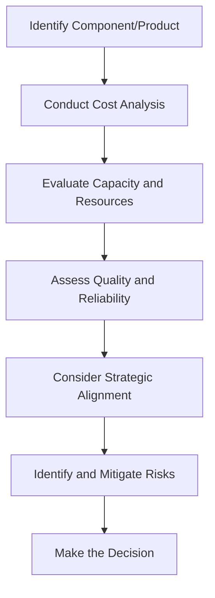

## 10.3 Make or Buy Decisions

### Introduction

In the realm of managerial accounting, make or buy decisions are pivotal in determining whether a company should manufacture a product or component internally or purchase it from an external supplier. This decision-making process is crucial for optimizing costs, enhancing operational efficiency, and aligning with strategic business goals. As you prepare for the Canadian Accounting Exams, understanding the intricacies of make or buy decisions will equip you with the analytical skills necessary to evaluate these scenarios effectively.

### Understanding Make or Buy Decisions

Make or buy decisions involve a comprehensive analysis of various factors, including cost considerations, capacity constraints, quality requirements, and strategic alignment. The primary objective is to determine the most cost-effective and strategically beneficial option for the organization. This decision is not merely about cost savings but also about leveraging core competencies, managing risks, and maintaining competitive advantage.

### Key Factors in Make or Buy Decisions

1. **Cost Analysis**: The cornerstone of make or buy decisions is a thorough cost analysis. This involves comparing the total costs of manufacturing internally versus purchasing externally. Key cost components include direct materials, direct labor, manufacturing overhead, and any additional costs associated with procurement or logistics.

2. **Capacity and Resource Availability**: Assessing the organization's capacity to produce internally is crucial. This includes evaluating current production capabilities, workforce availability, and potential impacts on existing operations.

3. **Quality and Reliability**: Ensuring consistent quality and reliability is paramount. Companies must evaluate whether internal production or external suppliers can meet the required quality standards and delivery timelines.

4. **Strategic Considerations**: Aligning the decision with the company's strategic objectives is essential. This includes considering factors such as core competencies, market positioning, and long-term business goals.

5. **Risk Management**: Identifying and mitigating risks associated with both options is critical. This includes supply chain risks, potential disruptions, and dependency on external suppliers.

### Cost Analysis in Make or Buy Decisions

Cost analysis is a fundamental aspect of make or buy decisions. It involves identifying and comparing relevant costs associated with each option. These costs can be categorized into:

- **Variable Costs**: Costs that vary with production levels, such as direct materials and direct labor.
- **Fixed Costs**: Costs that remain constant regardless of production levels, such as facility rent and salaries of permanent staff.
- **Opportunity Costs**: The potential benefits foregone by choosing one option over another.
- **Sunk Costs**: Costs that have already been incurred and cannot be recovered, which should not influence the decision.

#### Example: Cost Analysis for Make or Buy Decision

Consider a manufacturing company evaluating whether to produce a component internally or purchase it from an external supplier. The following cost analysis can be conducted:

- **Internal Production Costs**:
  - Direct Materials: $50,000
  - Direct Labor: $30,000
  - Manufacturing Overhead: $20,000
  - Total Internal Costs: $100,000

- **External Purchase Costs**:
  - Purchase Price: $90,000
  - Logistics and Handling: $5,000
  - Total External Costs: $95,000

In this scenario, the external purchase option is more cost-effective by $5,000. However, other factors such as quality, strategic alignment, and risk must also be considered.

### Strategic Considerations

Beyond cost analysis, strategic considerations play a vital role in make or buy decisions. Companies must evaluate how each option aligns with their strategic objectives and competitive positioning.

1. **Core Competencies**: Focusing on core competencies can enhance competitive advantage. If manufacturing a component internally leverages the company's strengths, it may be preferable despite higher costs.

2. **Market Positioning**: Companies must assess how make or buy decisions impact their market positioning. For instance, producing internally may allow for greater customization and differentiation.

3. **Long-term Goals**: Aligning the decision with long-term business goals is crucial. This includes considering future expansion plans, technological advancements, and potential changes in market demand.

### Risk Management in Make or Buy Decisions

Effective risk management is essential in make or buy decisions. Companies must identify potential risks associated with each option and develop strategies to mitigate them.

1. **Supply Chain Risks**: External purchasing may expose the company to supply chain risks, such as supplier reliability and geopolitical factors. Diversifying suppliers and establishing contingency plans can mitigate these risks.

2. **Operational Risks**: Internal production may involve operational risks, such as equipment breakdowns or workforce shortages. Implementing robust maintenance programs and cross-training employees can reduce these risks.

3. **Financial Risks**: Both options involve financial risks, including cost fluctuations and currency exchange rates. Hedging strategies and fixed-price contracts can help manage these risks.

### Practical Applications and Case Studies

To illustrate the practical application of make or buy decisions, consider the following case study:

**Case Study: Automotive Manufacturer**

An automotive manufacturer is evaluating whether to produce a specialized component in-house or purchase it from a supplier. The company conducts a comprehensive analysis, considering cost, quality, and strategic alignment.

- **Cost Analysis**: The internal production cost is slightly higher than the purchase cost. However, producing in-house allows for greater control over quality and customization.

- **Strategic Alignment**: The component is critical to the vehicle's performance, and producing it internally aligns with the company's strategy of offering high-performance vehicles.

- **Risk Management**: The company identifies potential supply chain risks with external suppliers and decides to produce the component internally to mitigate these risks.

Ultimately, the company decides to produce the component in-house, prioritizing quality and strategic alignment over cost savings.

### Step-by-Step Guidance for Make or Buy Decisions

1. **Identify the Component or Product**: Clearly define the component or product under consideration for make or buy decisions.

2. **Conduct Cost Analysis**: Perform a detailed cost analysis, identifying all relevant costs associated with internal production and external purchasing.

3. **Evaluate Capacity and Resources**: Assess the organization's capacity to produce internally, considering current production capabilities and resource availability.

4. **Assess Quality and Reliability**: Evaluate the quality and reliability of both internal production and external suppliers.

5. **Consider Strategic Alignment**: Align the decision with the company's strategic objectives, considering core competencies and market positioning.

6. **Identify and Mitigate Risks**: Identify potential risks associated with each option and develop strategies to mitigate them.

7. **Make the Decision**: Based on the analysis, make an informed decision that optimizes costs, aligns with strategic goals, and manages risks effectively.

### Diagrams and Visuals

To enhance understanding, consider the following flowchart illustrating the make or buy decision process:

### Best Practices and Common Pitfalls

**Best Practices**:
- Conduct a comprehensive cost analysis, considering all relevant costs.
- Align make or buy decisions with strategic objectives and core competencies.
- Develop robust risk management strategies to mitigate potential risks.

**Common Pitfalls**:
- Focusing solely on cost savings without considering quality and strategic alignment.
- Underestimating the importance of capacity and resource availability.
- Neglecting risk management and contingency planning.

### References and Additional Resources

For further exploration of make or buy decisions, consider the following resources:
- CPA Canada: [Management Accounting Guidelines](https://www.cpacanada.ca/en)
- International Financial Reporting Standards (IFRS): [IFRS Standards](https://www.ifrs.org)
- Accounting Standards for Private Enterprises (ASPE): [ASPE Guidelines](https://www.cpacanada.ca/en)

### Summary

Make or buy decisions are a critical aspect of managerial accounting, requiring a comprehensive analysis of costs, strategic alignment, and risk management. By understanding the intricacies of these decisions, you can effectively evaluate scenarios and make informed choices that optimize costs and align with business objectives.

---

## **Ready to Test Your Knowledge?**



### Which of the following is a key factor in make or buy decisions?

- [x] Cost Analysis
- [ ] Market Share
- [ ] Employee Satisfaction
- [ ] Brand Recognition

> **Explanation:** Cost analysis is crucial in determining the financial implications of making or buying a product.

### What is the primary objective of make or buy decisions?

- [ ] Increasing market share
- [x] Optimizing costs and aligning with strategic goals
- [ ] Enhancing employee satisfaction
- [ ] Improving brand recognition

> **Explanation:** The primary objective is to optimize costs and align with strategic business goals.

### Which cost is irrelevant in make or buy decisions?

- [ ] Variable Costs
- [ ] Fixed Costs
- [x] Sunk Costs
- [ ] Opportunity Costs

> **Explanation:** Sunk costs are past costs that should not influence current decision-making.

### What is a potential risk of purchasing externally?

- [x] Supply chain disruptions
- [ ] Increased internal labor costs
- [ ] Decreased product quality
- [ ] Reduced market demand

> **Explanation:** External purchasing may expose the company to supply chain disruptions.

### Which of the following aligns with strategic considerations in make or buy decisions?

- [x] Core Competencies
- [ ] Employee Turnover
- [ ] Market Trends
- [ ] Customer Feedback

> **Explanation:** Strategic considerations include leveraging core competencies.

### What is the role of risk management in make or buy decisions?

- [ ] To increase production capacity
- [x] To identify and mitigate potential risks
- [ ] To enhance employee engagement
- [ ] To improve brand loyalty

> **Explanation:** Risk management involves identifying and mitigating potential risks associated with each option.

### Which of the following is a common pitfall in make or buy decisions?

- [x] Focusing solely on cost savings
- [ ] Considering quality and reliability
- [ ] Aligning with strategic goals
- [ ] Developing risk management strategies

> **Explanation:** Focusing solely on cost savings without considering other factors is a common pitfall.

### What is the significance of capacity evaluation in make or buy decisions?

- [ ] It determines market demand
- [x] It assesses the organization's ability to produce internally
- [ ] It enhances employee productivity
- [ ] It improves customer satisfaction

> **Explanation:** Capacity evaluation assesses the organization's ability to produce internally.

### Which of the following is a strategic benefit of internal production?

- [x] Greater control over quality
- [ ] Reduced labor costs
- [ ] Increased market share
- [ ] Enhanced brand recognition

> **Explanation:** Internal production allows for greater control over quality.

### True or False: Make or buy decisions should only focus on cost savings.

- [ ] True
- [x] False

> **Explanation:** Make or buy decisions should consider multiple factors, including strategic alignment and risk management.


