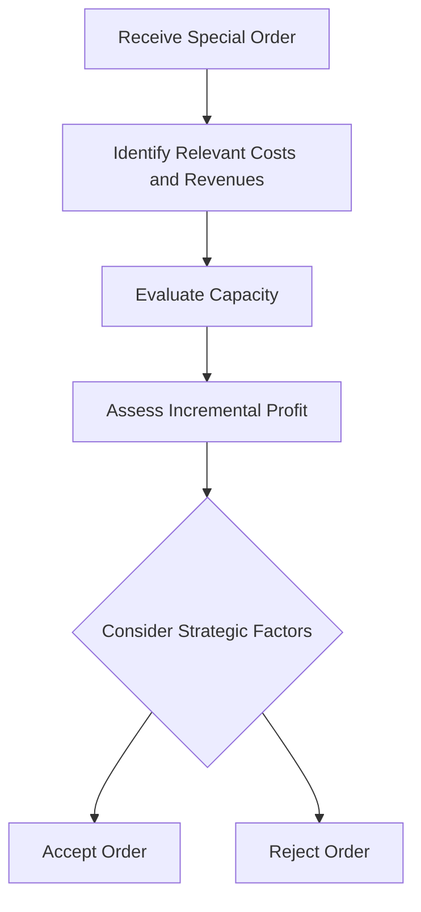

## 10.4 Special Order Decisions

In the realm of managerial accounting, special order decisions are pivotal in determining whether a company should accept a one-time order at a price different from its usual pricing structure. This decision-making process involves assessing the profitability of such orders, considering both relevant costs and potential benefits. Understanding special order decisions is crucial for those preparing for Canadian accounting exams, as it combines cost analysis, strategic thinking, and an understanding of accounting principles.

### Understanding Special Orders

A special order is a one-time order that is not part of the company's regular sales. These orders often come with unique pricing, quantities, or delivery requirements. Special orders can be an opportunity for a company to increase its revenue and utilize excess capacity. However, they also require careful evaluation to ensure they do not negatively impact the company's overall profitability.

#### Key Characteristics of Special Orders

1. **Non-Recurring Nature:** Special orders are typically one-time transactions and do not represent a regular business activity.
2. **Unique Pricing:** The pricing for special orders often deviates from standard pricing, usually lower to attract the customer.
3. **Excess Capacity Utilization:** Companies often consider special orders when they have excess production capacity.
4. **Impact on Regular Sales:** Special orders should not interfere with or cannibalize regular sales.

### The Decision-Making Process

The decision to accept or reject a special order involves several steps:

1. **Identify Relevant Costs and Revenues:** Only costs and revenues that will change as a result of the special order should be considered. These are known as relevant costs and revenues.
2. **Evaluate Capacity:** Determine if the company has the capacity to fulfill the special order without affecting regular operations.
3. **Assess Impact on Profitability:** Calculate the incremental profit or loss from the special order by comparing additional revenues with additional costs.
4. **Consider Strategic Factors:** Evaluate non-financial factors such as customer relationships, market entry, and long-term strategic goals.

### Relevant Costs and Revenues

Relevant costs are those that will be directly affected by the decision to accept the special order. These typically include:

- **Variable Costs:** Costs that vary with production levels, such as direct materials and direct labor.
- **Incremental Costs:** Additional costs incurred only if the special order is accepted, such as special shipping or packaging costs.

**Irrelevant Costs:** Fixed costs that do not change with the decision, such as rent or salaries, are generally considered irrelevant in special order decisions.

### Practical Example

Consider a Canadian manufacturing company, MapleTech Inc., which produces electronic gadgets. The company receives a special order request from a European retailer for 1,000 units at $50 per unit. The regular selling price is $70 per unit, and the variable cost per unit is $40. The company has excess capacity and can fulfill the order without affecting regular sales.

#### Step-by-Step Analysis

1. **Calculate Incremental Revenue:**
   
   \text{Incremental Revenue} = \text{Special Order Quantity} \times \text{Special Order Price} = 1,000 \times 50 = \$50,000
   

2. **Calculate Incremental Costs:**
   
   \text{Incremental Costs} = \text{Special Order Quantity} \times \text{Variable Cost per Unit} = 1,000 \times 40 = \$40,000
   

3. **Determine Incremental Profit:**
   
   \text{Incremental Profit} = \text{Incremental Revenue} - \text{Incremental Costs} = 50,000 - 40,000 = \$10,000
   

Since the incremental profit is positive, MapleTech Inc. should consider accepting the special order, assuming no other strategic factors oppose it.

### Strategic Considerations

While the financial analysis is crucial, strategic considerations can also influence the decision:

- **Market Penetration:** Accepting a special order might help the company enter a new market or establish a relationship with a new customer.
- **Brand Image:** Offering products at a lower price might affect the brand's perceived value.
- **Long-Term Contracts:** A special order could lead to long-term business opportunities.

### Real-World Applications and Regulatory Scenarios

In the Canadian context, companies must also consider regulatory implications, such as compliance with the International Financial Reporting Standards (IFRS) and Accounting Standards for Private Enterprises (ASPE). Special order decisions should align with these standards to ensure accurate financial reporting and compliance.

### Case Study: Special Order Decision in a Service Industry

**Scenario:** A Canadian consulting firm, Insight Advisors, receives a special order from a government agency to conduct a short-term project at a discounted rate. The firm must decide whether to accept the order, considering its current workload and capacity.

**Analysis:**

1. **Identify Relevant Costs:** Additional staffing costs and travel expenses specific to the project.
2. **Evaluate Capacity:** Determine if current consultants can handle the project without affecting ongoing client work.
3. **Assess Incremental Profit:** Calculate the difference between the project revenue and additional costs.
4. **Consider Strategic Benefits:** Potential for future government contracts and enhanced reputation.

### Best Practices and Common Pitfalls

**Best Practices:**

- **Comprehensive Analysis:** Consider both quantitative and qualitative factors.
- **Capacity Evaluation:** Ensure the company can fulfill the order without disrupting regular operations.
- **Long-Term Perspective:** Consider the potential long-term benefits of accepting the order.

**Common Pitfalls:**

- **Ignoring Fixed Costs:** While fixed costs are irrelevant to the decision, they should not be overlooked in overall profitability analysis.
- **Overlooking Strategic Factors:** Focusing solely on financial metrics can lead to missed strategic opportunities.

### Sample Problems and Exercises

**Exercise 1:** A Canadian bakery receives a special order for 500 custom cakes at $15 each. The variable cost per cake is $10, and the bakery has the capacity to fulfill the order. Calculate the incremental profit and decide whether to accept the order.

**Exercise 2:** A furniture manufacturer is offered a special order for 200 chairs at $80 each. The variable cost per chair is $60, and the company has limited capacity. Analyze the decision considering the opportunity cost of using capacity for regular orders.

### Diagrams and Visual Aids

To enhance understanding, consider the following diagram illustrating the decision-making process for special orders:

### Conclusion

Special order decisions are a critical aspect of managerial accounting, requiring a balance of financial analysis and strategic insight. By understanding the relevant costs, evaluating capacity, and considering strategic factors, companies can make informed decisions that enhance profitability and align with long-term goals.

### References

- CPA Canada Handbook
- International Financial Reporting Standards (IFRS)
- Accounting Standards for Private Enterprises (ASPE)

## **Ready to Test Your Knowledge?**



### What is a special order in managerial accounting?

- [x] A one-time order at a different price from regular sales
- [ ] A regular order with a discount
- [ ] An order that requires additional advertising
- [ ] A recurring order with a loyal customer

> **Explanation:** A special order is a one-time order that is not part of the company's regular sales and often comes with unique pricing.

### Which costs are considered relevant in special order decisions?

- [x] Variable costs
- [ ] Fixed costs
- [ ] Overhead costs
- [ ] Sunk costs

> **Explanation:** Relevant costs are those that will change as a result of the special order, such as variable costs.

### What is the primary financial metric used to assess special orders?

- [x] Incremental profit
- [ ] Gross margin
- [ ] Net income
- [ ] Operating income

> **Explanation:** Incremental profit, which is the difference between additional revenues and additional costs, is the primary metric.

### Why might a company accept a special order at a lower price?

- [x] To utilize excess capacity
- [ ] To increase fixed costs
- [ ] To decrease variable costs
- [ ] To reduce inventory levels

> **Explanation:** Accepting a special order at a lower price can help utilize excess production capacity.

### What strategic factor might influence the decision to accept a special order?

- [x] Market penetration
- [ ] Decreasing fixed costs
- [ ] Increasing variable costs
- [ ] Reducing labor hours

> **Explanation:** Market penetration is a strategic factor that might influence the decision to accept a special order.

### Which of the following is a common pitfall in special order decisions?

- [x] Ignoring strategic factors
- [ ] Overestimating fixed costs
- [ ] Underestimating variable costs
- [ ] Focusing on long-term benefits

> **Explanation:** Ignoring strategic factors can lead to missed opportunities in special order decisions.

### What is the impact of fixed costs on special order decisions?

- [x] They are generally irrelevant
- [ ] They are highly relevant
- [ ] They should be minimized
- [ ] They should be maximized

> **Explanation:** Fixed costs are generally irrelevant to special order decisions as they do not change with the decision.

### How can special orders affect brand image?

- [x] By lowering perceived value
- [ ] By increasing perceived value
- [ ] By stabilizing perceived value
- [ ] By having no impact

> **Explanation:** Offering products at a lower price through special orders might affect the brand's perceived value.

### What role do strategic factors play in special order decisions?

- [x] They provide a long-term perspective
- [ ] They focus solely on financial metrics
- [ ] They emphasize short-term gains
- [ ] They are irrelevant

> **Explanation:** Strategic factors provide a long-term perspective, influencing decisions beyond immediate financial metrics.

### True or False: Special orders should always be accepted if they generate a positive incremental profit.

- [ ] True
- [x] False

> **Explanation:** While positive incremental profit is important, strategic factors and capacity constraints must also be considered.


