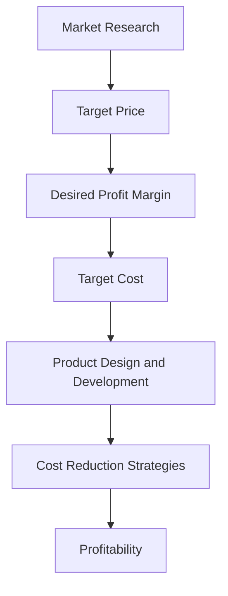

## 13.4 Target Pricing and Target Costing

In the competitive landscape of today's business environment, understanding and effectively implementing target pricing and target costing are crucial for maintaining profitability and achieving strategic objectives. These concepts are integral to managerial accounting, providing a framework for aligning product costs with market expectations and ensuring that pricing strategies are both competitive and profitable.

### Understanding Target Pricing

**Target Pricing** is a market-driven pricing strategy where the selling price of a product is determined based on competitive market conditions. The primary goal is to set a price that meets customer expectations while ensuring the company remains competitive in the market.

#### Key Components of Target Pricing

1. **Market Research**: Understanding customer needs, preferences, and willingness to pay is essential. This involves analyzing competitors' pricing strategies and market trends to determine a competitive price point.

2. **Value Proposition**: The perceived value of the product to the customer plays a significant role in target pricing. Companies must ensure that their products offer value that justifies the price.

3. **Competitive Analysis**: Assessing competitors' pricing strategies helps in positioning the product effectively in the market. This involves understanding the features, benefits, and pricing of similar products offered by competitors.

4. **Price Elasticity of Demand**: Understanding how sensitive customers are to price changes is crucial. This involves analyzing how changes in price affect the quantity demanded, which can influence pricing decisions.

#### Steps in Implementing Target Pricing

1. **Identify the Target Market**: Define the customer segment you aim to serve and understand their needs and preferences.

2. **Determine the Target Price**: Based on market research and competitive analysis, establish a price point that aligns with customer expectations and market conditions.

3. **Communicate the Value Proposition**: Clearly articulate the benefits and value of the product to justify the target price to customers.

4. **Monitor and Adjust**: Continuously monitor market conditions and customer feedback to adjust pricing strategies as needed.

### Introduction to Target Costing

**Target Costing** is a cost management strategy that involves setting a target cost by subtracting a desired profit margin from a competitive market price. The objective is to ensure that the product can be produced at a cost that allows for profitability at the target price.

#### Key Components of Target Costing

1. **Target Cost Calculation**: The target cost is calculated by subtracting the desired profit margin from the target price. This provides a cost ceiling that the company must not exceed to achieve its profit objectives.

2. **Cross-Functional Teams**: Target costing involves collaboration across various departments, including marketing, engineering, production, and finance, to ensure that the product can be produced within the target cost.

3. **Cost Reduction Techniques**: Implementing cost reduction strategies, such as process improvements, value engineering, and supplier negotiations, is essential to meet the target cost.

4. **Continuous Improvement**: Target costing is an ongoing process that requires continuous evaluation and improvement to adapt to changing market conditions and cost structures.

#### Steps in Implementing Target Costing

1. **Set the Target Price**: Based on market analysis, establish a competitive price point for the product.

2. **Determine the Desired Profit Margin**: Define the profit margin required to meet financial objectives.

3. **Calculate the Target Cost**: Subtract the desired profit margin from the target price to establish the target cost.

4. **Design and Develop the Product**: Collaborate with cross-functional teams to design a product that meets customer needs while adhering to the target cost.

5. **Implement Cost Reduction Strategies**: Identify and implement strategies to reduce costs and achieve the target cost.

6. **Monitor and Adjust**: Continuously monitor costs and market conditions to make necessary adjustments to maintain profitability.

### Practical Examples and Case Studies

#### Example 1: Automotive Industry

In the automotive industry, target pricing and target costing are widely used to ensure that vehicles are priced competitively while maintaining profitability. For instance, a car manufacturer may set a target price for a new model based on market research and competitor analysis. The desired profit margin is then subtracted from this target price to determine the target cost. Cross-functional teams work together to design and produce the vehicle within this cost constraint, implementing cost reduction strategies as needed.

#### Example 2: Consumer Electronics

A consumer electronics company may use target pricing and target costing to launch a new smartphone. The company conducts market research to determine a competitive price point and sets a target price. The desired profit margin is subtracted from this price to establish the target cost. The product development team collaborates with suppliers and engineers to design a smartphone that meets customer expectations while adhering to the target cost.

### Real-World Applications and Regulatory Scenarios

In Canada, companies must adhere to accounting standards and regulations when implementing target pricing and target costing. This includes compliance with the International Financial Reporting Standards (IFRS) as adopted in Canada and guidelines from CPA Canada. Companies must ensure that their pricing strategies align with these standards and regulations to maintain transparency and accountability.

### Step-by-Step Guidance for Target Pricing and Target Costing

1. **Conduct Market Research**: Gather data on customer preferences, competitor pricing, and market trends to establish a target price.

2. **Define the Value Proposition**: Clearly articulate the benefits and value of the product to justify the target price.

3. **Set the Target Price and Desired Profit Margin**: Based on market research, establish a competitive price point and define the desired profit margin.

4. **Calculate the Target Cost**: Subtract the desired profit margin from the target price to determine the target cost.

5. **Collaborate with Cross-Functional Teams**: Work with teams across the organization to design and produce the product within the target cost.

6. **Implement Cost Reduction Strategies**: Identify and implement strategies to reduce costs and achieve the target cost.

7. **Monitor and Adjust**: Continuously monitor costs, market conditions, and customer feedback to make necessary adjustments.

### Diagrams and Visuals

To enhance understanding, the following Mermaid.js diagram illustrates the relationship between target pricing, target costing, and profitability:

### Best Practices and Common Pitfalls

#### Best Practices

- **Involve Cross-Functional Teams**: Engage teams from different departments to ensure a comprehensive approach to target costing.

- **Focus on Value Engineering**: Continuously seek ways to improve product value while reducing costs.

- **Monitor Market Trends**: Stay informed about market changes and adjust pricing strategies accordingly.

#### Common Pitfalls

- **Ignoring Customer Feedback**: Failing to consider customer feedback can lead to misaligned pricing strategies.

- **Underestimating Costs**: Inaccurate cost estimates can result in unachievable target costs.

- **Lack of Collaboration**: Siloed departments can hinder the effectiveness of target costing.

### References and Additional Resources

For further exploration, consider the following resources:

- CPA Canada: [CPA Canada Website](https://www.cpacanada.ca)
- International Financial Reporting Standards (IFRS): [IFRS Website](https://www.ifrs.org)
- Accounting Standards for Private Enterprises (ASPE): [ASPE Resources](https://www.cpacanada.ca/en/business-and-accounting-resources/accounting-and-financial-reporting/aspe)

### Summary

Target pricing and target costing are essential tools in managerial accounting, enabling companies to align product costs with market expectations and achieve profitability. By understanding and implementing these strategies, companies can enhance their competitive position and ensure long-term success.

---

## **Ready to Test Your Knowledge?**



### What is the primary goal of target pricing?

- [x] To set a price that meets customer expectations while ensuring competitiveness
- [ ] To maximize profit margins regardless of market conditions
- [ ] To undercut competitors' prices at all costs
- [ ] To focus solely on cost reduction

> **Explanation:** The primary goal of target pricing is to set a price that aligns with customer expectations and ensures competitiveness in the market.

### How is the target cost calculated in target costing?

- [x] By subtracting the desired profit margin from the target price
- [ ] By adding the desired profit margin to the target price
- [ ] By multiplying the target price by the desired profit margin
- [ ] By dividing the target price by the desired profit margin

> **Explanation:** The target cost is calculated by subtracting the desired profit margin from the target price, providing a cost ceiling for product development.

### Which of the following is a key component of target costing?

- [x] Cross-functional teams
- [ ] Sole reliance on the finance department
- [ ] Ignoring market trends
- [ ] Focusing only on product design

> **Explanation:** Cross-functional teams are essential in target costing to ensure collaboration across departments and achieve the target cost.

### What role does market research play in target pricing?

- [x] It helps determine a competitive price point based on customer needs and competitor analysis
- [ ] It is only used for advertising purposes
- [ ] It is irrelevant to pricing strategies
- [ ] It focuses solely on internal cost structures

> **Explanation:** Market research is crucial in target pricing as it helps establish a competitive price point by understanding customer needs and analyzing competitors.

### Which strategy is essential for achieving target cost?

- [x] Cost reduction techniques
- [ ] Increasing production costs
- [ ] Ignoring supplier negotiations
- [ ] Focusing solely on marketing

> **Explanation:** Implementing cost reduction techniques is essential to meet the target cost and ensure profitability.

### What is a common pitfall in target costing?

- [x] Underestimating costs
- [ ] Overestimating market demand
- [ ] Ignoring product design
- [ ] Focusing too much on customer feedback

> **Explanation:** Underestimating costs can lead to unachievable target costs, making it a common pitfall in target costing.

### Why is collaboration important in target costing?

- [x] It ensures a comprehensive approach and aligns product development with cost objectives
- [ ] It is only necessary for large companies
- [ ] It is irrelevant to cost management
- [ ] It focuses solely on marketing strategies

> **Explanation:** Collaboration across departments ensures a comprehensive approach to target costing and aligns product development with cost objectives.

### How does target pricing benefit a company?

- [x] By aligning product prices with market expectations and enhancing competitiveness
- [ ] By focusing solely on internal cost structures
- [ ] By ignoring customer needs
- [ ] By setting the highest possible prices

> **Explanation:** Target pricing benefits a company by aligning product prices with market expectations, ensuring competitiveness and customer satisfaction.

### What is the relationship between target pricing and target costing?

- [x] Target costing ensures that products are produced at a cost that allows for profitability at the target price
- [ ] Target pricing focuses solely on cost reduction
- [ ] Target costing ignores market conditions
- [ ] Target pricing and target costing are unrelated

> **Explanation:** Target costing ensures that products are produced at a cost that allows for profitability at the target price, aligning with market conditions.

### True or False: Target pricing and target costing are only applicable to manufacturing industries.

- [ ] True
- [x] False

> **Explanation:** Target pricing and target costing are applicable across various industries, including services and consumer goods, not just manufacturing.



---
