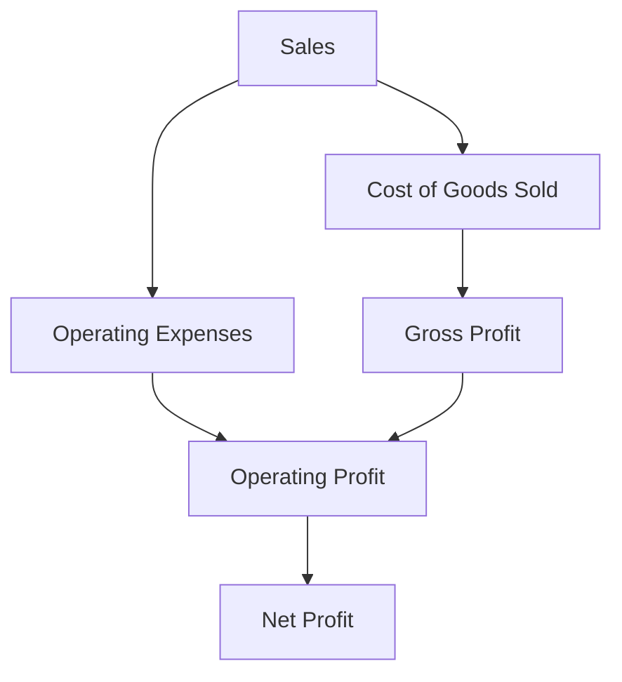

## 13.6 Profitability Analysis

Profitability analysis is a cornerstone of managerial accounting, providing insights into how effectively a company is generating profits relative to its costs. This section will delve into the intricacies of profitability analysis, focusing on profit margins and cost structures, which are essential for strategic decision-making and performance evaluation in any organization. Understanding these concepts is crucial for those preparing for Canadian accounting exams, as they form the basis for many managerial decisions.

### Understanding Profitability Analysis

Profitability analysis involves evaluating a company's ability to generate earnings compared to its expenses and other relevant costs incurred during a specific period. This analysis helps in assessing the financial health of a business and its potential for growth and sustainability. It is an integral part of managerial accounting, providing managers with the information needed to make informed decisions.

#### Key Objectives of Profitability Analysis

1. **Assessing Financial Health**: Profitability analysis helps in understanding the financial condition of a business by examining its profit-generating capacity.
2. **Identifying Cost Drivers**: It aids in identifying the primary factors that contribute to costs and their impact on profitability.
3. **Strategic Decision-Making**: Provides insights necessary for making strategic decisions regarding pricing, cost control, and resource allocation.
4. **Performance Evaluation**: Helps in evaluating the performance of different business segments, products, or services.
5. **Benchmarking**: Allows comparison with industry standards or competitors to gauge competitive positioning.

### Key Components of Profitability Analysis

Profitability analysis can be broken down into several key components, each of which provides valuable insights into different aspects of a company's financial performance.

#### 1. Profit Margins

Profit margins are a critical measure of profitability, indicating the percentage of revenue that exceeds the costs of production. They are essential for understanding how much profit a company makes for every dollar of sales.

- **Gross Profit Margin**: This margin measures the difference between sales and the cost of goods sold (COGS), divided by sales. It indicates how efficiently a company uses its resources to produce goods or services.

  
  \text{Gross Profit Margin} = \left( \frac{\text{Sales} - \text{COGS}}{\text{Sales}} \right) \times 100
  

- **Operating Profit Margin**: This margin considers operating expenses, providing a view of the company's operational efficiency.

  
  \text{Operating Profit Margin} = \left( \frac{\text{Operating Income}}{\text{Sales}} \right) \times 100
  

- **Net Profit Margin**: This margin reflects the overall profitability after all expenses, including taxes and interest, have been deducted.

  
  \text{Net Profit Margin} = \left( \frac{\text{Net Income}}{\text{Sales}} \right) \times 100
  

#### 2. Cost Structures

Cost structures refer to the types and relative proportions of fixed and variable costs that a business incurs. Understanding cost structures is vital for managing profitability, as it affects pricing strategies and cost management.

- **Fixed Costs**: Costs that do not change with the level of production or sales, such as rent, salaries, and insurance.
- **Variable Costs**: Costs that vary directly with the level of production, such as raw materials and direct labor.
- **Mixed Costs**: Costs that have both fixed and variable components, such as utility bills.

#### 3. Break-Even Analysis

Break-even analysis is a crucial tool in profitability analysis, helping determine the sales volume at which total revenues equal total costs, resulting in neither profit nor loss.


\text{Break-Even Point (Units)} = \frac{\text{Fixed Costs}}{\text{Selling Price per Unit} - \text{Variable Cost per Unit}}


### Practical Examples and Case Studies

To illustrate the application of profitability analysis, consider the following examples:

#### Example 1: Gross Profit Margin Analysis

A Canadian manufacturing company, MapleTech, has the following financial data for the year:

- Sales: CAD 1,000,000
- Cost of Goods Sold: CAD 600,000

**Calculation**:


\text{Gross Profit Margin} = \left( \frac{1,000,000 - 600,000}{1,000,000} \right) \times 100 = 40\%


This indicates that MapleTech retains 40% of its revenue as gross profit, which can be used to cover other expenses and generate net income.

#### Example 2: Operating Profit Margin Analysis

Continuing with MapleTech, assume the operating expenses are CAD 250,000.

**Calculation**:


\text{Operating Profit Margin} = \left( \frac{150,000}{1,000,000} \right) \times 100 = 15\%


This margin shows that MapleTech earns 15% of its revenue from operations after covering operating expenses.

#### Case Study: Cost Structure Analysis in Retail

Consider a Canadian retail chain, Northern Lights, which is evaluating its cost structure to improve profitability. The company identifies that its fixed costs (rent, salaries) are high compared to variable costs (inventory, utilities). By renegotiating lease agreements and optimizing staffing levels, Northern Lights aims to reduce fixed costs, thereby improving its profitability.

### Real-World Applications and Regulatory Scenarios

Profitability analysis is not just theoretical; it has practical applications in various business scenarios:

- **Pricing Strategies**: Companies use profitability analysis to set competitive prices that cover costs and generate desired profit margins.
- **Cost Control**: By understanding cost structures, businesses can implement cost-control measures to enhance profitability.
- **Investment Decisions**: Profitability analysis informs investment decisions by evaluating the potential returns on new projects or product lines.

In Canada, businesses must adhere to accounting standards such as the International Financial Reporting Standards (IFRS) and the Accounting Standards for Private Enterprises (ASPE) when conducting profitability analysis. These standards ensure consistency and transparency in financial reporting, aiding stakeholders in making informed decisions.

### Step-by-Step Guidance for Profitability Analysis

1. **Gather Financial Data**: Collect relevant financial data, including sales, COGS, operating expenses, and net income.
2. **Calculate Profit Margins**: Use the formulas provided to calculate gross, operating, and net profit margins.
3. **Analyze Cost Structures**: Identify fixed, variable, and mixed costs to understand their impact on profitability.
4. **Conduct Break-Even Analysis**: Determine the break-even point to understand the sales volume needed to cover costs.
5. **Evaluate Performance**: Compare profitability metrics against industry benchmarks or historical data to assess performance.
6. **Make Strategic Decisions**: Use insights from profitability analysis to make informed decisions regarding pricing, cost management, and resource allocation.

### Diagrams and Visuals

To enhance understanding, consider the following diagram illustrating the relationship between sales, costs, and profit margins:

### Best Practices and Common Pitfalls

**Best Practices**:
- Regularly update financial data to ensure accurate analysis.
- Use profitability analysis in conjunction with other financial metrics for a comprehensive view.
- Benchmark against industry standards to identify areas for improvement.

**Common Pitfalls**:
- Ignoring external factors such as market conditions and competition.
- Focusing solely on profit margins without considering cash flow and liquidity.
- Overlooking the impact of non-operating expenses on net profit.

### References and Additional Resources

For further exploration, consider the following resources:

- CPA Canada: [www.cpacanada.ca](https://www.cpacanada.ca)
- International Financial Reporting Standards (IFRS): [www.ifrs.org](https://www.ifrs.org)
- Accounting Standards for Private Enterprises (ASPE): [www.frascanada.ca](https://www.frascanada.ca)

### Summary

Profitability analysis is a vital tool for managerial accountants, providing insights into a company's financial performance and guiding strategic decision-making. By understanding profit margins and cost structures, businesses can enhance their profitability and achieve long-term success.

## **Ready to Test Your Knowledge?**



### What is the primary objective of profitability analysis?

- [x] Assessing a company's ability to generate earnings relative to its costs
- [ ] Determining the company's market share
- [ ] Evaluating employee performance
- [ ] Analyzing customer satisfaction

> **Explanation:** Profitability analysis focuses on assessing a company's ability to generate earnings compared to its costs, providing insights into financial health and performance.

### Which profit margin measures the difference between sales and the cost of goods sold?

- [x] Gross Profit Margin
- [ ] Operating Profit Margin
- [ ] Net Profit Margin
- [ ] Contribution Margin

> **Explanation:** The Gross Profit Margin measures the difference between sales and the cost of goods sold, indicating how efficiently a company produces goods or services.

### What type of costs remain constant regardless of production levels?

- [x] Fixed Costs
- [ ] Variable Costs
- [ ] Mixed Costs
- [ ] Marginal Costs

> **Explanation:** Fixed costs remain constant regardless of production levels, such as rent and salaries.

### What is the formula for calculating the break-even point in units?

- [x] Fixed Costs / (Selling Price per Unit - Variable Cost per Unit)
- [ ] Sales / Total Costs
- [ ] Net Income / Total Revenue
- [ ] Operating Income / Sales

> **Explanation:** The break-even point in units is calculated by dividing fixed costs by the difference between the selling price per unit and the variable cost per unit.

### Which of the following is a common pitfall in profitability analysis?

- [x] Ignoring external market conditions
- [ ] Regularly updating financial data
- [ ] Benchmarking against industry standards
- [ ] Considering cash flow and liquidity

> **Explanation:** Ignoring external market conditions is a common pitfall, as these factors can significantly impact profitability.

### What is the significance of the net profit margin?

- [x] It reflects the overall profitability after all expenses are deducted.
- [ ] It measures only the operational efficiency of a company.
- [ ] It indicates the company's market share.
- [ ] It evaluates the effectiveness of marketing strategies.

> **Explanation:** The net profit margin reflects the overall profitability after all expenses, including taxes and interest, have been deducted.

### In profitability analysis, what is the purpose of benchmarking?

- [x] Comparing performance with industry standards or competitors
- [ ] Setting internal performance goals
- [ ] Evaluating employee satisfaction
- [ ] Determining the optimal product mix

> **Explanation:** Benchmarking involves comparing performance with industry standards or competitors to gauge competitive positioning and identify areas for improvement.

### How can a company improve its profitability through cost structure analysis?

- [x] By reducing fixed costs and optimizing variable costs
- [ ] By increasing fixed costs
- [ ] By ignoring variable costs
- [ ] By focusing solely on revenue growth

> **Explanation:** A company can improve profitability by reducing fixed costs and optimizing variable costs, leading to better cost management and higher profit margins.

### Which accounting standards are relevant for profitability analysis in Canada?

- [x] IFRS and ASPE
- [ ] GAAP and SOX
- [ ] FASB and PCAOB
- [ ] IAS and SEC

> **Explanation:** In Canada, the International Financial Reporting Standards (IFRS) and the Accounting Standards for Private Enterprises (ASPE) are relevant for profitability analysis.

### True or False: Profitability analysis is only concerned with financial metrics.

- [ ] True
- [x] False

> **Explanation:** False. Profitability analysis also considers non-financial factors, such as market conditions and competitive positioning, to provide a comprehensive view of a company's performance.


