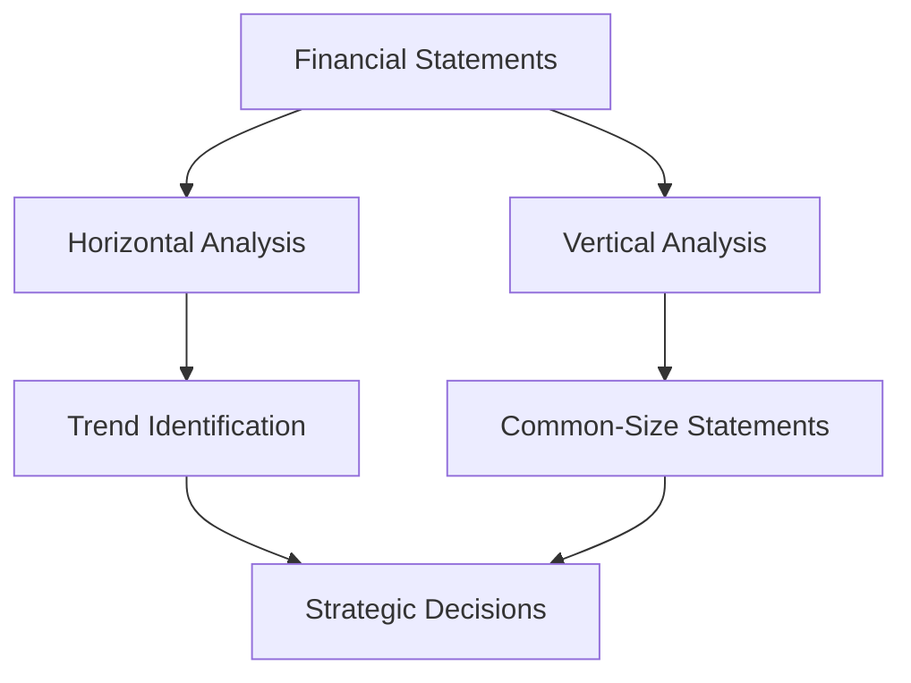

## 17.2 Horizontal and Vertical Analysis

In the realm of managerial accounting, understanding financial statements is crucial for making informed decisions. Two fundamental techniques that aid in this understanding are horizontal and vertical analysis. These methods allow accountants and managers to interpret financial data, identify trends, and make strategic decisions. This section will delve into these techniques, offering comprehensive insights, practical examples, and exam-focused guidance.

### Understanding Horizontal Analysis

Horizontal analysis, also known as trend analysis, involves comparing financial data over a series of periods. This technique helps in identifying trends, growth patterns, and anomalies in financial performance. By examining changes in financial statement items over time, managers can assess the company's operational efficiency, financial health, and strategic direction.

#### Key Concepts of Horizontal Analysis

1. **Comparative Financial Statements**: Horizontal analysis requires the use of comparative financial statements, which present financial data for multiple periods side by side. This format facilitates easy comparison and trend identification.

2. **Percentage Change Calculation**: The core of horizontal analysis is calculating the percentage change for each financial statement item over the periods being compared. The formula is:
   
   \text{Percentage Change} = \left(\frac{\text{Current Period Value} - \text{Base Period Value}}{\text{Base Period Value}}\right) \times 100
   

3. **Base Year Selection**: The base year is the initial period against which all subsequent periods are compared. Choosing a representative base year is crucial for meaningful analysis.

4. **Trend Lines**: Visual representations, such as trend lines, can be used to depict the changes over time, providing a clear picture of financial performance trends.

#### Practical Example of Horizontal Analysis

Consider a company, ABC Corp, analyzing its revenue over three years:

- 2021 Revenue: $500,000
- 2022 Revenue: $550,000
- 2023 Revenue: $600,000

To perform horizontal analysis, calculate the percentage change from 2021 to 2022 and from 2022 to 2023:

- **2021 to 2022**: 
  
  \text{Percentage Change} = \left(\frac{550,000 - 500,000}{500,000}\right) \times 100 = 10\%
  

- **2022 to 2023**: 
  
  \text{Percentage Change} = \left(\frac{600,000 - 550,000}{550,000}\right) \times 100 = 9.09\%
  

This analysis shows a consistent growth trend, indicating positive performance.

#### Advantages and Limitations of Horizontal Analysis

**Advantages**:
- **Trend Identification**: Helps in identifying growth patterns and operational efficiency.
- **Performance Evaluation**: Assists in evaluating past performance and predicting future trends.

**Limitations**:
- **Inflation Effects**: Does not account for inflation, which can distort real growth.
- **Comparability Issues**: Changes in accounting policies or business operations can affect comparability.

### Understanding Vertical Analysis

Vertical analysis, or common-size analysis, involves expressing each item in a financial statement as a percentage of a base amount. This technique is particularly useful for comparing financial statements of different sizes or across industries.

#### Key Concepts of Vertical Analysis

1. **Common-Size Statements**: In vertical analysis, financial statements are converted into common-size statements, where each line item is presented as a percentage of a base figure. For the income statement, the base is typically total sales or revenue, while for the balance sheet, it is total assets.

2. **Percentage Calculation**: The formula for calculating the percentage of each item is:
   
   \text{Percentage of Base} = \left(\frac{\text{Item Value}}{\text{Base Value}}\right) \times 100
   

3. **Comparative Analysis**: Vertical analysis allows for comparison across companies and industries by standardizing financial data.

#### Practical Example of Vertical Analysis

Consider the following simplified income statement for XYZ Corp:

- Total Revenue: $1,000,000
- Cost of Goods Sold (COGS): $600,000
- Gross Profit: $400,000

To perform vertical analysis, express each item as a percentage of total revenue:

- **COGS**: 
  
  \left(\frac{600,000}{1,000,000}\right) \times 100 = 60\%
  

- **Gross Profit**: 
  
  \left(\frac{400,000}{1,000,000}\right) \times 100 = 40\%
  

This analysis shows that 60% of revenue is consumed by COGS, leaving a 40% gross profit margin.

#### Advantages and Limitations of Vertical Analysis

**Advantages**:
- **Standardization**: Facilitates comparison across different-sized companies and industries.
- **Focus on Key Metrics**: Highlights key financial metrics and their relative importance.

**Limitations**:
- **Lack of Temporal Context**: Does not provide insights into trends over time.
- **Industry Differences**: Variations in industry standards can affect comparability.

### Real-World Applications and Regulatory Considerations

In the Canadian context, horizontal and vertical analyses are essential tools for compliance with accounting standards such as the International Financial Reporting Standards (IFRS) and Accounting Standards for Private Enterprises (ASPE). These analyses are used by financial analysts, auditors, and managers to assess financial health and make informed decisions.

#### Case Study: Horizontal and Vertical Analysis in Practice

Consider a Canadian manufacturing company, Maple Leaf Industries, which uses horizontal and vertical analysis to assess its financial performance. Over the past three years, the company has seen a steady increase in revenue and a decrease in operating expenses as a percentage of sales. By applying these analyses, Maple Leaf Industries identified areas for cost reduction and strategic investment, leading to improved profitability and market competitiveness.

### Step-by-Step Guidance for Performing Analyses

#### Horizontal Analysis Steps

1. **Select the Periods**: Choose the periods for comparison, ensuring they are relevant and comparable.
2. **Compile Financial Data**: Gather financial statements for the selected periods.
3. **Calculate Changes**: Compute the absolute and percentage changes for each line item.
4. **Interpret Results**: Analyze the changes to identify trends, growth patterns, and anomalies.

#### Vertical Analysis Steps

1. **Select the Base Amount**: Determine the base amount for each statement (e.g., total revenue for income statements).
2. **Convert to Common-Size**: Express each line item as a percentage of the base amount.
3. **Analyze Percentages**: Compare the percentages to industry benchmarks or historical data.
4. **Draw Conclusions**: Use the analysis to make informed decisions about financial health and strategic direction.

### Diagrams and Visual Aids

To enhance understanding, consider the following Mermaid.js diagram illustrating the flow of horizontal and vertical analysis:

### Best Practices and Common Pitfalls

**Best Practices**:
- **Consistent Base Year**: Use a consistent base year for horizontal analysis to ensure comparability.
- **Industry Benchmarks**: Compare vertical analysis results to industry benchmarks for meaningful insights.

**Common Pitfalls**:
- **Ignoring Inflation**: Failing to account for inflation can lead to misleading conclusions in horizontal analysis.
- **Overlooking Context**: Not considering the broader economic or industry context can skew interpretations.

### Exam Preparation and Practice

For those preparing for Canadian accounting exams, mastering horizontal and vertical analysis is crucial. These techniques are frequently tested, and understanding their application can significantly enhance your exam performance.

#### Sample Exam Questions

1. **Calculate the percentage change in net income for a company over two years using horizontal analysis.**
2. **Perform vertical analysis on a given income statement and interpret the results.**

### Summary and Key Points

Horizontal and vertical analyses are powerful tools for financial statement analysis, providing insights into trends, performance, and strategic direction. By mastering these techniques, you can enhance your managerial decision-making skills and excel in your accounting exams.

## **Ready to Test Your Knowledge?**



### Which analysis technique involves comparing financial data over multiple periods?

- [x] Horizontal Analysis
- [ ] Vertical Analysis
- [ ] Ratio Analysis
- [ ] Break-Even Analysis

> **Explanation:** Horizontal analysis compares financial data over multiple periods to identify trends and growth patterns.

### What is the base figure typically used in vertical analysis of an income statement?

- [x] Total Revenue
- [ ] Net Income
- [ ] Total Assets
- [ ] Gross Profit

> **Explanation:** In vertical analysis of an income statement, each item is expressed as a percentage of total revenue.

### What is the primary purpose of horizontal analysis?

- [x] To identify trends over time
- [ ] To compare financial statements across companies
- [ ] To assess liquidity
- [ ] To determine profitability

> **Explanation:** Horizontal analysis is used to identify trends over time by comparing financial data across multiple periods.

### In vertical analysis, what is the base figure for a balance sheet?

- [x] Total Assets
- [ ] Total Liabilities
- [ ] Shareholders' Equity
- [ ] Net Income

> **Explanation:** In vertical analysis of a balance sheet, each item is expressed as a percentage of total assets.

### What is a common limitation of horizontal analysis?

- [x] It does not account for inflation.
- [ ] It lacks standardization.
- [ ] It is difficult to perform.
- [ ] It cannot be used for trend analysis.

> **Explanation:** Horizontal analysis does not account for inflation, which can distort real growth figures.

### How is a common-size statement created in vertical analysis?

- [x] By expressing each item as a percentage of a base amount
- [ ] By comparing items across multiple periods
- [ ] By calculating financial ratios
- [ ] By analyzing cash flows

> **Explanation:** A common-size statement is created by expressing each item as a percentage of a base amount, such as total revenue.

### What is a key advantage of vertical analysis?

- [x] It facilitates comparison across companies.
- [ ] It provides trend analysis.
- [ ] It accounts for inflation.
- [ ] It simplifies financial statements.

> **Explanation:** Vertical analysis facilitates comparison across companies by standardizing financial data.

### Which of the following is NOT typically analyzed using horizontal analysis?

- [ ] Revenue
- [ ] Expenses
- [ ] Net Income
- [x] Industry Benchmarks

> **Explanation:** Horizontal analysis focuses on comparing financial data over time, not on industry benchmarks.

### What is a potential pitfall of vertical analysis?

- [x] Variations in industry standards can affect comparability.
- [ ] It is too complex to perform.
- [ ] It does not provide trend information.
- [ ] It requires extensive data.

> **Explanation:** Variations in industry standards can affect the comparability of vertical analysis results.

### True or False: Vertical analysis can be used to compare financial statements of different-sized companies.

- [x] True
- [ ] False

> **Explanation:** True. Vertical analysis standardizes financial data, allowing for comparison across different-sized companies.


