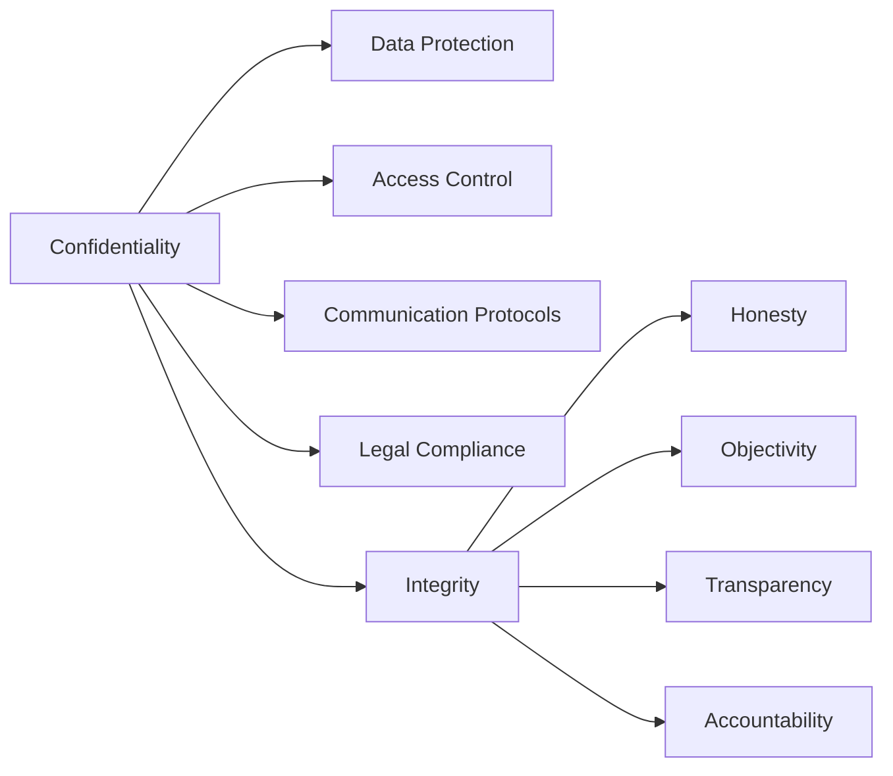

## 18.7 Confidentiality and Integrity

In the realm of managerial accounting, confidentiality and integrity are not just ethical imperatives but foundational principles that guide professional conduct and decision-making. As you prepare for the Canadian Accounting Exams, understanding these concepts is crucial, not only for passing the exams but also for your future career as a managerial accountant.

### Understanding Confidentiality in Managerial Accounting

Confidentiality refers to the obligation of accounting professionals to protect sensitive information from unauthorized access and disclosure. This responsibility is paramount in managerial accounting, where accountants often deal with proprietary data that can significantly impact a company's competitive position.

#### Key Aspects of Confidentiality

1. **Data Protection**: Managerial accountants must ensure that financial data, strategic plans, and other sensitive information are safeguarded against breaches. This involves implementing robust security measures and adhering to data protection regulations.

2. **Access Control**: Limiting access to confidential information to authorized personnel only is essential. This involves setting up protocols to determine who can view or handle specific data.

3. **Communication Protocols**: When discussing sensitive information, whether internally or externally, accountants must use secure communication channels to prevent unauthorized interception.

4. **Legal Compliance**: Compliance with laws such as the Personal Information Protection and Electronic Documents Act (PIPEDA) in Canada is mandatory. This includes understanding the legal framework governing data privacy and confidentiality.

#### Practical Example: Confidentiality in Action

Consider a scenario where a managerial accountant at a Canadian manufacturing firm is involved in preparing a budget for a new product line. The accountant must ensure that details about the product's cost structure, pricing strategy, and market entry plans are kept confidential to prevent competitors from gaining an advantage.

### The Role of Integrity in Managerial Accounting

Integrity in managerial accounting involves adhering to moral and ethical principles, ensuring honesty and fairness in all financial reporting and decision-making processes. It is the cornerstone of trust between accountants and their stakeholders.

#### Core Principles of Integrity

1. **Honesty**: Providing accurate and truthful information in financial reports and communications is non-negotiable. Misrepresentation of facts can lead to severe legal and reputational consequences.

2. **Objectivity**: Accountants must remain unbiased and impartial, ensuring that personal interests do not influence their professional judgment.

3. **Transparency**: Clear and open communication with stakeholders about financial matters fosters trust and accountability.

4. **Accountability**: Taking responsibility for one's actions and decisions is crucial. This includes acknowledging mistakes and taking corrective measures.

#### Case Study: Integrity in Decision Making

Imagine a managerial accountant faced with a situation where reporting inflated sales figures could temporarily boost the company's stock price. An accountant with integrity would resist such pressure, understanding the long-term damage to the company's reputation and legal standing.

### Confidentiality and Integrity: A Symbiotic Relationship

Confidentiality and integrity are interdependent. While confidentiality ensures that sensitive information is protected, integrity ensures that the information is accurate and used ethically. Together, they form the bedrock of ethical managerial accounting practices.

#### Diagram: The Interplay Between Confidentiality and Integrity

### Challenges in Maintaining Confidentiality and Integrity

Despite their importance, maintaining confidentiality and integrity can be challenging due to various factors:

1. **Technological Advancements**: With the rise of digital accounting systems, ensuring data security has become increasingly complex.

2. **Globalization**: Operating in multiple jurisdictions with varying legal standards can complicate compliance efforts.

3. **Pressure from Management**: Accountants may face pressure to manipulate data to meet financial targets or market expectations.

4. **Resource Constraints**: Limited resources can hinder the implementation of robust security and compliance measures.

### Strategies for Upholding Confidentiality and Integrity

To overcome these challenges, managerial accountants can adopt several strategies:

1. **Continuous Education**: Staying informed about the latest developments in data protection and ethical standards is crucial. This includes regular training and certification updates.

2. **Robust Internal Controls**: Implementing strong internal controls can prevent unauthorized access and ensure data accuracy.

3. **Ethical Leadership**: Encouraging a culture of ethics and integrity within the organization can mitigate the risk of unethical behavior.

4. **Whistleblower Protections**: Establishing mechanisms for reporting unethical conduct without fear of retaliation can help maintain integrity.

### Regulatory Frameworks and Standards

In Canada, several regulatory frameworks and standards guide the confidentiality and integrity of managerial accounting practices:

1. **CPA Canada Handbook**: Provides guidelines on ethical conduct and professional standards for accountants.

2. **International Financial Reporting Standards (IFRS)**: Adopted in Canada, these standards emphasize transparency and accuracy in financial reporting.

3. **Accounting Standards for Private Enterprises (ASPE)**: Offers a framework for financial reporting in private Canadian companies, ensuring consistency and reliability.

### Real-World Applications and Compliance Considerations

In practice, maintaining confidentiality and integrity involves adhering to both internal policies and external regulations. For example, a managerial accountant in a multinational corporation must navigate different privacy laws across countries while ensuring that financial reports comply with IFRS.

#### Example: Implementing a Confidentiality Policy

A Canadian tech company implements a confidentiality policy requiring all employees to sign non-disclosure agreements (NDAs) and undergo regular training on data protection. This policy helps safeguard proprietary technology and maintain competitive advantage.

### Best Practices for Canadian Managerial Accountants

1. **Develop a Code of Conduct**: Establish clear ethical guidelines for all accounting professionals within the organization.

2. **Regular Audits**: Conduct regular audits to assess compliance with confidentiality and integrity standards.

3. **Use of Technology**: Leverage technology to enhance data security and streamline compliance processes.

4. **Stakeholder Engagement**: Engage with stakeholders to understand their expectations and communicate the organization's commitment to ethical practices.

### Common Pitfalls and How to Avoid Them

1. **Neglecting Data Security**: Failing to invest in data security can lead to breaches and legal repercussions. Regularly update security protocols and conduct vulnerability assessments.

2. **Ignoring Ethical Dilemmas**: Address ethical dilemmas head-on by fostering an open dialogue and providing support for ethical decision-making.

3. **Overlooking Training**: Continuous training is essential to keep up with evolving standards and technologies. Implement a structured training program for all accounting staff.

### Exam Preparation Tips

As you prepare for the Canadian Accounting Exams, focus on understanding the principles of confidentiality and integrity, and how they apply to real-world scenarios. Practice applying these concepts through case studies and ethical dilemmas.

1. **Review Case Studies**: Analyze case studies that highlight confidentiality and integrity issues in managerial accounting.

2. **Practice Ethical Decision-Making**: Engage in exercises that simulate ethical dilemmas and require you to apply ethical principles.

3. **Stay Updated**: Keep abreast of the latest developments in accounting standards and regulations.

### Summary

Confidentiality and integrity are essential components of managerial accounting, ensuring that sensitive information is protected and ethical standards are upheld. By understanding and applying these principles, you can enhance your professional conduct and contribute to the success of your organization.

---

## **Ready to Test Your Knowledge?**



### What is the primary purpose of confidentiality in managerial accounting?

- [x] To protect sensitive information from unauthorized access
- [ ] To ensure financial statements are accurate
- [ ] To comply with tax regulations
- [ ] To improve financial performance

> **Explanation:** Confidentiality in managerial accounting focuses on safeguarding sensitive information from unauthorized access and disclosure.

### Which of the following is a key aspect of integrity in managerial accounting?

- [x] Honesty
- [ ] Profitability
- [ ] Efficiency
- [ ] Innovation

> **Explanation:** Integrity in managerial accounting involves adhering to ethical principles such as honesty, ensuring truthful and accurate reporting.

### How can managerial accountants ensure data protection?

- [x] Implementing robust security measures
- [ ] Increasing sales targets
- [ ] Reducing operational costs
- [ ] Expanding market reach

> **Explanation:** Data protection involves implementing security measures to safeguard sensitive information against breaches.

### What is the role of access control in maintaining confidentiality?

- [x] Limiting access to authorized personnel
- [ ] Increasing data availability
- [ ] Enhancing data visualization
- [ ] Improving customer service

> **Explanation:** Access control ensures that only authorized personnel can access sensitive information, maintaining confidentiality.

### Which regulatory framework guides ethical conduct for Canadian accountants?

- [x] CPA Canada Handbook
- [ ] Sarbanes-Oxley Act
- [ ] GAAP
- [ ] Basel III

> **Explanation:** The CPA Canada Handbook provides guidelines on ethical conduct and professional standards for Canadian accountants.

### What is a common challenge in maintaining confidentiality and integrity?

- [x] Technological advancements
- [ ] Increased competition
- [ ] Market saturation
- [ ] Product diversification

> **Explanation:** Technological advancements can complicate data security, posing challenges to maintaining confidentiality and integrity.

### How can organizations encourage ethical behavior among accountants?

- [x] Establishing a culture of ethics and integrity
- [ ] Offering financial incentives
- [ ] Reducing work hours
- [ ] Increasing marketing efforts

> **Explanation:** Encouraging a culture of ethics and integrity helps mitigate the risk of unethical behavior among accountants.

### What is the significance of transparency in managerial accounting?

- [x] Fostering trust and accountability
- [ ] Increasing profit margins
- [ ] Reducing production costs
- [ ] Enhancing brand image

> **Explanation:** Transparency in managerial accounting involves clear communication, fostering trust and accountability with stakeholders.

### Which of the following is a strategy for upholding confidentiality and integrity?

- [x] Continuous education and training
- [ ] Expanding product lines
- [ ] Increasing advertising spend
- [ ] Outsourcing operations

> **Explanation:** Continuous education and training help accountants stay informed about data protection and ethical standards.

### True or False: Confidentiality and integrity are independent concepts in managerial accounting.

- [ ] True
- [x] False

> **Explanation:** Confidentiality and integrity are interdependent concepts, both essential for ethical managerial accounting practices.


