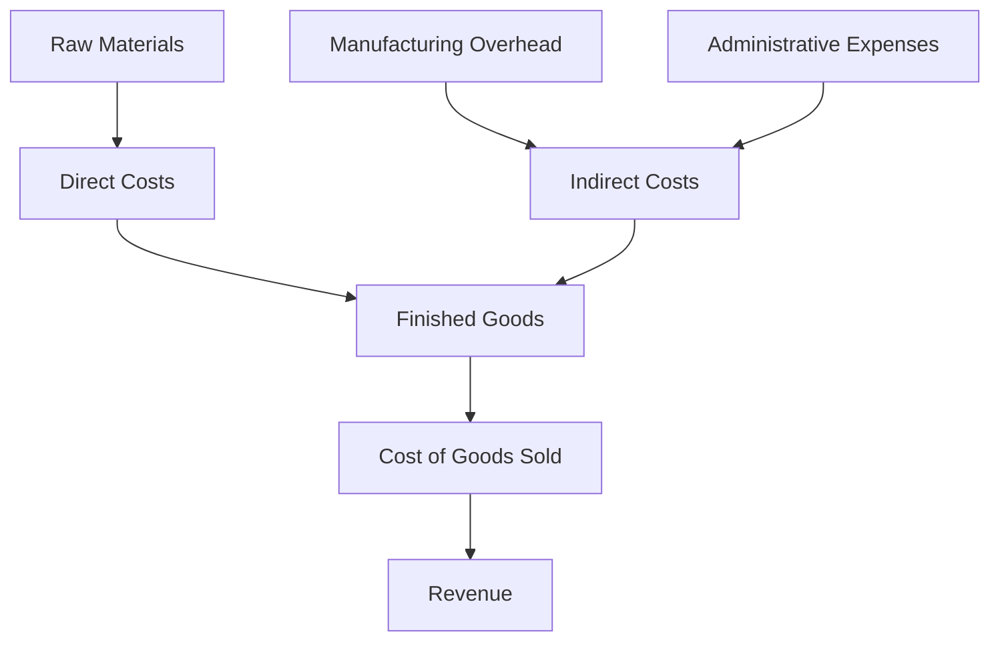

## 2.1 Cost Terminology

In managerial accounting, understanding cost terminology is fundamental to effective decision-making and financial management. Costs are the economic sacrifices made to achieve a specific objective, such as producing goods or providing services. This section delves into the essential cost terms, focusing on direct and indirect costs, and their significance in managerial accounting. We will explore how these costs are classified, measured, and applied in various business scenarios, providing you with a comprehensive understanding of their role in planning, controlling, and decision-making processes.

### **Understanding Costs**

Costs can be defined as the monetary value of resources used or consumed in the production of goods or services. They are crucial for determining pricing, budgeting, and profitability. In managerial accounting, costs are categorized based on their behavior, traceability, and relevance to decision-making. Let's begin by exploring the fundamental types of costs: direct and indirect costs.

### **Direct Costs**

Direct costs are expenses that can be directly traced to a specific cost object, such as a product, department, or project. These costs are easily identifiable and measurable, making them crucial for accurate cost allocation and pricing decisions. Common examples of direct costs include:

- **Direct Materials:** Raw materials and components that are used in the production of goods. For instance, wood used in furniture manufacturing or flour in a bakery.
- **Direct Labor:** Wages and salaries paid to employees who are directly involved in the production process. This includes assembly line workers or chefs in a restaurant.

#### **Characteristics of Direct Costs**

1. **Traceability:** Direct costs can be directly linked to a specific cost object without any ambiguity.
2. **Variability:** These costs often vary with the level of production or activity. As production increases, direct costs typically increase proportionally.
3. **Ease of Allocation:** Since they are easily identifiable, direct costs can be allocated accurately to cost objects.

### **Indirect Costs**

Indirect costs, also known as overhead costs, are expenses that cannot be directly traced to a specific cost object. Instead, they support multiple cost objects and require allocation based on a rational method. Examples of indirect costs include:

- **Manufacturing Overhead:** Costs related to the production process that are not directly tied to a specific product, such as factory rent, utilities, and maintenance.
- **Administrative Expenses:** Costs associated with the general management and administration of a business, like office supplies and salaries of administrative staff.

#### **Characteristics of Indirect Costs**

1. **Non-traceability:** Indirect costs cannot be directly linked to a single cost object, making allocation necessary.
2. **Fixed Nature:** Many indirect costs are fixed, meaning they do not change with the level of production or activity.
3. **Complex Allocation:** Allocating indirect costs requires the use of cost drivers and allocation bases to distribute costs fairly among cost objects.

### **Cost Classifications**

Understanding cost classifications is essential for effective cost management and decision-making. Costs can be classified based on various criteria, including behavior, function, and relevance. Let's explore these classifications in detail:

#### **Cost Behavior**

Cost behavior refers to how costs change in response to changes in business activity levels. Costs are classified as:

- **Fixed Costs:** Costs that remain constant regardless of production levels, such as rent and salaries.
- **Variable Costs:** Costs that vary directly with production levels, such as raw materials and direct labor.
- **Mixed Costs:** Costs that have both fixed and variable components, like utility bills that have a base charge plus a usage charge.

#### **Functional Classification**

Costs can also be classified based on their function within the organization:

- **Manufacturing Costs:** Costs incurred in the production of goods, including direct materials, direct labor, and manufacturing overhead.
- **Non-Manufacturing Costs:** Costs not directly tied to production, such as selling and administrative expenses.

#### **Relevance to Decision-Making**

Costs are classified based on their relevance to specific decisions:

- **Relevant Costs:** Costs that will be affected by a decision and should be considered in decision-making.
- **Irrelevant Costs:** Costs that will not be affected by a decision and should be ignored in decision-making.

### **Practical Examples and Applications**

To illustrate the application of cost terminology in managerial accounting, let's consider a few practical examples:

#### **Example 1: Direct Costs in a Manufacturing Company**

A furniture manufacturing company produces wooden chairs. The direct costs associated with producing each chair include the cost of wood, nails, and the wages of workers assembling the chairs. These costs are directly traceable to each chair produced, making them direct costs.

#### **Example 2: Indirect Costs in a Service Organization**

A consulting firm incurs various indirect costs, such as office rent, utilities, and administrative salaries. These costs support the overall operations of the firm and cannot be traced to a specific consulting project. Therefore, they are considered indirect costs.

#### **Example 3: Cost Behavior in a Retail Business**

A retail store incurs fixed costs such as rent and salaries, which remain constant regardless of sales volume. However, the cost of goods sold is a variable cost that changes with the number of products sold. Understanding these cost behaviors helps the store manage its budget and pricing strategies effectively.

### **Real-World Applications and Regulatory Scenarios**

In the Canadian accounting environment, understanding cost terminology is crucial for compliance with accounting standards and regulations. For instance, the International Financial Reporting Standards (IFRS) adopted in Canada require accurate cost allocation and reporting. Managerial accountants must ensure that costs are classified and reported correctly to comply with these standards.

### **Step-by-Step Guidance for Cost Allocation**

Allocating costs accurately is essential for financial reporting and decision-making. Here is a step-by-step guide to cost allocation:

1. **Identify Cost Objects:** Determine the specific products, departments, or projects to which costs will be allocated.
2. **Classify Costs:** Categorize costs as direct or indirect based on their traceability to cost objects.
3. **Select Allocation Bases:** Choose appropriate cost drivers or bases for allocating indirect costs. Common allocation bases include labor hours, machine hours, or square footage.
4. **Allocate Costs:** Distribute costs to cost objects using the selected allocation bases, ensuring accuracy and fairness.
5. **Review and Adjust:** Regularly review cost allocations to ensure they reflect actual resource usage and make adjustments as necessary.

### **Diagrams and Visual Aids**

To enhance understanding, let's use a Mermaid.js diagram to illustrate the flow of costs in a manufacturing organization:

This diagram shows how raw materials and manufacturing overhead contribute to the cost of goods sold, ultimately impacting revenue.

### **Best Practices and Common Pitfalls**

When managing costs, it's essential to follow best practices and avoid common pitfalls:

- **Best Practices:**
  - Regularly review and update cost classifications to reflect changes in business operations.
  - Use accurate and relevant allocation bases for indirect costs to ensure fair distribution.
  - Monitor cost behavior to identify opportunities for cost savings and efficiency improvements.

- **Common Pitfalls:**
  - Failing to update cost classifications can lead to inaccurate financial reporting.
  - Using inappropriate allocation bases can result in unfair cost distribution and distorted financial statements.
  - Ignoring cost behavior can lead to budget overruns and reduced profitability.

### **References and Additional Resources**

For further exploration of cost terminology and its applications in managerial accounting, consider the following resources:

- **CPA Canada:** Offers comprehensive guides and resources on accounting standards and practices.
- **International Financial Reporting Standards (IFRS):** Provides guidelines on cost classification and reporting.
- **Accounting Standards for Private Enterprises (ASPE):** Offers insights into cost management for private enterprises in Canada.

### **Summary and Key Points**

In this section, we explored the fundamental cost terminology in managerial accounting, focusing on direct and indirect costs. We discussed their characteristics, classifications, and applications in decision-making processes. Understanding these cost terms is crucial for effective cost management, financial reporting, and compliance with accounting standards.

### **Ready to Test Your Knowledge?**



### What is a direct cost?

- [x] A cost that can be directly traced to a specific cost object
- [ ] A cost that cannot be traced to a specific cost object
- [ ] A cost that remains constant regardless of production levels
- [ ] A cost that varies with production levels

> **Explanation:** Direct costs are expenses that can be directly traced to a specific cost object, such as a product or project.

### Which of the following is an example of an indirect cost?

- [ ] Direct labor
- [ ] Direct materials
- [x] Factory rent
- [ ] Raw materials

> **Explanation:** Indirect costs, like factory rent, cannot be directly traced to a specific cost object and support multiple cost objects.

### What is the primary characteristic of variable costs?

- [ ] They remain constant regardless of production levels
- [x] They vary directly with production levels
- [ ] They cannot be traced to a specific cost object
- [ ] They are fixed in nature

> **Explanation:** Variable costs change in direct proportion to changes in production levels.

### What is the purpose of cost allocation?

- [x] To distribute indirect costs to cost objects
- [ ] To trace direct costs to cost objects
- [ ] To reduce overall costs
- [ ] To increase profitability

> **Explanation:** Cost allocation involves distributing indirect costs to cost objects using appropriate allocation bases.

### Which of the following is a fixed cost?

- [ ] Direct materials
- [ ] Direct labor
- [x] Rent
- [ ] Utilities based on usage

> **Explanation:** Fixed costs, like rent, remain constant regardless of production levels.

### What is a mixed cost?

- [ ] A cost that is entirely fixed
- [ ] A cost that is entirely variable
- [x] A cost that has both fixed and variable components
- [ ] A cost that cannot be traced to a specific cost object

> **Explanation:** Mixed costs have both fixed and variable components, such as utility bills with a base charge and a usage charge.

### How are indirect costs allocated?

- [ ] Directly traced to cost objects
- [x] Distributed using cost drivers or allocation bases
- [ ] Ignored in financial reporting
- [ ] Treated as direct costs

> **Explanation:** Indirect costs are allocated to cost objects using cost drivers or allocation bases to ensure fair distribution.

### What is the significance of cost behavior analysis?

- [ ] It helps in tracing direct costs
- [x] It aids in budgeting and pricing decisions
- [ ] It is irrelevant to managerial accounting
- [ ] It reduces overall costs

> **Explanation:** Understanding cost behavior is crucial for making informed budgeting and pricing decisions.

### What is a relevant cost?

- [x] A cost that will be affected by a decision
- [ ] A cost that remains constant regardless of decisions
- [ ] A cost that cannot be traced to a specific cost object
- [ ] A cost that is fixed in nature

> **Explanation:** Relevant costs are those that will be affected by a decision and should be considered in decision-making.

### True or False: Indirect costs are always variable.

- [ ] True
- [x] False

> **Explanation:** Indirect costs can be fixed, variable, or mixed, depending on their nature and behavior.



By mastering these cost terms and concepts, you will be well-prepared to tackle cost-related questions on the Canadian Accounting Exams and apply this knowledge in your professional practice.
