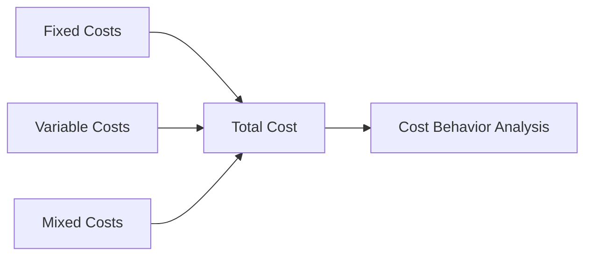

## 2.4 Fixed, Variable, and Mixed Costs

Understanding the behavior of costs is a fundamental aspect of managerial accounting. This knowledge is crucial for effective planning, controlling, and decision-making within an organization. In this section, we will delve into the concepts of fixed, variable, and mixed costs, examining their characteristics, implications, and applications in managerial accounting.

### **Understanding Cost Behavior Patterns**

Cost behavior refers to how costs change in response to changes in a company's level of activity. This understanding helps managers predict how costs will behave under different operational scenarios, which is essential for budgeting, forecasting, and strategic planning.

#### **Fixed Costs**

Fixed costs are expenses that do not change with the level of production or sales activity within a certain range. These costs remain constant regardless of the volume of goods or services produced by the organization. Examples of fixed costs include rent, salaries of permanent staff, and depreciation of equipment.

**Characteristics of Fixed Costs:**

- **Stability:** Fixed costs remain unchanged in total over a wide range of activity levels. This stability provides predictability in financial planning.
- **Per Unit Cost Variation:** While total fixed costs remain constant, the fixed cost per unit decreases as production increases. This is because the same total cost is spread over a larger number of units.
- **Capacity Considerations:** Fixed costs are often associated with the capacity of the organization, such as the cost of maintaining a factory or office space.

**Example:**

Consider a manufacturing company that rents a factory for $10,000 per month. Whether the company produces 1,000 units or 10,000 units, the rent remains $10,000. However, the fixed cost per unit decreases as production increases, as shown in the table below:

| Production Units | Total Fixed Cost | Fixed Cost Per Unit |
|------------------|------------------|---------------------|
| 1,000            | $10,000          | $10                 |
| 5,000            | $10,000          | $2                  |
| 10,000           | $10,000          | $1                  |

#### **Variable Costs**

Variable costs, in contrast, change directly and proportionately with changes in the level of production or sales. These costs increase as production increases and decrease as production decreases. Common examples of variable costs include raw materials, direct labor, and sales commissions.

**Characteristics of Variable Costs:**

- **Proportionality:** Variable costs change in direct proportion to changes in activity level. If production doubles, total variable costs will also double.
- **Per Unit Consistency:** The variable cost per unit remains constant, regardless of the level of activity.
- **Direct Association with Production:** Variable costs are often directly tied to the production process, making them easier to trace to specific products or services.

**Example:**

A company produces widgets, and the cost of raw materials is $5 per widget. If the company produces 1,000 widgets, the total variable cost for raw materials is $5,000. If production increases to 2,000 widgets, the total variable cost rises to $10,000. The variable cost per unit remains constant at $5.

#### **Mixed Costs**

Mixed costs, also known as semi-variable costs, contain both fixed and variable components. These costs change with the level of activity but not in direct proportion. Mixed costs are common in many business scenarios, such as utility bills, which have a fixed base charge plus a variable charge based on usage.

**Characteristics of Mixed Costs:**

- **Combination of Fixed and Variable Elements:** Mixed costs include a fixed component that does not change with activity level and a variable component that does.
- **Complexity in Analysis:** Analyzing mixed costs requires separating the fixed and variable components to understand how they behave with changes in activity.
- **Relevance in Decision Making:** Understanding mixed costs is crucial for accurate budgeting and cost control.

**Example:**

Consider a utility bill that has a fixed monthly charge of $50 plus $0.10 per kilowatt-hour (kWh) used. If a company uses 1,000 kWh in a month, the total cost is calculated as follows:

- Fixed cost: $50
- Variable cost: $0.10 x 1,000 kWh = $100
- Total cost: $50 + $100 = $150

### **Analyzing Cost Behavior**

Understanding the behavior of fixed, variable, and mixed costs is essential for several managerial accounting functions, including:

- **Budgeting:** Accurate cost behavior analysis helps in preparing realistic budgets that reflect expected costs at different levels of activity.
- **Cost Control:** Identifying and managing costs effectively requires an understanding of how costs behave. This knowledge allows managers to implement cost-saving measures.
- **Pricing Decisions:** Understanding cost behavior aids in setting prices that cover costs and achieve desired profit margins.
- **Break-even Analysis:** This involves determining the level of sales needed to cover all costs, which requires an understanding of fixed and variable costs.

### **Real-World Applications**

In the Canadian accounting profession, understanding cost behavior is vital for compliance with accounting standards and effective financial management. Organizations must accurately classify and report costs to adhere to regulations such as the International Financial Reporting Standards (IFRS) and Accounting Standards for Private Enterprises (ASPE).

### **Practical Example: Cost Behavior Analysis in a Canadian Manufacturing Firm**

Let's consider a Canadian manufacturing firm, Maple Leaf Manufacturing, which produces furniture. The company incurs the following costs:

- **Fixed Costs:** Rent for the factory space is $20,000 per month, and salaries for administrative staff total $15,000 per month.
- **Variable Costs:** The cost of wood is $50 per unit, and direct labor costs are $30 per unit.
- **Mixed Costs:** The utility bill includes a fixed charge of $500 and a variable charge of $0.05 per kWh.

**Scenario Analysis:**

1. **Current Production Level:** 1,000 units
   - Total Fixed Costs: $35,000
   - Total Variable Costs: ($50 + $30) x 1,000 = $80,000
   - Total Mixed Costs: $500 + ($0.05 x 10,000 kWh) = $1,000
   - Total Costs: $116,000

2. **Increased Production Level:** 2,000 units
   - Total Fixed Costs: $35,000 (unchanged)
   - Total Variable Costs: ($50 + $30) x 2,000 = $160,000
   - Total Mixed Costs: $500 + ($0.05 x 20,000 kWh) = $1,500
   - Total Costs: $196,500

This analysis helps Maple Leaf Manufacturing understand how costs will change with different production levels, aiding in decision-making and financial planning.

### **Visualizing Cost Behavior**

To further illustrate the concepts of fixed, variable, and mixed costs, let's use a Mermaid.js diagram to depict the cost behavior patterns:

### **Best Practices and Common Pitfalls**

**Best Practices:**

- **Accurate Classification:** Ensure costs are accurately classified as fixed, variable, or mixed to avoid errors in financial analysis.
- **Regular Review:** Periodically review cost classifications to account for changes in business operations or market conditions.
- **Use of Technology:** Utilize accounting software to track and analyze cost behavior efficiently.

**Common Pitfalls:**

- **Overlooking Mixed Costs:** Failing to separate fixed and variable components of mixed costs can lead to inaccurate financial projections.
- **Ignoring External Factors:** External factors such as economic conditions and regulatory changes can impact cost behavior and should be considered in analysis.

### **Conclusion**

Understanding fixed, variable, and mixed costs is crucial for effective managerial accounting. By analyzing cost behavior, organizations can make informed decisions, optimize resource allocation, and achieve financial objectives. This knowledge is not only essential for exam preparation but also for practical application in the Canadian accounting profession.

### **References and Further Reading**

- CPA Canada: [Management Accounting Guidelines](https://www.cpacanada.ca)
- IFRS Standards: [IFRS Foundation](https://www.ifrs.org)
- ASPE Standards: [CPA Canada ASPE](https://www.cpacanada.ca/en/business-and-accounting-resources/accounting-and-financial-reporting)

## **Ready to Test Your Knowledge?**



### Which of the following is a characteristic of fixed costs?

- [x] They remain constant in total regardless of activity level.
- [ ] They vary directly with production volume.
- [ ] They have both fixed and variable components.
- [ ] They are always variable per unit.

> **Explanation:** Fixed costs remain constant in total, regardless of changes in the level of production or sales activity.

### What happens to the fixed cost per unit as production increases?

- [x] It decreases.
- [ ] It increases.
- [ ] It remains constant.
- [ ] It fluctuates randomly.

> **Explanation:** As production increases, the fixed cost per unit decreases because the total fixed cost is spread over more units.

### Which cost type changes in direct proportion to production levels?

- [ ] Fixed costs
- [x] Variable costs
- [ ] Mixed costs
- [ ] Sunk costs

> **Explanation:** Variable costs change directly and proportionately with changes in production levels.

### What is a mixed cost?

- [ ] A cost that remains constant regardless of activity level.
- [ ] A cost that varies directly with production.
- [x] A cost that has both fixed and variable components.
- [ ] A cost that is irrelevant for decision-making.

> **Explanation:** Mixed costs contain both fixed and variable components, changing with activity level but not in direct proportion.

### In the context of cost behavior, what does the term "capacity" refer to?

- [x] The maximum level of activity that can be sustained.
- [ ] The variable cost per unit.
- [ ] The total cost at zero production.
- [ ] The fixed cost per unit.

> **Explanation:** Capacity refers to the maximum level of activity that an organization can sustain, often associated with fixed costs.

### Which of the following is an example of a variable cost?

- [ ] Rent
- [x] Direct materials
- [ ] Salaries of administrative staff
- [ ] Depreciation

> **Explanation:** Direct materials are a variable cost because they change in proportion to the level of production.

### How can mixed costs be analyzed?

- [x] By separating them into fixed and variable components.
- [ ] By treating them as entirely fixed.
- [ ] By treating them as entirely variable.
- [ ] By ignoring them in cost analysis.

> **Explanation:** Mixed costs should be separated into fixed and variable components to accurately analyze their behavior.

### What is the primary purpose of understanding cost behavior?

- [ ] To increase fixed costs.
- [ ] To eliminate variable costs.
- [x] To aid in budgeting and decision-making.
- [ ] To ignore mixed costs.

> **Explanation:** Understanding cost behavior helps in budgeting and decision-making by predicting how costs will change with activity levels.

### Which of the following is a common pitfall in cost behavior analysis?

- [x] Overlooking the mixed cost components.
- [ ] Accurately classifying costs.
- [ ] Regularly reviewing cost classifications.
- [ ] Using technology for cost tracking.

> **Explanation:** Overlooking the mixed cost components can lead to inaccurate financial projections and analysis.

### True or False: Fixed costs per unit increase as production decreases.

- [x] True
- [ ] False

> **Explanation:** True. As production decreases, the fixed cost per unit increases because the total fixed cost is spread over fewer units.


