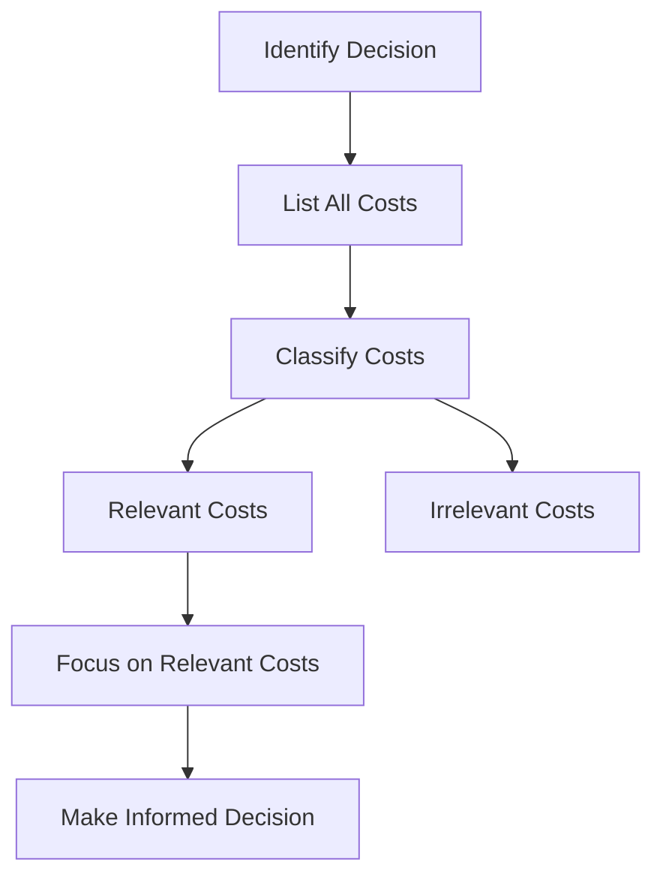

## 2.6 Relevant and Irrelevant Costs

In the realm of managerial accounting, understanding the distinction between relevant and irrelevant costs is crucial for making informed decisions. This section will delve into these concepts, providing you with the knowledge needed to identify which costs should influence your decision-making processes and which should not. By mastering these concepts, you will be better equipped to tackle questions on the Canadian Accounting Exams and apply these principles in real-world scenarios.

### Understanding Relevant Costs

**Relevant costs** are those costs that will be directly affected by a specific managerial decision. They are future costs that differ between alternatives. When making decisions, it is essential to focus on these costs as they have the potential to impact the outcome of the decision.

#### Characteristics of Relevant Costs

1. **Future-Oriented**: Relevant costs are expected to occur in the future. Past costs, or sunk costs, are not relevant because they cannot be changed by any decision made now or in the future.
   
2. **Differential**: These costs differ between decision alternatives. If a cost remains the same regardless of the decision made, it is not relevant.

3. **Avoidable**: Relevant costs can be avoided if a particular decision is not taken. This means they are directly tied to the decision at hand.

#### Examples of Relevant Costs

- **Direct Materials and Labor**: When deciding whether to produce a product, the costs of materials and labor that will be incurred are relevant.
  
- **Opportunity Costs**: The potential benefits lost when choosing one alternative over another are considered relevant.

- **Variable Costs**: Often, variable costs are relevant because they change with the level of production or service activity.

### Understanding Irrelevant Costs

**Irrelevant costs** are those that will not be affected by a decision. These costs should be ignored in the decision-making process as they do not impact the outcome.

#### Characteristics of Irrelevant Costs

1. **Sunk Costs**: Costs that have already been incurred and cannot be recovered. These are past costs and should not influence current decisions.

2. **Non-Differential**: Costs that remain constant across all decision alternatives.

3. **Unavoidable**: Costs that cannot be eliminated regardless of the decision made.

#### Examples of Irrelevant Costs

- **Sunk Costs**: Money spent on research and development that cannot be recovered.
  
- **Fixed Costs**: Often, fixed costs are irrelevant as they do not change with the level of production or service activity.

- **Allocated Costs**: Costs that are arbitrarily assigned to a product or department, such as corporate overhead.

### Practical Application in Decision-Making

To effectively apply the concepts of relevant and irrelevant costs in decision-making, it is important to follow a systematic approach:

1. **Identify the Decision**: Clearly define the decision that needs to be made.

2. **List All Costs**: Compile a comprehensive list of all costs associated with each alternative.

3. **Classify Costs**: Determine which costs are relevant and which are irrelevant by applying the characteristics discussed.

4. **Focus on Relevant Costs**: Use only the relevant costs to compare the alternatives and make an informed decision.

### Case Study: Make or Buy Decision

Consider a manufacturing company deciding whether to produce a component in-house or purchase it from an external supplier. The relevant costs in this scenario might include:

- **Direct Materials and Labor**: Costs of producing the component in-house.
  
- **Opportunity Cost**: The potential revenue from using the production capacity for another product.

- **Supplier Price**: The cost of purchasing the component from the supplier.

Irrelevant costs might include:

- **Sunk Costs**: Previous investments in machinery that cannot be recovered.

- **Fixed Overhead**: Costs that will remain unchanged regardless of the decision.

By focusing on the relevant costs, the company can make a decision that maximizes its financial benefit.

### Real-World Applications and Regulatory Scenarios

In the Canadian context, understanding relevant and irrelevant costs is vital not only for passing exams but also for complying with accounting standards and regulations. For instance, when preparing financial statements under the International Financial Reporting Standards (IFRS) as adopted in Canada, it is important to accurately classify costs to ensure transparency and compliance.

### Diagrams and Visual Aids

To further illustrate the concept of relevant and irrelevant costs, consider the following diagram that outlines the decision-making process:

### Best Practices and Common Pitfalls

**Best Practices:**

- Always focus on future costs that differ between alternatives.
- Regularly review and update cost data to ensure accuracy.
- Use relevant cost analysis as part of a broader decision-making framework.

**Common Pitfalls:**

- Including sunk costs in the analysis, which can lead to poor decision-making.
- Overlooking opportunity costs, which can result in missed benefits.
- Confusing fixed costs with irrelevant costs; while often irrelevant, fixed costs can sometimes be relevant if they change with the decision.

### Conclusion

Understanding relevant and irrelevant costs is essential for effective managerial decision-making. By focusing on costs that truly impact the decision at hand, you can make more informed and financially sound choices. This knowledge is not only crucial for passing the Canadian Accounting Exams but also for succeeding in your accounting career.

### References and Further Reading

- CPA Canada Handbook
- International Financial Reporting Standards (IFRS)
- Accounting Standards for Private Enterprises (ASPE)

### Ready to Test Your Knowledge?



### Which of the following is a characteristic of relevant costs?

- [x] They are future-oriented.
- [ ] They are sunk costs.
- [ ] They are non-differential.
- [ ] They are unavoidable.

> **Explanation:** Relevant costs are future-oriented, meaning they will occur in the future and can be influenced by the decision at hand.

### What type of cost is considered irrelevant in decision-making?

- [x] Sunk costs
- [ ] Opportunity costs
- [ ] Variable costs
- [ ] Direct materials

> **Explanation:** Sunk costs are irrelevant because they have already been incurred and cannot be changed by any future decision.

### In a make or buy decision, which of the following is a relevant cost?

- [x] Direct labor costs
- [ ] Sunk costs
- [ ] Fixed overhead
- [ ] Allocated costs

> **Explanation:** Direct labor costs are relevant because they will be incurred if the decision is made to produce the component in-house.

### Which of the following is an example of an irrelevant cost?

- [x] Allocated corporate overhead
- [ ] Direct materials
- [ ] Opportunity cost
- [ ] Variable production costs

> **Explanation:** Allocated corporate overhead is irrelevant because it does not change with the decision and is arbitrarily assigned.

### What is the primary focus when analyzing relevant costs?

- [x] Future costs that differ between alternatives
- [ ] Past costs that have already been incurred
- [ ] Costs that remain constant across all alternatives
- [ ] Costs that cannot be avoided

> **Explanation:** The primary focus is on future costs that differ between alternatives, as these will impact the decision outcome.

### Which cost is typically considered relevant in a decision to discontinue a product line?

- [x] Opportunity cost
- [ ] Sunk cost
- [ ] Fixed overhead
- [ ] Allocated costs

> **Explanation:** Opportunity cost is relevant because it represents the potential benefits lost if the product line is discontinued.

### How should irrelevant costs be treated in decision-making?

- [x] They should be ignored.
- [ ] They should be included in the analysis.
- [ ] They should be prioritized.
- [ ] They should be minimized.

> **Explanation:** Irrelevant costs should be ignored because they do not impact the decision outcome.

### Which of the following costs is most likely to be relevant in a special order decision?

- [x] Variable production costs
- [ ] Sunk costs
- [ ] Allocated costs
- [ ] Fixed overhead

> **Explanation:** Variable production costs are relevant because they will be incurred if the special order is accepted.

### What is the impact of including irrelevant costs in decision-making?

- [x] It can lead to poor decision-making.
- [ ] It improves decision accuracy.
- [ ] It has no impact.
- [ ] It simplifies the decision process.

> **Explanation:** Including irrelevant costs can lead to poor decision-making because they do not affect the decision outcome.

### True or False: Fixed costs are always irrelevant in decision-making.

- [ ] True
- [x] False

> **Explanation:** Fixed costs are not always irrelevant. They can be relevant if they change with the decision.


