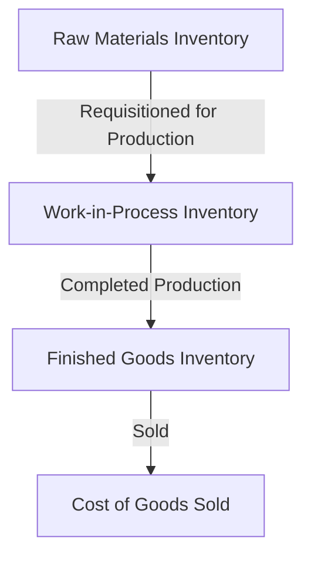

## 2.9 Cost Flows in Manufacturing Organizations

Understanding the flow of costs within manufacturing organizations is crucial for effective managerial accounting. This section delves into how costs move through various inventory accounts, providing a comprehensive overview of the processes involved in tracking and managing these costs. By mastering these concepts, you will be better equipped to analyze financial statements, make informed decisions, and succeed in your Canadian accounting exams.

### Introduction to Cost Flows

In manufacturing organizations, costs flow through several stages before they are reflected in the financial statements. These stages include raw materials, work-in-process (WIP), and finished goods. Each stage represents a different phase of production, and understanding how costs are allocated and transferred between these stages is essential for accurate financial reporting and decision-making.

### The Role of Inventory Accounts

Inventory accounts play a pivotal role in tracking the flow of costs within a manufacturing organization. These accounts include:

1. **Raw Materials Inventory**: This account tracks the cost of materials that have been purchased but not yet used in production. It represents the starting point of the cost flow process.

2. **Work-in-Process (WIP) Inventory**: This account captures the costs associated with products that are in the process of being manufactured but are not yet complete. It includes direct materials, direct labor, and manufacturing overhead.

3. **Finished Goods Inventory**: This account reflects the cost of completed products that are ready for sale. Once products are sold, costs are transferred from this account to the cost of goods sold (COGS) on the income statement.

### Cost Flow Process

The cost flow process in manufacturing organizations can be visualized as a series of transactions that move costs from one inventory account to another. Let's explore each stage in detail:

#### 1. Raw Materials to Work-in-Process

The flow of costs begins with the purchase of raw materials. When materials are requisitioned for production, their costs are transferred from the Raw Materials Inventory account to the Work-in-Process Inventory account. This transfer reflects the consumption of materials in the production process.

**Example**: A furniture manufacturer purchases $10,000 worth of wood. As the wood is used in production, its cost is transferred to the WIP account.

#### 2. Work-in-Process to Finished Goods

As production progresses, additional costs such as direct labor and manufacturing overhead are added to the Work-in-Process Inventory account. Once the production process is complete, the total cost of the finished products is transferred to the Finished Goods Inventory account.

**Example**: The furniture manufacturer incurs $5,000 in direct labor and $3,000 in manufacturing overhead. These costs are added to the WIP account. Upon completion, the total cost of $18,000 ($10,000 + $5,000 + $3,000) is transferred to the Finished Goods Inventory account.

#### 3. Finished Goods to Cost of Goods Sold

When finished goods are sold, their costs are transferred from the Finished Goods Inventory account to the Cost of Goods Sold (COGS) account on the income statement. This transfer reflects the expense associated with the sale of products.

**Example**: The furniture manufacturer sells the finished furniture for $25,000. The cost of $18,000 is transferred to COGS, resulting in a gross profit of $7,000.

### Visualizing Cost Flows

To better understand the cost flow process, let's visualize it using a diagram:

### Importance of Accurate Cost Allocation

Accurate cost allocation is critical for several reasons:

- **Financial Reporting**: Proper cost allocation ensures that financial statements accurately reflect the cost of goods sold and inventory values, which are essential for assessing profitability and financial health.

- **Decision-Making**: Managers rely on accurate cost information to make informed decisions about pricing, production, and resource allocation.

- **Compliance**: Adhering to accounting standards and regulations, such as the International Financial Reporting Standards (IFRS) and Accounting Standards for Private Enterprises (ASPE), is essential for maintaining credibility and avoiding legal issues.

### Challenges in Cost Flows

Manufacturing organizations may face several challenges in managing cost flows, including:

- **Complex Production Processes**: Complex production processes can make it difficult to accurately track and allocate costs.

- **Overhead Allocation**: Allocating manufacturing overhead to products can be challenging, especially when overhead costs vary significantly.

- **Inventory Valuation**: Choosing the appropriate inventory valuation method (e.g., FIFO, LIFO, or weighted average) can impact financial statements and tax liabilities.

### Best Practices for Managing Cost Flows

To effectively manage cost flows, manufacturing organizations should consider the following best practices:

- **Implement Robust Accounting Systems**: Use accounting software and systems that facilitate accurate tracking and allocation of costs.

- **Regularly Review Cost Allocation Methods**: Periodically review and update cost allocation methods to ensure they reflect current production processes and cost structures.

- **Conduct Cost Audits**: Regularly audit cost flows to identify discrepancies and ensure compliance with accounting standards.

- **Train Staff**: Provide training to accounting and production staff to ensure they understand cost flow processes and their importance.

### Real-World Applications

Understanding cost flows is not only essential for exam preparation but also for real-world applications. For instance, a Canadian manufacturing company might use cost flow analysis to:

- **Optimize Production**: By analyzing cost flows, the company can identify inefficiencies in the production process and implement improvements to reduce costs.

- **Enhance Pricing Strategies**: Accurate cost information allows the company to set competitive prices that maximize profitability.

- **Improve Inventory Management**: Effective cost flow management helps the company maintain optimal inventory levels, reducing carrying costs and minimizing stockouts.

### Conclusion

Mastering the flow of costs in manufacturing organizations is a fundamental aspect of managerial accounting. By understanding how costs move through inventory accounts and the impact on financial statements, you will be better prepared to analyze financial data, make informed decisions, and succeed in your Canadian accounting exams. Remember to apply the concepts learned in this section to real-world scenarios and practice regularly to reinforce your understanding.

## **Ready to Test Your Knowledge?**



### What is the first stage in the cost flow process in manufacturing organizations?

- [x] Raw Materials Inventory
- [ ] Work-in-Process Inventory
- [ ] Finished Goods Inventory
- [ ] Cost of Goods Sold

> **Explanation:** The cost flow process begins with the Raw Materials Inventory, where the costs of purchased materials are initially recorded.

### When are costs transferred from Work-in-Process Inventory to Finished Goods Inventory?

- [x] Upon completion of production
- [ ] When materials are requisitioned
- [ ] When goods are sold
- [ ] At the end of the fiscal year

> **Explanation:** Costs are transferred from Work-in-Process Inventory to Finished Goods Inventory once production is complete.

### What costs are included in the Work-in-Process Inventory account?

- [x] Direct materials, direct labor, and manufacturing overhead
- [ ] Only direct materials
- [ ] Only direct labor
- [ ] Only manufacturing overhead

> **Explanation:** The Work-in-Process Inventory account includes direct materials, direct labor, and manufacturing overhead costs.

### How does the sale of finished goods impact the financial statements?

- [x] Costs are transferred to Cost of Goods Sold
- [ ] Costs remain in Finished Goods Inventory
- [ ] Costs are transferred to Raw Materials Inventory
- [ ] Costs are written off as a loss

> **Explanation:** When finished goods are sold, their costs are transferred from Finished Goods Inventory to Cost of Goods Sold on the income statement.

### Which inventory account reflects the cost of completed products ready for sale?

- [x] Finished Goods Inventory
- [ ] Raw Materials Inventory
- [ ] Work-in-Process Inventory
- [ ] Cost of Goods Sold

> **Explanation:** The Finished Goods Inventory account reflects the cost of completed products that are ready for sale.

### What is a common challenge in managing cost flows in manufacturing organizations?

- [x] Overhead allocation
- [ ] Direct labor tracking
- [ ] Raw material procurement
- [ ] Sales forecasting

> **Explanation:** Overhead allocation is a common challenge in managing cost flows, as it involves distributing indirect costs to products.

### Why is accurate cost allocation important for financial reporting?

- [x] It ensures financial statements accurately reflect costs
- [ ] It simplifies tax calculations
- [ ] It reduces production costs
- [ ] It increases sales revenue

> **Explanation:** Accurate cost allocation ensures that financial statements accurately reflect the cost of goods sold and inventory values.

### What is one best practice for managing cost flows?

- [x] Implement robust accounting systems
- [ ] Increase production speed
- [ ] Reduce labor costs
- [ ] Outsource manufacturing

> **Explanation:** Implementing robust accounting systems helps track and allocate costs accurately, improving cost flow management.

### How can cost flow analysis benefit a manufacturing company?

- [x] By optimizing production and enhancing pricing strategies
- [ ] By reducing employee wages
- [ ] By increasing inventory levels
- [ ] By decreasing marketing expenses

> **Explanation:** Cost flow analysis can help optimize production processes and enhance pricing strategies, leading to increased profitability.

### True or False: Costs are transferred from Finished Goods Inventory to Work-in-Process Inventory when goods are sold.

- [ ] True
- [x] False

> **Explanation:** Costs are transferred from Finished Goods Inventory to Cost of Goods Sold, not Work-in-Process Inventory, when goods are sold.


