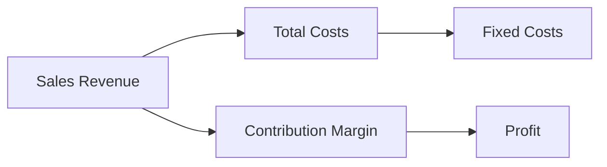

## 6.5 Contribution Margin Concepts

In the realm of managerial accounting, the contribution margin is a pivotal concept that aids in understanding how sales affect profitability. It serves as a crucial tool for decision-making, particularly in cost-volume-profit (CVP) analysis, pricing strategies, and profitability assessments. This section delves into the intricacies of contribution margin, offering insights into its calculation, applications, and significance in managerial decisions.

### Understanding Contribution Margin

The contribution margin is the amount remaining from sales revenue after all variable expenses have been deducted. It is a measure of a company's ability to cover its fixed costs with the revenue generated from sales. The contribution margin can be expressed in several forms:

- **Contribution Margin in Dollars:** This is calculated by subtracting total variable costs from total sales revenue.
  
  
  \text{Contribution Margin} = \text{Sales Revenue} - \text{Variable Costs}
  

- **Contribution Margin Per Unit:** This represents the contribution margin for each unit sold and is calculated by subtracting the variable cost per unit from the selling price per unit.

  
  \text{Contribution Margin Per Unit} = \text{Selling Price Per Unit} - \text{Variable Cost Per Unit}
  

- **Contribution Margin Ratio:** This is the contribution margin expressed as a percentage of sales revenue. It indicates the proportion of sales revenue that contributes to covering fixed costs and generating profit.

  
  \text{Contribution Margin Ratio} = \frac{\text{Contribution Margin}}{\text{Sales Revenue}} \times 100
  

### Importance of Contribution Margin

The contribution margin is a vital metric for several reasons:

1. **Break-Even Analysis:** Understanding the contribution margin helps in determining the break-even point, which is the level of sales at which total revenues equal total costs, resulting in zero profit. The break-even point in units can be calculated using the following formula:

   
   \text{Break-Even Point (Units)} = \frac{\text{Total Fixed Costs}}{\text{Contribution Margin Per Unit}}
   

2. **Profit Planning:** By analyzing the contribution margin, businesses can plan for desired profit levels. The target profit analysis involves determining the sales volume needed to achieve a specific profit target.

3. **Pricing Decisions:** The contribution margin provides insights into the impact of pricing changes on profitability. It helps in setting prices that cover variable costs and contribute to fixed costs and profit.

4. **Cost Control:** By focusing on the contribution margin, managers can identify areas where cost control can enhance profitability. It highlights the impact of variable cost changes on overall profitability.

5. **Product Line Decisions:** The contribution margin aids in evaluating the profitability of different products or services, guiding decisions on whether to add or discontinue product lines.

### Contribution Margin in Cost-Volume-Profit (CVP) Analysis

CVP analysis is a tool used to understand the relationship between costs, volume, and profit. The contribution margin plays a central role in this analysis by helping managers assess how changes in sales volume, costs, and prices affect profitability.

#### Key Components of CVP Analysis

- **Fixed Costs:** Costs that remain constant regardless of the level of production or sales volume.
- **Variable Costs:** Costs that vary directly with the level of production or sales volume.
- **Sales Volume:** The number of units sold.
- **Contribution Margin:** The amount remaining from sales revenue after variable costs are deducted.

#### CVP Graph

A CVP graph visually represents the relationships between costs, volume, and profit. It typically includes lines for total revenue, total costs, and the break-even point. The contribution margin is depicted as the area between the total revenue and total variable cost lines.

### Practical Examples and Scenarios

#### Example 1: Break-Even Analysis

Consider a company that sells a product for $50 per unit. The variable cost per unit is $30, and the total fixed costs are $20,000. To find the break-even point in units:

- Contribution Margin Per Unit = $50 - $30 = $20
- Break-Even Point (Units) = $20,000 / $20 = 1,000 units

This means the company must sell 1,000 units to cover all costs and break even.

#### Example 2: Target Profit Analysis

Using the same company data, if the company wants to achieve a profit of $10,000, the required sales volume can be calculated as follows:

- Required Sales Volume (Units) = (Total Fixed Costs + Target Profit) / Contribution Margin Per Unit
- Required Sales Volume (Units) = ($20,000 + $10,000) / $20 = 1,500 units

The company needs to sell 1,500 units to achieve a $10,000 profit.

### Contribution Margin and Decision-Making

#### Pricing Strategies

The contribution margin is instrumental in pricing decisions. By understanding the contribution margin, managers can set prices that maximize profitability while remaining competitive. For instance, if a company wants to introduce a discount, it must ensure that the reduced price still covers variable costs and contributes to fixed costs.

#### Product Mix Decisions

In scenarios where resources are limited, such as production capacity or raw materials, the contribution margin helps in deciding the optimal product mix. Products with higher contribution margins are prioritized to maximize overall profitability.

#### Make or Buy Decisions

The contribution margin is also crucial in make-or-buy decisions, where a company must decide whether to produce a component in-house or purchase it from an external supplier. The decision is based on comparing the contribution margin of in-house production with the cost of purchasing.

### Real-World Applications

In the Canadian context, businesses often use contribution margin analysis to navigate competitive markets and regulatory environments. For example, a Canadian manufacturing firm might use contribution margin analysis to optimize its product lines and pricing strategies in response to changes in trade policies or currency fluctuations.

### Challenges and Best Practices

#### Common Pitfalls

- **Ignoring Fixed Costs:** While the contribution margin focuses on variable costs, it's essential not to overlook fixed costs in decision-making.
- **Overemphasis on Contribution Margin:** Relying solely on contribution margin without considering other factors, such as market demand and competitive dynamics, can lead to suboptimal decisions.

#### Best Practices

- **Regular Analysis:** Conduct regular contribution margin analysis to adapt to changing market conditions and cost structures.
- **Integrate with Other Metrics:** Use contribution margin analysis alongside other financial metrics for comprehensive decision-making.

### Conclusion

The contribution margin is a fundamental concept in managerial accounting, providing valuable insights into cost behavior, pricing strategies, and profitability analysis. By mastering contribution margin concepts, you can enhance your decision-making capabilities and drive business success.

### References and Further Reading

- CPA Canada Handbook
- International Financial Reporting Standards (IFRS)
- Accounting Standards for Private Enterprises (ASPE)

---

## **Ready to Test Your Knowledge?**



### What is the primary purpose of contribution margin in managerial accounting?

- [x] To determine the amount available to cover fixed costs and generate profit
- [ ] To calculate total sales revenue
- [ ] To measure the efficiency of production processes
- [ ] To assess the liquidity of a company

> **Explanation:** The contribution margin is used to determine the amount available to cover fixed costs and generate profit after variable costs have been deducted from sales revenue.

### How is the contribution margin per unit calculated?

- [x] Selling price per unit minus variable cost per unit
- [ ] Total sales revenue minus total fixed costs
- [ ] Total variable costs divided by total sales volume
- [ ] Fixed costs divided by sales volume

> **Explanation:** The contribution margin per unit is calculated by subtracting the variable cost per unit from the selling price per unit.

### What does a high contribution margin ratio indicate?

- [x] A large portion of sales revenue is available to cover fixed costs and profit
- [ ] The company has high fixed costs
- [ ] The company is not profitable
- [ ] The company has low sales volume

> **Explanation:** A high contribution margin ratio indicates that a large portion of sales revenue is available to cover fixed costs and contribute to profit.

### Which of the following is a key component of cost-volume-profit analysis?

- [x] Contribution margin
- [ ] Net income
- [ ] Gross profit
- [ ] Operating expenses

> **Explanation:** Contribution margin is a key component of cost-volume-profit analysis, as it helps assess how changes in sales volume, costs, and prices affect profitability.

### In a break-even analysis, what does the break-even point represent?

- [x] The level of sales at which total revenues equal total costs
- [ ] The point where total variable costs exceed total fixed costs
- [ ] The maximum profit achievable
- [ ] The minimum sales required to cover variable costs

> **Explanation:** The break-even point represents the level of sales at which total revenues equal total costs, resulting in zero profit.

### What role does contribution margin play in pricing decisions?

- [x] It helps set prices that cover variable costs and contribute to fixed costs and profit
- [ ] It determines the total sales revenue
- [ ] It measures the efficiency of production processes
- [ ] It assesses the liquidity of a company

> **Explanation:** Contribution margin helps set prices that cover variable costs and contribute to fixed costs and profit, ensuring profitability.

### Why is contribution margin important in product mix decisions?

- [x] It helps prioritize products with higher contribution margins to maximize profitability
- [ ] It calculates total sales revenue
- [ ] It measures the efficiency of production processes
- [ ] It assesses the liquidity of a company

> **Explanation:** Contribution margin is important in product mix decisions because it helps prioritize products with higher contribution margins to maximize profitability.

### How does contribution margin assist in make-or-buy decisions?

- [x] By comparing the contribution margin of in-house production with the cost of purchasing
- [ ] By calculating total sales revenue
- [ ] By measuring the efficiency of production processes
- [ ] By assessing the liquidity of a company

> **Explanation:** Contribution margin assists in make-or-buy decisions by comparing the contribution margin of in-house production with the cost of purchasing from an external supplier.

### What is a common pitfall in using contribution margin analysis?

- [x] Ignoring fixed costs in decision-making
- [ ] Overestimating sales revenue
- [ ] Underestimating variable costs
- [ ] Focusing too much on liquidity

> **Explanation:** A common pitfall in using contribution margin analysis is ignoring fixed costs in decision-making, which can lead to inaccurate conclusions.

### True or False: Contribution margin analysis should be used in isolation for decision-making.

- [ ] True
- [x] False

> **Explanation:** Contribution margin analysis should not be used in isolation for decision-making. It should be integrated with other financial metrics for comprehensive analysis.


