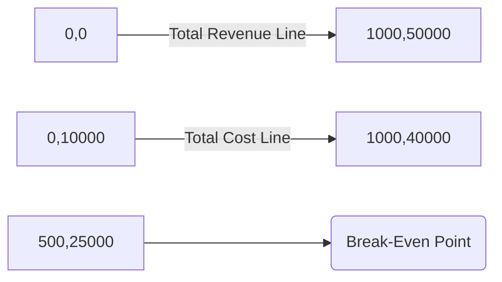

## 6.8 Cost-Volume-Profit (CVP) Charts

Cost-Volume-Profit (CVP) analysis is a powerful tool in managerial accounting that helps businesses understand the relationship between costs, sales volume, and profit. CVP charts provide a visual representation of these relationships, enabling managers to make informed decisions about pricing, product mix, and cost control. This section will guide you through the principles of CVP analysis, the construction and interpretation of CVP charts, and their application in strategic decision-making.

### Understanding Cost-Volume-Profit Analysis

Cost-Volume-Profit analysis is a method used to determine how changes in costs and volume affect a company's operating income and net income. It is a crucial part of managerial accounting, providing insights into how various factors impact profitability. The primary components of CVP analysis include:

- **Fixed Costs:** Costs that remain constant regardless of the level of production or sales, such as rent, salaries, and insurance.
- **Variable Costs:** Costs that vary directly with the level of production or sales, such as raw materials and direct labor.
- **Sales Price per Unit:** The amount charged to customers for each unit sold.
- **Contribution Margin:** The difference between sales revenue and variable costs, representing the amount available to cover fixed costs and generate profit.
- **Break-Even Point:** The sales volume at which total revenue equals total costs, resulting in zero profit.

### Constructing a CVP Chart

A CVP chart is a graphical representation of the relationships between costs, volume, and profit. It typically includes the following elements:

1. **X-Axis (Horizontal):** Represents the sales volume or number of units sold.
2. **Y-Axis (Vertical):** Represents the total costs and total revenue.
3. **Total Revenue Line:** A line starting from the origin, representing the total revenue at various sales volumes. The slope of this line is determined by the sales price per unit.
4. **Total Cost Line:** A line representing the total costs (fixed plus variable) at different sales volumes. This line starts at the level of fixed costs on the Y-axis and increases with the slope of variable costs per unit.
5. **Break-Even Point:** The intersection of the total revenue line and the total cost line, indicating the sales volume at which the company neither makes a profit nor incurs a loss.

#### Example of a CVP Chart

Let's consider a company that sells a product for $50 per unit, with fixed costs of $10,000 and variable costs of $30 per unit. The CVP chart would be constructed as follows:

- **Total Revenue Line:** Starts at the origin (0,0) and rises with a slope of $50 per unit.
- **Total Cost Line:** Starts at $10,000 on the Y-axis and rises with a slope of $30 per unit.
- **Break-Even Point:** Calculated by dividing total fixed costs by the contribution margin per unit ($50 - $30 = $20), resulting in a break-even volume of 500 units.

### Interpreting CVP Charts

CVP charts provide valuable insights into the financial dynamics of a business. Key interpretations include:

- **Profitability Zones:** The area above the break-even point represents profit, while the area below indicates a loss.
- **Margin of Safety:** The difference between actual or projected sales and the break-even sales volume. A larger margin of safety indicates lower risk.
- **Operating Leverage:** The degree to which a company uses fixed costs in its cost structure. High operating leverage means that small changes in sales volume can lead to significant changes in profit.

### Applications of CVP Charts

CVP charts are used in various strategic decision-making scenarios:

- **Pricing Strategies:** Analyzing how changes in sales price affect profitability and break-even volume.
- **Cost Control:** Identifying opportunities to reduce fixed or variable costs to enhance profitability.
- **Product Mix Decisions:** Evaluating the impact of different product combinations on overall profitability.
- **Budgeting and Forecasting:** Using CVP analysis to set realistic sales targets and budget allocations.

### Real-World Applications and Case Studies

#### Case Study: Pricing Strategy Adjustment

A Canadian manufacturing company was facing increased competition and needed to adjust its pricing strategy. By using CVP charts, the company analyzed the impact of reducing its sales price by 10% while maintaining its current cost structure. The analysis revealed that the new break-even point would require an increase in sales volume by 20% to maintain profitability. This insight helped the company make an informed decision about its pricing strategy.

#### Case Study: Cost Reduction Initiative

A service organization in Canada aimed to improve its profitability by reducing variable costs. Through CVP analysis, the company identified that a 5% reduction in variable costs would lower the break-even point by 15%. This finding enabled the organization to implement targeted cost-saving measures without compromising service quality.

### Best Practices and Common Pitfalls

#### Best Practices

- **Regular Updates:** Continuously update CVP charts with current data to reflect changes in costs, prices, and sales volume.
- **Scenario Analysis:** Use CVP charts to evaluate different scenarios, such as changes in market conditions or cost structures.
- **Integration with Other Tools:** Combine CVP analysis with other managerial accounting tools, such as budgeting and variance analysis, for comprehensive decision-making.

#### Common Pitfalls

- **Ignoring Fixed Costs:** Failing to account for all fixed costs can lead to inaccurate break-even analysis.
- **Overlooking External Factors:** CVP analysis should consider external factors, such as market trends and economic conditions, that can impact sales volume and costs.
- **Assuming Linear Relationships:** CVP charts assume linear relationships between costs and volume, which may not always hold true in real-world scenarios.

### Exam Preparation Tips

- **Understand Key Concepts:** Focus on understanding the components of CVP analysis, such as fixed and variable costs, contribution margin, and break-even point.
- **Practice Graphical Analysis:** Practice constructing and interpreting CVP charts to enhance your analytical skills.
- **Apply Real-World Scenarios:** Use case studies and real-world examples to relate theoretical concepts to practical applications.
- **Review Canadian Standards:** Familiarize yourself with Canadian accounting standards and guidelines related to cost behavior and profitability analysis.

### Conclusion

Cost-Volume-Profit charts are an essential tool in managerial accounting, providing valuable insights into the financial dynamics of a business. By mastering CVP analysis, you can enhance your decision-making capabilities and contribute to the strategic success of your organization. Practice constructing and interpreting CVP charts, and apply these skills to real-world scenarios to prepare effectively for your Canadian Accounting Exams.

## **Ready to Test Your Knowledge?**



### What is the primary purpose of a Cost-Volume-Profit (CVP) chart?

- [x] To visually represent the relationship between costs, volume, and profit
- [ ] To calculate the exact profit for a given sales volume
- [ ] To determine the tax liabilities of a company
- [ ] To forecast future economic conditions

> **Explanation:** A CVP chart is used to visually represent the relationship between costs, volume, and profit, helping managers make informed decisions.

### In a CVP chart, what does the intersection of the total revenue line and the total cost line represent?

- [x] Break-even point
- [ ] Maximum profit point
- [ ] Minimum loss point
- [ ] Contribution margin

> **Explanation:** The intersection of the total revenue line and the total cost line represents the break-even point, where total revenue equals total costs.

### Which of the following is NOT a component of CVP analysis?

- [ ] Fixed Costs
- [ ] Variable Costs
- [x] Tax Rate
- [ ] Contribution Margin

> **Explanation:** Tax rate is not a component of CVP analysis. CVP focuses on fixed costs, variable costs, and contribution margin.

### What is the slope of the total revenue line in a CVP chart determined by?

- [x] Sales price per unit
- [ ] Variable cost per unit
- [ ] Fixed cost per unit
- [ ] Break-even volume

> **Explanation:** The slope of the total revenue line is determined by the sales price per unit.

### How can a company increase its margin of safety?

- [x] Increase sales volume
- [ ] Increase fixed costs
- [x] Decrease variable costs
- [ ] Increase break-even volume

> **Explanation:** A company can increase its margin of safety by increasing sales volume or decreasing variable costs, thereby increasing the gap between actual sales and break-even sales.

### What does a high operating leverage indicate in a CVP analysis?

- [x] Small changes in sales volume can lead to significant changes in profit
- [ ] The company has low fixed costs
- [ ] The company has high variable costs
- [ ] The company is at its break-even point

> **Explanation:** High operating leverage indicates that small changes in sales volume can lead to significant changes in profit due to a higher proportion of fixed costs.

### Which of the following is a common pitfall when using CVP charts?

- [x] Assuming linear relationships between costs and volume
- [ ] Regularly updating CVP charts with current data
- [ ] Using CVP charts for scenario analysis
- [ ] Integrating CVP analysis with other tools

> **Explanation:** A common pitfall is assuming linear relationships between costs and volume, which may not always hold true in real-world scenarios.

### What is the contribution margin?

- [x] The difference between sales revenue and variable costs
- [ ] The difference between total costs and fixed costs
- [ ] The difference between total revenue and fixed costs
- [ ] The difference between sales price and fixed costs

> **Explanation:** The contribution margin is the difference between sales revenue and variable costs, representing the amount available to cover fixed costs and generate profit.

### How can CVP charts be used in product mix decisions?

- [x] By evaluating the impact of different product combinations on overall profitability
- [ ] By determining the tax implications of different products
- [ ] By forecasting future economic conditions
- [ ] By calculating the exact profit for each product

> **Explanation:** CVP charts can be used in product mix decisions by evaluating the impact of different product combinations on overall profitability.

### True or False: CVP analysis should consider external factors such as market trends and economic conditions.

- [x] True
- [ ] False

> **Explanation:** True. CVP analysis should consider external factors such as market trends and economic conditions that can impact sales volume and costs.


