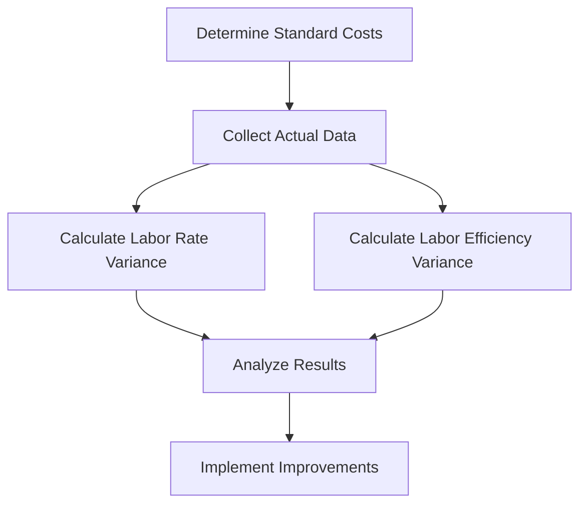

## 8.5 Labor Variances

Labor variances are a critical component of variance analysis in managerial accounting, providing insights into the efficiency and cost-effectiveness of labor utilization within an organization. Understanding labor variances helps managers identify areas where labor costs deviate from standard costs, allowing for informed decision-making and improved operational control. This section delves into the calculation and interpretation of labor rate and efficiency variances, offering practical examples and real-world applications relevant to the Canadian accounting profession.

### Understanding Labor Variances

Labor variances are deviations between actual labor costs and standard labor costs. They are divided into two main types: labor rate variance and labor efficiency variance. These variances help organizations assess how well they are managing their labor resources and whether they are achieving their cost objectives.

#### Importance of Labor Variances

1. **Cost Control:** Labor variances provide a mechanism for controlling labor costs by highlighting discrepancies between expected and actual labor expenses.
2. **Performance Evaluation:** They serve as a tool for evaluating the performance of production managers and workers, identifying areas for improvement.
3. **Budgeting and Forecasting:** Understanding labor variances aids in accurate budgeting and forecasting, ensuring that labor costs align with organizational goals.
4. **Decision Making:** By analyzing labor variances, managers can make informed decisions about staffing, training, and process improvements.

### Labor Rate Variance

Labor rate variance (LRV) measures the difference between the actual hourly wage paid to workers and the standard hourly wage that was expected. It reflects how effectively an organization manages its wage rates.

#### Formula for Labor Rate Variance

The formula for calculating labor rate variance is:


\text{Labor Rate Variance (LRV)} = (\text{Actual Hourly Rate} - \text{Standard Hourly Rate}) \times \text{Actual Hours Worked}


#### Interpretation of Labor Rate Variance

- **Favorable Variance:** Occurs when the actual hourly rate is less than the standard rate, indicating cost savings.
- **Unfavorable Variance:** Occurs when the actual hourly rate exceeds the standard rate, suggesting higher labor costs than anticipated.

#### Causes of Labor Rate Variance

1. **Wage Rate Changes:** Variations in wage rates due to market conditions, union negotiations, or changes in labor laws.
2. **Skill Level Differences:** Hiring workers with different skill levels than planned, affecting wage rates.
3. **Overtime Payments:** Increased overtime payments can lead to higher actual hourly rates.
4. **Temporary Workers:** Use of temporary or contract workers at different rates than standard employees.

#### Example of Labor Rate Variance

Consider a manufacturing company that sets a standard hourly wage of $20 for its workers. During a particular month, the company pays an actual hourly wage of $22 due to overtime and hiring skilled workers. The actual hours worked are 1,000 hours.


\text{LRV} = (\$22 - \$20) \times 1,000 = \$2,000 \text{ Unfavorable}


In this example, the labor rate variance is $2,000 unfavorable, indicating that the company spent more on wages than planned.

### Labor Efficiency Variance

Labor efficiency variance (LEV) measures the difference between the actual hours worked and the standard hours expected for the actual production level. It reflects how efficiently labor is used in the production process.

#### Formula for Labor Efficiency Variance

The formula for calculating labor efficiency variance is:


\text{Labor Efficiency Variance (LEV)} = (\text{Actual Hours Worked} - \text{Standard Hours Allowed}) \times \text{Standard Hourly Rate}


#### Interpretation of Labor Efficiency Variance

- **Favorable Variance:** Occurs when actual hours worked are less than standard hours allowed, indicating efficient use of labor.
- **Unfavorable Variance:** Occurs when actual hours worked exceed standard hours allowed, suggesting inefficiencies in labor utilization.

#### Causes of Labor Efficiency Variance

1. **Worker Productivity:** Differences in worker productivity levels can lead to variances in labor efficiency.
2. **Machine Downtime:** Unplanned machine downtime can increase actual hours worked.
3. **Training and Experience:** Well-trained and experienced workers may complete tasks faster than expected.
4. **Process Improvements:** Implementation of process improvements can reduce the time required for production.

#### Example of Labor Efficiency Variance

Suppose a company sets a standard of 1,200 hours for producing 600 units of a product, with a standard hourly rate of $20. The actual hours worked are 1,100 hours.


\text{LEV} = (1,100 - 1,200) \times \$20 = -\$2,000 \text{ Favorable}


In this case, the labor efficiency variance is $2,000 favorable, indicating that the company used fewer hours than planned, resulting in cost savings.

### Real-World Applications of Labor Variances

Labor variances are not just theoretical concepts; they have practical applications in various industries. Here are some real-world scenarios where labor variances play a crucial role:

#### Manufacturing Industry

In the manufacturing sector, labor variances help managers assess the efficiency of production processes. By analyzing labor rate and efficiency variances, companies can identify bottlenecks, optimize staffing levels, and implement training programs to enhance productivity.

#### Service Industry

In service-oriented businesses, such as hospitality and healthcare, labor variances are used to evaluate staff performance and allocate resources effectively. For example, a hotel might analyze labor variances to determine the optimal number of housekeeping staff needed during peak seasons.

#### Construction Industry

Construction companies use labor variances to monitor project costs and timelines. By comparing actual labor costs to budgeted costs, project managers can identify areas where labor expenses exceed expectations and take corrective actions.

### Calculating Labor Variances: Step-by-Step Guide

To effectively calculate labor variances, follow these step-by-step instructions:

1. **Determine Standard Costs:** Establish standard hourly rates and standard hours allowed for production based on historical data and industry benchmarks.
2. **Collect Actual Data:** Gather actual hourly rates paid and actual hours worked during the accounting period.
3. **Calculate Labor Rate Variance:** Use the formula for labor rate variance to determine the difference between actual and standard hourly rates.
4. **Calculate Labor Efficiency Variance:** Use the formula for labor efficiency variance to assess the difference between actual and standard hours worked.
5. **Analyze Results:** Interpret the variances to identify favorable or unfavorable outcomes and investigate underlying causes.
6. **Implement Improvements:** Based on the analysis, implement strategies to address unfavorable variances and enhance labor efficiency.

### Diagram: Labor Variance Calculation Process

### Best Practices for Managing Labor Variances

1. **Regular Monitoring:** Continuously monitor labor variances to identify trends and address issues promptly.
2. **Employee Training:** Invest in employee training programs to enhance skills and improve productivity.
3. **Process Optimization:** Streamline production processes to reduce inefficiencies and minimize labor costs.
4. **Incentive Programs:** Implement incentive programs to motivate employees and encourage efficient work practices.
5. **Technology Integration:** Leverage technology to automate routine tasks and improve labor efficiency.

### Common Pitfalls and Challenges

1. **Inaccurate Standards:** Setting unrealistic or outdated standards can lead to misleading variance analysis.
2. **Data Collection Errors:** Inaccurate data collection can result in incorrect variance calculations.
3. **Ignoring Qualitative Factors:** Focusing solely on quantitative variances without considering qualitative factors can lead to incomplete analysis.
4. **Lack of Communication:** Poor communication between departments can hinder effective variance analysis and corrective actions.

### Exam Tips and Strategies

1. **Understand Key Formulas:** Familiarize yourself with the formulas for labor rate and efficiency variances and practice calculations.
2. **Analyze Scenarios:** Practice analyzing different scenarios to identify potential causes of variances.
3. **Focus on Interpretation:** Pay attention to interpreting variances and understanding their implications for decision-making.
4. **Review Case Studies:** Study real-world case studies to see how labor variances are applied in practice.
5. **Practice Problems:** Solve practice problems to reinforce your understanding and improve your calculation skills.

### References and Further Reading

- CPA Canada Handbook: Accounting Standards for Private Enterprises (ASPE)
- International Financial Reporting Standards (IFRS) as adopted in Canada
- "Managerial Accounting" by Ray H. Garrison, Eric Noreen, and Peter C. Brewer
- "Cost Accounting: A Managerial Emphasis" by Charles T. Horngren, Srikant M. Datar, and Madhav V. Rajan

### Conclusion

Labor variances are a vital aspect of managerial accounting, providing insights into labor cost management and operational efficiency. By understanding and analyzing labor rate and efficiency variances, managers can make informed decisions to optimize labor resources and achieve cost objectives. Through regular monitoring, process improvements, and employee training, organizations can enhance their labor efficiency and maintain a competitive edge in the market.

## **Ready to Test Your Knowledge?**



### What is the formula for calculating Labor Rate Variance (LRV)?

- [x] (Actual Hourly Rate - Standard Hourly Rate) × Actual Hours Worked
- [ ] (Actual Hours Worked - Standard Hours Allowed) × Standard Hourly Rate
- [ ] (Standard Hourly Rate - Actual Hourly Rate) × Standard Hours Allowed
- [ ] (Actual Hours Worked - Actual Hourly Rate) × Standard Hours Allowed

> **Explanation:** The correct formula for Labor Rate Variance is (Actual Hourly Rate - Standard Hourly Rate) × Actual Hours Worked.

### Which of the following indicates a favorable Labor Rate Variance?

- [x] Actual hourly rate is less than the standard rate
- [ ] Actual hourly rate is more than the standard rate
- [ ] Actual hours worked are more than standard hours allowed
- [ ] Actual hours worked are less than standard hours allowed

> **Explanation:** A favorable Labor Rate Variance occurs when the actual hourly rate is less than the standard rate, indicating cost savings.

### What does an unfavorable Labor Efficiency Variance suggest?

- [x] Inefficiencies in labor utilization
- [ ] Efficient use of labor
- [ ] Cost savings in labor
- [ ] Reduced labor costs

> **Explanation:** An unfavorable Labor Efficiency Variance suggests inefficiencies in labor utilization, as actual hours worked exceed standard hours allowed.

### Which factor can cause a Labor Rate Variance?

- [x] Wage rate changes
- [ ] Machine downtime
- [ ] Process improvements
- [ ] Worker productivity

> **Explanation:** Wage rate changes can cause a Labor Rate Variance, as they affect the actual hourly rate paid to workers.

### How is Labor Efficiency Variance calculated?

- [x] (Actual Hours Worked - Standard Hours Allowed) × Standard Hourly Rate
- [ ] (Actual Hourly Rate - Standard Hourly Rate) × Actual Hours Worked
- [ ] (Standard Hours Allowed - Actual Hours Worked) × Actual Hourly Rate
- [ ] (Standard Hourly Rate - Actual Hourly Rate) × Standard Hours Allowed

> **Explanation:** Labor Efficiency Variance is calculated as (Actual Hours Worked - Standard Hours Allowed) × Standard Hourly Rate.

### What is a common cause of a favorable Labor Efficiency Variance?

- [x] Well-trained and experienced workers
- [ ] Increased overtime payments
- [ ] Use of temporary workers
- [ ] Unplanned machine downtime

> **Explanation:** Well-trained and experienced workers can lead to a favorable Labor Efficiency Variance, as they may complete tasks faster than expected.

### Which industry commonly uses labor variances for cost control?

- [x] Manufacturing
- [ ] Retail
- [ ] Agriculture
- [ ] Real Estate

> **Explanation:** The manufacturing industry commonly uses labor variances for cost control to assess the efficiency of production processes.

### What is the impact of ignoring qualitative factors in variance analysis?

- [x] Incomplete analysis
- [ ] Accurate variance calculations
- [ ] Improved decision-making
- [ ] Enhanced cost control

> **Explanation:** Ignoring qualitative factors in variance analysis can lead to incomplete analysis, as it overlooks important contextual information.

### How can technology integration improve labor efficiency?

- [x] Automating routine tasks
- [ ] Increasing overtime payments
- [ ] Hiring temporary workers
- [ ] Reducing training programs

> **Explanation:** Technology integration can improve labor efficiency by automating routine tasks, allowing workers to focus on more value-added activities.

### True or False: Labor variances are only applicable to manufacturing industries.

- [ ] True
- [x] False

> **Explanation:** False. Labor variances are applicable to various industries, including service and construction, where labor cost management is crucial.


