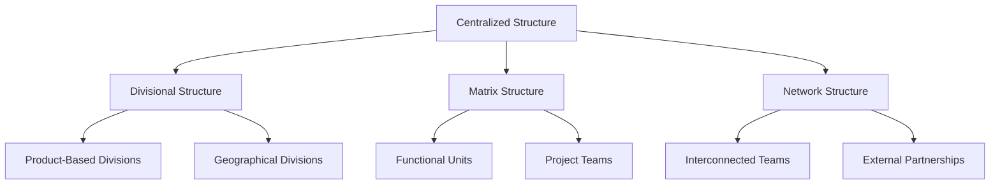
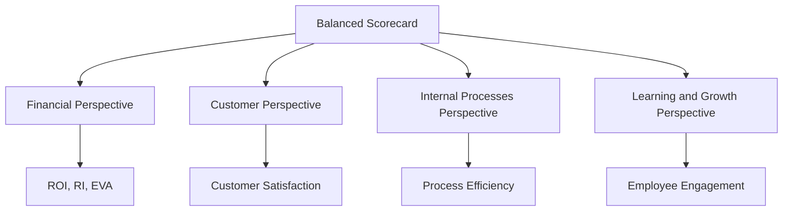

## 9.10 The Impact of Decentralization

Decentralization is a strategic approach in organizational management where decision-making authority is distributed across various levels rather than being confined to a central point. This approach significantly influences managerial accounting practices, affecting how organizations plan, control, and evaluate their operations. In this section, we will delve into the impact of decentralization on managerial accounting, examining its implications for organizational structure, decision-making processes, and performance evaluation.

### Understanding Decentralization

Decentralization involves the delegation of decision-making authority to lower levels in an organization. This structure contrasts with centralization, where decision-making is concentrated at the top levels of management. Decentralization can manifest in various forms, such as geographical, functional, or product-based divisions, and is often adopted to enhance responsiveness, flexibility, and innovation within an organization.

#### Key Characteristics of Decentralization

1. **Autonomy**: Subunits or divisions within the organization have the freedom to make decisions that best suit their operational needs.
2. **Responsibility Centers**: These are segments of the organization, such as departments or divisions, where managers are accountable for specific activities and outcomes.
3. **Local Decision-Making**: Decisions are made closer to the point of action, allowing for quicker responses to changes in the market or environment.
4. **Empowerment**: Employees at various levels are empowered to make decisions, fostering a sense of ownership and motivation.

### The Role of Managerial Accounting in Decentralized Organizations

In a decentralized organization, managerial accounting plays a crucial role in providing the necessary information for decision-making and performance evaluation. The decentralized structure requires a robust accounting system that can cater to the diverse needs of different responsibility centers. Key functions of managerial accounting in such settings include:

- **Budgeting and Forecasting**: Decentralized units need tailored budgets that reflect their specific operational goals and constraints.
- **Performance Measurement**: Managerial accounting provides tools and metrics to evaluate the performance of different units, ensuring alignment with overall organizational objectives.
- **Cost Control**: Decentralized units must manage their costs effectively, requiring detailed cost information and analysis.
- **Strategic Planning**: Managerial accounting supports strategic decision-making by providing relevant financial and non-financial information.

### Benefits of Decentralization in Managerial Accounting

1. **Enhanced Responsiveness**: Decentralization allows organizations to respond more swiftly to changes in the market or environment, as decisions are made closer to the operational level.
2. **Improved Motivation and Morale**: Empowering managers and employees at various levels can lead to increased job satisfaction and motivation, as they have a direct impact on the outcomes of their decisions.
3. **Innovation and Creativity**: Decentralized structures often foster an environment where innovation and creativity can thrive, as employees are encouraged to explore new ideas and approaches.
4. **Better Customer Focus**: With decision-making authority closer to the customer interface, organizations can better tailor their products and services to meet customer needs.

### Challenges of Decentralization in Managerial Accounting

1. **Coordination and Control**: Ensuring that decentralized units align with overall organizational goals can be challenging, requiring effective communication and control mechanisms.
2. **Duplication of Efforts**: Decentralized units may duplicate efforts or resources, leading to inefficiencies.
3. **Inconsistent Decision-Making**: Different units may make decisions that are not aligned, leading to inconsistencies and potential conflicts.
4. **Complex Performance Evaluation**: Evaluating the performance of decentralized units can be complex, as it requires a comprehensive understanding of each unit's unique context and challenges.

### Organizational Structure and Decentralization

Decentralization significantly impacts an organization's structure, influencing how it is designed and managed. In a decentralized organization, the structure is often more flat and flexible, allowing for greater autonomy and quicker decision-making. This structure can take various forms, such as:

- **Divisional Structure**: Organizations are divided into semi-autonomous units based on products, services, or geographical regions.
- **Matrix Structure**: Combines functional and divisional structures, allowing for flexibility and collaboration across different units.
- **Network Structure**: A more fluid and dynamic structure that relies on a network of interconnected units or teams.

#### Diagram: Organizational Structures in Decentralized Organizations

### Decision-Making in Decentralized Organizations

Decentralization shifts the decision-making process from a centralized authority to various levels within the organization. This shift can lead to more informed and timely decisions, as managers at different levels have a better understanding of their specific operational contexts. However, it also requires effective communication and coordination to ensure that decisions align with the organization's overall strategy and objectives.

#### Factors Influencing Decision-Making in Decentralized Organizations

1. **Information Availability**: Access to relevant and timely information is crucial for effective decision-making.
2. **Managerial Competence**: The skills and expertise of managers at different levels influence the quality of decisions made.
3. **Organizational Culture**: A culture that supports autonomy, innovation, and accountability can enhance decision-making in decentralized settings.
4. **Technology and Systems**: Advanced information systems and technologies can facilitate better decision-making by providing accurate and real-time data.

### Performance Evaluation in Decentralized Organizations

Performance evaluation in decentralized organizations involves assessing the effectiveness and efficiency of different responsibility centers. Managerial accounting provides various tools and metrics to evaluate performance, such as:

- **Financial Metrics**: These include measures like return on investment (ROI), residual income (RI), and economic value added (EVA).
- **Non-Financial Metrics**: These may include customer satisfaction, employee engagement, and process efficiency.
- **Balanced Scorecard**: A comprehensive performance evaluation tool that considers financial and non-financial metrics across different perspectives.

#### Diagram: Balanced Scorecard in Decentralized Organizations

### Real-World Applications and Case Studies

Decentralization is widely used in various industries and organizations, each with unique applications and challenges. Here are some real-world examples:

1. **Multinational Corporations**: Companies like Unilever and Procter & Gamble use decentralization to manage their global operations effectively, allowing regional units to tailor strategies to local markets.
2. **Public Sector Organizations**: Decentralization is often used in government and public sector organizations to improve service delivery and responsiveness to local needs.
3. **Technology Companies**: Firms like Google and Amazon use decentralized structures to foster innovation and agility in rapidly changing markets.

### Best Practices for Implementing Decentralization

1. **Clear Communication**: Establish clear communication channels to ensure alignment and coordination across different units.
2. **Robust Performance Metrics**: Develop comprehensive performance metrics that consider both financial and non-financial aspects.
3. **Effective Training and Development**: Invest in training and development programs to enhance the skills and competencies of managers and employees.
4. **Strong Leadership**: Ensure strong leadership at all levels to guide and support decentralized units.

### Common Pitfalls and Challenges

1. **Lack of Alignment**: Decentralized units may pursue goals that are not aligned with the organization's overall strategy.
2. **Resource Duplication**: Different units may duplicate efforts or resources, leading to inefficiencies.
3. **Inconsistent Performance Evaluation**: Evaluating performance across diverse units can be challenging, requiring a nuanced understanding of each unit's context.

### Conclusion

Decentralization offers numerous benefits for organizations, including enhanced responsiveness, improved motivation, and increased innovation. However, it also presents challenges, such as coordination and control, resource duplication, and complex performance evaluation. Managerial accounting plays a crucial role in supporting decentralized organizations by providing the necessary information for decision-making and performance evaluation. By understanding the impact of decentralization and implementing best practices, organizations can effectively leverage this approach to achieve their strategic objectives.

## **Ready to Test Your Knowledge?**



### Which of the following is a key characteristic of decentralization?

- [x] Autonomy
- [ ] Centralized decision-making
- [ ] Limited responsibility
- [ ] Inflexibility

> **Explanation:** Autonomy is a key characteristic of decentralization, allowing units to make decisions independently.

### What is a common benefit of decentralization?

- [x] Enhanced responsiveness
- [ ] Increased central control
- [ ] Reduced innovation
- [ ] Decreased employee motivation

> **Explanation:** Decentralization enhances responsiveness by allowing decisions to be made closer to the point of action.

### Which organizational structure is commonly associated with decentralization?

- [x] Divisional Structure
- [ ] Hierarchical Structure
- [ ] Centralized Structure
- [ ] Bureaucratic Structure

> **Explanation:** A divisional structure is commonly associated with decentralization, allowing for semi-autonomous units.

### What is a potential challenge of decentralization?

- [x] Coordination and control
- [ ] Increased centralization
- [ ] Reduced flexibility
- [ ] Decreased autonomy

> **Explanation:** Coordination and control can be challenging in decentralized organizations due to the distributed decision-making authority.

### Which tool is used for performance evaluation in decentralized organizations?

- [x] Balanced Scorecard
- [ ] Centralized Budgeting
- [ ] Hierarchical Reporting
- [ ] Bureaucratic Metrics

> **Explanation:** The balanced scorecard is a comprehensive tool used for performance evaluation in decentralized organizations.

### What is the role of managerial accounting in decentralized organizations?

- [x] Providing information for decision-making
- [ ] Centralizing decision-making authority
- [ ] Limiting financial analysis
- [ ] Reducing performance evaluation

> **Explanation:** Managerial accounting provides information for decision-making and performance evaluation in decentralized organizations.

### Which factor influences decision-making in decentralized organizations?

- [x] Information Availability
- [ ] Centralized Control
- [ ] Limited Autonomy
- [ ] Reduced Innovation

> **Explanation:** Information availability is crucial for effective decision-making in decentralized organizations.

### What is a common pitfall in decentralized organizations?

- [x] Resource Duplication
- [ ] Increased Centralization
- [ ] Reduced Flexibility
- [ ] Decreased Innovation

> **Explanation:** Resource duplication can occur in decentralized organizations when different units duplicate efforts or resources.

### Which real-world company uses decentralization to manage global operations?

- [x] Unilever
- [ ] Apple
- [ ] Tesla
- [ ] Microsoft

> **Explanation:** Unilever uses decentralization to manage its global operations effectively, allowing regional units to tailor strategies to local markets.

### Decentralization can lead to increased innovation and creativity.

- [x] True
- [ ] False

> **Explanation:** True. Decentralization fosters an environment where innovation and creativity can thrive, as employees are encouraged to explore new ideas and approaches.


